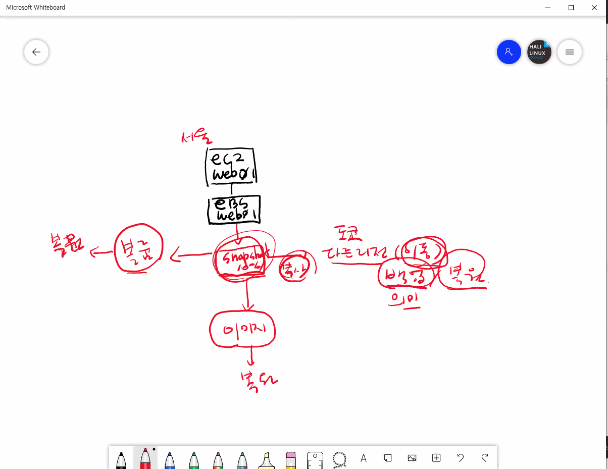
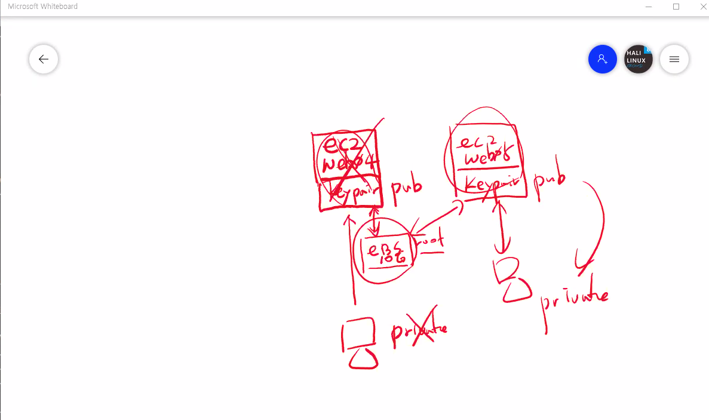
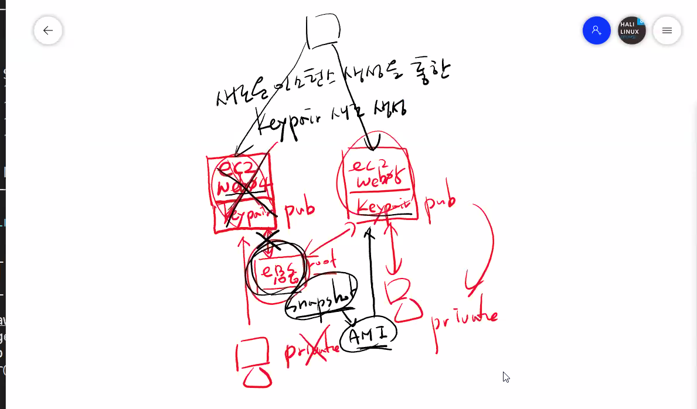

# Route 53

# EC2

ns-1096.awsdns-09.org
ns-695.awsdns-22.net
ns-216.awsdns-27.com
ns-1962.awsdns-53.co.uk

```bash
#!/bin/bash
sudo yum install -y httpd
sudo systemctl start httpd
sudo systemctl enable httpd
sudo echo "WEB01" > /var/www/html/index.html
```

8GB
TAG : WEB01

SG-WEB01

CNAME --> Domain 과 Domain 을 연결

raraneedu@naver.com
raraneedu!0201

eksuser
Welcome!1

0.0.0.0/0 
인터넷게이트웨이

## Amazon(CentOS) 환경 볼륨

- 볼륨 마운트

```bash
[ec2-user ~]$ lsblk
[ec2-user ~]$ sudo file -s /dev/xvdf
[ec2-user ~]$ sudo mkfs -t xfs /dev/xvdf
[ec2-user ~]$ sudo mkdir /data
[ec2-user ~]$ sudo mount /dev/xvdf /data
[ec2-user ~]$ sudo cp /etc/fstab /etc/fstab.orig
[ec2-user ~]$ sudo blkid
[ec2-user ~]$ sudo vi /etc/fstab
UUID=aebf131c-6957-451e-8d34-ec978d9581ae /data xfs defaults,nofail 0 2
```

- 볼륨 마운트 이전

```bash
[ec2-user ~]$ lsblk
[ec2-user ~]$ sudo mkdir /data
[ec2-user ~]$ sudo mount /dev/xvdf /data
[ec2-user ~]$ sudo blkid
[ec2-user ~]$ sudo vi /etc/fstab
UUID=aebf131c-6957-451e-8d34-ec978d9581ae /data xfs defaults,nofail 0 2
```

- 볼륨 마운트 확장
  
```bash
볼륨 크기 조정 후 Linux 파일 시스템 확장(T2 인스턴스)
볼륨의 파일 시스템 식별
sudo file -s /dev/xvd*
lsblk

파티션 확장
sudo growpart /dev/xvda 1
lsblk

XFS 파일 시스템 확장
df -Th
sudo xfs_growfs -d /
df -Th
```







## 워드프레스 설치

```bash
// MariaDB 설치
$ sudo apt-get -y update
$ sudo apt-get -y install mariadb-server
$ sudo mysql_secure_installation
$ sudo vi /etc/mysql/mariadb.conf.d/50-server.cnf
#bind-address            = 127.0.0.1

$ sudo systemctl restart mysql
$ sudo mysql -u root -p
CREATE USER 'wpuser'@'%' IDENTIFIED BY 'wppass';
CREATE DATABASE IF NOT EXISTS wordpress;
GRANT ALL PRIVILEGES ON wordpress.* TO 'wpuser'@'%';
quit

CREATE USER 'wpuser'@'%' IDENTIFIED BY 'oss13579';
CREATE DATABASE IF NOT EXISTS wordpressdb;
GRANT ALL PRIVILEGES ON wordpressdb.* TO 'wpuser'@'%';

워드프레스 설치
# wget https://ko.wordpress.org/wordpress-4.8.2-ko_KR.zip
# cd /var/www/html
# unzip /root/wordpress-4.8.2-ko_KR.zip
# chown -R apache:apache wordpress
웹브라우저 http://본인 ip/wordpress

인스턴스 삭제 > NAT 게이트웨이 삭제 > VPC 삭제
```


## 삭제

DB -> Route53 -> IAM -> EC2 -> 볼륨 -> AMI -> 스냅샷 -> 키페어 -> 
