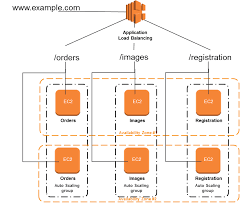
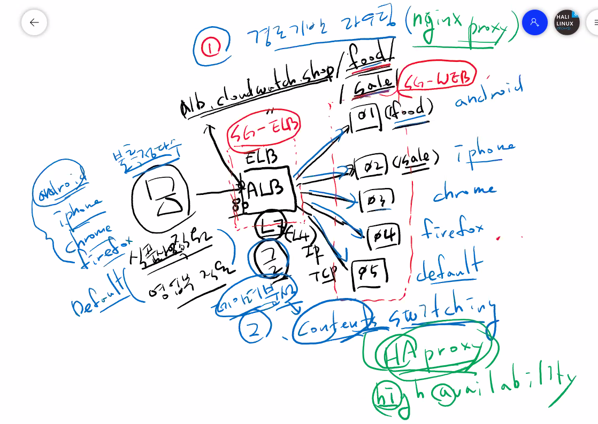
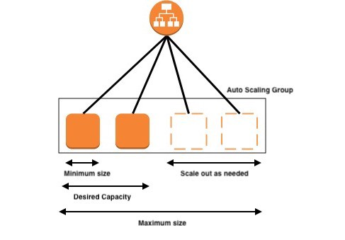

# ELB

ns-253.awsdns-31.com
ns-1221.awsdns-24.org
ns-670.awsdns-19.net
ns-1589.awsdns-06.co.uk

WEB01 : 3.35.235.219 --> 172.31.11.182
WEB02 : 13.125.156.41 --> 172.31.43.98
WEB03 : 3.35.175.188 --> 172.31.5.52
WEB04 : 13.125.116.188 --> 172.31.40.204
WEB05 : 13.209.16.98 --> 172.31.11.172

Classic(CLB) L4 - EC2 Classic Network 기반 로드발랜싱(라운드로빈), 타겟 그룹 없음
Network(NLB) L4 - 라운드로빈X, 타겟 그룹, Least Connection 방식
Application(ALB) L7 - 타겟 그룹

<https://pearlluck.tistory.com/114>
<http://blog.naver.com/PostView.nhn?blogId=ijoos&logNo=221567890872&parentCategoryNo=&categoryNo=135&viewDate=&isShowPopularPosts=true&from=search>
<https://blueyikim.tistory.com/1753>

ELB 보안그룹 -> ELB 리스터의 보안그룹(SG-ELB)

고정(Sticky)

CLB -> Route53 -> SG(SG-WEB)
NLB -> Route53

NGINX - 경로기반 라우팅
HA Proxy - Contents Switching

삭제순서

ELB -> Target Group -> EC2

## AWS Auto Scaling

WEB01 - 13.125.83.235
WEB02 - 3.35.21.109

부하테스트
yes > /dev/null &

top

삭제

Auto Scaling Group(관련 인스턴스도 포함해서 삭제) -> 로드발랜서 -> Target Group -> (AMI, 스냅샷) AMI삭제 후 자동생성된 스냅샷 삭제 -> CloudWatch -> 키페어 -> 