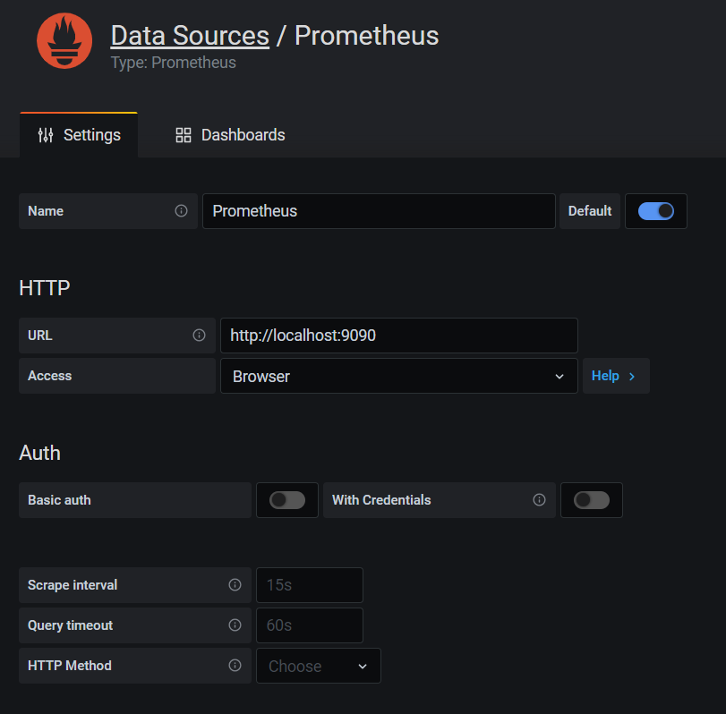
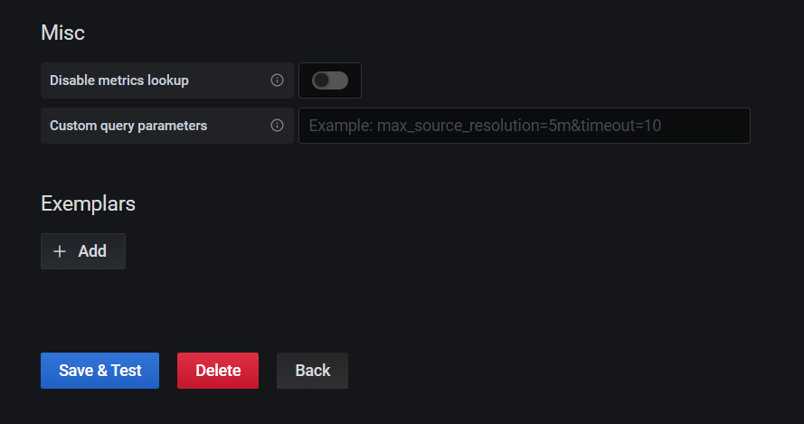

# Prometheus와 Grafana 설치하기

## Prometheus

```bash
docker run  -p 9090:9090 -v /tmp/prometheus.yml:/etc/prometheus/prometheus.yml prom/prometheus
```

## Grafana

- 초기 계정 admin/admin

```bash
docker run -d -p 3000:3000 grafana/grafana
```

- Configuration > Data Sources




## node_exporter 인스턴스 메트릭 수집

```bash
cd /opt
wget https://github.com/prometheus/node_exporter/releases/download/v1.0.1/node_exporter-1.0.1.linux-amd64.tar.gz
tar xvfz node_exporter-*.*.*-amd64.tar.gz
cd node_exporter-*.*-amd64
./node_exporter
```

<https://herrenofficial.github.io/devops/2020/04/26/prometheus-with-grafana-1.html>
<https://www.google.com/search?rlz=1C1BNSD_koKR931KR931&sxsrf=ALeKk02ntrreENSZdXF_JFONINaX5sirWQ%3A1612491800792&ei=GKwcYP7sL4HmwQP7up5Q&q=node_exporter+%EC%84%A4%EC%B9%98&oq=node_exporter+%EC%84%A4%EC%B9%98&gs_lcp=CgZwc3ktYWIQAzICCAA6BwgAEEcQsAM6BAgAEEM6BQgAEMsBUMAdWIotYMouaAFwAngAgAGDAYgBlQiSAQMwLjmYAQCgAQGqAQdnd3Mtd2l6yAEIwAEB&sclient=psy-ab&ved=0ahUKEwj-2PSH2NHuAhUBc3AKHXudBwoQ4dUDCA0&uact=5>
<https://medium.com/@eun9882/node-exporter%EB%A5%BC-%EC%84%A4%EC%B9%98%ED%95%B4-%EB%B3%B4%EC%9E%90-623e554f3d9b>
<https://heeestorys.tistory.com/958>


