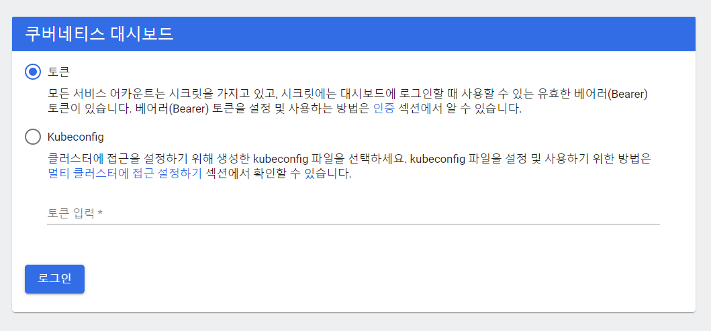

# Install

- 도커Docker가 컨테이너 런타임으로서 자리잡은 이후 한동안 컨테이너 오케스트레이션 분야의 경쟁이 치열
- 도커 사에서 직접 만들었던 스웜Swarm을 비롯해, 구글Google의 쿠버네티스Kubernetes, 랜처Rancher의 캐틀Cattle, 하시코프Hashicorp의 노마드Nomad 등 다양한 도구가 등장
- 현재는 쿠버네티스가 데 실질적인 표준
-  엣지 채널을 굳이 사용하지 않더라도 최신 버전의 도커 포 맥이나 도커 포 윈도우를 설치하기만 하면 곧바로 쿠버네티스를 사용

## Minikube 설치

- Local용 Kube Server
- Minikube는 다음과 같은 쿠버네티스의 기능을 제공
  - DNS
  - 노드 포트
  - 컨피그 맵과 시크릿
  - 대시보드
  - 컨테이너 런타임: Docker, CRI-O 와 containerd
  - CNI(Container Network Interface) 사용
  - 인그레스

- 서버설치 : minikube
- 클라이언트 설치 : Docker Desktop 안에 kubectl 포함(아래 설치 참조)

<https://v1-18.docs.kubernetes.io/ko/docs/tasks/tools/install-minikube/>

## Window에서 Kubectl 설치

### CURL설치

```bash
curl -LO https://dl.k8s.io/release/v1.21.0/bin/windows/amd64/kubectl.exe

## PATH 추가
## 확인
kubectl version --client
```

### PSGallery PowerShell 설치

```bash
Install-Script -Name install-kubectl -Scope CurrentUser -Force
install-kubectl.ps1 [-DownloadLocation <path>]

## 확인
kubectl version --client
```

### Chocolatey 또는 Scoop 설치

```bash
choco install kubernetes-cli
# OR
scoop install kubectl

## 확인
kubectl version --client
```

### Google Cloud SDK

```bash
# Google Cloud SDK 설치
gcloud components install kubectl

## 확인
kubectl version --client
```

## 대시보드 설치

<https://not-to-be-reset.tistory.com/327>

ocker desktop 설치 후 쿠버네티스를 사용하는 법을 간단하게 기록

### 1. kubernetes enable


도커 데스크톱 화면에서 우측 상단의 톱니바퀴(setting)버튼을 클릭한 뒤, Kubernetes 탭으로 가서 Enable Kubernetes를 체크한뒤 우측 하단의 Apply & Restart를 눌러 쿠버네티스를 활성화

설치가 다 되면 도커 데스크톱 창에서 왼쪽 아래부분에 아래 그림처럼 고래옆에 톱니바퀴 로고가 초록색 표시


```bash
$ kubectl version --output yaml
clientVersion:
  buildDate: "2020-10-14T12:50:19Z"
  compiler: gc
  gitCommit: 1e11e4a2108024935ecfcb2912226cedeafd99df
  gitTreeState: clean
  gitVersion: v1.19.3
  goVersion: go1.15.2
  major: "1"
  minor: "19"
  platform: linux/amd64
serverVersion:
  buildDate: "2020-10-14T12:41:49Z"
  compiler: gc
  gitCommit: 1e11e4a2108024935ecfcb2912226cedeafd99df
  gitTreeState: clean
  gitVersion: v1.19.3
  goVersion: go1.15.2
  major: "1"
  minor: "19"
  platform: linux/amd64
```

설치가 잘 되었는지 version 명령어로 확인

### 2. 대시보드 설치

<http://kubernetes.io/ko/docs/tasks/access-application-cluster/web-ui-dashboard/>

위 공식사이트의 '대시보드 UI 접근'에 있는 방법으로 대시보드를 설치
(쿠버네티스 버전과 대시보드 버전의 차이가 많이나면 안되는 것 같다. 아래 명령어도 업데이트가 될 수 있으니 공식 사이트의 방법대로 설치하는걸 추천)

```bash
kubectl apply -f https://raw.githubusercontent.com/kubernetes/dashboard/v2.0.0/aio/deploy/recommended.yaml
```

원격지에 정의되어 있는 kubernetes-dashboard.yaml를 통해 대시보드를 설치

### 3. proxy 실행

```bash
$ kubectl proxy

// 결과
Starting to serve on 127.0.0.1:8001
```

proxy를 실행하여 접속가능하도록 한다. 

### 4. 대시보드 접속

<http://localhost:8001/api/v1/namespaces/kubernetes-dashboard/services/https:kubernetes-dashboard:/proxy/>

위의 주소로 로컬에서 접속하면 대시보드로 접속



### 5. 계정 생성

jogeum.net/22 이분 블로그를 참고하면서 진행함.(감사합니다.) 각 파일의 의미는 해당 블로그를 참고!

service-accout.yml 파일과 cluster-role-binding.yml파일을 아래와 같이 생성(파일 이름은 상관 없음)

- service-account.yml

```bash
$ cat service-account.yml
apiVersion: v1
kind: ServiceAccount
metadata:
  name: admin-user
  namespace: kube-system
```

- cluster-role-binding.yml

```bash
$ cat cluster-role-binding.yml
apiVersion: rbac.authorization.k8s.io/v1
kind: ClusterRoleBinding
metadata:
  name: admin-user
roleRef:
  apiGroup: rbac.authorization.k8s.io
  kind: ClusterRole
  name: cluster-admin
subjects:
  - kind: ServiceAccount
    name: admin-user
    namespace: kube-system
```

kubctl로 service-accout.yml 파일과 cluster-role-binding.yml파일을 적용

```bash
$ kubectl create -f service-account.yml
$ kubectl create -f cluster-role-binding.yml
```

생성한 계정을 확인.(sa는 service account를 의미한다.)

```bash
$ kubectl get sa -n kube-system
NAME                                 SECRETS   AGE
admin-user                           1         47m
```

### 6. 계정 토큰 조회

5.과정에서 생성한 admin-user의 cluster-admin 권한의 토큰값을 가져온다.

```bash
$ kubectl -n kube-system describe secret $(kubectl -n kube-system get secret | grep admin-user | awk '{print $1}')
Name:         admin-user-token-plhpd
Namespace:    kube-system
Labels:       <none>
Annotations:  kubernetes.io/service-account.name: admin-user
              kubernetes.io/service-account.uid: 2e9e3fcf-df41-4d4e-a181-43b8b4c29708

Type:  kubernetes.io/service-account-token

Data
====
ca.crt:     1066 bytes
namespace:  11 bytes
token:      eyJhbGciO.....
```

### 7. 대시보드 로그인

얻은 토큰값(eyJhbGciO.....)을 입력하여 쿠버네티스 대시보드에 접속


접속에 성공하면 아래와 같이 대시보드를 확인


### 8. 대시보드 삭제

```bash
$ kubectl delete -f https://raw.githubusercontent.com/kubernetes/dashboard/v2.0.0/aio/deploy/recommended.yaml
```

2.번 과정에서 대시보드 설치시 사용했던 명령어에서 apply를 delete로 변경하여 수행하면 대시보드가 삭제

```bash
$ kubectl get svc --all-namespaces
NAMESPACE     NAME         TYPE        CLUSTER-IP   EXTERNAL-IP   PORT(S)                  AGE
default       kubernetes   ClusterIP   10.96.0.1    <none>        443/TCP                  3h11m
kube-system   kube-dns     ClusterIP   10.96.0.10   <none>        53/UDP,53/TCP,9153/TCP   3h11m
```

대시보드 서비스가 사라진 것을 확인
