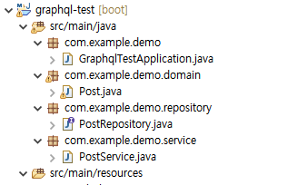
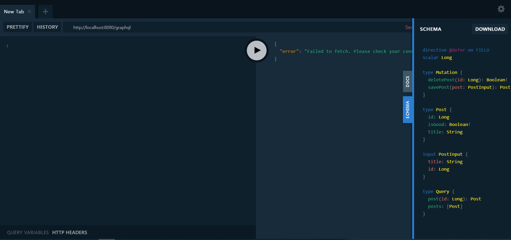
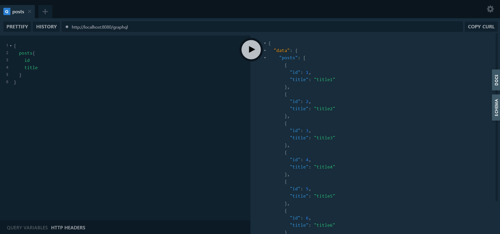
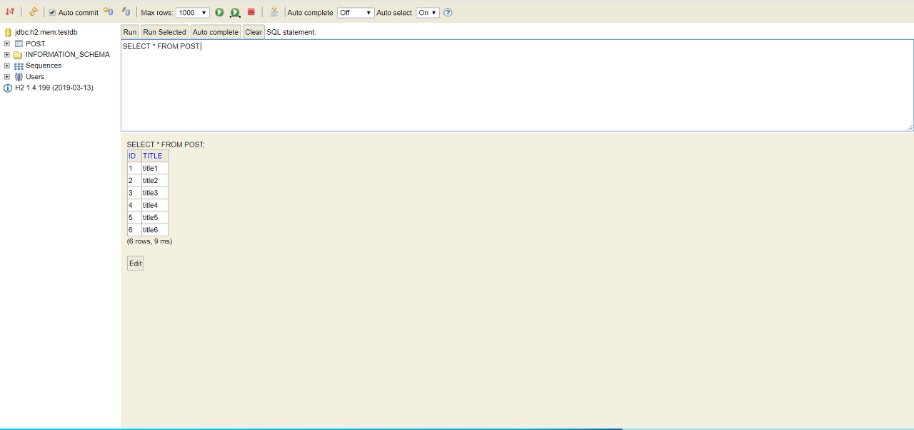

# Example 3

<https://ttubeoki.tistory.com/23>

하지만, graphqls 라는 확장자로 스키마를 정의해야하니 기존에 보지 못한 방법으로 작성하는 번거로움이 있었다

ex) post.graphql

```json
type Post @model { 
  id: ID! 
  title: String! 
  postInfo: [PostInfo] @connection(name: "PostPrice") 
} 
```

예를 들자면 이런식이다 ( !는 notnull ) [postinfo]라고 되어있는 부분은 join table 기존의 rest api에 익숙해진 우리로서는 다시금 만들기 귀찮아 지는부분이 있는데,(유지보수 측면에서도 아주 약간의 러닝커브도 존재) 다행이도 anotation으로 쉽게 해결하는 방안이 제시되어있다.

io.leangen.graphql
내가 사용한것은 0.0.4 버전으로 초기단계의 버전이라 아직은 안전성 측면에서 불안할 수도 있겠다.

이제 구조는 이질감 없는 Rest API를 따라가되, graphQL로 간단한 CRUD작업을 해보려고 한다.

Spring Boot Starter로 시작하고, +web starter +lombok +h2 database + JPA정도(?)

프로젝트가 생성이 되면 Dependency에 graphql를 추가하자.

```xml
<!-- graphql -->
<dependency>
    <groupId>com.graphql-java</groupId>
    <artifactId>graphql-spring-boot-starter</artifactId>
    <version>5.0.2</version>
</dependency>
<dependency>
    <groupId>com.graphql-java</groupId>
    <artifactId>graphql-java-tools</artifactId>
    <version>5.2.4</version>
</dependency>
<!-- graphql -->
<!-- graphql-like sql usual -->
<dependency>
    <groupId>io.leangen.graphql</groupId>
    <artifactId>graphql-spqr-spring-boot-starter</artifactId>
    <version>0.0.4</version>
</dependency>
<!-- graphql-like sql usual -->
```

위에 두개는 기본적으로 사용할때 필요한 것들, 3번째는 rest API랑 비슷하게 만들려고 사용하는 dependency이다

이제 Maven update 한번 눌러주면 GraphQL의 어노테이션을 다 사용할 수 있을것이다.

그리고 database의 상황과 graphql의 사용을 조금더 편하게할 gui를 사용하게끔 application.yml을 수정해보자

( graphql 작동을 하려면 postman이나 swagger를 돌려야하는데 귀찮으니까.. gui를 쓰도록 하자)

```yml
graphql:
  spqr:
    gui:
      enabled: true
spring:
  h2:
    console:
      enabled: true
```

h2 database를 맨처음 프로젝트 만들때 추가해놨으면 문제없이 실행될것이다.
이제 셋팅은 끝났고 본격적인 틀을 잡아보면,



이런식으로 구성이 되어있다.

Rest API랑 똑같은데, 단지 controller만 빠져있는 모습 우선 domain/post.java로 스키마정의까지 만들어보면,

```java
@Data
@NoArgsConstructor
@Entity
@ToString
public class Post {

    @Id
    @GeneratedValue
    @GraphQLQuery(name = "id")
    private Long id;

    @GraphQLQuery(name = "title")
    private String title;

}
```

간단하게 id랑 title만 정의를 해놓았고, 여기서 굳이 다른 Anotation은 설명하지 않겠다 ( 전 포스팅에 있기때문에 . . )

여기서 @GraphQLQuery란 녀석이 매우 중요하다.

맨위에서 설명한거와 같이, 원래는 graphqls 라는 확장자를 넣어서 schema를 만들어줘야하는데,

@GraphQLQuery를 넣으면 알아서 name대로 매칭시켜 만들어준다. (안써주면 Bean 에러)

그렇기 때문에 파일을 새로 만들 필요없이, 기존에 쓰던 domain에서 추가만 하면 끝

repository/PostRepository.java

```java
@Repository
public interface PostRepository extends JpaRepository<Post, Long>{
}
```

CRUD의 기능을 위해 Repository

service/PostService.java

```java
@Service
//추가
@GraphQLApi
public class PostService {

    @Autowired
    private PostRepository postRepository;

    public PostService(PostRepository postRepository) {
        this.postRepository = postRepository;
    }

    //{
    //	posts{
    //		id
    //  	title
    //	}
    //}

    @GraphQLQuery(name = "posts")
    public List getPosts(){
        return postRepository.findAll();
    }

    //{
    //  post(id:1){
    //      id
    //      title
    //  }
    //}
    @GraphQLQuery(name = "post")
    public Optional getPostById(Long id){
        return postRepository.findById(id);
    }

    //mutation{
    //  savePost(post:{title:"title"}){
    //      id
    //      title
    //  }
    //}

    @GraphQLMutation(name = "savePost")
    public Post savePost(Post post) {
        return postRepository.save(post);
    }

    //mutation{
    //  deletePost(id:1)
    //}
    @GraphQLMutation(name = "deletePost")
    public void deletePost(Long id) {
        postRepository.deleteById(id);
    }

    //{
    //  posts{
    //      title
    //      isGood
    //  }
    //}
    @GraphQLQuery(name = "isGood")
    public boolean isGood(@GraphQLContext Post post) {
        return !post.getTitle().equals("title1");
    }
}
``` 

주석의 내용은 어떤식으로 요청을 보내야 실행되는지 적어둔 것이다.

우선 기존에 있던 Service에서 @GraphQLApi를 추가한다 ( api요청 받아야하니까 )

그다음 @GraphQLQuery로 실제 사용할 이름들을 정의해준다

(실제 실행시킬때 저 이름을 보고 실행이 되기때문에 꼭 정의해줄것)

요청값이 조금 독특하게 느껴질 수도 있고, 또 다양한 방법이 있기 때문에 관련 사이트에서 쿼리 사용법을 익여두면 좋을 듯 하다.

<https://graphql-kr.github.io/>

GraphQL: API를 위한 쿼리 언어

GraphQL은 API에 있는 데이터에 대한 완벽하고 이해하기 쉬운 설명을 제공하고 클라이언트에게 필요한 것을 정확하게 요청할 수 있는 기능을 제공하며 시간이 지남에 따라 API를 쉽게 진화시키고 강력한 개발자 도구를 지원합니다.

graphql-kr.github.io

그다음 데이터를 일일히 저장하기 번거로우니 더미데이타를 주입시키고 실행

/GraphTestApplication.java

```java
@SpringBootApplication
public class GraphqlTestApplication {

    public static void main(String[] args) {
        SpringApplication.run(GraphqlTestApplication.class, args);
    }


    @Bean
    ApplicationRunner init(PostService postservice) {
        return args -> {
            Stream.of("title1", "title2" , "title3", "title4", "title5", "title6")
                    .forEach(title -> {
                        Post post = new Post();
                        post.setTitle(title);
                        postservice.savePost(post);
                    });
            postservice.getPosts().forEach(System.out::println);
        };
    }
}
```

실행시켜보면, 로그에 데이터가 들어간것이 확인될것이다

그다음 localhost:8080/gui 에 들어가보면 graphql을 위한 페이지가 나온다

( 위 application.yml 에서 gui 를 추가했으면 이상없이 이 화면이 나올것이다 )



오른쪽에 schema를 눌러보면 사실 graphqls 라는 확장자로 정의했어야할 스키마 내용들이

어노테이션으로 인해 자동생성된것이 보일것이다.

*위쪽에보면 url은 /graqhql 로 고정되어있음*

주석의 내용따라 실행해보면,



localhost:8080/h2-console 확인



값이 올바르게 출력되는 것을 볼 수 있다