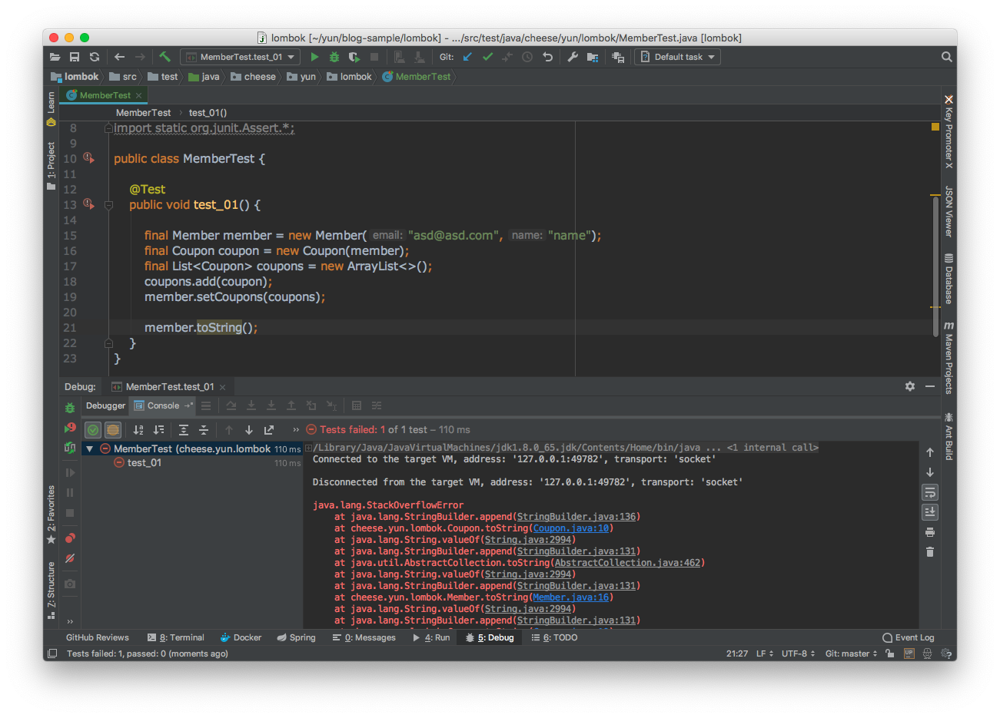
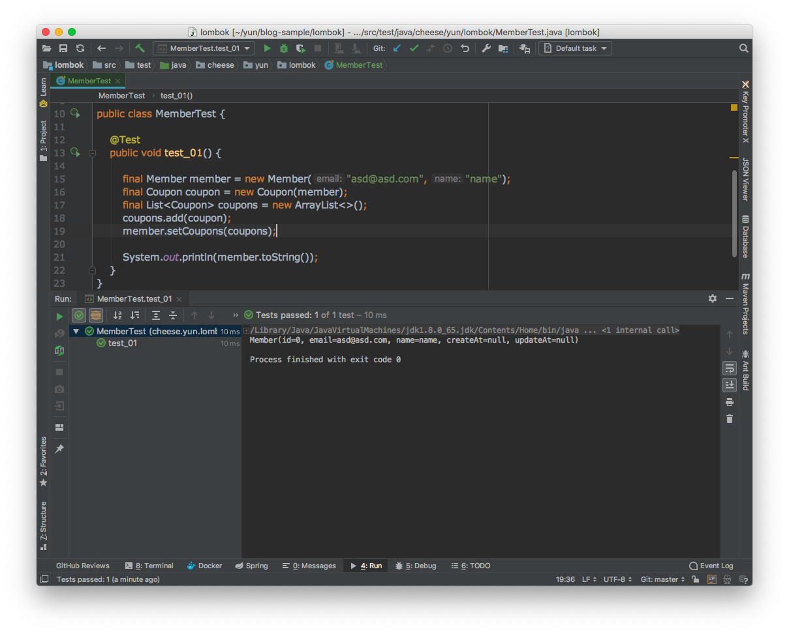
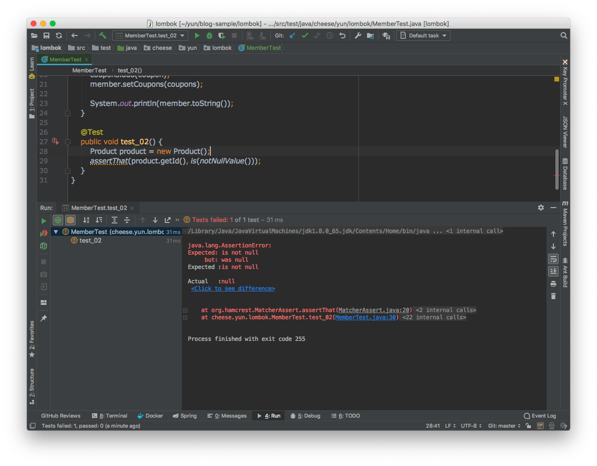
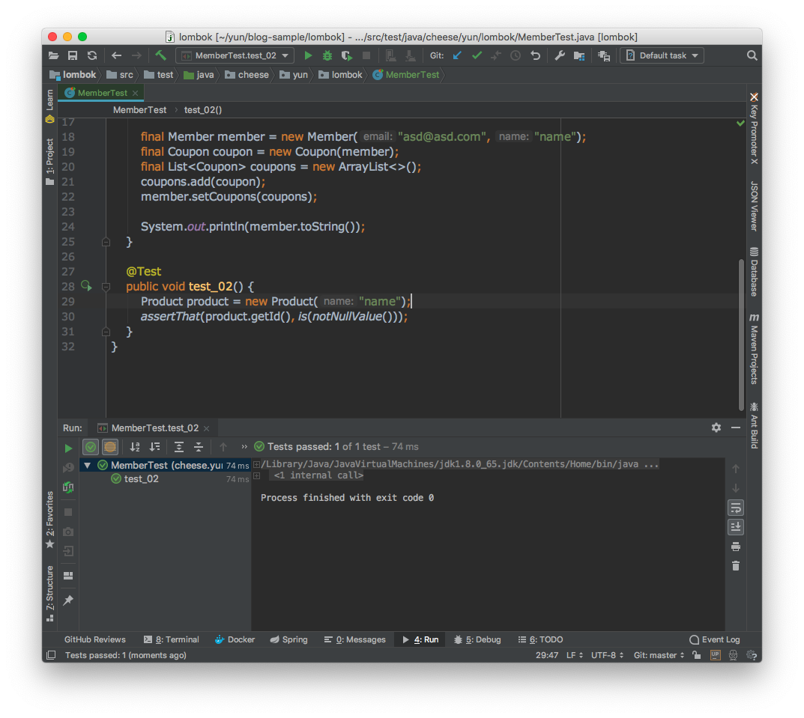
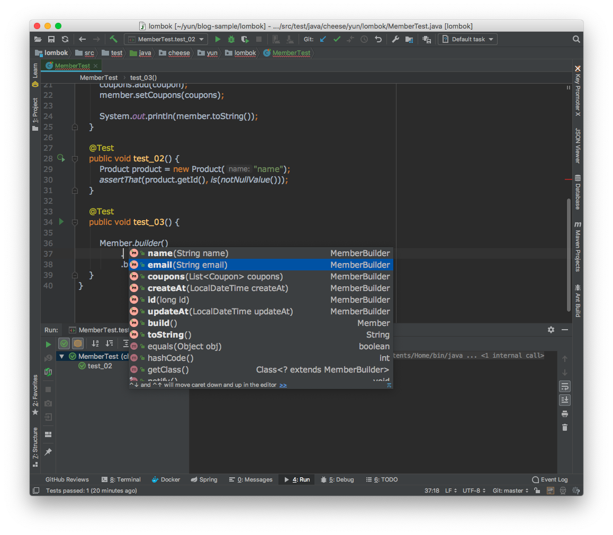
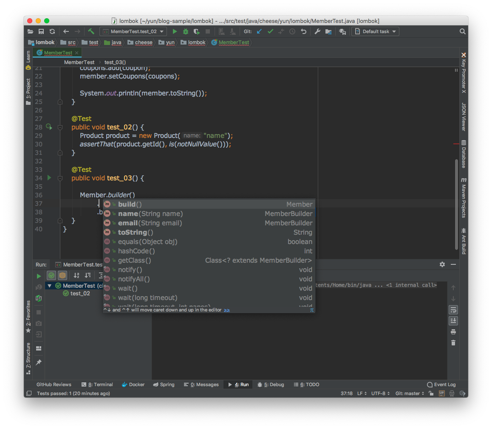

# Lombok

<https://niceman.tistory.com/99>
<https://cheese10yun.github.io/lombok/>
<https://mangkyu.tistory.com/78>

- Lombok은 자바 컴파일 시점에서 특정 어노테이션으로 해당 코드를 추가할 수 있는 라이브러리

## @Data는 지양 하자

```java
@Entity
@Table(name = "member")
@Data
public class Member {
    @Id
    @GeneratedValue(strategy = GenerationType.IDENTITY)
    private long id;

    @Column(name = "email", nullable = false)
    private String email;

    @Column(name = "name", nullable = false)
    private String name;

    @CreationTimestamp
    @Column(name = "create_at", nullable = false, updatable = false)
    private LocalDateTime createAt;

    @UpdateTimestamp
    @Column(name = "update_at", nullable = false)
    private LocalDateTime updateAt;
}
```

- @Data는 @ToString, @EqualsAndHashCode, @Getter, @Setter, @RequiredArgsConstructor을 한번에 사용하는 강력한 어노테이션

## 무분별한 Setter 남용

- Setter는 그 의도가 분명하지 않고 객체를 언제든지 변경할 수 있는 상태가 되어서 객체의 안전성이 보장받기 힘듬

## ToString으로 인한 양방향 연관관계시 순환 참조 문제

```java
@Entity
@Table(name = "member")
@Data
public class Member {
....
@OneToMany
@JoinColumn(name = "coupon_id")
private List<Coupon> coupons = new ArrayList<>();
}

@Entity
@Table(name = "coupon")
@Data
public class Coupon {

    @Id
    @GeneratedValue(strategy = GenerationType.IDENTITY)
    private long id;

    @ManyToOne
    private Member member;

    public Coupon(Member member) {
        this.member = member;
    }
}
```



- Member 객체와 Coupon 객체가 양방향 영관관계일 경우 ToString을 호출하면 무한 순환 참조가 발생
- JPA를 사용하다 보면 객체를 Json으로 직렬화 하는 가정에서 발생하는 문제와 동일한 이유
- 무분별하게 @Data를 사용하게 되면 이러한 문제

쉬운 해결 방법으로는

```java
@ToString(exclude = "coupons")
public class Member {...}
```

- @ToString(exclude = "coupons") 어노테이션을 이용해서 ToString 항목에서 제외



## 바람직한 Lombok 사용법

```java
@Entity
@Table(name = "member")
@ToString(exclude = "coupons")
@Getter
@NoArgsConstructor(access = AccessLevel.PROTECTED)
@EqualsAndHashCode(of = {"id", "email"})
public class Member {

    @Id
    @GeneratedValue(strategy = GenerationType.IDENTITY)
    private long id;

    @Column(name = "email", nullable = false)
    private String email;

    @Column(name = "name", nullable = false)
    private String name;

    @CreationTimestamp
    @Column(name = "create_at", nullable = false, updatable = false)
    private LocalDateTime createAt;

    @UpdateTimestamp
    @Column(name = "update_at", nullable = false)
    private LocalDateTime updateAt;

    @OneToMany
    @JoinColumn(name = "coupon_id")
    private List<Coupon> coupons = new ArrayList<>();

    @Builder
    public Member(String email, String name) {
        this.email = email;
        this.name = name;
    }
}
```

- @ToString(exclude = “coupons”), @Getter 메서드

## @NoArgsConstructor 접근 권한을 최소화

- JPA에서는 프록시를 생성을 위해서 기본 생성자를 반드시 하나를 생성
- 접근 권한이 protected

```java
@Entity
@Table(name = "product")
@Getter
@NoArgsConstructor(access = AccessLevel.PUBLIC) // 테스트를 위해 임시로 Public, 의도한 코드는 PROTECTED
public class Product {

    @Id
    private String id;

    private String name;

    @Builder
    public Product(String name) {
        this.id = UUID.randomUUID().toString();
        this.name = name;
    }
}
```

해당 코드는 ID 생성 전략을 UUID로 가져 갔습니다.



- Id는 항상 null이 아니길 기대하지만 pulbic 생성자를 통해서 객체를 생성하면 Id 값은 null
- @NoArgsConstructor(access = AccessLevel.PUBLIC)를 사용하면 객체 생성 시 안전성을 어느 정도 보장
- 기본 생성자 접근을 protected으로 변경하면 외부에서 해당 생성자를 접근 할 수 없으므로 아래 생성자를 통해서 객체를 생성

```java
@Builder
public Product(String name) {
this.id = UUID.randomUUID().toString();
this.name = name;
}
```

- 해당 생성자 코드에는 UUID 생성 코드가 있어 객체를 생성할 시 반드시 Id 값을 보장
- 객체에 대한 생성자를 하나로 두고 그것을 @Builder을 통해서 사용하는 것이 더군다나 효율적이라고 생각합니다.
- 굳이 ID에 국환 되어 생각하지 객체 생성 시 반드시 생성되어야 하는 것들에 대한 안전성을 높이는 시각을 갖는 것이 중요



## Builder 사용시 매개변수를 최소화 하자

```java
@Builder
public class Member {...}
```

- 클래스 위에 @Builder를 사용 시 @AllArgsConstructor 어노테이션을 붙인 효과를 발생시켜 모든 멤버 필드에 대해서 매개변수를 받는 기본 생성자를 만듬



- 위 그림처럼 모든 멤버필드에 대한 매개변수를 허용
- Member의 Id 생성전략은 데이터베이스의 auto_increment를 의존하고 있다고 가정했을 경우 Id를 넘겨받는 않아야 함
- 또 createAt, updateAt 같은 경우는 @CreationTimestamp, @UpdateTimestamp 각각의 어노테이션이 해당 일을 담당
- 객채 생성시 받지 않아야 할 데이터들이 클래스 상단 @Builder를 사용하게 되면 발생

```java
public class Member {

    @Builder
    public Member(String email, String name) {
        this.email = email;
        this.name = name;
    }
}
```


