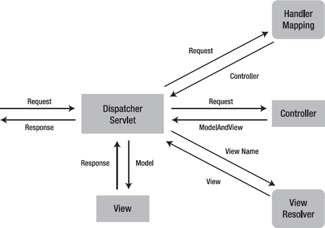

# Spring MVC

<https://doflamingo.tistory.com/20>

## Spring MVC 플로우



Spring MVC를 사용해서 6가지 간단한 웹 플로우를 만드는 예제

- Flow 1. 뷰가 없는 컨트롤러, 자체적으로 컨텐츠 제공
- Flow 2. 뷰가 있는 컨트롤러 (JSP)
- Flow 3. 뷰가 있고, ModelMap을 사용하는 컨트롤러
- Flow 4. 뷰가 있고, ModelAndView를 사용하는 컨트롤러
- Flow 5. 간단한 폼의 컨트롤러
- Flow 6. 벨리데이션이 있는 간단한 폼의 컨트롤러

기본 설정

- Spring MVC의 의존성을 추가
- ispatcherServlet을 web.xml에 추가
- Spring Application Context를 생성

### Spring MVC에 대한 의존성을 추가

- MAVEN pom.xml

```xml
<dependency>
  <groupId>org.springframework</groupId>
  <artifactId>spring-webmvc</artifactId>
  <version>4.1.4.RELEASE</version>
</dependency>
```

DispatcherServlet을 /WEB-INF/web.xml에 추가

```xml
<servlet>
  <servlet-name>dispatcherServlet</servlet-name>
  <servlet-class>org.springframework.web.servlet.DispatcherServlet</servlet-class>
  <load-on-startup>1</load-on-startup>
</servlet>
<servlet-mapping>
  <servlet-name>dispatcherServlet</servlet-name>
  <url-pattern>/</url-pattern>
</servlet-mapping>
```

OR

```xml
<!-- Processes application requests -->
<servlet>
    <servlet-name>dispatcherServlet</servlet-name>
    <servlet-class>org.springframework.web.servlet.DispatcherServlet</servlet-class>
    <init-param>
        <param-name>contextConfigLocation</param-name>
        <param-value>/WEB-INF/spring/appServlet/servlet-context.xml</param-value>
    </init-param>
    <load-on-startup>1</load-on-startup>
</servlet>
<servlet-mapping>
  <servlet-name>dispatcherServlet</servlet-name>
  <url-pattern>/</url-pattern>
</servlet-mapping>
```

### 스프링 애플리케이션 컨텍스트 생성

WEB-INF/spring/appServlet/servlet-context.xml

```xml
<beans> <!-- Schema Definition removed -->


    <bean class="org.springframework.web.servlet.mvc.annotation.DefaultAnnotationHandlerMapping" />
    <bean class="org.springframework.web.servlet.mvc.annotation.AnnotationMethodHandlerAdapter" />

    <bean class="org.springframework.web.servlet.view.InternalResourceViewResolver">
        <property name="prefix" value="/WEB-INF/views/" />
        <property name="suffix" value=".jsp" />
    </bean>

    <mvc:annotation-driven />
    <context:component-scan base-package="me.bosuksh.springmvc" />
</beans>
```

WEB-INF/spring/root-context.xml
변경없음

## Flow 1 - 뷰 없는 컨트롤러

### Flow1 Spring MVC 컨트롤러

```java
@Controller
public class BasicController {
    @RequestMapping(value = "/welcome")
    @ResponseBody
    public String welcome() {
        return "Welcome to Spring MVC";
    }
}
```

- @Controller : 요청 매핑을 포함할 수 있는 Spring MVC 컨트롤러를 정의
- URL을 컨트롤러 메소드에 매핑

- @RequestMapping(value="/welcome"): URL /welcome을 welcome 메서드에 매핑하는 것을 정의
- 클라이언트가 /welcome(`http://localhost:port/contextroot/welcome`)에 요청을 보내면, Spring MVC는 welcome 메서드를 실행
- @ResponseBody: welcome 메서드가 반환한 텍스트가 Response로 클라이언트에게 전송


### Flow1 단위 테스트

단위 테스트는 유지 관리가 가능한 애플리케이션을 개발하는데 있어서 매우 중요
Spring MVC 모킹 프레임워크를 이용해서 컨트롤러 단위테스트
Spring MVC 모킹 프레임워크를 사용하기 위해서 스프링 테스트 프레임워크에 의존성을 추가

```xml
<dependency>
  <groupId>org.springframework</groupId>
  <artifactId>spring-test</artifactId>
  <version>4.0.5.RELEASE</version>
  <scope>test</scope>
</dependency>
```

이제 단위 테스트를 위해서 테스트할 컨트롤러를 설정하고 테스트 코드를 작성

### Flow1 테스트를 위한 컨트롤러 설정

```java
public class BasicControllerTest {
    private MockMvc mockMvc;

    @Before
    public void setUp() {
        this.mockMvc = MockMvcBuilders.standaloneSetup(
                new BasicController()
        ).build();
    }
}
```

- MockMVC: 실제로 애플리케이션 서버에 배포하지 않고서도 Spring MVC를 실행할 수 있는 클래스
- @Before: 이 어노테이션이 붙으면 @Test 어노테이션 이전에 수행된다. 보통 테스트를 위한 전 작업을 할때 사용
- MockMvcBuilders.standaloneSetup : 테스트할 클래스를 mockMVC 객체로 등록해주는 역할

### Flow1 테스트 메서드 작성

```java
@Test
public void basicTest() throws Exception {
    this.mockMvc.perform(
        get("/welcome")
            .accept(MediaType.parseMediaType("application/html;charset=UTF-8")))
        .andExpect(status().isOk())
        .andExpect(content().contentType("application/html;charset=UTF-8"))
        .andExpect(content().string("Welcome to Spring MVC"));
}
```


## Flow2 - 뷰를 가진 컨트롤러 플로우

여기서는 컨트롤러에서 뷰로 리다이렉션

### Flow2 Spring MVC 컨트롤러

```java
@Controller
public class BasicController {

    @RequestMapping(value = "/welcome-view")
    public String welcomeView() {
        return "welcome";
    }
}
```

- 여기는 @ResponseBody 어노테이션이 없음
- 따라서 Spring MVC는 반환된 문자열인 welcome을 뷰와 일치시키려고 시도

### Flow2 View 생성

src/main/webapp/WEB-INF/views/에 welcome.jsp를 작성

```html
<html>
  <head>
    <title>Welcome</title>
  </head>
  <body>
    <p>Welcome! This is Coming from a view - a JSP</p>
  </body>
</html>
```

### Flow2 View Resolver

View Resolver는 View이름을 실제 JSP 페이지로 해석
이것이 가능한 이유는 위에 Application Context를 설정시 빈으로 View Resolover를 빈으로 등록
dispatcher-servlet.xml에서 확인

```xml
<bean class="org.springframework.web.servlet.view.InternalResourceViewResolver">
        <property name="prefix" value="/WEB-INF/views/" />
        <property name="suffix" value=".jsp" />
</bean>
```

InternalResourceViewResolver 클래스가 prefix와 suffix가 붙은 파일들을 찾아서 해당하는 view이름을 가진 jsp파일과 매핑
이것 때문에 컨트롤러가 이름만 가지고 해당하는 jsp 파일을 찾아서 연결


### Flow2 단위 테스트

```java
 @Before
 public void setUp() {
    this.mockMvc = MockMvcBuilders.standaloneSetup(
        new BasicController()
    ).setViewResolvers(viewResolver())
    .build();
}

private ViewResolver viewResolver() {
    InternalResourceViewResolver viewResolver =
    new InternalResourceViewResolver();
    viewResolver.setViewClass(JstlView.class);
    viewResolver.setPrefix("/WEB-INF/views/");
    viewResolver.setSuffix(".jsp");
    return viewResolver;
}
```

- setUp함수에서 어떤 mockMVC에게 어떤 Controller에 대해서 테스트를 할건지 지정
- MockMVC의 경우 view를 실제로 실행하지 않기 때문에 가짜로 view Resolver를 만들어주어서 실제로 데이터 값이 view에 제대로 전달되는지의 확인정도만 가능

### Flow2 테스트 메서드 작성

```java
@Test
public void testWelcomeView() throws Exception {
    this.mockMvc.perform(
    get("/welcome-view")
        .accept(MediaType.parseMediaType("application/html;charset=UTF-8"))
.andExpect(view().name("welcome"));
}
```

위에서 view Resolver를 생성해줬기 때문에 view의 이름을 확인

## Flow3 - 모델이 있는 View로 전환하는 컨트롤러

- 일반적으로 뷰를 생성하면 그 안에 데이터를 전달
- Spring MVC에서는 모델을 사용해서 View에 데이터를 전달

### Flow3 Spring MVC 컨트롤러

```java
@Controller
public class BasicModelMapController {

    @RequestMapping("/welcome-model-map")
    public String modelAndMap(ModelMap modelMap) {
        modelMap.put("name","xyz");
        return "welcome-model-map";
    }
}
```

- ModelMap이라는 파라미터를 받아서 modelMap에 key-value 형태로 값을 넣음
- 이 model은 후에 View에서 사용이 가능

### Flow3 View 생성

WEB-INF/views/ 밑에 welcome-model-map.jsp 을 생성

```html
<html>
  <head>
    <title>Welcome</title>
  </head>
  <body>
    <p>Welcome ${name}! This is Coming from a view - a JSP</p>
  </body>
</html>
```

- ${name} : EL(Expression Language)를 사용해서 모델의 속성을 접근


### Flow3 단위테스트

### Flow3 테스트 컨트롤러 설정

- Flow2 와 동일

### Flow3 테스트 메서드 작성

```java
@Test
public void testModelMap() throws Exception {
    mockMvc.perform(
        get("/welcome-model-map")
        .accept(MediaType.parseMediaType("application/html;charset=UTF-8")))
    .andExpect(model().attribute("name","xyz"))
    .andExpect(view().name("welcome-model-map"));
}
```

- model().attribute()를 통해서 model에 들어가는 attribute key 와 value를 확인

## Flow4- ModelAndView를 사용해 View로 전환하는 컨트롤러

- Spring MVC에서는 ModelAndView라는 객체를 사용해서 대체

```java
@Controller
public class BasicModelViewController {
    @RequestMapping("/welcome-model-and-view")
    public ModelAndView welcome(ModelMap modelMap) {
        modelMap.put("name","abc");
        return new ModelAndView("welcome-model-and-view",modelMap);
    }
}
```

대부분은 Flow3과 동일하다. 대신 String으로 View의 이름을 Return해줬다면 이번에는 ModelAndView 클래스를 이용해서 Return을 해준다. 내용 자체는 앞의 내용과 동일하게 진행됨

### Flow4 View 생성

- WEB-INF/views/ 밑에 welcome-model-and-view.jsp 을 생성

```html
<html>
  <head>
    <title>Welcome</title>
  </head>
  <body>
    <p>Welcome ${name}! This is Coming from a view - a JSP</p>
  </body>
</html>
```


### Flow4 단위 테스트

- Flow4는 Flow3와 내용상 같기 때문에 테스트 코드도 동일하게 적용

## Flow 5 - 폼이 있는 뷰로 전환하는 컨트롤러

- 간단한 POJO를 만듬
- 2개의 컨트롤러 메서드를 작성한다. 하나는 폼을 표시하는 메서드 하나는 폼에 입력된 세부사항을 받을 메서드
- 폼으로 간단한 뷰를 작성

### Flow5 명령 또는 폼 백엔드 오브젝트 작성

```java
public class User {
    private String guid;
    private String name;
    private String userId;
    private String password;
    private String password2;
    // 생성자
    // Getter/ Setter
    // toString
}
```

- 이 클래스에는 어노테이션 또는 스프링 관련 매핑이 없음
- 모든 빈은 폼 백엔드 객체로 작동
- 폼에 이름, 사용자 ID 및 암호를 캡처
- 암호확인 필드인 password2 와 고유 식별자 필드인 guid가 있음
- 간결하게 하기 위해 생성자, getter,setter, toString은 표시하지 않음

### Flow5 폼을 표시하는 컨트롤러 메서드

```java
@Controller
public class UserController {
    private Log logger = LogFactory.getLog(UserController.class);
}
```

### Flow5폼이 있는 뷰를 불러오는 메서드

```java
@RequestMapping(value = "/create-user",method = RequestMethod.GET)
public String showCreateUserPage(ModelMap model) {
    model.addAttribute("user", new User());
    return "user";
}
```

- /create-user 라는 URI를 매핑하는데 HTTP메서드 중 GET방식으로 들어온 것을 매핑

### Flow5 폼 제출을 처리하는 메서드

```java
@RequestMapping(value = "/create-user", method = RequestMethod.POST)
public String addToUser(User user) {
    logger.info("user detail : "+ user);
    return "redirect:list-users";
}

@RequestMapping(value = "/list-users", method = RequestMethod.GET)
public String listUser() {
    return "list-users";
}
```

- /create-user 라는 URI를 매핑하는데 HTTP메서드 중 POST방식으로 들어온 것을 매핑

- 여기서는 폼 백엔드 객체를 파라미터로 사용
- Spring MVC는 폼의 값을 폼 백엔드 객체에 자동으로 바인딩
- 그후 return으로 redirect를 시켜서 다른 URL로 리다이렉팅

### Flow5 폼을 가진 뷰 생성

```jsp
<%@ taglib uri="http://java.sun.com/jsp/jstl/core" prefix="c"%>
<%@ taglib uri="http://java.sun.com/jsp/jstl/fmt" prefix="fmt"%>
<%@taglib uri="http://www.springframework.org/tags/form" prefix="form"%>
<%@taglib uri="http://www.springframework.org/tags" prefix="spring"%>

<H1>Create User</H1>
<form:form method="post" modelAttribute="user">
    <form:errors path="" cssClass="text-warning"/>
    <form:hidden path="guid" />

    <fieldset>
        <form:label path="name">Name</form:label>
        <form:input path="name" type="text" required="required" />
        <form:errors path="name" cssClass="text-warning"/>
    </fieldset>

    <fieldset>
        <form:label path="userId">User Id</form:label>
        <form:input path="userId" type="text" required="required" />
        <form:errors path="userId" cssClass="text-warning"/>
    </fieldset>

    <fieldset>
        <form:label path="password">Password</form:label>
        <form:input path="password" type="password" required="required" />
        <form:errors path="password" cssClass="text-warning"/>
    </fieldset>

    <fieldset>
        <form:label path="password2">Reenter Password</form:label>
        <form:input path="password2" type="password" required="required" />
        <form:errors path="password2" cssClass="text-warning"/>
    </fieldset>

    <input class="btn btn-success" type="submit" value="Submit" />
</form:form>
```

### Flow5 단위 테스팅

Flow 6에서 밸리데이션을 추가할 때 단위 테스팅에 대해 설명할 것

## Flow 6 - 벨리데이션이 있는 간단한 폼의 컨트롤러

- 이전 Flow에서 데이터는 추가 했지만 데이터에 Validation에 대해서 체크하지 않음
- 폼 내용의 유효성을 검증하는데 자바스크립트로 작성할 수는 있지만, 서버에서 벨리데이션을 수행하는 것이 안전
- 이 Flow에서는 앞서 스프링 MVC를 사용해 서버 측에서 작성한 폼에 벨리데이션을 추가

### Flow6 하이버네이트 벨리데이터 의존성 추가

```xml
<dependency>
    <groupId>org.hibernate</groupId>
    <artifactId>hibernate-validator</artifactId>
    <version>5.0.2.Final</version>
</dependency>
```

### 빈에 대한 검증

```java
@Size(min = 6, message = "Enter atleast 6 characters")
private String name;

@Size(min = 6, message = "Enter atleast 6 characters")
private String userId;

@Size(min = 8, message = "Enter atleast 8 characters")
private String password;

@Size(min = 8, message = "Enter atleast 8 characters")
private String password2;
```

- @Size 어노테이션을 통해 필드의 최소 글자수를 지정해주고 이 벨리데이션을 통과하지 못하면 메시지 속성의 텍스트가 벨리데이션 에러메시지로 사용
- 이런 Validation을 검증하는 어노테이션은 아래의 어노테이션을 포함해 더 많이 존재

- @NotNull : Null이면 안됨
- @Size(min= , max= ): 최대 글자수와 최소 글자수를 지정
- @Past: 과거의 날짜
- @Future: 미래의 날짜
- @Pattern: 제공된 정규 표현식과 일치
- @Max: 필드의 최대값
- @Min: 필드의 최소값

```java
@RequestMapping(value = "/create-user-with-validation", method = RequestMethod.POST)
public String addTodo(@Valid User user, BindingResult result) {
    if (result.hasErrors()) {
        return "user";
    }

    logger.info("user details " + user);
    return "redirect:list-users"
}
```

Flow5의 메서드와는 달리 파라미터로 @Valid라는 어노테이션과 BindingResult를 추가로 받았는데 @Valid 어노테이션이 사용되면 Spring MVC는 빈을 validate한다. 벨리데이션 결과는 BindingResult 인스턴스 결과에서 사용

### Flow6 커스텀 벨리데이션

```java
@AssertTrue(message = "Password fields don't match")
private boolean isValid() {
    return this.password.equals(this.password2);
}
```

- @AssertTrue는 벨리데이션이 실패했을 경우 표시할 메시지
- 이러한 방법으로 다중 필드의 복잡한 벨리데이션 로직을 구현

### Flow6 단위 테스팅

- 이 부분에 대한 단위 테스팅은 벨리데이션 에러를 확인하는데 중점
- 여기서는 4개의 벨리데이션 에러를 확인하는 빈 폼에 대한 테스트를 작성

### Flow6 컨트롤러 설정 및 테스틑 메서드

- 이전과 마찬가지의 방식으로 MockMvc를 사용하여 가짜 객체를 만들어서 setup

```java
public class UserValidationControllerTest {

    private MockMvc mockMvc;

    @Before
    public void setUp() {
        mockMvc = MockMvcBuilders.standaloneSetup(
                new UserValidationController())
                .setViewResolvers(viewResolver())
                .build();
    }

    private ViewResolver viewResolver() {
        InternalResourceViewResolver viewResolver = new InternalResourceViewResolver();
        viewResolver.setViewClass(JstlView.class);
        viewResolver.setPrefix("/WEB-INF/views/");
        viewResolver.setSuffix(".jsp");
        return viewResolver;
    }

    @Test
    public void basicTest_WithAllValidationErrors() throws Exception {
        this.mockMvc.perform(
                post("/create-user-with-validation")
                .accept(MediaType.APPLICATION_JSON))
                .andExpect(status().isOk())
                .andExpect(model().errorCount(4))
                .andExpect(model().attributeHasFieldErrors("user" ,"name","Size"));
    }
}
```

- .post()로 지정된 uri에 대한 포스트 요청을 작성
- model().errorCount(4) : 모델에 4개의 벨이데이션 에러가 있는지 점검
- model().attributeHasFieldErrorCode("user","name","Size"): user 속성에 Size라는 벨리데이션 에러가 있는 name 필드가 있는지 확인

<https://github.com/bosuksh/springbase/tree/master/springpuremvc>
