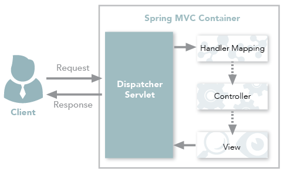
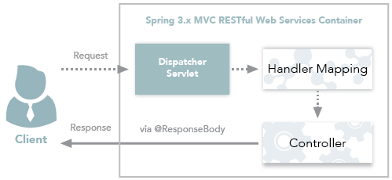
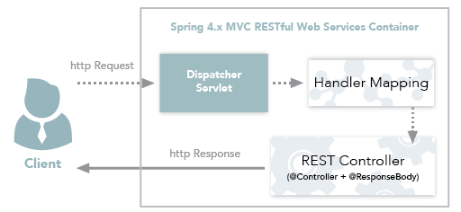

# Spring MVC 컨트롤러

## 컨트롤러(Controller)

### BasicController

```java
package me.springmvc.controller;

import org.springframework.stereotype.Controller;
import org.springframework.web.bind.annotation.RequestBody;
import org.springframework.web.bind.annotation.RequestMapping;
import org.springframework.web.bind.annotation.ResponseBody;

@Controller
public class BasicController {

    @RequestMapping(value = "/welcome")
    @ResponseBody
    public String welcome() {
        return "Welcome to Spring MVC";
    }

    @RequestMapping(value = "welcome-view")
    public String welcomeView() {
        return "welcome";
    }
}
```

### BasicModelMapController

```java
package me.springmvc.controller;

import org.springframework.stereotype.Controller;
import org.springframework.ui.ModelMap;
import org.springframework.web.bind.annotation.RequestMapping;

@Controller
public class BasicModelMapController {

    @RequestMapping("/welcome-model-map")
    public String modelAndMap(ModelMap modelMap) {
        modelMap.put("name","xyz");
        return "welcome-model-map";
    }
}
```

### BasicModelViewController

```java
package me.springmvc.controller;

import org.springframework.stereotype.Controller;
import org.springframework.ui.ModelMap;
import org.springframework.web.bind.annotation.RequestMapping;
import org.springframework.web.servlet.ModelAndView;

@Controller
public class BasicModelViewController {
    @RequestMapping("/welcome-model-and-view")
    public ModelAndView welcome(ModelMap modelMap) {
        modelMap.put("name","abc");
        return new ModelAndView("welcome-model-and-view",modelMap);
    }
}
```

### UserController

```java
package me.springmvc.controller;

import me.bosuksh.springmvc.entity.User;
import org.apache.commons.logging.Log;
import org.apache.commons.logging.LogFactory;
import org.springframework.stereotype.Controller;
import org.springframework.ui.ModelMap;
import org.springframework.web.bind.annotation.RequestMapping;
import org.springframework.web.bind.annotation.RequestMethod;

@Controller
public class UserController {
    private Log logger = LogFactory.getLog(UserController.class);

    @RequestMapping(value = "/create-user",method = RequestMethod.GET)
    public String showCreateUserPage(ModelMap model) {
        model.addAttribute("user", new User());
        return "user";
    }

    @RequestMapping(value = "/create-user", method = RequestMethod.POST)
    public String addToUser(User user) {
        logger.info("user detail : "+ user);
        return "redirect:list-users";
    }

    @RequestMapping(value = "/list-users", method = RequestMethod.GET)
    public String listUser() {
        return "list-users";
    }
}
```

### UserValidationController(User 포함)

```java
package me.springmvc.controller;

import me.springmvc.entity.User;
import org.apache.commons.logging.Log;
import org.apache.commons.logging.LogFactory;
import org.springframework.stereotype.Controller;
import org.springframework.ui.ModelMap;
import org.springframework.validation.BindingResult;
import org.springframework.web.bind.annotation.RequestMapping;
import org.springframework.web.bind.annotation.RequestMethod;

import javax.validation.Valid;

@Controller
public class UserValidationController {

    private Log logger = LogFactory.getLog(UserValidationController.class);

    @RequestMapping(value = "/create-user-with-validation", method = RequestMethod.GET)
    public String showCreateUserPage(ModelMap model) {
        model.addAttribute("user", new User());
        return "user";
    }

    @RequestMapping(value = "/create-user-with-validation", method = RequestMethod.POST)
    public String addTodo(@Valid User user, BindingResult result) {
        if (result.hasErrors()) {
            return "user";
        }

        logger.info("user details " + user);
        return "redirect:list-users";
    }
}
```

```java
package me.springmvc.entity;

import javax.validation.constraints.AssertTrue;
import javax.validation.constraints.Size;

public class User {

    private String guid;
    @Size(min = 6, message = "Enter atleast 6 characters")
    private String name;

    @Size(min = 6, message = "Enter atleast 6 characters")
    private String userId;

    @Size(min = 8, message = "Enter atleast 8 characters")
    private String password;

    @Size(min = 8, message = "Enter atleast 8 characters")
    private String password2;

    public User(String guid, String name, String userId, String password) {
        super();
        this.guid = guid;
        this.name = name;
        this.userId = userId;
        this.password = password;
    }

    public User() {
        this("", "", "", "");
    }

    @AssertTrue(message = "Password fields don't match")
    private boolean isValid() {
        return this.password.equals(this.password2);
    }

    public String getGuid() {
        return guid;
    }

    public void setGuid(String guid) {
        this.guid = guid;
    }

    public String getName() {
        return name;
    }

    public void setName(String name) {
        this.name = name;
    }

    public String getUserId() {
        return userId;
    }

    public void setUserId(String userId) {
        this.userId = userId;
    }

    public String getPassword() {
        return password;
    }

    public void setPassword(String password) {
        this.password = password;
    }

    public String getPassword2() {
        return password2;
    }

    public void setPassword2(String password2) {
        this.password2 = password2;
    }

    @Override
    public String toString() {
        return String
                .format("User [guid=%s, name=%s, userId=%s, password=%s,  password2=%s]", guid, name, userId, password, password2);
    }
}
```

## Spring MVC 컨트롤러 Anotation

<https://github.com/spring-projects/spring-framework/issues/18022>

Spirng MVC 4.3 이상에서 적용

- @PostMapping
- @GetMapping
- @PutMapping
- @DeleteMapping
- @PatchMapping

> > HttpMethods에 매칭

```java
@RequestMapping(value="/getList",method={RequestMethod.POST})
...
@PostMapping("/getList")
```

```java
@RequestMapping(value="/getList",method={RequestMethod.GET})
...
@GetMapping("/getList")
```

## @Controller와 @RestController 차이

- 주요한 차이점은 HTTP Response Body가 생성되는 방식

### @Controller(Spring MVC Controller)

#### [ Controller - View ]

- 전통적인 Spring MVC의 컨트롤러인 @Controller는 주로 View를 반환하기 위해 사용



1. Client는 URI 형식으로 웹 서비스에 요청
2. Mapping되는 Handler와 그 Type을 찾는 DispatcherServlet이 요청을 인터셉트
3. Controller가 요청을 처리한 후에 응답을 DispatcherServlet으로 반환
4. DispatcherServlet은 View를 사용자에게 반환

#### [ Controller - Data ]

- Spring MVC의 컨트롤러에서도 Data를 반환해야 하는 경우
- Spring MVC의 컨트롤러에서는 데이터를 반환하기 위해 @ResponseBody어노테이션을 활용
- 이를 통해 Controller도 Json 형태로 데이터를 반환



1. Client는 URI 형식으로 웹 서비스에 요청
2. Mapping되는 Handler와 그 Type을 찾는 DispatcherServlet이 요청을 인터셉트
3. `@ResponseBody`를 사용하여 Client에게 Json 형태로 데이터를 반환

#### [ @Controller 예제 코드 ]

```java
package com.user.controller;

import com.user.model.UserVO;
import com.user.service.UserService;
import org.springframework.stereotype.Controller;
import org.springframework.ui.Model;
import org.springframework.web.bind.annotation.RequestBody;
import org.springframework.web.bind.annotation.GetMapping;
import org.springframework.web.bind.annotation.PostMapping;
import org.springframework.web.bind.annotation.RequestMethod;
import org.springframework.web.bind.annotation.ResponseBody;

import javax.annotation.Resource;

@Controller
@RequestMapping("/user")
public class UserController {

    @Resource(name = "userService")
    private UserService userService;

    @PostMapping(value = "/retrieveUserInfo")
    public @ResponseBody UserVO retrieveUserInfo(@RequestBody UserVO userVO){
        return userService.retrieveUserInfo(userVO);
    }

    @GetMapping(value = "/userInfoView")
    public String userInfoView(Model model, @RequestParam(value = "userName", required = true) String userName){
        UserVO userVO = userService.retrieveUserInfo(userName);
        model.addAttribute("userInfo", userVO);
        return "/user/userInfoView";
    }
}
```

- retrieveUserInfo는 UserVO라는 데이터를 반환
- UserVO를 json으로 반환하기 위해 @ResponseBody라는 어노테이션
- userInfoView 함수에서는 View를 전달해주고 있기 때문에 String을 반환값으로 설정

### @RestController(Spring Restful Controller)

#### [ RestController ]

- @RestController는 Spring MVC Controlle에 @ResponseBody가 추가
- RestController의 주용도는 Json 형태로 객체 데이터를 반환
- 개인적으로는 VueJS + Spring boot 프로젝트를 진행하며 Spring boot를 API 서버로 활용 또는 Android 앱 개발을 하면서 데이터를 반환할 때 사용



1. Client는 URI 형식으로 웹 서비스에 요청
2. Mapping되는 Handler와 그 Type을 찾는 DispatcherServlet이 요청을 인터셉트
3. RestController는 해당 요청을 처리하고 데이터를 반환

#### [ @RestController 예제 코드 ]

```java
package com.user.controller;

import com.user.model.UserVO;
import com.user.service.UserService;
import org.springframework.http.HttpStatus;
import org.springframework.http.ResponseEntity;
import org.springframework.web.bind.annotation.RequestBody;
import org.springframework.web.bind.annotation.RequestMapping;
import org.springframework.web.bind.annotation.RequestMethod;
import org.springframework.web.bind.annotation.RestController;

import javax.annotation.Resource;

@RestController
@RequestMapping("/user")
public class UserController {

    @Resource(name = "userService")
    private UserService userService;

    @PostMapping(value = "/retrieveUserInfo1")
    public UserVO retrieveUserInfo1(@RequestBody UserVO userVO){
        return userService.retrieveUserInfo(userVO);
    }

    @PostMapping(value = "/retrieveUserInfo2")
    public ResponseEntity<UserVO> retrieveUserInfo2(@RequestParam(value = "userName", required = true) String userName){
        userVO = userService.retrieveUserInfo(userName);
        if(userVO == null){
            return new ResponseEntity<>(HttpStatus.NOT_FOUND);
        }
        return new ResponseEntity<>(userVO, HttpStatus.OK);
    }

    @PostMapping(value = "/retrieveUserInfo3")
    public ResponseEntity<UserVO> retrieveUserInfo3(@RequestParam(value = "userName", required = true) String userName){
        return Optional.ofNullable(userService.retrieveUserInfo(userName))
                .map(userVO -> new ResponseEntity<>(userVO, HttpStatus.OK))
                .orElse(new ResponseEntity<>(HttpStatus.NOT_FOUND));
    }
}
```

- retrieveUserInfo1의 메소드는 UserVO를 그대로 반환
- retrieveUserInfo2처럼 결과 데이터와 상태코드를 함께 제어하여 반환하는 것이 좋음
- 만약 userService에서 반환하는 형태가 [Optional](https://mangkyu.tistory.com/70)이라면 retrieveUserInfo3 처럼 깔끔하게 처리
