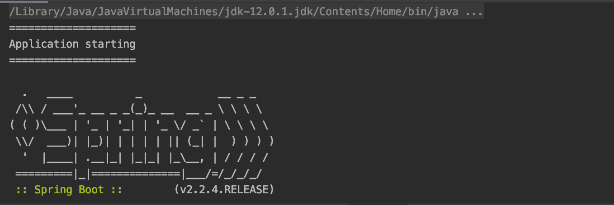
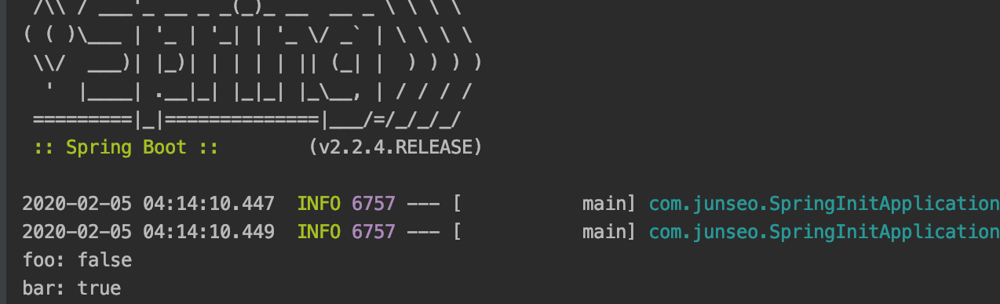
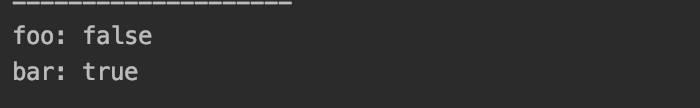

# Application

<https://velog.io/@max9106/Spring-Boot-SpringApplication->

## 스프링부트 프로젝트 실행

1. static 메서드를 쓰는 방법
   - 커스터마이징을 할 수 없음
   ```java
   @SpringBootApplication
   public class SpringInitApplication {
       public static void main(String [] args){
           SpringApplication.run(SpringInitApplication.class, args);
       }
   }
   ```
2. SpringApplication
   - 분해하여 커스터마이징 가능
   ```java
   @SpringBootApplication
   public class SpringInitApplication {
       public static void main(String [] args){
           SpringApplication app =  new SpringApplication(SpringInitApplication.class);
           app.run(args);
       }
   }
   ```
3. springApplicationBuilder

   - 커스터 마이징 가능

   ```java
   @SpringBootApplication
   public class SpringInitApplication {
       public static void main(String [] args){
           new SpringApplicationBuilder()
            .sources(SpringInitApplication.class)
            .run(args);
       }
   }
   ```

## Application Event

- 이 이벤트들에는 애플리케이션이 시작될 때, 에플리케이션 컨텍스트를 만들었을 때 등과 같은 다양한 시점
- Event 리스너를 만들때는 ApplicationListener<타입>를 implements
- 타입을 ApplicationStartingEvent로 주면 이 이벤트가 발생하면(애플리케이션이 시작될 때) 해당 리스너가 실행

```java
public class SampleListener implements ApplicationListener<ApplicationStartingEvent>{
    @Override
    public void onApplicationEvent(ApplicationStartingEvent applicationStartingEvent){
        System.out.println("=================================")
        System.out.println("===== Application Startup  ======")
        System.out.println("=================================")
    }
}
```

- 리스너가 Bean이면, 등록되어있는 Bean 중에 해당하는 이벤트에 대한 리스너는 알아서 실행
- application context가 만들어졌느냐 안 만들어졌느냐를 기준으로 application context가 만들어진 다음에 발생하는 이벤트들은 그 이벤트들의 리스너가 Bean이면 알아서 호출해줄 수 있는데, application context가 만들어지기 이전에 발생한 이벤트(ex. ApplicationStartingEvent같은 이벤트)는 Bean으로 등록한다 하더라도 리스너가 동작않음(이런경우는 직접 등록)
- SpringApplication의 addListeners를 사용해서 에플리케이션에 리스너를 등록

```java
@SpringBootApplication
public class SpringInitApplication {
    public static void main(String [] args){
        SpringApplication app =  new SpringApplication(SpringInitApplication.class);
        app.addListeners(new SampleListener());
        app.run(args);
    }
}
```



만약, 리스너의 타입이 ApplicationStartedEvent인 경우는 application context가 만들어진 이후이기 때문에 Bean으로만 등록해주면 리스너가 동작

```java
@Component
public class SampleListener implements ApplicationListener<ApplicationStartingEvent>{

    @Override
    public void onApplicationEvent(ApplicationStartingEvent applicationStartingEvent){
        System.out.println("=================================")
        System.out.println("===== Application Startup  ======")
        System.out.println("=================================")
    }
}
```

## Application의 타입 지정

- NONE 타입 / REACTIVE 타입 / SERVLET 타입
- Spring MVC가 들어있으면, 기본적으로 SERVLET 타입
- Spring WebFlux가 들어있으면, 기본적으로 REACTIVE 타입(servlet이 있는 경우는 SERVLET 타입)
- 둘 다 없는 경우는 NONE 타입

## Application Argument

Edit Configuration으로 들어간다.

- `-D`로 시작하는 옵션은 JVM옵션
- `--`로 시작하는 옵션이 Application Argument

- JVM옵션에 `-Dfoo` Application argument에 `--bar`를 설정

- spring은 만약 어떤 Bean에 생성자가 하나고 그 생성자의 파라미터가 Bean일 경우에는 그 Bean을 spring이 알아서 주입
- 에플리케이션을 실행해주면 Bean이 생성되므로, 생성자에 아까 설정한 foo와 bar 출력

```java
@Component
public class ArgumentTestComponent{

    public ArgumentTestComponent(ApplicationArguments arguments){
        System.out.println("foo : " + arguments.containsOption(name : "foo"));
        System.out.println("bar : " + arguments.containsOption(name : "bar"));
    }
}
```



- `--`로 들어오는 옵션만 argument로 사용(JVM옵션은 Application argument 아님)

## ApplicationRunner

- Application을 실행하고 난 후, 뭔가를 실행하고 싶을 때 사용
- 클래스를 만들어주고 ApplicationRunner를 implements

```java
@Component
public class AppRunner implements ApplicationRunner{

    @Override
    public void run(ApplicationArguments args) throws Exception{
    }
}
```

- ApplicationRunner는 ApplicationArguments라는 타입으로 메서드 생성
- 사용한 containsOption같은 유용한 메서드들을 바로 사용 가능

```java
@Component
public class AppRunner implements ApplicationRunner{

    @Override
    public void run(ApplicationArguments args) throws Exception{
        System.out.println("foo : " + arguments.containsOption(name : "foo"));
        System.out.println("bar : " + arguments.containsOption(name : "bar"));
    }
}
```



- 만약 ApplicationRunner가 여러개인 경우, `@Order` 어노테이션을 붙여 순서를 지정(숫자가 낮을수록 높은 우선순위)

```java
@Component
@Order(1)
public class AppRunner implements ApplicationRunner{

    @Override
    public void run(ApplicationArguments args) throws Exception{
        System.out.println("foo : " + arguments.containsOption(name : "foo"));
        System.out.println("bar : " + arguments.containsOption(name : "bar"));
    }
}
```
