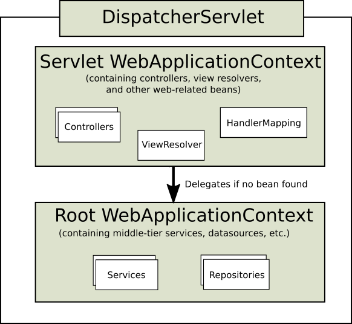

# servlet-context.xml, root-context.xml, web.xml 차이

<https://thiago6.tistory.com/70>
<https://debugdaldal.tistory.com/127>

## web.xml

- 최초로 WAS가 최초로 구동될 때, 각종 설정을 정의
- 여러 xml파일을 인식하도록 각 파일 지정

```xml
<?xml version="1.0" encoding="UTF-8"?>
<web-app version="2.5" xmlns="http://java.sun.com/xml/ns/javaee"
      xmlns:xsi="http://www.w3.org/2001/XMLSchema-instance"
      xsi:schemaLocation="http://java.sun.com/xml/ns/javaee http://java.sun.com/xml/ns/javaee/web-app_2_5.xsd">
<!-- The definition of the Root Spring Container shared by all Servlets and Filters -->
    <context-param>
    <!-- 루트 컨텍스트로 모든 서블릿과 필터들이 공유함. root-context.xml을 정의 -->
        <param-name>contextConfigLocation</param-name>
        <param-value>/WEB-INF/spring/root-context.xml</param-value>
    </context-param>
    <!-- Creates the Spring Container shared by all Servlets and Filters -->
    <listener>
    <!-- 리스너로써 루트 컨텍스트에 정의 되어있는 것들을 모든 서블릿과 필터가 공유할 수 있게 해준다고 함. -->
        <listener-class>org.springframework.web.context.ContextLoaderListener</listener-class>
    </listener>
    <!-- Processes application requests -->
    <servlet>
    <!--  서블릿 설정 -->
    <servlet-name>appServlet</servlet-name>
    <servlet-class>org.springframework.web.servlet.DispatcherServlet</servlet-class> <!-- DispatcherServlet으로 앞단에서 요청정보를 핸들링 해줌. -->
    <init-param>
            <param-name>contextConfigLocation</param-name>
            <param-value>/WEB-INF/spring/appServlet/servlet-context.xml</param-value>
            <!-- servlet-context.xml을 가르키고 있음 -->
    </init-param>
    <load-on-startup>1</load-on-startup>
    </servlet>

    <servlet-mapping>
    <!-- appServlet에 대한 url-pattern을 정의 -->
    <servlet-name>appServlet</servlet-name>
    <url-pattern>/</url-pattern>
    </servlet-mapping>
</web-app>
```


(출처: https://docs.spring.io/spring/docs/current/spring-framework-reference/web.html#mvc)

## root-contex.xml

- servlet-context.xml과는 반대로 view와 관련되지 않은 객체를 정의
- Service, Repository(DAO), DB등 비즈니스 로직과 관련된 설정

```xml
<?xml version="1.0" encoding="UTF-8"?>
<beans:beans xmlns="http://www.springframework.org/schema/mvc"
      xmlns:xsi="http://www.w3.org/2001/XMLSchema-instance"
      xmlns:beans="http://www.springframework.org/schema/beans"
      xmlns:context="http://www.springframework.org/schema/context"
      xsi:schemaLocation="http://www.springframework.org/schema/mvc http://www.springframework.org/schema/mvc/spring-mvc.xsd
            http://www.springframework.org/schema/beans http://www.springframework.org/schema/beans/spring-beans.xsd
            http://www.springframework.org/schema/context http://www.springframework.org/schema/context/spring-context.xsd">
      <!-- DispatcherServlet Context: defines this servlet's request-processing infrastructure -->

      <!-- Enables the Spring MVC @Controller programming model -->
      <annotation-driven />
      <!-- 어노테이션을 사용한다고 선언 -->
      <!-- Handles HTTP GET requests for /resources/** by efficiently serving up static resources in the ${webappRoot}/resources directory -->
      <resources mapping="/resources/**" location="/resources/" />
      <!-- HTML 리소스 디렉토리 정의 -->
      <!-- Resolves views selected for rendering by @Controllers to .jsp resources in the /WEB-INF/views directory -->
      <beans:bean class="org.springframework.web.servlet.view.InternalResourceViewResolver">
            <!-- ViewResolver로 jsp와 name 을 매핑 -->
            <beans:property name="prefix" value="/WEB-INF/views/" />
            <beans:property name="suffix" value=".jsp" />
      </beans:bean>

      <context:component-scan base-package="com.hee.heechart" />
      <!-- 베이스 패키지 하위 모든 어노테이션을 스캔해서 빈으로 등록하겠다는 것. -->
</beans:beans>


출처: https://debugdaldal.tistory.com/127 [달달한 디버깅]
```

## servlet-contex.xml

- servlet에서 보듯이 요청과 관련된 객체를 정의
- url과 관련된 controller나, @(어노테이션), ViewResolver, Interceptor, MultipartResolver 등의 설정

<!-- DispatcherServlet Context: defines this servlet's request-processing infrastructure -->

DispatcherServlet과 관련된 설정
