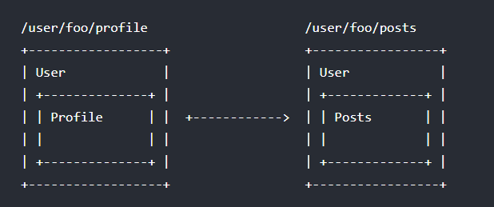

# 기본 사용법

## 동적 라우팅 매칭

```js
const User = {
  template: '<div>User {{ $route.params.id }}</div>'
}

const router = new VueRouter({
  routes: [
    // 동적 세그먼트는 콜론으로 시작합니다.
    { path: '/user/:id', component: User }
  ]
})
```

|패턴|일치하는 패스|$route.params|
|:--:|:--:|:--:|
|/user/:username|/user/evan|{username : 'evan'}|
|/user/:username/post/:post_id|/user/evan/post/123|{username : 'evan', post_id:'123'}|


- `$route.query`
- `$route.hash`

### Params 변경사항 반응

- /user/foo에서 /user/bar로 이동

```js
// 1번
const User = {
  template: '...',
  watch: {
    '$route' (to, from) {
      // 경로 변경에 반응하여...
    }
  }
}

// OR
// 2번
const User = {
  template: '...',
  beforeRouteUpdate (to, from, next) {
    // react to route changes...
    // don't forget to call next()
  }
}
```

### 고급 매칭 패턴

- [path-to-regexp](https://github.com/pillarjs/path-to-regexp/tree/v1.7.0)
- [예제](https://github.com/pillarjs/path-to-regexp/tree/v1.7.0)

### 매칭 우선 순위

- 라우팅 정의의 우선순위에 따라 결정

## 중첩된 라우팅



```js
const router = new VueRouter({
  routes: [
    {
      path: '/user/:id', component: User,
      children: [
        // UserHome은 /user/:id 가 일치 할 때
        // User의 <router-view> 안에 렌더링됩니다.
        { path: '', component: UserHome },

        // ...또 다른 서브 라우트
      ]
    }
  ]
})
```

- [예제](http://jsfiddle.net/yyx990803/L7hscd8h/)

## 프로그램방식 네비게이션

### router.push(location, onComplete?, onAbort?)

|선언적 방식|프로그래밍 방식|
|:--:|:--:|:--:|
|&lt;router-link :to="..."&gt;|this.$router.push(...)|

```js
// 리터럴 string
router.push('home')

// object
router.push({ path: 'home' })

// 이름을 가지는 라우트
router.push({ name: 'user', params: { userId: 123 }})

// 쿼리와 함께 사용, 결과는 /register?plan=private 입니다.
router.push({ path: 'register', query: { plan: 'private' }})
```

- router.push 또는 router.replace에 두번째와 세번째 전달인자로 onComplete와 onAbort 콜백을 제공
- 탐색이 성공적으로 완료되거나(모든 비동기 훅이 해결된 후) 또는 중단(현재 탐색이 완료되기 전에 동일한 경로로 이동하거나 다른 경로 이동)될 때 호출

### router.replace(location)

- 새로운 히스토리 항목에 추가하지 않고 탐색

|선언적 방식|프로그래밍 방식|
|:--:|:--:|:--:|
|&lt;router-link :to="..." replace &gt;|this.$router.replace(...)|

### router.go(n)

- 히스토리 스택에서 앞으로 또는 뒤로 이동하는 단계

```js
// 한 단계 앞으로 갑니다. history.forward()와 같습니다. history.forward()와 같습니다.
router.go(1)

// 한 단계 뒤로 갑니다. history.back()와 같습니다.
router.go(-1)

// 3 단계 앞으로 갑니다.
router.go(3)

// 지정한 만큼의 기록이 없으면 자동으로 실패 합니다.
router.go(-100)
router.go(100)
```

- router.push(window.history.pushState)
- router.replace(window.history.replaceState)
- router.go(window.history.go)

## 이름을 가지는 라우트

```js
const router = new VueRouter({
  routes: [
    {
      path: '/user/:userId',
      name: 'user',
      component: User
    }
  ]
})
```

```js
router.push({ name: 'user', params: { userId: 123 }})
```

```html
<router-link :to="{ name: 'user', params: { userId: 123 }}">User</router-link>
```

- [예제](https://github.com/vuejs/vue-router/blob/dev/examples/named-routes/app.js)

## 이름을 가지는 뷰

```html
<router-view class="view one"></router-view>
<router-view class="view two" name="a"></router-view>
<router-view class="view three" name="b"></router-view>
```

```js
const router = new VueRouter({
  routes: [
    {
      path: '/',
      components: {
        default: Foo,
        a: Bar,
        b: Baz
      }
    }
  ]
})
```

- [예제](https://jsfiddle.net/posva/6du90epg/)

## 리다이렉트와 별칭

### 리다이렉트

```js
const router = new VueRouter({
  routes: [
    { path: '/a', redirect: '/b' }
  ]
})

const router = new VueRouter({
  routes: [
    { path: '/a', redirect: { name: 'foo' }}
  ]
})

const router = new VueRouter({
  routes: [
    { path: '/a', redirect: to => {
      // 함수는 인수로 대상 라우트를 받습니다.
      // 여기서 path/location 반환합니다.
    }}
  ]
})
```

### 별칭

```js
const router = new VueRouter({
  routes: [
    { path: '/a', component: A, alias: '/b' }
  ]
})
```

- [예제](https://github.com/vuejs/vue-router/blob/dev/examples/route-alias/app.js)


## 라우트 컴포넌트에 속성 전달

- 라우트 의존성 추가

```js
const User = {
  template: '<div>User {{ $route.params.id }}</div>'
}
const router = new VueRouter({
  routes: [
    { path: '/user/:id', component: User }
  ]
})
```

- 라우트 의존성 해제

```js
const User = {
  props: ['id'],
  template: '<div>User {{ id }}</div>'
}
const router = new VueRouter({
  routes: [
    { path: '/user/:id', component: User, props: true },
  ]
})
// Boolean props: true
```

### 객체모드

- props가 객체일때 컴포넌트 props가 있는 그대로 설정됩니다. props가 정적일 때 유용

```js
const router = new VueRouter({
  routes: [
    { path: '/promotion/from-newsletter', component: Promotion, props: { newsletterPopup: false } }
  ]
})
// 객체 props: { newsletterPopup: false } 
```

### 함수모드

```js
const router = new VueRouter({
  routes: [
    { path: '/search', component: SearchUser, props: (route) => ({ query: route.query.q }) }
  ]
})
// 함수 props: (route) => ({ query: route.query.q }) 
```

- [예제](https://github.com/vuejs/vue-router/blob/dev/examples/route-props/app.js)

## HTML5 히스토리 모드

```js
const router = new VueRouter({
  mode: 'history',
  routes: [...]
})
```

### 서버설정

- Apache

```xml
<IfModule mod_rewrite.c>
  RewriteEngine On
  RewriteBase /
  RewriteRule ^index\.html$ - [L]
  RewriteCond %{REQUEST_FILENAME} !-f
  RewriteCond %{REQUEST_FILENAME} !-d
  RewriteRule . /index.html [L]
</IfModule>
 ```
- NginX

```json
location / {
  try_files $uri $uri/ /index.html;
}
```

- Native Node.js

```js
const http = require('http')
const fs = require('fs')
const httpPort = 80

http
  .createServer((req, res) => {
    fs.readFile('index.html', 'utf-8', (err, content) => {
      if (err) {
        console.log('We cannot open "index.html" file.')
      }

      res.writeHead(200, {
        'Content-Type': 'text/html; charset=utf-8'
      })

      res.end(content)
    })
  })
  .listen(httpPort, () => {
    console.log('Server listening on: http://localhost:%s', httpPort)
  })
```

- Express Node.js([참고 : connect-history-api-fallback](https://github.com/bripkens/connect-history-api-fallback))

- IIS(Internet Information Services)

```xml
<?xml version="1.0" encoding="UTF-8"?>
<configuration>
 <system.webServer>
   <rewrite>
     <rules>
       <rule name="Handle History Mode and custom 404/500" stopProcessing="true">
         <match url="(.*)" />
         <conditions logicalGrouping="MatchAll">
           <add input="{REQUEST_FILENAME}" matchType="IsFile" negate="true" />
           <add input="{REQUEST_FILENAME}" matchType="IsDirectory" negate="true" />
         </conditions>
         <action type="Rewrite" url="index.html" />
       </rule>
     </rules>
   </rewrite>
     <httpErrors>
         <remove statusCode="404" subStatusCode="-1" />
         <remove statusCode="500" subStatusCode="-1" />
         <error statusCode="404" path="/survey/notfound" responseMode="ExecuteURL" />
         <error statusCode="500" path="/survey/error" responseMode="ExecuteURL" />
     </httpErrors>
     <modules runAllManagedModulesForAllRequests="true"/>
 </system.webServer>
</configuration>
```

## 주의사항

- Vue 앱에서 catch-all 라우트를 구현하여 404 페이지를 표시

```js
const router = new VueRouter({
  mode: 'history',
  routes: [{ path: '*', component: NotFoundComponent }]
})
```