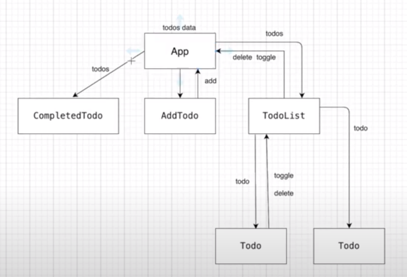
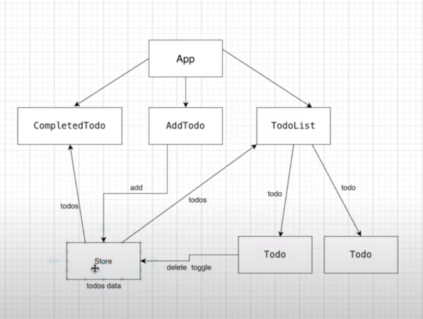

# VUE

## 설치

```js
<script src="https://cdn.jsdelivr.net/npm/vue/dist/vue.js"></script><!-- 개발버전, 도움되는 콘솔 경고를 포함. -->
<script src="https://cdn.jsdelivr.net/npm/vue"></script><!-- 상용버전, 속도와 용량이 최적화됨. -->
```

```bash
npm install vue

npm install -g @vue/cli
yarn global add @vue/cli

vue create 프로젝트명
vue init webpack 프로젝트명 (local)
vue init username/repo 프로젝트명 (github)

cd 프로젝트명
npm install (모듈 업데이트)
npm run serve(npm run dev, npm run build)
```

## 기본템플릿

```js
<template lang="html">
    <div id="app">
      {{ message }}
    </div>
</template>

<script>
// @ ROOT부터 페키지 검색
export default {
    data() : {
      message : "TEST"
    },
    components: {
    }
}
</script>

<style lang="css" scoped>
#app {

}
</style>
```

### 예제 1 : 랜더링(v-bind,v-on)

- `<input v-bind:type="type" v-bind:value="inputData"><br/>`
- `<input :type="type" :value="inputData"><br/>`  v-bind 생략가능 (:)

- `<button v-on:click="alert" >Click Me</button><br/>`
- `<button @click="alert" >Click Me</button><br/>` v-on 생략가능 (@)

```html
<html lang="en">
  <head>
    <meta charset="utf-8">
    <meta http-equiv="X-UA-Compatible" content="IE=edge">
    <meta name="viewport" content="width=device-width,initial-scale=1.0">
    <title>Document</title>
    <script src="https://cdn.jsdelivr.net/npm/vue/dist/vue.js"></script><!-- 개발버전, 도움되는 콘솔 경고를 포함. -->
  </head>
  <body>
      <div id="app">
          {{person.name}}  {{person.age}}<br/>
          {{ nextYear('안녕하세요.') }}<br/>
          <input v-bind:type="type" v-bind:value="inputData"><br/>
          <input :type="type" :value="inputData"><!-- v-bind 생략 가능 --><br/>
          <a :href='link'> InfoRect-Portal</a>
          <button v-on:click="alert" >Click Me</button><br/>
          <form v-on:submit.prevent="submit">
              <!--<input type="text" :value="text" @keyup="updateText" ><br/>-->
              <input type="text" v-model="text" ><br/>
              {{ text }} <br/>
              <button type="submit">버튼</button>
          </form>
      </div>
      <script>
      new Vue({
          el:'#app',
          data:{
              person : {
                  name : 'InfoRect-Portal',
                  age : 1
              },
              inputData: 'hello',
              type:'text',
              text:'text',
              link:'https://www.youtube.com/'
          },
          methods : {
              alert(){
                 alert("TEST TEST");
              },
              submit(){
                  alert("submitted!!");
                  console.log("hello");
              }
          }
      })
      </script>
  </body>
</html>
```

### 예제 2 : computed

```html
<html lang="en">
  <!DOCTYPE html>
<html lang="en">
  <head>
    <meta charset="utf-8">
    <meta http-equiv="X-UA-Compatible" content="IE=edge">
    <meta name="viewport" content="width=device-width,initial-scale=1.0">
    <title>Document</title>
    <script src="https://cdn.jsdelivr.net/npm/vue/dist/vue.js"></script>
  </head>
  <body>
      <div id="app">
          {{ number + 1}} <br/>
          {{ message.split('').reverse().join('') }} <br/>
          {{ reverseMessage }} <br/>
          {{ reverseMessage }} <br/><!-- 중복처리 효과 -->
          {{ reverseMessageFunc() }} <br/>
          {{ reverseMessageFunc() }} <br/>
          <!-- https://kr.vuejs.org/v2/guide/computed.html#computed-%EC%86%8D%EC%84%B1%EC%9D%98-%EC%BA%90%EC%8B%B1-vs-%EB%A9%94%EC%86%8C%EB%93%9C -->
          <button @click="changeMessage">Click</button>

      </div>
      <script>
      new Vue({
          el:'#app',
          data:{
              number: 1,
              message : '안녕하세요.'
          },
          methods : {
              reverseMessageFunc(){
                  return this.message.split('').reverse().join('');
              },
              changeMessage(){
                  this.message = '조나단';
              }
          },
          computed : {
              reverseMessage(){
                  return this.message.split('').reverse().join('');
              }
          }
      })
      </script>
  </body>
</html>
```

### 예제 3 : (v-bind:style, v-bind:class)

```html
<!DOCTYPE html>
<html lang="en">
  <head>
    <meta charset="utf-8">
    <meta http-equiv="X-UA-Compatible" content="IE=edge">
    <meta name="viewport" content="width=device-width,initial-scale=1.0">
    <title>Document</title>
    <style>
    .red {
        color: red;
    }
    .bold {
        font-weight: bold;
    }
    </style>
    <script src="https://cdn.jsdelivr.net/npm/vue/dist/vue.js"></script>
  </head>
  <body>
      <div id="app">
          <div class="red bold">Hello</div>
          {{ message }}<br/>
          <button @click="changeMessage">Click</button>
          {{ updated }}<br/>
          <br/>
          <!-- https://kr.vuejs.org/v2/guide/class-and-style.html --><!-- 클래스와 스타일 바인딩 -->
          <div :class="{red : isRed, bold : isBold}">Hello2</div><br/>
          <button @click="updateColor">Click</button>

          <!--<div v-bind:style="{ color : red, fontSize : size}" >Hello3</div><br/>-->
          <div :style="{ color : red, fontSize : size}" >Hello3</div><br/>
          <div :style="styleObject" >Hello4</div><br/>

      </div>
      <script>
      new Vue({
          el:'#app',
          data:{
              message : '안녕하세요.',
              updated : '아니요',
              isRed : false,
              isBold : false,
              red : 'red',
              size : '30px',
              styleObject : {
                  color : 'red',
                  fontSize : '20px'
              }
          },
          methods : {
              changeMessage(){
                  this.message = '코지로더';
              },
              updateColor(){
                  this.isRed = !this.isRed;
                  this.isBold = !this.isBold;
              },
          },
          computed : {
              reverseMessage(){
                  return this.message.split('').reverse().join('');
              }
          },
          watch : {
              message(newVal, oldVal){
                  console.log(newVal,oldVal);
                  this.updated = '네';
              }
            // https://kr.vuejs.org/v2/guide/computed.html#computed-%EC%86%8D%EC%84%B1-vs-watch-%EC%86%8D%EC%84%B1
            // computed속성 vs watch 속성
          }
      })
      </script>
  </body>
</html>
```

### 예제 4 : (v-if, v-else-if, v-else, v-show)

```html
<!DOCTYPE html>
<html lang="en">
  <head>
    <meta charset="utf-8">
    <meta http-equiv="X-UA-Compatible" content="IE=edge">
    <meta name="viewport" content="width=device-width,initial-scale=1.0">
    <title>Document</title>
    <style>
    .red {
        color: red;
    }
    .bold {
        font-weight: bold;
    }
    </style>
    <script src="https://cdn.jsdelivr.net/npm/vue/dist/vue.js"></script>
  </head>
  <body>
      <div id="app">
          <div v-if="show">Yes</div>
          <div v-else>No</div>
          <br/>
          <button @click="toggleShow">Target</button>
          <br/>
          <br/>
          <template v-if="number === 1">
              <div >1</div>
              <div >2</div>
              <div >3</div>
          </template>
          <div v-else-if="number === 2">HI</div>
          <div v-else>No</div>
          <button @click="increaseNumber">Target</button> {{ number}}
          <br/>
          <div v-show="show2">Yes</div><br/><br/>
          <button @click="toggle">Toggle</button>
          <!-- 조건부 렌더링 -->
          <!--
          이에 비해 v-show는 훨씬 더 간단합니다. 요소는 CSS 기반 토글로 초기 조건에 관계없이 항상 렌더링됩니다.
          일반적으로 v-if는 토글 비용이 더 높고 v-show는 초기 렌더링 비용이 더 높습니다.
          따라서 무언가를 자주 토글해야하는 경우 v-show를 선호하고 런타임에 조건이 변경되지 않을 경우 v-if를 선호합니다.
          -->
      </div>
      <script>
      new Vue({
          el:'#app',
          data:{
              show : true,
              show2 : false,
              number : 1
          },
          methods : {
              toggleShow(){
                  this.show = !this.show;
              },
              increaseNumber(){
                  this.number ++;
              },
              toggle(){
                  this.show2 = !this.show2;
              }
          }
      })
      </script>
  </body>
</html>

```

### 예제 5 : (List, v-for)

```html
<!DOCTYPE html>
<html lang="en">
  <head>
    <meta charset="utf-8">
    <meta http-equiv="X-UA-Compatible" content="IE=edge">
    <meta name="viewport" content="width=device-width,initial-scale=1.0">
    <title>Document</title>
    <style>
    .red {
        color: red;
    }
    .bold {
        font-weight: bold;
    }
    </style>
    <script src="https://cdn.jsdelivr.net/npm/vue/dist/vue.js"></script>
  </head>
  <body>
      <div id="app">
          <div>
              {{ people[0].name}} {{ people[0].age}}
          </div>
          <div>
              {{ people[1].name}} {{ people[1].age}}
          </div>
          <div>
              {{ people[2].name}} {{ people[2].age}}
          </div>
          <div>
              {{ people[3].name}} {{ people[3].age}}
          </div>
          <hr/>
          <div v-for="person in people">
              {{ person.name}} {{ person.age}}
          </div>

          <hr/>
          <div v-for=" (person, index) in people" :key="person.name + '-' + person.age">
              {{ person.name}} {{ person.age}} {{index}}
          </div>

          <hr/>
          <div v-for="(person, index) in people2" :key="person.id">
              {{ person.name}} {{ person.age}} {{index}}
          </div>
          <!-- 리스트 랜더링 https://vuejs.org/v2/guide/list.html -->
      </div>
      <script>
      new Vue({
          el:'#app',
          data:{
              people : [
                  { name : 'a' , age : 20},
                  { name : 'b' , age : 21},
                  { name : 'c' , age : 22},
                  { name : 'd' , age : 23},
                  { name : 'e' , age : 24}
              ],
              people2 : [
                  { id : 1, name : 'a' , age : 20},
                  { id : 2,  name : 'b' , age : 21},
                  { id : 3,  name : 'c' , age : 22},
                  { id : 4,  name : 'd' , age : 23},
                  { id : 5,  name : 'e' , age : 24}
              ]

          },
          methods : {
          }
      })
      </script>
  </body>
</html>
```

### 예제 6 : (vue객체, this)

```html
<!DOCTYPE html>
<html lang="en">
  <head>
    <meta charset="utf-8">
    <meta http-equiv="X-UA-Compatible" content="IE=edge">
    <meta name="viewport" content="width=device-width,initial-scale=1.0">
    <title>Document</title>
    <style>
    .red {
        color: red;
    }
    .bold {
        font-weight: bold;
    }
    </style>
    <script src="https://cdn.jsdelivr.net/npm/vue/dist/vue.js"></script>
  </head>
  <body>
      <div id="app">
          <div>
              {{name}}
          </div>
          <button @click="changeText">Click</button>
          <button @click="changeOtherText">Click</button>
      </div>
      <div id="app-1">
          <div>
              {{name}}
          </div>
          <button @click="changeText">Click</button>
          <button @click="changeOtherText">Click</button>
      </div>
      <script>
      const app = new Vue({
          el:'#app',
          data:{
              name : 'anabasis'
          },
          methods : {
              changeText(){
                  this.name = "Anabasis Update";
              },
              changeOtherText(){
                  app1.name = "Anabasis Update";
              }
          }
      })
      const app1 = new Vue({
          el:'#app-1',
          data:{
              name : 'anabasis1'
          },
          methods : {
              changeText(){
                  this.name = "Anabasis111 Update";
              },
              changeOtherText(){
                  app.name = "Anabasis111 Update";
              }
          }
      })
      </script>
  </body>
</html>

```

### 예제 7 : (Vue.component, const app = new Vue)

```html
<!DOCTYPE html>
<html lang="en">

<head>
    <meta charset="utf-8">
    <meta http-equiv="X-UA-Compatible" content="IE=edge">
    <meta name="viewport" content="width=device-width,initial-scale=1.0">
    <title>Document</title>
    <style>
        .red {
            color: red;
        }

        .bold {
            font-weight: bold;
        }
    </style>
    <script src="https://cdn.jsdelivr.net/npm/vue/dist/vue.js"></script><!-- 개발버전, 도움되는 콘솔 경고를 포함. -->
    <!--<script src="https://cdn.jsdelivr.net/npm/vue"></script>-->
    <!-- 상용버전, 속도와 용량이 최적화됨. -->
</head>
<body>
    <!-- 컴포넌트 사용하기 https://kr.vuejs.org/v2/guide/components.html -->
    <div id="app">
        <!-- <div>
            {{name}}
        </div>
        <button @click="changeText">Click</button>
        <button @click="changeOtherText">Click</button>
        <hr /> -->
        <inforect-button></inforect-button>
    </div>

    <div id="app-1">
        <!-- <div>
            {{name}}
        </div>
        <button @click="changeText">Click</button>
        <button @click="changeOtherText">Click</button>
        <hr /> -->
        <inforect-button></inforect-button>
    </div>
    <script>
        Vue.component('hello-world', {
            template: `<div>
            hello world
            </div>`
        });
        // 전역 컴포넌트
        Vue.component('inforect-button', {
            template: `
            <div>
            <hello-world></hello-world>
          <div>
              {{name}}
          </div>
          <button @click="changeText">Click</button>
          <button @click="changeOtherText">Click</button>
          </div>
          `,
            data() {
                return {
                    name: 'anabasis'
                }
            },
            methods: {
                changeText() {
                    this.name = "Anabasis Update";
                },
                changeOtherText() {
                    app1.name = "Anabasis Update";
                }
            }
        });
        const app = new Vue({
            el: '#app',
            // data: {
            //     name: 'anabasis'
            // },
            // methods: {
            //     changeText() {
            //         this.name = "Anabasis Update";
            //     },
            //     changeOtherText() {
            //         app1.name = "Anabasis Update";
            //     }
            // }
        });

        const app1 = new Vue({
            el: '#app-1',
            // data: {
            //     name: 'anabasis1'
            // },
            // methods: {
            //     changeText() {
            //         this.name = "Anabasis111 Update";
            //     },
            //     changeOtherText() {
            //         app.name = "Anabasis111 Update";
            //     }
            // }
        });
    </script>
</body>
</html>
```

### 예제 8 : (component, template, data(), methods)

```html
<!DOCTYPE html>
<html lang="en">

<head>
    <meta charset="utf-8">
    <meta http-equiv="X-UA-Compatible" content="IE=edge">
    <meta name="viewport" content="width=device-width,initial-scale=1.0">
    <title>Document</title>
    <style>
        .red {
            color: red;
        }

        .bold {
            font-weight: bold;
        }
    </style>
    <script src="https://cdn.jsdelivr.net/npm/vue/dist/vue.js"></script>
</head>

<body>
    <!-- 컴포넌트 사용하기 https://kr.vuejs.org/v2/guide/components.html -->
    <div id="app">
        <inforect-button></inforect-button>
    </div>
    <div id="app-1">
        <inforect-button></inforect-button>
    </div>
    <script>

        // 지역 컴포넌트
        const HelloWorld = {
            template: `<div>
            hello world
            </div>`
        }
        const InforectButton = {
            components : {
                'hello-world' : HelloWorld
            },
            template: `
            <div>
            <hello-world></hello-world>
          <div>
              {{name}}
          </div>
          <button @click="changeText">Click</button>
          <button @click="changeOtherText">Click</button>
          </div>
          `,
            data() {
                return {
                    name: 'anabasis'
                }
            },
            methods: {
                changeText() {
                    this.name = "Anabasis Update";
                },
                changeOtherText() {
                    this.name = "Anabasis Update";
                }
            }
        }
        const app = new Vue({
            el: '#app',
            components : {
                'inforect-button' : InforectButton
            }
        });
        const app1 = new Vue({
            el: '#app-1',
            components : {
                'inforect-button' : InforectButton
            }
        });
    </script>
</body>
</html>
```

### 예제 9 : (slot)


### 예제 10 : (props, emit)


## 소스코드 분석

- /public/index.html

```html
...
<div id="app"></div>
...
```

- /src/main.js

```js
import Vue from 'vue'
import App from './App.vue'
import router from './router'
import store from './store'

Vue.config.productionTip = false
new Vue({
  router,
  store,
  render: h => h(App)
}).$mount('#app')
```

- /src/App.vue

```js
<template>
  <div id="app">
    <div id="nav">
      <router-link to="/">Home</router-link> |
      <router-link to="/about">About</router-link>
    </div>
    <router-view/>
  </div>
</template>

<style>
#app {
  font-family: Avenir, Helvetica, Arial, sans-serif;
  -webkit-font-smoothing: antialiased;
  -moz-osx-font-smoothing: grayscale;
  text-align: center;
  color: #2c3e50;
}
#nav {
  padding: 30px;
}
#nav a {
  font-weight: bold;
  color: #2c3e50;
}
#nav a.router-link-exact-active {
  color: #42b983;
}
</style>
```

- /router/index.js

```js
import Vue from 'vue'
import VueRouter from 'vue-router'
import Home from '../views/Home.vue'

Vue.use(VueRouter)

const routes = [
  {
    path: '/',
    name: 'Home',
    component: Home
  },
  {
    path: '/about',
    name: 'About',
    // route level code-splitting
    // this generates a separate chunk (about.[hash].js) for this route
    // which is lazy-loaded when the route is visited.
    component: () => import(/* webpackChunkName: "about" */ '../views/About.vue')
  }
]

const router = new VueRouter({
  mode: 'history',
  base: process.env.BASE_URL,
  routes
})

export default router
```

- /store/index.js

```js
import Vue from 'vue'
import Vuex from 'vuex'

Vue.use(Vuex)

export default new Vuex.Store({
  state: {
  },
  mutations: {
  },
  actions: {
  },
  modules: {
  }
})

```

- /views/Home.vue

```js
<template>
  <div class="home">
    
    <HelloWorld msg="Welcome to Your Vue.js App"/>
  </div>
</template>

<script>
// @ is an alias to /src
import HelloWorld from '@/components/HelloWorld.vue'

export default {
  name: 'Home',
  components: {
    HelloWorld
  }
}
</script>
```

- /views/About.vue

```js
<template>
  <div class="about">
    <h1>This is an about page</h1>
  </div>
</template>
```

- views 일반 페이지 컴포넌트
- components 페이지내 기능 컴포넌트





