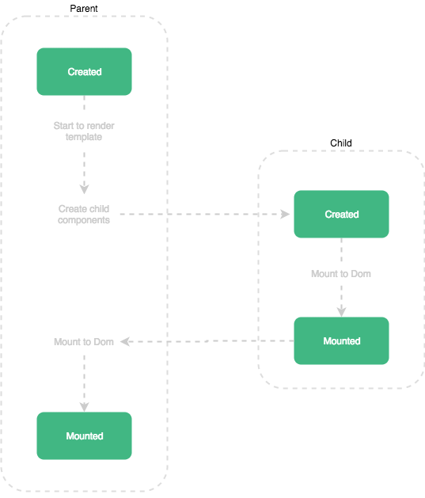

# Vue.js 2.0 라이프싸이클

- Creation
- Mounting
- Updating
- Destruction


## 1. Creation : 컴포넌트 초기화 단계

- Creation 단계에서 실행되는 훅(hook)들이 라이프사이클 중에서 가장 처음 실행
- 이 단계는 컴포넌트가 돔에 추가되기 전이다. 서버 렌더링에서도 지원되는 훅
- 클라이언트 단과 서버단 렌더링 모두에서 처리해야할일이 있다면 이단계에서 하면됨
- 아직 컴포넌트가 돔에 추가되기 전이기 때문에 돔에 접근하거나 this.$el를 사용할 수 없음
- 이 단계에서는 beforeCreate 훅과 Created 훅

### beforeCreate

- 모든 훅 중에 가장 먼저 실행되는 훅
- data와 events(vm.$on, vm.$once, vm.$off, vm.$emit)가 세팅되지 않은 시점이므로 접근하려고 하면 에러

```js
<script>
  export default {
    data () {
      return {
        title: ''
      }
    },
    beforeCreate () {
      //can't use Data(this.title ...), events(vm.$on, vm.$once, vm.$off, vm.$emit)
    }
  }
</script>
```

### created

- created 훅에서는 이제 data와 events가 활성화되어 접근 가능
- 여전히 템플릿과 가상돔은 마운트 및 렌더링되지 않은 상태

```js
<script>
  export default {
    data () {
      return {
        title: ''
      }
    },
    computed: {
      titleComputed() {
        console.log('I change when this.property changes.')
        return this.property
      }
    },
    created () {
      //can use Data(this.title, this.titleComputed ...), events(vm.$on, vm.$once, vm.$off, vm.$emit)
      //don't use $el
    }
  }
</script>
```

## 2. Mounting : 돔(DOM) 삽입 단계

- Mounting 단계는 초기 렌더링 직전에 컴포넌트에 직접 접근 가능. 서버렌더링에서는 지원하지 않음
- 초기 랜더링 직전에 돔을 변경하고자 한다면 이 단계를 활용할 수 있음. 그러나 컴포넌트 초기에 세팅되어야할 데이터 페치는 created 단계를 사용

### beforeMount

- beforeMount 훅은 템플릿과 렌더 함수들이 컴파일된 후에 첫 렌더링이 일어나기 직전에 실행
- 대부분의 경우에 사용하지 않는 것이 좋다. 그리고 서버사이드 렌더링시에는 호출되지 않음

```js
<script>
export default {
  beforeMount() {
    console.log(`this.$el doesn't exist yet, but it will soon!`)
  }
}
</script>
```

### mounted

- mounted 훅에서는 컴포넌트, 템플릿, 렌더링된 돔에 접근 가능
- 모든 하위 컴포넌트가 마운트된 상태를 보장하지는 않는다. 서버렌더링에서는 호출되지 않음

```js
<script>
export default {
  mounted() {
    console.log(this.$el.textContent) // can use $el
    this.$nextTick(function () {
      // 모든 화면이 렌더링된 후 실행합니다.
    })
  }
}
</script>
```

- mounted 훅에서 유의할 점은, 부모와 자식 관계의 컴포넌트에서 우리가 생각한 순서로 mounted가 발생하지 않는다는 점
- 즉 부모의 mounted훅이 자식의 mounted훅보다 먼저 실행되지 않음. 오히려 그 반대



- 위 그림처럼 Created훅은 부모->자식의 순서로 실행되지만 mounted는 그렇지 않다는 것을 알 수 있음.
- 부모는 mounted훅을 실행하기 전에 자식의 mounted훅이 끝나기를 기다린다.(참고 [Vue Parent and Child lifecycle hooks](https://medium.com/@brockreece/vue-parent-and-child-lifecycle-hooks-5d6236bd561f))

## 3. Updating : Diff 및 재 렌더링 단계

- 컴포넌트에서 사용되는 반응형 속성들이 변경되거나 어떤 이유로 재 렌더링이 발생되면 실행
- 디버깅이나 프로파일링 등을 위해 컴포넌트 재 렌더링 시점을 알고 싶을때 사용
- 조심스럽지만, 꽤 유용하게 활용될 수 있는 단계이다. 서버렌더링에서는 호출되지 않음

### beforeUpdate

- 이 훅은 컴포넌트의 데이터가 변하여 업데이트 사이클이 시작될때 실행
- 정확히는 돔이 재 렌더링되고 패치되기 직전에 실행
- 재 렌더링 전의 새 상태의 데이터를 얻을 수 있고 더 많은 변경이 가능
- 이 변경으로 이한 재 렌더링은 트리거되지 않음

### updated

- 이 훅은 컴포넌트의 데이터가 변하여 재 렌더링이 일어나 후에 실행
- 돔이 업데이트 완료된 상태이므로 돔 종속적인 연산 가능
- 여기서 상태를 변경하면 무한루프에 빠질 수 있다. 모든 자식 컴포넌트의 재 렌더링 상태를 보장하지는 않음

```js
<script>
export default {
  updated() {
    this.$nextTick(function () {
      // 모든 화면이 렌더링된 후 실행합니다.
    })
  }
}
</script>
```

## 4. Destruction : 해체 단계

### beforeDestroy

- 이 훅은 해체(뷰 인스턴스 제거)되기 직전에 호출
- 컴포넌트는 원래 모습과 모든 기능들을 그대로 가지고 있다. 이벤트 리스너를 제거하거나 reactive subscription을 제거하고자 한다면 이 훅이 제격
- 서버 렌더링시 호출되지 않음

### destroyed

- 이 훅은 해체(뷰 인스턴스 제거)된 후에 호출
- Vue 인스턴스의 모든 디렉티브가 바인딩 해제 되고 모든 이벤트 리스너가 제거되며 모든 하위 Vue 인스턴스도 삭제
- 서버 렌더링시 호출되지 않는다.

### activated와 deactivated

- 각각 keep-alive 컴포넌트가 활성화 될 때와 비활성화 될 때 호출