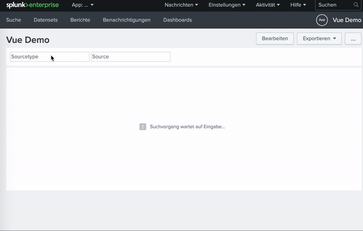

# Splunk VUE(Using VueJS in Splunk Part 1: Simple Filter on a Dashboard)

- 단순하게 유지하기 위해 Vue 코어 lib의 축소 된 버전을 사용
- sourcetype을 설정하여 _internal 인덱스에 대한 검색을 필터링하는 간단한 텍스트 필터 제작.
- 텍스트 필터는 제출된 토큰 모델에 연결
- 따라서 토큰을 업데이트해야하는 경우와 필터를 업데이트해야하는 경우를 모두 고려

1. Token is set via URL when the dashboard is loaded.(토큰은 대시보드가 로드 될 때 URL을 통해 설정)
2. Token is changed by Vue.(토큰은 Vue에 의해 변경)
3. Token is changed by Splunk.(토큰은 Splunk에 의해 변경)

## Prepare a fresh Splunk app(새로운 Splunk 앱 준비)

- 이름 : Vue Demo
- 디렉토리 : 앱명
- 앱명폴더 밑에 `appserver/static` 디렉토리 생성

```bash
cd $SPLUNK_HOME/etc/apps/앱명
mkdir appserver
cd appserver
mkdir static
cd static

# YARN 설치
npm install -g yarn

# VUE CLI 설치
npm install -g @vue/cli
yarn global add @vue/cli

# 프로젝트 초기화
yarn init -y
yarn add vue

# VUE 파일 생성
vi vue-demo.js
```

```js
//# sourceURL=vue-demo.js

require.config({
  paths: {
    vue: "../app/vue-demo/node_modules/vue/dist/vue"
  }
});

require([
  "vue",
  "splunkjs/mvc",
  "splunkjs/mvc/simplexml/ready!",
  "splunkjs/ready!"
], (mvc, Vue) => {

  new Vue({
    template: `
      <input />
    `,
  }).$mount('#app');
  
});
```

- `//# sourceURL = vue-demo.js`의 시작 부분에있는 주석은 디버깅을 위한 것
- 브라우저의 DevTools에서 "unbundled"파일을 볼 수 있기 때문
- Vue를 paths 속성에 추가하여 필수 구성에 등록
- 나머지는 표준 RequireJS("splunkjs/mvc", 'splunkjs/mvc/simplexml/ready!', 'splunkjs/ready!')

## Simple XML

- $SPLUNK_HOME\etc\apps\앱명\local\data\ui\views
- vue_dashboard.xml(스플렁크 대시보드 파일)
- `<form script="vue-demo.js">`
- `index=_internal sourcetype=$sourcetype$ | head`

```html
<form script="vue-demo.js">
  <label>Vue Demo</label>
  <row>
    <panel>
      <html>
        <div id="app"></div>
      </html>
    </panel>
  </row>
  <row>
    <panel>
      <table>
        <search>
          <query>index=_internal sourcetype="$sourcetype$" | head</query>
          <earliest>-24h@h</earliest>
          <latest>now</latest>
        </search>
        <option name="drilldown">none</option>
      </table>
    </panel>
  </row>
</form>
```


## 1st Draft: Simple Filter(1차 초안 : 단순 필터)

- 먼저 제출된 토큰 모델을 캐시
- `const tokenModel = mvc.Components.get('submitted')`.
- 먼저 URL을 통해 설정된 경우 토큰을 검색
- 이것은 istance가 인스턴스화 될 때 `tokenModel.get ('sourcetype')`을 호출하여 수행
- 이를 반응적으로 만들기 위해 데이터에 저장
- BTW : 데이터는 Vue 루트 인스턴스의 개체.
- sourcetype은 템플릿의 입력 `<input v-model.lazy = "sourcetype”/>`에 지연 바인딩되어 모든 입력 이벤트가 아닌 변경 후에 만 동기화(Lazy 수정자).

```js
data() {
  return {
    sourcetype: tokenModel.get('sourcetype'),
  }
},
```

The second case is covered by adding a watcher on the sourcetype, which sets the sourcetype in the token model after a change.

두 번째 경우는 변경 후 토큰 모델에서 소스 유형을 설정하는 소스 유형에 감시자를 추가

```js
watch: {
  sourcetype(value) {
    tokenModel.set('sourcetype', value);
  },
},
```

- 세 번째 경우는 반대로 Splunk가 토큰을 변경할 때 Vue에 알려야하기 때문
- 따라서 생성된 라이프 사이클 후크에서 토큰 모델의 소스 유형 변경 사항을 구독
- 인스턴스가 소멸되었을 때 제대로 구독을 취소하려면 콜백을 명명된 함수로 만듦,
- Splunk 토큰 모델내에서 호출되는 경우에도 updateOnTokenChange가 이 컨텍스트를 어떻게 유지하는지 궁금 할 수 있는데 그 이유는 "모든 메서드는이 컨텍스트를 Vue 인스턴스에 자동으로 바인딩."
  
```js
//# sourceURL=vue-demo.js

require.config({
  paths: {
    vue: "../app/vue-demo/node_modules/vue/dist/vue"
  }
});

require([
  "splunkjs/mvc",
  "vue",
  'splunkjs/mvc/simplexml/ready!',
  'splunkjs/ready!'
], (mvc, Vue) => {
  const tokenModel = mvc.Components.get('submitted');

  new Vue({
    data() {
      return {
        sourcetype: tokenModel.get('sourcetype'),
      }
    },

    watch: {
      sourcetype(value) {
        tokenModel.set('sourcetype', value);
      },
    },

    created() {
      tokenModel.on('change:sourcetype', this.updateOnTokenChange);
    },

    destroyed() {
      tokenModel.off('change:sourcetype', this.updateOnTokenChange);
    },

    methods: {
      updateOnTokenChange(model, value) {
        this.sourcetype = value;
      },
    },

    template: `
      <input v-model.lazy="sourcetype" placeholder="Sourcetype" />
    `,
  }).$mount("#vue-app");
});
```

## 2nd Draft: Extract Logic via Mixin(2차 초안 : Mixin을 통해 논리 추출)

- 첫 번째 결과의 문제는 전체 로직이 컴포넌트에 바인딩되어 다른 곳에서 재사용 할 수 없음
- 로직을 여러 구성 요소에서 사용할 수있는 Mixin으로 추출하여 문제를 해결

```js
const splunkTokenMixin = {
  data() {
    return {
      sourcetype: tokenModel.get('sourcetype'),
    }
  },

  watch: {
    sourcetype(value) {
      tokenModel.set('sourcetype', value);
    },
  },

  created() {
    tokenModel.on('change:sourcetype', this.updateOnTokenChange);
  },

  destroyed() {
    tokenModel.off('change:sourcetype', this.updateOnTokenChange);
  },

  methods: {
    updateOnTokenChange(model, value) {
      this.sourcetype = value;
    },
  },
};

new Vue({
  mixins: [ splunkTokenMixin ],

  template: `
    <input v-model.lazy="sourcetype" placeholder="Sourcetype" />  
  `,
}).$mount("#vue-app");
```

## 3th Draft: Mixin Token Factory(## 3 차 초안 : Mixin 토큰 팩토리)

- 우리는 두 번째 초안에서 Mixin을 사용하여 구성 요소에서 토큰 로직을 분리
- 그러나 mixin은 특정 토큰에 연결
- 즉, 조작하려는 각 토큰에 대해 새로운 믹스 인을 만들어야 함.
- 토큰 배열(문자열)과 특정 토큰 모델을 받아들이는 mixin 팩토리를 작성하는 아이디어
- mixin 팩토리는 spread 연산자를 사용하여 Vue 인스턴스에 삽입 할 수있는 mixin 배열을 반환
- mixin 팩토리의 상용구는 다음 스니펫과 같습니다. 선택한 토큰 모델을 로컬 상수에 저장하고 tokens 배열의 map 함수를 사용하여 mixin 배열을 반환

```js
const mixinSplunkTokens = (tokens, model) => {
  const tokenModel = mvc.Components.get(model);

  return tokens.map(token => ({
    // Create the mixin here
  }))
};
```

- 초안 1에서했던 것처럼 소개에서 세 가지 업데이트 사례를 모두 다루어야 함
- 동적 속성 이름을 가진 개체를 만들려면 대괄호 구문 `{[name] : 'foobar'}`를 사용
- 나머지는 "sourcetype"을 "token"으로 바꾸기만하면 되기 때문에 매우 간단

```js
data() {
  return {
    [token]: tokenModel.get(token)
  }
},

watch: {
  [token](value) {
    tokenModel.set(token, value);
  }
},

created() {
  tokenModel.on(`change:${token}`, this.updateOnTokenChange);
},

destroyed() {
  tokenModel.off(`change:${token}`, this.updateOnTokenChange);
},

methods: {
  updateOnTokenChange(model, value) {
    this[token] = value;
  },
},
```

The last step is to insert the created mixins into the Vue instance by using the spread operator.

```js
new Vue({
  mixins: [ ...mixinSplunkTokens(["sourcetype","source"], 'submitted') ],
  
  // ...
});
```

- 최종 결과입니다.

```js
//# sourceURL=vue-demo.js

require.config({
  paths: {
    vue: "../app/vue-demo/node_modules/vue/dist/vue"
  }
});

require([
  "splunkjs/mvc",
  "vue",
  'splunkjs/mvc/simplexml/ready!',
  'splunkjs/ready!'
], (mvc, Vue) => {
  const mixinSplunkTokens = (tokens, model) => {
    const tokenModel = mvc.Components.get(model);

    return tokens.map(token => ({
      data() {
        return {
          [token]: tokenModel.get(token)
        }
      },

      watch: {
        [token](value) {
          tokenModel.set(token, value);
        }
      },

      created() {
        tokenModel.on(`change:${token}`, this.updateOnTokenChange);
      },

      destroyed() {
        tokenModel.off(`change:${token}`, this.updateOnTokenChange);
      },

      methods: {
        updateOnTokenChange(model, value) {
          this[token] = value;
        },
      },
    }))
  };

  new Vue({
    mixins: [ ...mixinSplunkTokens(["sourcetype","source"], 'submitted') ],

    template: `
      <div>
        <input v-model.lazy="sourcetype" placeholder="Sourcetype" />
        <input v-model.lazy="source" placeholder="Source" />
      </div>
    `,
  }).$mount("#vue-app");
});
```



Repo: <https://github.com/bmacher/splunk-and-vue>
