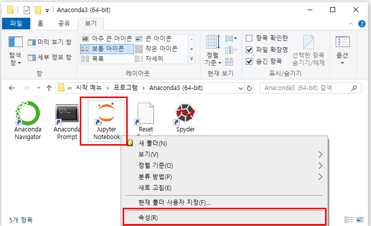
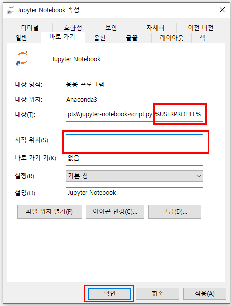

# Jupyter

<http://localhost:8888/tree>
<http://localhost:8888/lab>

## Anaconda Path

%ANACONDA_HOME\Anaconda3
%ANACONDA_HOME\Anaconda3\Library
%ANACONDA_HOME\Anaconda3\Library\bin
%ANACONDA_HOME\Anaconda3\Scripts

## Upgrade

```bash
conda --version
python --version

# Conda 업데이트
conda update -n base conda

# Python
conda install python=3.8

# 파이썬 패키지 업데이트
conda update --all

# pip 업데이트
python -m pip install --upgrade pip

```

## 설정

```bash
jupyter notebook --generate-config
```

`C:\Users\anaba\.jupyter\jupyter_notebook_config.py`
`사용자_HOME\.jupyter\jupyter_notebook_config.py`

- The directory to use for notebooks and kernels.

```properties
c.NotebookApp.notebook_dir = 'D:/GOOGLE_DRIVE/09.SOURCE/JUPYTER'
```

### Jupyter Notebook > 속성



### 설정 변경



## Jupyter Notebook Nbextensions 추가하기

### 설치

```bash
# (pip)
pip install jupyter_contrib_nbextensions
# (conda)
conda install -c conda-forge jupyter_contrib_nbextensions
```

### 연결하기

```bash
jupyter contrib nbextension install --user
jupyter nbextensions_configurator enable --user
```

- Table of Contents
- Autopep8
- Codefolding
- Collapsible Headings
- Hide Input All
- Execute Time
- Variable Inspector

## Jupyter Notebook Theme

<https://bio-info.tistory.com/15?category=881064>

```bash
# 설치
!pip install jupyterthemes

# 목록
!jt -l

# 상세 설명
!jt -h

# 적용
!jt -t monokai -TN

# 예제
!jt -t chesterish -f bitstream -fs 12 -tf roboto -tfs 13 -nf opensans -nfs 12 -ofs 12 -dfs 12 -cellw 95% -lineh 150 -T -N
```

1) -f, -fs : 코드의 폰트와 폰트 사이즈
2) -tf, -tfs : Text Font와 그 사이즈 아래 그림에서 분홍색 박스가 있는 부분(마크 다운 부분)
3) -nf , -nfs : notebook font와 그 사이즈 아래에서 노랑 박스가 있는 부분
4) -ofs : Output폰트 사이즈 출력된 결과의 폰트 사이즈
5) -dfs : 데이터 프레임의 폰트 사이즈 아래에서 초록 박스가 있는 부분
6) -cellw : 셀이 가로폭 퍼센테이지  저는 거의 꽉차게 95%를 지정
7) -lineh : 코드한줄의 위 아래 폭 170이 default 이지만, 저는 150이 더 좋았습니다.(* lineh가 작으면 아래 위 그림 처럼 됩니다.)
8) -T : 툴바가 보이게 할지  아래 그림에서 보라 박스가 있는 부분
9) -N : 제목과 심볼이 보이게 할지  아래 그림에서 노랑 박스가 있는 부분
