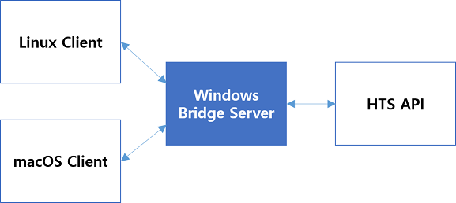

# 증권사 API 장단점 비교

이 포스트에서는 다음 세 가지 증권사 API의 활용성에 대해 정리하고자 합니다.

- 키움증권 Open API
- 대신증권 크레온 API
- 이베스트투자증권 Xing API

## 환경

증권사 API들은 제가 아는 바로는 모두 윈도우 환경에서만 제공됩니다. 공인인증서 등의 보안 장치 때문으로 보이는데, 개발 환경이 주로 리눅스나 맥인 경우 이는 상당한 단점이 됩니다.

주요 개발환경을 리눅스나 맥으로 유지하면서 증권사 API를 활용하려면 어떻게 해야 할까요? 윈도우 환경으로 증권사 API를 호출하고 결과를 그대로 전달해주는 간단한 Bridge 서버를 구성하는 것이 유일한 방법으로 보입니다.

리눅스, 맥 환경의 클라이언트가 윈도우 환경의 Brige 서버에 요청을 보내고, 이 Bridge 서버는 요청에 맞게 HTS API를 호출하여 결과를 다시 클라이언트에게 전송하는 구조입니다.

Bridge 서버는 HTTP, Socket 등의 통신 방식으로 구성할 수 있습니다. Request-Response 방식의 요청만 필요하면 HTTP 서버로, 실시간 데이터 수신이 필요하면 Socket 서버를 사용하는 것이 효과적일 것입니다.

## API 연결 방식

증권사들이 윈도우 환경에서 OCX, COM, DLL 방식으로 API를 제공합니다.

- 키움증권 Open API: OCX 방식
- 대신증권 크레온 API: COM 방식
- 이베스트투자증권 Xing API: COM 방식, DLL 방식

개인적으로 API 제공 방식은 OCX 보다는 COM 방식을 선호합니다. 파이썬에서 OCX 방식의 API를 사용하기 위해서 PyQt를 이용해야 하지만 COM 방식은 win32com을 사용하여 보다 간편합니다. (DLL 방식으로는 개발해보지 않았습니다.)

## API 사용성

API가 잘 설계되어 있으면 그만큼 사용하기 편합니다. 세 증권사 API를 모두 사용해본 소감을 다음과 같이 정리합니다.

- 키움증권 Open API: 문서화가 잘 되어 있고 API의 Signature는 설계가 잘 되어 있으나, 요청 결과를 비동기 방식으로 제공하여 불편함이 있습니다.
- 대신증권 크레온 API: 문서화가 잘 되어 있고 API의 Signature도 잘 설계되어 있으며 요청 결과를 동기적으로 받을 수 있습니다.
- 이베스트투자증권 Xing API: 문서화가 잘 되어 있지만 API Signature가 직관적이지가 않습니다. 요청 결과는 동기적으로 받을 수 있습니다.
즉 제가 느낀 사용성은 크레온 >> 키움 = 씽 입니다.

## 요청 제한

증권사 API들은 원활한 서비스 제공을 위해 API를 통한 과도한 요청을 막고 있습니다.

- 키움증권 Open API: 1초에 5회로 제한하며, 제 경험상 1시간에 1000회로 제한하고 있습니다.
- 대신증권 크레온 API: 시세 조회의 경우 15초에 60건, 실시간 조회의 경우 최대 400건으로 제한되어 있고, 주문 관련 조희의 경우 15초에 최대 20건으로 제한됨.
- 이베스트투자증권 Xing API: 모의서버의 경우 1초에 10건으로 제한되어 있습니다.

이로 봤을 때 요청 제한은 Xing API가 가장 제한이 약하고 나머지 두 증권사는 비슷한 수준으로 보입니다.

## 자동로그인 사용성과 보안성

세 증권사 API 모두 자동로그인이 가능합니다. 다만 사용성과 보안성 측면에서 차이점이 있습니다.

- 키움증권 Open API: 코드 상에서 아이디, 비밀번호, 공인인증서 비밀번호가 노출되지 않으므로 보안이 강합니다.
- 대신증권 크레온 API: 코드 상에서 크레온 프로그램을 실행하여 자동로그인 기능을 구현하면 아이디, 비밀번호, 공인인증서 비밀번호가 노출될 수 있습니다. 스크립트 등으로 로그인하고 프로그램을 실행하는 것이 보안상 좋습니다.
- 이베스트투자증권 Xing API: 코드 상에서 아이디, 비밀번호, 공인인증서 비밀번호가 노출될 수 있습니다.

즉 보안성은 키움증권이 제일 좋아 보이며 크레온, Xing을 사용할 경우 코드가 유출되지 않도록 각별히 유의해야 할 것입니다.

## 요약 정리

||키움증권|크레온|Xing|
|:--:|:--:|:--:|:--:|
|환경|윈도우|윈도우|윈도우|
|API 연결 방식|OCX|COM|COM, DLL|
|API 사용성|보통|좋음|보통|
|요청 제한|5/s|4/s|10/s|
|자동로그인 보안성|좋음|보통|보통|