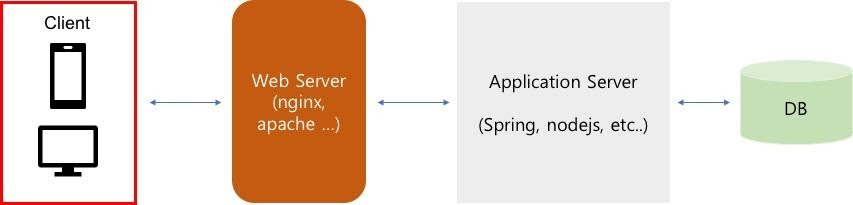
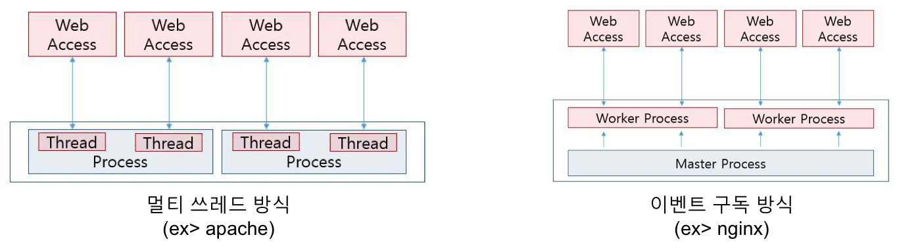

# [Nginx] Nginx 설치 및 기본 환경 설정

<https://kscory.com/dev/nginx/install>




- 데이터 전송
  - HTML 텍스트 파일을 비롯하여 이미지나 음성 데이터 같은 정적인 컨텐츠를 웹 클라이언트에 전송
  - 이를 이용하면 최근 유행하는 클라이언트 사이드 랜더링(React, Vue, Angular 등)에 의해 생성된 빌드 파일(정적 파일)을 제공
- 어플리케이션 실행
  - 위 아키텍처와는 다르게 웹서버 내에 PHP 와 같은 모듈을 내장해서 웹 서버가 직접 Application Server 를 실행
  - 이를 이용해 이미지 압축 등의 기능을 사용
- 프록시 처리
  - 클라이언트의 요청을 Application Server 로 전달하는 역할
  - 이를 이용해 캐시 처리를 할 수 있고 로드 밸런싱 기능, 암호화 기능 등 처리할 수 있으며, 웹 서버가 사용되는 가장 큰 이유 중 하나

## nginx 특징

- nginx 의 가장 큰 특징은 비동기 Event Driven 에 의한 Non Blocking 처리
- 동시 접속수가 늘어날 수록 물리 메모리가 증가하는 프로세스 기반의 apache 서버 에 비해 소비 메모리량이 적어지면서 동시 처리수를 급격하게 늘릴 수 있음
- single Thread 기반으로 master/worker 프로세스 구동 방식을 채택하여 context switching 를 하지 않기 때문에 CPU 사용률을 감소



- 결국 하드웨어 자원을 사용하는 것이므로 nginx 에서 읽기/쓰기가 자주 일어난다면 아파치가 더 좋을 수도 있음
- 대부분의 웹 서버에서는 하드웨어 읽기가 발생하지 않는 캐시 제공, 리버스 프록시 서버, 로드 벨런서 등의 역할을 주로 담당하게 되므로 최근들어 더 자주 사용
- nginx 는 여러 기능을 모듈 단위로 개발하여 nginx 를 컴파일할 때 필요한 모듈들만 조합해서 사용

## nginx 설치하기

- 우분투

```bash
# apt repository 에 설치하고자 하는 nginx 버전 추가 
# ubuntu 버전 (18.04: bionic, 16.04: xenial)
sudo touch /etc/apt/sources.list.d/nginx.list
echo "deb http://nginx.org/packages/ubuntu/ bionic nginx" | sudo tee -a /etc/apt/sources.list.d/nginx.list
echo "deb-src http://nginx.org/packages/ubuntu/ bionic nginx"| sudo tee -a /etc/apt/sources.list.d/nginx.list

# 인증 키 등록
wget http://nginx.org/keys/nginx_signing.key
sudo apt-key add nginx_signing.key

# 저장소 업데이트
sudo apt-get update

# nginx 설치
sudo apt-get install nginx
```

- CentOS

```bash

# nginx 공식 저장소 추가
sudo vim /etc/yum.repos.d/nginx.repo
# 파일에 아래 내용 추가
[nginx]
name=nginx repo
baseurl=http://nginx.org/packages/centos/$releasever/$basearch/
gpgcheck=0
enabled=1

# nginx 설치
sudo yum install nginx
# 각각 설치 후 다음 명령어를 이용해 nginx 버전을 확인하고 실행할 수 있습니다.

# nginx 버전 확인
nginx -v

# nginx 시작
sudo /etc/init.d/nginx start
```

## nginx 기본 환경 변수

/etc/nginx 디렉토리

```bash
├── conf.d # nginx.conf 에서 불러들일수 있는 설정 파일
├── fastcgi.conf
├── fastcgi_params
├── koi-utf
├── koi-win
├── mime.types
├── nginx.conf # 기본 설정 파일
├── proxy_params
├── scgi_params
├── sites-available # 가상 호스트 설정 파일들 위치
│   └── default
├── sites-enabled
│   └── default -> /etc/nginx/sites-available/default
├── snippets # nginx와 관련된 잡다한 설정파일들 위치 (ubuntu 에서는 여기에 위치시키는 것이 관례)
│   ├── fastcgi-php.conf
│   └── snakeoil.conf
├── uwsgi_params
└── win-utf
```

nginx.conf

```bash
cat /etc/nginx/nginx.conf

# worker 프로세스를 실행할 사용자 설정
# - 이 사용자에 따라 권한이 달라질 수 있다.
user  nginx;
# 실행할 worker 프로세스 설정
# - 서버에 장착되어 있는 코어 수 만큼 할당하는 것이 보통, 더 높게도 설정 가능
worker_processes  1;

# 오류 로그를 남길 파일 경로 지정
error_log  /var/log/nginx/error.log warn;
# NGINX 마스터 프로세스 ID 를 저장할 파일 경로 지정
pid        /var/run/nginx.pid;


# 접속 처리에 관한 설정을 한다.
events {
    # 워커 프로레스 한 개당 동시 접속 수 지정 (512 혹은 1024 를 기준으로 지정)
    worker_connections  1024;
}

# 웹, 프록시 관련 서버 설정
http {
    # mime.types 파일을 읽어들인다.
    include       /etc/nginx/mime.types;
    # MIME 타입 설정
    default_type  application/octet-stream;

    # 엑세스 로그 형식 지정
    log_format  main  '$remote_addr - $remote_user [$time_local] "$request" '
                      '$status $body_bytes_sent "$http_referer" '
                      '"$http_user_agent" "$http_x_forwarded_for"';

    # 엑세스 로그를 남길 파일 경로 지정
    access_log  /var/log/nginx/access.log  main;

    # sendfile api 를 사용할지 말지 결정
    sendfile        on;
    #tcp_nopush     on;

    # 접속시 커넥션을 몇 초동안 유지할지에 대한 설정
    keepalive_timeout  65;

    # (추가) nginx 버전을 숨길 수 있다. (보통 아래를 사용해서 숨기는게 일반적)
    server_tokens off

    #gzip  on;

    # /etc/nginx/conf.d 디렉토리 아래 있는 .conf 파일을 모두 읽어 들임
    include /etc/nginx/conf.d/*.conf;
}
```

- 실행

```bash
# ubuntu
$ service nginx reload;

# centOS
$ systemctl start nginx
```

## NginX 윈도우 설치

### 다운로드 설치

- nginx.exe -s stop : 강제종료
- nginx.exe -s quit : 접속한 사용자의 처리가 다 끝난 후 종료(graceful shutdown)
- nginx.exe -s reload : 설정파일 갱신(reloading the configuration file)
- nginx.exe -s reopen : 로그파일 갱신(reopening the log files)

### 방화벽 등록

- `> 제어판 > 모든 제어판 항목 > Windows 방화벽`
- `Windows 방화벽을 통해 앱 또는 기능 허용`
- nginx.exe 등록(개인,공용 허용)

### 윈도우 서비스 등록

```bash
sc create [서비스명] binpath= [서비스 파일 경로]
sc delete [서비스명]
sc start [서비스명]
sc stop [서비스명]

# 예제
sc create NginX binpath= "D:\MODULE\nginx"

net start [서비스명]
net stop [서비스명]

sc query
sc query [서비스명]
```

### Trouble Shooting

#### 10013: An attempt was made to access a socket in a way forbidden by its access permissions

- 포트중복


