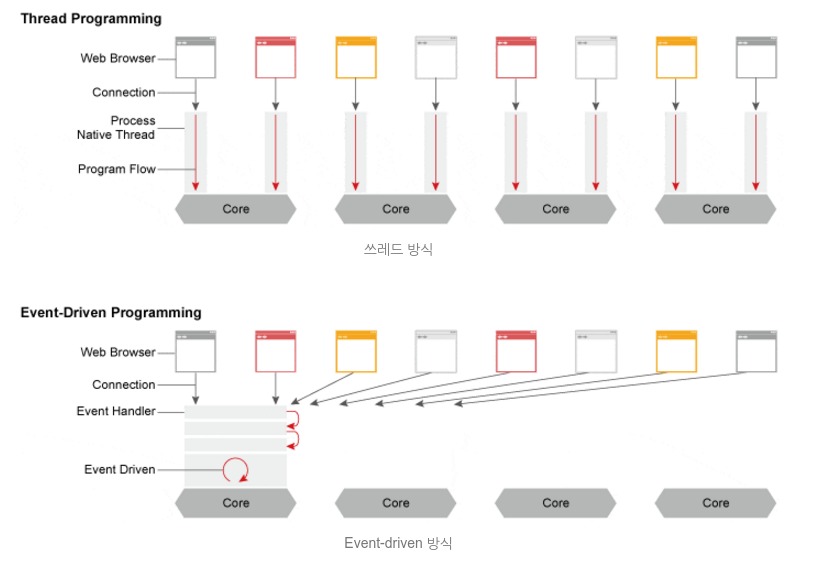

# 설정

- ./conf/nginx.conf

- Core 모듈 설정
  - 위의 예의 work_processes와 같은 지시자 설정 파일 최상단에 위치
  - nginx의 기본적인 동작 방식을 정의
  - 여기서 사용되는 지시어들은 다른 곳에서 사용되지 않음
- http 블록
  - http 블록은 이후에 소개할 server, location의 루트 블록이라고 할 수 있고, 여기서 설정된 값을 하위 블록들은 상속
  - http 블록은 여러개를 사용할 수 있지만 관리상의 이슈로 한번만 사용하는 것을 권장
  - http, server, location 블록은 계층구조
  - 많은 지시어가 각각의 블록에서 동시에 사용할 수 있는데, http의 내용은 server의 기본값이 되고, server의 지시어는 location의 기본값
  - 하위의 블록에서 선언된 지시어는 상위의 선언을 무시하고 적용
- server 블록
  - server 블록은 하나의 웹사이트를 선언하는데 사용
  - 가상 호스팅(Virtual Host)의 개념
  - 하나의 서버로 http://opentutorials.org 과 http://egoing.net 을 동시에 운영하고 싶은 경우 사용할 수 있는 방법
  - 가상 호스팅에 대한 자세한 내용은 가상 호스팅 참고
- location 블록
  - location 블록은 server 블록 안에 등장하면서 특정 URL을 처리하는 방법을 정의
  - http://opentutorials.org/course/1 과 http://opentutorials.org/module/1 로 접근하는 요청을 다르게 처리하고 싶을 때 사용
- events 블록
  - 이벤트 블록은 주로 네트워크의 동작방법과 관련된 설정값
  - 이벤트 블록의 지시어들은 이벤트 블록에서만 사용할 수 있고, http, server, location와는 상속관계를 갖지 않음
  - 이벤트 모듈 지시어에 대한 설명은 이벤트 모듈 지시어 사전을 참고
  
## 리버스 프록시(reverse proxy)


- 클라이언트는 가짜 서버에 요청(request)하면, 프록시 서버가 배후 서버(reverse server)로부터 데이터를 가져오는 역할
- 프록시 서버가 Nginx, 리버스 서버가 응용프로그램 서버를 의미
- 웹 응용프로그램 서버에 리버스 프록시(Nginx)를 두는 이유는 요청(request)에 대한 버퍼링이 있기 때문
- 클라이언트가 직접 App 서버에 직접 요청하는 경우, 프로세스1개가 응답 대기 상태가 되어야만 함(따라서 프록시 서버를 둠으로써 요청을 배분하는 역할)
- nginx.conf 파일에서 location 지시어를 사용하여 요청을 배분

## 비동기 처리방식



- 동기(Synchronous) : A가 B에게 데이터를 요청했을 때, 이 요청에 따른 응답을 주어야만 A가 다시 작업 처리가 가능(하나의 요청, 하나의 작업에 충실)
- 비동기(Asynchronous) : A의 요청을 B가 즉시 주지 않아도, A의 유휴시간으로 또 다른 작업 처리가 가능한 방식

## nginx.conf 설정

### 1. 최상단 (Core 모듈)

```properties
user  nginx; # (디폴트값 : www-data) 
worker_processes  1;
error_log  /var/log/nginx/error.log warn;
pid        /var/run/nginx.pid;
```

#### user : NGINX 프로세스가 실행되는 권한

- nginx는 마스터(master)와 워커(worker) 프로세스로 나뉨
- 워커 프로세스가 실질적인 웹서버 역할을 수행
- user 지시어는 워커 프로세스의 권한을 지정한다.
- 워커 프로세스를 악의적 사용자가 제어하면 해당 머신을 최고 사용자의 권한으로 원격제어하는 것이기 때문에 위험

#### work_processes : NGINX 프로세스 실행 가능 수

- 워커 프로세스이다. 실질적인 웹서버 역할
- auto도 무방하지만, 명시적으로 서버에 장착되어 있는 코어 수 만큼 할당하는 것이 보통, 더 높게도 설정 가능

#### pid : NGINX 마스터 프로세스 ID 정보가 저장

### 2. events 블락

```properties
events { 
    worker_connections  1024;
    # multi_accept on; (디폴트값 : off) 
}
```

- NGINX의 특징인 비동기 이벤트 처리 방식에 대한 옵션을 설정
- worker_connections는 하나의 프로세스가 처리할 수 있는 커넥션의 수를 의미
- `최대 접속자수 = worker_processes X worket_connections`

### 3. http 블락

```properties
http { 
    include       /etc/nginx/mime.types;
    default_type  application/octet-stream;
 
    log_format  main  '$remote_addr - $remote_user [$time_local] "$request" '
    '$status $body_bytes_sent "$http_referer" '
    '"$http_user_agent" "$http_x_forwarded_for"';
 
    access_log  /var/log/nginx/access.log  main;
    sendfile        on;
    #tcp_nopush     on; 
    keepalive_timeout  65;
    #gzip  on; 
    include /etc/nginx/conf.d/*.conf;
}
```

- keepalive_timeout : 접속시 커넥션을 몇 초동안 유지할지에 대한 설정값. 이 값이 높으면 불필요한 커넥션(접속)을 유지하기 때문에 낮은값 또는 0을 권장(default=10)
- servers token : NGINX의 버전을 숨길것인가에 대한 옵션. 보안상 주석을 제거하여 설정
- types_hash_max_size, server_names_hash_bucket_size 호스트의 도메인 이름에 대한 공간을 설정하는 것으로 이 값이 낮을 경우 많은 가상 호스트 도메인을 등록한다거나, 도메인 이름이 길 경우 bucket 공간이 모자라 에러가 생길 수 있으므로 넉넉하게 설정

### 4. 기타

- include 옵션 : 가상 호스트 설정이나 반복되는 옵션 항목을 inlcude를 통해 불러올 수 있음.
- EX) 리버스 프록시를 각 도메인에 설정한다고 했을 떄 헤더 처리 옵션등을 conf.d 디렉토리에 넣어두고 incldue 명령

### 5 설정 파일의 반영

설정 파일의 내용을 변경한 후에는 NGINX에 반영, reload 명령을 이용

```bash
sudo service nginx reload;
```

<https://architectophile.tistory.com/12>


