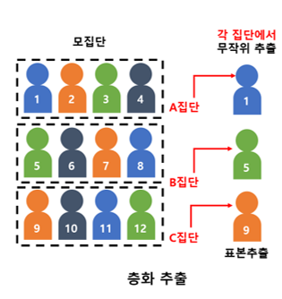

# 시계열 분석 기초 및 이론

- 어떤 라이브러리를 써야할지 잘 모르겠을때: <https://github.com/vinta/awesome-python>
- 주목받는 파이썬 프로젝트들을 둘러보고 싶을때: <https://github.com/trending/python>

1. 데이터수집: 소스별 데이터 추출 및 저장(Loading)
2. 데이터전처리: 기초통계(Descriptive Statistics) + 붙이기(Curation) + 없애기(Remove) + 채우기(Fill) + 필터(Filter) + 변경하기(Transform)
3. 데이터정리: 데이터한곳에담기(Data Warehouse) + 바꾸기및정리(Data Mart) + 분리(Data Split)
4. 데이터분석: 기초통계(Descriptive Statistics) + 모델링(Algorithm) + 검증(Evaluation) + 에러분석(Error Analysis)
5. 결과정리: 시각화(Visualization/Dashboard) + 의사결정(Decision Support) + 지식화(Knowledge) + 공유(Reporting)

## 통계 기본 용어

### 중심 통계량(데이터의 중심을 나타내는 수치)

- 평균(Average)
- 중앙값(Median)
- 최빈값(Mode)

### 변동 통계량(데이터의 변동성을 나타내는 수치)

- 볌위(Range) : 최대 최소 차이
- 편차(Deviation) : 관측값과 평균의 차이
- 변동(Variation)
- 분산(Variance)
- 표준편차(Standard Deviation)

### 형태 통계량(데이터의 분포형태와 왜곡을 나타내는 수치)

- 왜도(Skewness) : 편향도
- 첨도(Kurtosis) : 뽀족한 정도
- 이상치(Outlier)

### 관계 통계량(데이터간의 관계를 나타내는 수치)

- 상관관계(Correlation)
- 인과관계(Causality)

### 함정

- 통계를 이용한 조작

## 가설검정

### 가설검정 조건 3가지

- 상호배반적(Mutually Exclusive)
- 증명가능성(Demostrable)
- 구체적(Specific)

## 표본추출

### Sample을 편향되게 만드는 방법

1. Household Bias(가정이나 그룹내에 생길 수 있는 편향성)
2. Nonresponse Bias(답변하지 않는 것에서 생길 수 있는 편향성)
3. Quota Sampling Bias(샘플을 잘못 할당하는 것에서 생길 수 있는 편향성)
4. Response Bias(거짓말을 하거나 지시에 불성실하게 임하는 것에서 생길 수 있는 편향성)
5. Selection Bias(특정 집단을 집중적으로 선택하는 것에서 생길 수 있는 편향성)
6. Size Bias(특정 집단에서 표본으로 선정될 수 있는 특혜를 줌으로서 생길 수 있는 편향성)
7. Undercoverage Bias(특정 집단을 누락시키는 것에서 생길 수 있는 편향성)
8. Voluntary Response Bias(자발적으로 답변하는 것에서 생길 수 있는 편향성)
9. Word Bias(문제를 잘못 읽는 것에서 생길 수 있는 편향성)

### Sampling에서 Bias를 제거하는 방법

1. Bootstrapping : 샘플을 여러번 획득하는 것
2. Allocational Sampling : 부분 집단으로 쪼개서 전체 집단으로 합쳐 분석
3. Bias Adjustment : Sampling과정에서 발생하는 Bias가 익히 알려져 있는 경우, 계산과정에서 조정(조정치의 정당화)

### 확률표본과 비확률표본

<table>
<tr><td></td><td>확률표본(Probability Sample): 무작위추출</td><td>비확률표본(Nonprobability Sample): 작위추출</td></tr>
<tr><td>방법론</td><td>주관을 배재하고 각 샘플이 뽑힐 확률을 확률적(객관적)으로 균등하게 부여 => "확률표본"</td><td>샘플이 뽑힐 확률을 수학/확률적인 방법을 따르지 않음 => "비확률표본"</td></tr>
<tr><td>장점</td><td>- 표본이 추출될 확률 사전적으로 알때 용이 - 모수추정에 bias가 없음 - 추출기회가 독립적이라 대표성이 높음</td><td>- 표본이 추출될 확률 사전적으로 모를때 용이 - 모수추정에 bias가 있음 - 추출기회가 독립적이 않아 대표성이 낮음</td></tr>
<tr><td>단점</td><td>시간과 비용이 많이 듦(표본의 크기가 커야함)</td><td>시간과 비용이 적게 듦(표본의 크키가 작아도됨)</td></tr>
<tr><td>모집단 일반화</td><td>가능</td><td>불가능(모집단의 대략적 성격 파악 목적)</td></tr>
<tr><td>표본오차(신뢰구간) 추정</td><td>가능</td><td>불가능</td></tr>
<tr><td>종류</td><td>- 단순임의 표본추출 - 체계적 표본추출 - 비례층화 표본추출 - 다단계층화 표본추출 - 군집 표본추출</td><td>- 편의 표본추출 - 할당 표본추출 - 자발적 표본추출
</td></tr>
</table>

#### 확률표본 추출법

<table>
<tr><td>종류</td><td>추출법</td><td>비고</td></tr>
<tr><td>단순임의 표본추출(Simple Random Sampling)</td><td>모집단으로 표본을 균등한 확률로 추출하는 것으로, 추출된 표본을 단순임의표본이라고 함</td><td>100명(남60,여40) 중 10명을 뽑을 시 전부 남자일 수 있어서 모집단의 특성을 반영하지 못하는 대표성 한계</td></tr>
<tr><td>체계적 표본추출(Systematic Sampling)</td><td>첫번째 표본을 무작위로 선정한 후 k번째 간격의 표본들을 선정함</td><td>단순임의추출의 대표성 한계를 줄이기 위해서이며 비용이 적게들고 정확성이 단순임의 추출보다 높은편 k는 모집단의 크기를 원하는 표본의 크기로 나누어 계산</td></tr>
<tr><td>층화 표본추출(Stratified Sampling)</td><td>모집단을 서로 겹치지 않는 여러 개의 층(부분집단)으로 구분 후, 각 층에서 단순임의추출로 표본 추출함</td><td>단순임의추출의 대표성 한계를 줄이기 위해 여러 층으로 구분하여 bias를 회피 
층간은 이질적이나 층내는 동질적인 데이터에 적합(ex. 개발 파트 vs 분석 파트)</td></tr>
<tr><td>군집 표본추출(Cluster sampling)</td><td>모집단을 서로 인접한 값들로 묶어 집단을 구성후, 특정 집단의 일부 또는 전체를 표본으로 함</td><td>집단간은 동질적이나 집단내는 이질적인 데이터에 적합(ex. 분석파트1 vs 분석파트2) 
집단간은 동질적이나 집단내는 이질적인 데이터에 적합(ex. 분석파트1 vs 분석파트2)</td></tr>
</table>

#### 비확률표본 추출법

<table>
<tr><td>종류</td><td>추출법</td><td>비고</td></tr>
<tr><td>편의 표본추출(Convenience Sampling)</td><td>특정 집단이나, 계층 및 시간대로 데이터만을 대상으로 표본을 선정	</td><td>시간과 비용이 적게 들지만 대표성 문제 아주 높음</td></tr>
<tr><td>판단 표본추출(Purposive Sampling)</td><td>분석가 주관으로 분석에 도움이 된다 판단되는 대상만을 표본으로 함	</td><td>전문가여야 가능하며 그렇지 않으면 모집단의 대표성 문제 높음</td></tr>
<tr><td>할당 표본추출(Quota Sampling)</td><td>모집단이 여러 특성을 가질 경우 각 특성에 따라 층을 형성 후, 층별로 표본을 같게 또는 비례 선정</td><td>모집단의 특성을 잘 아는 전문가이어야 하마 그렇지 않으면 대표성 뿐 아니라 Bias 문제 높음</td></tr>
</table>

