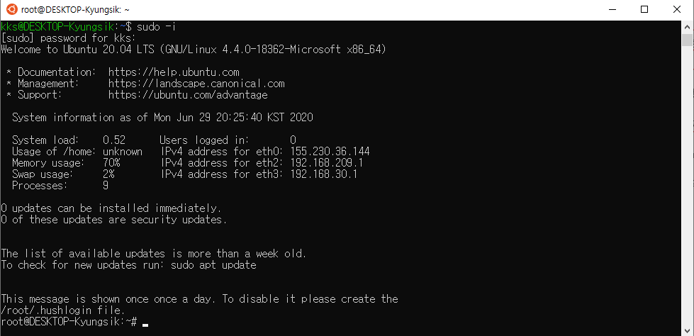

# WSL(Windows Sybsystem for Linux)

<https://webdir.tistory.com/541>

## 설치

- 시작 - Windows 기능 켜기/끄기

- Linux용 Windows 하위 시스템 체크

- 재부팅, Microsoft Store Ubuntu 설치

- Ubuntu 실행 후 username, password 입력

- root권한 "sudo -i", password

