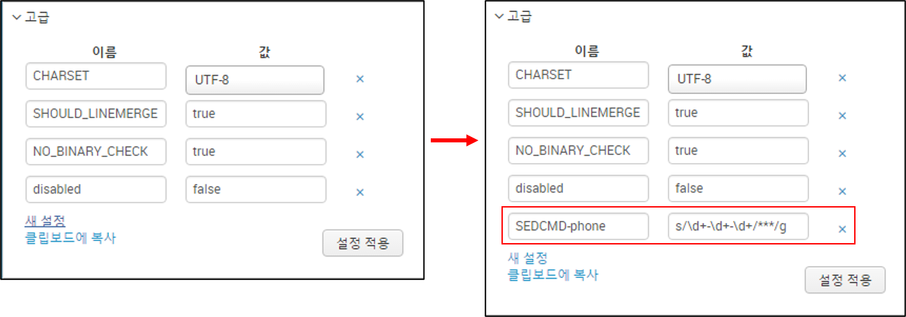

# Routing & Filtering

## 수집단계 라우팅

- 수집된 데이터 별로 다양한 서버로 전달

### 정의(1)

- UF 적용 가능, 데이터 내용으로 불리 불가

```bash
# inputs.conf
[<input_stanza>]
...
_TCP_ROUTING = <output_group>, <output_group>, …
```

```bash
# outputs.conf
[tcpout:<output_group>]
server = <IP>:<Receive_port>, <IP>:<Receive_port>, …
```

### 예제(1)

```bash
# inputs.conf
[monitor:///opt/sample_files/access.log]
index = my_index
sourcetype = web_access
_TCP_ROUTING = web_access_idx

[monitor:///opt/sample_files/error.log]
index = my_index
sourcetype = web_error
_TCP_ROUTING = web_error_idx
```

```bash
# outputs.conf
[tcpout:web_access_idx]
server = 192.168.99.10:9997

[tcpout:web_error_idx]
server = 192.168.99.11:9997, 192.168.99.21:9997
```

## 파싱단계 라우팅

- 특정 패턴별로 다양한 서버로 전달

### 정의(2)

- UF에서 사용불가, 데이터 내용으로 데이터수신 인스턴스 정의

```bash
# props.conf
[<sourcetype>|source::<source>|host::<host>]
TRANSFORMS-<class> = <transforms_stanza_name>, <transforms_stanza_name>, …
```

```bash
# transforms.conf
[<transforms_stanza_name>]
REGEX = <regex>
DEST_KEY = _TCP_ROUTING
FORMAT = <output_group>, <output_group>, …
```

```bash
# outputs.conf
[tcpout:<output_group>]
server = <IP>:<Receive_port>, <IP>:<Receive_port>, …
```

### 예제(2)

```bash
# props.conf
[my_sourcetype]
TRANSFORMS-route_idx = info_idx, error_idx
```

```bash
# transforms.conf
[info_idx]
REGEX = \d+\sINFO
DEST_KEY = _TCP_ROUTING
FORMAT = info_idx_servers

[error_idx]
REGEX = \d+\s(WARN|ERROR)
DEST_KEY = _TCP_ROUTING
FORMAT = error_idx_servers
```

```bash
# outputs.conf
[tcpout:info_idx_servers]
server = 192.168.99.10:9997, 192.168.99.11:9997

[tcpout:error_idx_servers]
server = 192.168.99.20:9997, 192.168.99.21:9997
```

## 인덱스 라우팅

- 특정패턴 별로 다양한 인덱스(소스타입,소스) 전달

### 정의(3)

- UF에서 사용불가, 데이터 파싱 단계에서 적용

```bash
# props.conf
[<sourcetype>|source::<source>|host::<host>]
TRANSFORMS-<class> = <transforms_stanza_name>, <transforms_stanza_name>, …
```

```bash
# transforms.conf
[<transforms_stanza_name>]
REGEX = <regex>
DEST_KEY = _MetaData:Index
FORMAT = <new index name>
```

> ※ DEST_KEY 설정 입력 시 대/소문자, 특수문자 사용에 주의 (_MetaData:Index)
> ※ DEST_KEY 설정 입력 시 대/소문자, 특수문자 사용에 주의 (_MetaData:Sourcetype)
> ※ DEST_KEY 설정 입력 시 대/소문자, 특수문자 사용에 주의 (_MetaData:Source)

```bash
# outputs.conf
[tcpout:<output_group>]
server = <IP>:<Receive_port>, <IP>:<Receive_port>, …
```

### 예제(3)

```bash
# props.conf
[my_sourcetype]
TRANSFORMS-route_idx = info_idx, error_idx
```

```bash
# transforms.conf
[info_idx]
REGEX = \d+\sINFO
DEST_KEY = _MetaData:Index
FORMAT = info_idx

[error_idx]
REGEX = \d+\s(WARN|ERROR)
DEST_KEY = _MetaData:Index
FORMAT = error_idx
```

## 필터링

- 특정패턴별로 필터링

### 정의(4)

- UF에서 사용불가, 데이터 파싱단계에서 동작, 정규식을 통해서 데이터 수집여부 설정

```bash
# props.conf
[<sourcetype>|source::<source>|host::<host>]
TRANSFORMS-<class> = <transforms_stanza_name>, <transforms_stanza_name>, …
```

```bash
# transforms.conf
[<transforms_stanza_name>]
REGEX = <regex>
DEST_KEY = queue
FORMAT = [nullQueue | indexQueue]
```

### 예제(4)

```bash
# props.conf
[my_sourcetype]
TRANSFORMS-filter_data = setnull, setparsing
```

```bash
# transforms.conf
[setnull]
REGEX = .*
DEST_KEY = queue
FORMAT = nullQueue

[setparsing]
REGEX = (INFO|DEBUG)
DEST_KEY = queue
FORMAT = indexQueue
```

## 인덱스별 필터링

### 정의(5)

- 데이터 전달 제어,  Index명에 따라 데이터 전달 여부 설정
- Index별 허용 리스트/차단 리스트 사용하여 필터링

```bash
# outputs.conf
[tcpout]
forwardedindex.<n>.whitelist = <regex>
forwardedindex.<n>.blacklist = <regex>
```

>> ※   whiltelist / blacklist 설정은 반드시 [tcpout] 스탠자 아래 설정할 것
>> ※   `<n>` 순서 정의시 순차적으로 정의하지 않는 경우 동작하지 않음

### 예제(5)

```bash
# outputs.conf
[tcpout]
forwardedindex.0.whitelist = .*
forwardedindex.1.blacklist = _.*
forwardedindex.2.whitelist = (_audit|_internal|_introspection|_telemetry)
```

## 로컬 인덱싱

- 포워더에서 포워더 로컬 인덱스

### 로컬 인덱싱 정의(6)

- HF에서만 가능,데이터를 포워더 로컬 인덱스에도 동일하게 저장

```bash
# outputs.conf
[indexAndForward]
index = true
```

### 선택적 로컬 인덱싱 정의(6)

- HF에서만 가능,데이터를 포워더 로컬 인덱스에도 동일하게 저장
- 수집데이터의 종류에 따라 로컬 인덱싱 적용여부 결정

```bash
# inputs.conf
[<input_stanza>]
_INDEX_AND_FORWARD_ROUTING = <string>
```

```bash
# outputs.conf
[indexAndForward]
index = true
selectiveIndexing = true
```

>> [indexAndForward] 설정은 모든 설정에 적용되는 전역설정으로, outputs.conf 중 임의의 설정 파일에 한번만 적용

### 예제(6)

```bash
# inputs.conf
[monitor:///opt/sample_files/access.log]
index = my_index
sourcetype = access_combined_wcookie
_INDEX_AND_FORWARD_ROUTING = local

[monitor:///opt/sample_files/error.log]
index = my_index
sourcetype = web_error
_TCP_ROUTING = indexer_B
```

```bash
# outputs.conf
[tcpout]
defaultGroup = indexer_A

[tcpout:indexer_A]
server = 192.168.99.10:9997

[tcpout:indexer_B]
server = 192.168.99.11:9997

[indexAndForward]
index = true
selectiveIndexing = true
```

## SEDCMD

### 정의(7)

- 마스킹, 치환(인덱싱 이전에)

>> ※ Splunk – SEDCMD 설정은 "input time" 에 적용되므로 반드시 데이터 인덱싱 전에 설정



```bash
# inputs.conf
[monitor://<path to file>]
index = <index>
sourcetype = <sourcetype>
…
```

```bash
# props.conf
[<SOURCETYPE>]
…
SEDCMD-<class> = s/<regex>/<replace string>/g
```

## Transforms.conf

- queue : 이벤트를 보낼 큐를 지정(nullQueue, indexQueue일 수 있음).
  - indexQueue 변환처리 프로세서를 통과하는 이벤트의 일반적인 대상
  - nullQueue 이벤트를 완전히 삭제하는 대상
- _raw : 이벤트의 원시 텍스트
- _meta : 공백으로 구분된 이벤트 메타 데이터 목록
- _time : 1970 년 1 월 1 일 UTC 이후의 이벤트 타임 스탬프(초)

- MetaData:Host       : 이벤트와 관련된 호스트. 값은 "host::" 시작
- _MetaData:Index     : 이벤트가 저장될 인덱스
- MetaData:Source     : 이벤트와 관련된 소스. 값은 "source ::" 시작
- MetaData:Sourcetype : 이벤트의 소스유형. 값은 "sourcetype ::" 시작
- _TCP_ROUTING        : 쉼표로 구분된 tcpout 그룹 이름 목록 (outputs.conf) 기본값은 [tcpout]의 'defaultGroup'에 있는 그룹
- _SYSLOG_ROUTING : 쉼표로 구분 된 syslog-stanza 이름 목록 (outputs.conf에서) 기본값은 [syslog]의 'defaultGroup'에 있는 그룹

>> 참고 : 일반적으로 '_'로 시작하는 KEY (필드 이름)는 Splunk 소프트웨어에 의해 인덱싱되지 않음

### 예제(7)

```bash
# props.conf
[my_sourcetype]
TRANSFORMS-route_idx = sourcetype1, sourcetype2, sourcetype3
```


```bash
# transforms.conf
[sourcetype1]
REGEX = <정규표현식 패턴1>
DEST_KEY = _MetaData:Sourcetype
FORMAT = sourcetype1

[sourcetype1]
REGEX = <정규표현식 패턴2>
DEST_KEY = _MetaData:Sourcetype
FORMAT = sourcetype1

[sourcetype1]
REGEX = <정규표현식 패턴3>
DEST_KEY = _MetaData:Sourcetype
FORMAT = sourcetype1
```
