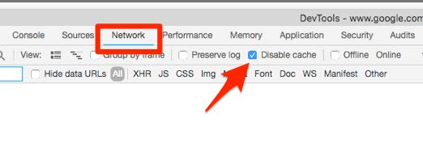

# Splunk 개발

## 디렉토리 구조

### UI 기본

```text
app_folder
└───default
│   │   app.conf
│   └───data
│       └───ui
│           └───nav
│           │   │   default.xml
│           └───views
│               │   tutorial.xml
│               │   contents.xml
└───appserver
│   └───static
│       │   tutorial.js
│       │   contents.js
│       │   contents.css
│       └───icons
│       └───components
│       │   └───d3
│       │   └───undercore
│       └───description
│           │   tutorial.md
│           │   contents.md
└───metadata
    │   default.meta
    │   local.meta
```

#### app_folder > default > app.conf

<https://docs.splunk.com/Documentation/Splunk/7.1.2/Admin/Appconf>

```properties
[ui]
is_visible = 1
label = Custom Visualizations

[launcher]
version = 2.2.1
description = Custom JS visualizations collected from various sources.

[package]
id = custom_vizs
check_for_updates = 1

[install]
install_source_checksum = a62045c0f65fed1e3691a45beaae4651967d58f3
```

#### app_folder > default > data > ui > nav > default.xml

<http://dev.splunk.com/view/webframework-developapps/SP-CAAAEP9http://dev.splunk.com/view/SP-CAAAESU>

```xml
<nav search_view="search" color="#d62728">
  <view name="tutorial" default="true"/>
  <collection label="Examples">
    <view name="contents"/>
    <divider/>
    <view source="all" match="viz_"/>
  </collection>
  <view name="search"/>
</nav>
```

#### app_folder > appserver > static > tutorial.js

<http://docs.splunk.com/Documentation/WebFramework>

```js
require([
    'jquery',
    'underscore',
    'splunkjs/mvc',
    'splunkjs/mvc/simplexml/ready!'
],
function(
    $,
    _,
    mvc
) {
    var service = mvc.createService();
    if(service.app !== "custom_vizs") {
        alert(
            'WARNING! Your app name is not "custom_vizs" '
        );
    }
```

#### app_folder > appserver > static > components > sample_boxplot.js

```js
// Boxplot D3.js code taken and modified from http://bl.ocks.org/jensgrubert/7789216 by Jens Grubert
define(function(require, exports, module) {
    var d3 = require("../d3/d3");
    var box = require("./d3.box");
    var SimpleSplunkView = require("splunkjs/mvc/simplesplunkview");
    var _ = require("underscore");
    require("css!./boxplot.css");

    var BoxPlot = SimpleSplunkView.extend({
        className: "splunk-toolkit-box-plot",
        options: {
        },
        output_mode: "json",
        initialize: function() {
            SimpleSplunkView.prototype.initialize.apply(this, arguments);
            $(window).resize(this, _.debounce(this._handleResize, 20));
        },
        _handleResize: function(e) {
            // e.data is the this pointer passed to the callback.
            // here it refers to this object and we call render()
            e.data.render();
        },
        createView: function() {
            return true;
        },
        // Making the data look how we want it to for updateView to do its job
        formatData: function(data) {
            var formatted_data = [];
            var headers;
            ...
            return formatted_data; // this is passed into updateView as 'data'
        },
        updateView: function(viz, data) {
            var that = this;
            ...

            // Returns a function to compute the interquartile range.
            function iqr(k) {
                return function(d, i) {
                    ...
                    return [i, j];
                };
            }
        }
    });
    return BoxPlot;
});
```

#### app_folder > metadata > default.meta

<https://docs.splunk.com/Documentation/Splunk/7.1.2/Admin/Defaultmetaconf>

```properties
# Application-level permissions
[]
access = read : [ * ], write : [ admin, power ]

### EVENT TYPES
[eventtypes]
export = system

### PROPS
[props]
export = system

### TRANSFORMS
[transforms]
export = system

### LOOKUPS
[lookups]
export = system

### VIEWSTATES: even normal users should be able to create shared viewstates
[viewstates]
access = read : [ * ], write : [ * ]
export = system

```

#### app_folder > metadata > local.meta

```properties
[views/tutorial]
version = 6.2.5
modtime = 1440298269.103258000

[views/contents]
version = 6.2.4
modtime = 1438368133.024945000

[nav/default]
version = 6.2.4
modtime = 1438368066.477154000

[]
access = read : [ * ], write : [ admin, power ]
export = system
version = 6.2.5
modtime = 1440297576.531527000

[app/install/install_source_checksum]
version = 7.1.2
modtime = 1533741265.250585000

```

### TA 기본

```text
app_folder
└───default
│   │   app.conf
│   │   commands.conf
└───bin
│   │   user_command.py
│   └───user_command
│       │   __init__.py
│       │   command.py
└───metadata
    │   default.meta
    │   local.meta
```

## EXAMPLE

- [Tutorial: Convert a Simple XML dashboard to HTML](http://dev.splunk.com/view/SP-CAAAETP)
- [Tutorial: Use KV Store with a simple app](http://dev.splunk.com/view/SP-CAAAEZT)
- [Tutorial: Create a custom Splunk view](http://dev.splunk.com/view/SP-CAAAEQ8)
- [Tutorial: Create a Music dashboard](http://dev.splunk.com/view/SP-CAAAEMU)
- [Tutorial: Create an app using Django Bindings:Deprecation](http://dev.splunk.com/view/SP-CAAAESP)

## 개발환경 구성

1. Debug/refresh – updates settings without restarting Splunk.
   Update just what you need 
    <http://localhost:8000/en-US/debug/refresh?entity=data/ui/views&entity=data/ui/nav>

2. Disable Caching in your browser debug capabilities
   

3. JavaScript – cause a breakpoint with the “debugger” command

## 개발정보

```bash
#File System
$SPLUNK_HOME/etc/apps/<your_app>/appserver/static/<your_resource>

#URL
http://splunk_url:splunk_port/static/app/<your app>/<your_resource>

# Splunk Style Guide
http://splunk_url:splunk_port/en-US/static/docs/style/styleguide.html
```
