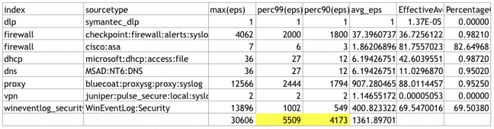
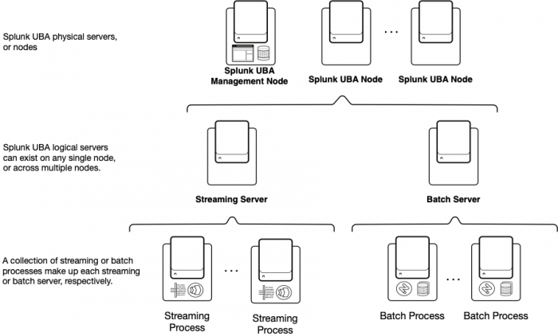

# UBA Install

## Introduction

### About Splunk User Behavior Analytics and release types

The following types of Splunk UBA releases are available:

- Platform releases
- Maintenance and patch releases

#### Platform releases

Platform releases contain significant new features and enhancements such as new or enhanced rules, threats, or product functionality. Platform releases are identified with a zero at the end of the three-digit release number (for example, 4.3.0).

Platform releases are installed by performing the following tasks:

1. Downloading the software from the Splunk UBA Software Update page on Splunkbase.
2. Deploy the software into a new environment, or upgrade existing software by following the upgrade instructions.

You can also obtain the platform release software for Bare Metal environments from the Splunk UBA RHEL 7.x Software for Bare Metal Installation page on Splunkbase.

#### Maintenance and patch releases

Maintenance releases contain a longer list of known issues, bug fixes, and minor feature additions or enhancements. Maintenance releases are identified by a three-digit release number that does not end in a zero such as 4.3.1, which is a maintenance release for the platform release 4.3.0.

A patch release consists of up to five critical or highly urgent issues that must be addressed in a short window of time. Patch releases are identified by a four-digit release number such as 4.3.1.1, which is a patch release for Splunk UBA release 4.3.1.

Maintenance and patch releases are installed by performing the following tasks:

1. Download the software from the Splunk UBA Software Update page on Splunkbase.
2. Install the software using the CLI to execute a script.

### How to install or upgrade to this release of Splunk UBA

Splunk UBA 5.0.4.1 is a maintenance release containing fixed issues. Refer to the Fixed Issues in Splunk UBA in the Splunk User Behavior Analytics Release Notes for a summary of this information.

#### Install or upgrade to this release of Splunk UBA

Refer to the table for information about how to install or upgrade to this release of Splunk UBA.

>> Splunk UBA 5.0.0 requires files from the Splunk UBA 5.0.4 installation package in order to complete the installation on RHEL 7.8. If your upgrade or installation path requires you to install Splunk UBA 5.0.0 on RHEL 7.8, follow the installation instructions carefully and make sure you do not skip the steps to obtain and extract files from the Splunk UBA 5.0.4 installation package.

<table>
<tr><td>Your current deployment</td><td>How to get Splunk UBA 5.0.4.1</td></tr>
<tr><td>You are running Splunk UBA 5.0.0 or later.</td><td>1. Upgrade to Splunk UBA 5.0.4.<br/>
See Upgrade Splunk UBA prerequisites in The Splunk UBA 5.0.4 documentation for instructions.<br/>
2. Upgrade to Splunk UBA 5.0.4.1.<br/>
See Upgrade Splunk UBA prerequisites and overview for instructions.</td></tr>
<tr><td>You are running Splunk UBA version earlier than 5.0.0.</td><td>
1. Upgrade to Splunk UBA 5.0.0.<br/>
See Upgrade Splunk UBA prerequisites in the Splunk UBA 5.0.0 documentation for instructions.<br/>
2. Upgrade to Splunk UBA 5.0.4.<br/>
See Upgrade Splunk UBA prerequisites in the release 5.0.4 documentation for instructions.<br/>
3. Upgrade to Splunk UBA 5.0.4.1.
See Upgrade Splunk UBA prerequisites and overview for instructions.</td></tr>
<tr><td>You are deploying Splunk UBA for the first time</td><td>
1. Install Splunk UBA 5.0.0. Follow the instructions in the Splunk UBA installation checklist in the Splunk UBA 5.0.0 documentation.<br/>
2. Upgrade to Splunk UBA 5.0.4.<br/>
See Upgrade Splunk UBA prerequisites in The Splunk UBA 5.0.4 documentation for instructions.<br/>
3. Upgrade to Splunk UBA 5.0.4.1.<br/>
See Upgrade Splunk UBA prerequisites and overview for instructions.</td></tr>
</table>

#### Splunk UBA upgrade and install path summary

The following table summarizes the installation and upgrade path required for Splunk UBA releases. For example:

- To upgrade to 5.0.4.1 from 5.0.2 on RHEL, you must first upgrade to 5.0.4, then upgrade to 5.0.4.1.
- If you are installing Splunk UBA for the first time on RHEL, you must first install 5.0.0, then upgrade to 5.0.4, then upgrade to 5.0.4.1.

Refer to the installation and upgrade documentation for each release to find instructions.

<table>
<tr><td>Splunk UBA Release</td><td>Type of Release</td><td>Date Released</td><td>Upgrade Path</td><td>Install Path</td></tr>
<tr><td>5.0.4.1</td><td>Patch</td><td>February 16, 2021</td><td>Upgrade from 5.0.4</td><td>
On RHEL, OEL, and CentOS systems:<br/>
&middot; Install 5.0.0<br/>
&middot; Upgrade to 5.0.4<br/>
&middot; Upgrade to 5.0.4.1<br/><br/>
On AMI or OVA systems:<br/>
&middot; Install 5.0.3<br/>
&middot; Upgrade to 5.0.4<br/>
&middot; Upgrade to 5.0.4.1</td></tr>
<tr><td>5.0.4</td><td>Maintenance</td><td>October 21, 2020</td><td>Upgrade from 5.0.0 or later</td><td>
On RHEL, OEL, and CentOS systems:<br/>
&middot; Install 5.0.0<br/>
&middot; Upgrade to 5.0.4<br/><br/>
On AMI or OVA systems:<br/>
&middot; Install 5.0.3<br/>
&middot; Upgrade to 5.0.4</td></tr>
<tr><td>5.0.3</td><td>Maintenance</td><td>April 2, 2020</td><td>
&middot; RHEL, OEL, and CentOS require 5.0.1 and the 5.0.3.1 installer<br/>
&middot; AMI or OVA systems can install release 5.0.3 directly</td><td>
On RHEL, OEL, and CentOS systems:<br/>
&middot; Install 5.0.0<br/>
&middot; Upgrade to 5.0.1, and optionally to 5.0.2<br/>
&middot; Upgrade to 5.0.3<br/><br/>
On AMI or OVA systems, you can install 5.0.3 directly.
</td></tr>
<tr><td>5.0.2</td><td>Content</td><td>February 12, 2020</td><td>Upgrade from 5.0.1</td><td>
1. Install 5.0.0<br/>
2. Upgrade to 5.0.1<br/>
3. Upgrade to 5.0.2</td></tr>
<tr><td>5.0.1</td><td>Maintenance</td><td>January 22, 2020</td><td>Upgrade from 5.0.0</td><td>
1. Install 5.0.0<br/>
2. Upgrade to 5.0.1</td></tr>
<tr><td>5.0.0</td><td>Platform</td><td>October 17, 2019</td><td>Upgrade from 4.3.1 or later</td><td>You can install this version of Splunk UBA directly.</td></tr>
<tr><td>4.3.4</td><td>Content</td><td>September 11, 2019</td><td>Upgrade from 4.3.1.1</td><td>
1. Install 4.3.0<br/>
2. Upgrade to 4.3.1, and optionally to 4.3.2 or 4.3.3<br/>
3. Upgrade to 4.3.1.1<br/>
4. Upgrade to 4.3.4</td></tr>
<tr><td>4.3.1.1</td><td>Patch</td><td>August 29, 2019</td><td>Upgrade from 4.3.1</td><td>
1. Install 4.3.0<br/>
2. Upgrade to 4.3.1<br/>
3. Upgrade to 4.3.1.1</td></tr>
<tr><td>4.3.3</td><td>Content</td><td>August 8, 2019</td><td>Upgrade from 4.3.1 or 4.3.2</td><td>
1. Install 4.3.0<br/>
2. Upgrade to 4.3.1, and optionally to 4.3.2<br/>
3. Upgrade to 4.3.3</td></tr>
<tr><td>4.3.2</td><td>Content</td><td>June 17, 2019</td><td>Upgrade from 4.3.1</td><td>
1. Install 4.3.0<br/>
2. Upgrade to 4.3.1<br/>
3. Upgrade to 4.3.2</td></tr>
<tr><td>4.3.1</td><td>Maintenance</td><td>June 3, 2019</td><td>Upgrade from 4.3.0</td><td>Install 4.3.0, then upgrade to 4.3.1</td></tr>
<tr><td>4.3.0</td><td>Platform</td><td>March 26, 2019</td><td>Upgrade from 4.2.1.1. Do not upgrade to release 4.3.0 without assistance from Splunk UB Professional Services.</td><td>You can install this version of Splunk UBA directly.</td></tr>
</table>

### Splunk UBA installation checklist

Install Splunk UBA with assistance from Splunk Professional Services.

#### Checklist of tasks to install Splunk UBA

Use this checklist if you are a new Splunk UBA customer installing a Splunk UBA platform release for the first time. See About Splunk User Behavior Analytics and release types for information about how to determine if your Splunk UBA release is a platform release.

If you are an existing customer and want to upgrade to a more recent version of Splunk UBA, see How to install or upgrade to this release of Splunk UBA for upgrade instructions.

Perform all tasks in the table in the order that they are listed.

<table>
<tr><td>Number</td><td>Task</td><td>Description	Documentation</td></tr>
<tr><td>1. Review known issues</td><td>Review the known issues reported in this Splunk UBA release.</td><td>See <a href="http://docs.splunk.com/Documentation/UBA/5.0.4.1/ReleaseNotes/KnownIssues" >Known issues in Splunk UBA</a>.</td></tr>
<tr><td>2. Verify sizing</td><td>You can install Splunk UBA in a single-server deployment or in a distributed deployment. All servers must meet the system requirements. Verify that the planned architecture of the system meets the requirements for the desired EPS and number of accounts, devices, and data sources.</td><td>See <a href="http://docs.splunk.com/Documentation/UBA/5.0.4.1/Install/DeploymentArchitecture" >Plan and scale your Splunk UBA deployment</a>.</td></tr>
<tr><td>3. Verify hardware requirements</td><td>Verify hardware requirements such as the minimum IOPS of the storage subsystem, and the disk space and RAM on all nodes.</td><td>See <a href="http://docs.splunk.com/Documentation/UBA/5.0.4.1/Install/Requirements#Hardware_requirements" >Hardware requirements</a>.</td></tr>
<tr><td>4. Verify operating system requirements</td><td>Verify that your system is running a supported operating system. Automatic OS updating must be turned off on all nodes.</td><td>See <a href="http://docs.splunk.com/Documentation/UBA/5.0.4.1/Install/Requirements#Operating_system_requirements" >Operating system requirements</a>.</td></tr>
<tr><td>5. Verify permissions</td><td>Verify that you are able to log in to each node and that root account permissions exist.</td><td>See <a href="http://docs.splunk.com/Documentation/UBA/5.0.4.1/Install/Requirements#User_access_requirements" >User access requirements</a>.</td></tr>
<tr><td>6. Verify networking requirements</td><td>Verify networking requirements such as node connectivity, port availability, IP address assignments, and DNS configuration.</td><td>See <a href="http://docs.splunk.com/Documentation/UBA/5.0.4.1/Install/Requirements#Networking_requirements" >Networking requirements</a>.</td></tr>
<tr><td>7. Configure host name lookup and DNS</td><td>Configure the host name lookup and DNS settings in your environment so that all Splunk UBA nodes can communicate with each other.</td><td>See <a href="http://docs.splunk.com/Documentation/UBA/5.0.4.1/Install/Requirements#Configure_host_name_lookups_and_DNS" >Configure host name lookup and DNS</a>.</td></tr>
<tr><td>8. Verify Splunk platform user account requirements</td><td>A properly configured Splunk user account is required to send data from the Splunk platform to Splunk UBA.</td><td>See <a href="http://docs.splunk.com/Documentation/UBA/5.0.4.1/Install/Requirements#Requirements_for_connecting_to_and_getting_data_from_the_Splunk_platform" >Requirements for connecting to and getting data from the Splunk platform</a>.</td></tr>
<tr><td>9. Install Splunk UBA</td><td>Perform any remaining platform-specific tasks that are needed, and then download and install the Splunk UBA software and perform the installation.
Splunk UBA 5.0.0 requires files from the Splunk UBA 5.0.4 installation package in order to complete the installation on RHEL 7.8. If you upgrade or installation path requires you to install Splunk UBA 5.0.0 on RHEL 7.8, follow the installation instructions carefully and make sure you do not skip the steps to obtain and extract files from the Splunk UBA 5.0.4 installation package.
</td><td>See <a href="http://docs.splunk.com/Documentation/UBA/5.0.4.1/Install/Install" >Install Splunk User Behavior Analytics</a>.</td></tr>
<tr><td>10. Verify the installation</td><td>Open a supported web browser and log in to the public IP address with admin credentials to confirm a successful installation.</td><td>See <a href="http://docs.splunk.com/Documentation/UBA/5.0.4.1/Install/Verify" >Verify successful installation</a>.</td></tr>
</table>

#### Next steps after installing Splunk UBA

Perform the tasks summarized in the table after Splunk UBA is successfully installed.

<table>
<tr><td>Number</td><td>Task</td><td>Description</td><td>Documentation</td></tr>
<tr><td>1</td><td>Secure the default account</td><td>Change the password for the default admin account, and optionally restrict sudo access.</td><td>See <a href="http://docs.splunk.com/Documentation/UBA/5.0.4.1/Install/SecureDefaultAccount">Secure the default account after installing Splunk UBA</a>.</td></tr>
<tr><td>2</td><td>Configure Splunk UBA</td><td>Perform additional tasks to configure Splunk UBA:</td><td>
1. Perform the tasks in <a href="http://docs.splunk.com/Documentation/UBA/5.0.4.1/Install/Configure">Configure Splunk UBA</a>.<br/>
2. Upload a license file. See <a href="http://docs.splunk.com/Documentation/UBA/5.0.4.1/Install/License">License Splunk UBA</a>.<br/>
3. Manage your Splunk UBA certificates. See <a href="http://docs.splunk.com/Documentation/UBA/5.0.4.1/Install/Certificate">Request and add a new certificate to Splunk UBA to access the Splunk UBA web interface</a>.</td></tr>
<tr><td>3</td><td>Administer Splunk UBA</td><td>Administer user accounts and monitor the health of your deployment.</td><td>
1. Configure user accounts and authentication. See <a href="http://docs.splunk.com/Documentation/UBA/5.0.4.1/Admin/ManageAccounts">Manage user accounts and account roles in Splunk UBA</a> in the Administer Splunk User Behavior Analytics manual.<br/>
2. Verify that Splunk UBA is running normally. See <a href="http://docs.splunk.com/Documentation/UBA/5.0.4.1/Admin/HealthMonitor">Monitor the health of your Splunk UBA deployment</a> in the Administer Splunk User Behavior Analytics manual.</td></tr>
<tr><td>4</td><td>Add data to Splunk UBA</td><td>After Splunk UBA is installed and configured, add human resources (HR) data and assets data from the Splunk platform as your first data sources.</td><td>See <a href="http://docs.splunk.com/Documentation/UBA/5.0.4.1/GetDataIn/DataSources">Which data sources do I need</a>? in the Get Data into Splunk User Behavior Analytics manual.
</td></tr>
</table>

### Plan and scale your Splunk UBA deployment

Install Splunk UBA in a single-server or distributed deployment architecture. A distributed deployment helps you scale your Splunk UBA installation.

#### Scaling your deployment

A distributed Splunk UBA deployment scales horizontally with streaming and batch servers. Because the nodes in a distributed Splunk UBA deployment perform a high number of computations among them and require fast network connections, do not deploy Splunk UBA across different geographical locations. If you have multiple sites, configure a duplicate Splunk UBA cluster as a warm standby system. See Configure warm standby in Splunk UBA in the Administer Splunk User Behavior Analytics manual.

Use the parameters below to guide you in properly sizing your Splunk UBA deployment. Exceeding the limits will have a negative impact on performance and can result in events being dropped and not processed.

- The Max events per second capacity represents the peak events rate processed by Splunk UBA when ingesting data from Splunk Enterprise.
- The Max Number of accounts represents the total number of accounts monitored by Splunk UBA, such as user, admin, system, or service accounts.
- The Max Number of devices represents the total number of devices monitored by Splunk UBA.
- The Max number of data sources represents the total number of data source connectors configured on Splunk UBA to ingest data from Splunk Enterprise.

|Size of cluster|Max events per second capacity|Max Number of accounts|Max Number of devices|Max number of data sources|
|:--:|:--:|:--:|:--:|:--:|
|1 node|4K|up to 50K|up to 100K|6|
|3 nodes|12K|up to 50K|up to 200K|10|
|5 nodes|20K|up to 200K|up to 300K|12|
|7 nodes|28K|up to 350K|up to 500K|24|
|10 nodes|40K-45K|up to 350K|up to 500K|32|
|20 nodes|75K-80K|up to 750K|up to 1 Million|64|

Engage Splunk engineering if the requirements for your environment exceed the limits listed in the table above.

Below is an example of how to determine the proper deployment for a particular environment:

1. Use the following tstats query on Splunk Enterprise. This query obtains the EPS statistics for the last 30 days.

    ```splunk
    | tstats count as eps where index=* earliest=-30d@d groupby index, sourcetype _time span=1s 
    | stats count as NumSeconds max(eps) perc99(eps) perc90(eps) avg(eps) as avg_eps by index, sourcetype 
    | addinfo 
    | eval PercentageOfTimeWithData = NumSeconds / (info_max_time - info_min_time) 
    | fields - NumSeconds info* 
    | eval EffectiveAverage = avg_eps * PercentageOfTimeWithData 
    | fieldformat PercentageOfTimeWithData = round(PercentageOfTimeWithData*100,2) . "%"
    ```

2. Export the results to a CSV file. See Export search results in the Splunk Enterprise Search Manual for options and instructions.
3. Using a spreadsheet program such as Microsoft Excel, open the CSV file and remove all rows that have data sources that will not be ingested into Splunk UBA. See Which data sources do I need? in the Get Data into Splunk User Behavior Analytics manual to determine the data sources you need to configure. The data sources you need will vary depending on your environment and the content you want to see in Splunk UBA.
4. Get a total of the EPS in the 99% and 90% columns. Base your sizing requirements on the 99% column to get the added benefit of providing a cushion of extra nodes.

    

This example has a total EPS in the 99% column over 5,000 and fewer than 10 data sources, meaning that a 3-node deployment is sufficient.

#### Splunk UBA deployment architecture

To scale Splunk UBA in a distributed deployment, Splunk UBA assigns each physical server, or node, in a cluster to a specific task. Each node then has specific services installed to support that task. The specific services installed on each node can vary depending on the size of your cluster. For example, in a 7-node deployment, Spark services are installed on node 7 only, while Hadoop services are installed on all nodes except for node 3.

- See Monitor the health of your Splunk UBA deployment in Administer Splunk User Behavior Analytics for more information about each type of service.
- See Where services run in Splunk UBA in Administer Splunk User Behavior Analytics for more information about finding where services are running in your Splunk UBA deployment.

In a single-node deployment, all services provided by the streaming and batch servers exist on the same node.

All nodes in your Splunk UBA deployment must meet the System requirements for Splunk UBA.



This image shows an example architecture diagram of a distributed Splunk UBA deployment. There are three layers in the image. The top layer shows a Splunk UBA management server and Splunk UBA nodes. The second later shows a streaming server and a batch server. The last layer shows multiple streaming processes under the streaming server, and multiple batch processes under the batch server.

<table>
<tr><td>Server</td><td>Description</td></tr>
<tr><td>Management server</td><td>The management server hosts the Splunk UBA web interface. You only need one management server.<br/><br/>
Typical services installed on this server include the UI server, job manager master, InfluxDB server, PostgreSQL, Impala, and Zookeeper Quorum.
</td></tr>
<tr><td>Streaming server</td><td>Streaming servers are logical servers consisting of a collection of related streaming processes. A streaming server can exist on any single Splunk UBA node or across multiple nodes.<br/><br/>
Streaming servers handle the data processing tasks for streaming models in Splunk UBA such as Web Beaconing Detection Model, Network Transport Model, Land Speed Violation Model, and Unusual Windows Events Sequences Model. Streaming servers analyze ingested data in real time and determine the impact of those events over a short time window, such as the past hour. Based on this analysis, streaming servers can produce a multitude of items in Splunk UBA, such as anomalies, indicators of compromise (IoCs), or analytics data.<br/><br/>
Typical services installed on streaming servers include Kafka, Docker, Kubernetes, Zookeeper, and Redis. In Splunk UBA, select System > Models and click Streaming Models to view a complete list of available streaming models.
</td></tr>
<tr><td>Batch server</td><td>Batch servers are logical servers consisting of a collection of related batch processes. A batch server can exist on any single Splunk UBA node or across multiple nodes.<br/><br/>
Batch servers handle the data processing tasks for batch models in Splunk UBA. Some anomaly batch models include Unusual Volume of Authentication Events per User Model, Network Scanning Detection Model, and Suspicious Privilege Escalation Model. Some threat batch models include Lateral Movement Threat Model and Threat Computation Task (for detecting threats from anomalies). Batch servers analyze ingested data over a larger time window, such as the last 24 hours, typically running overnight due to the need to process a large amount of data. All threat models in Splunk UBA run as batch models, taking into account the aggregation of data in Splunk UBA including the data cataloged by the streaming servers. Batch servers produce threats and anomalies in Splunk UBA.
<br/><br/>
Typical services installed on batch servers include Apache Spark and HDFS. In Splunk UBA, select System > Models and click Batch Models to view a complete list of available batch models.
</td></tr>
</table>

### System requirements for Splunk UBA

Install Splunk UBA with assistance from Splunk Professional Services.

#### Hardware requirements

You can install Splunk UBA on a physical server, a virtual machine, or in the cloud.

Install Splunk UBA on its own hardware stack. Do not install Splunk UBA on the same machines as Splunk Enterprise.

Verify the following hardware requirements before installing Splunk UBA:

- Disk space and memory requirements for installing Splunk UBA.
- (Optional) Plan for configuring Splunk UBA warm standby.
- (Optional) Add additional disks for offline Splunk UBA backups.
- Supported AWS server instance types.
- Disk subsystem IOPS requirements.
- Network interface requirements.
- Directories created or modified on the disk.

##### Disk space and memory requirements for installing Splunk UBA

Every machine in your Splunk UBA deployment must meet the following requirements. Not all machines in your deployment need to have matching specifications, but they must all meet the minimum requirements.

- 16 dedicated CPU cores. If a machine has more than 16 cores, the additional cores are not used by Splunk UBA.
- 64GB dedicated RAM. If a machine has more than 64GB RAM, the additional RAM is used by Splunk UBA as needed.
- Disk 1 - 100GB dedicated disk space for the Splunk UBA installation.
- Disk 2 - 1TB additional dedicated disk space for metadata storage.
- Disk 3 - 1TB additional dedicated disk space for each node running Spark services.

See Where services run in Splunk UBA in Administer Splunk User Behavior Analytics for more information about how to determine where Splunk UBA services are running in your deployment. See Directories created or modified on the disk for more information about Splunk UBA directories and space requirements.

>> For AMI and OVA installations, do not manually mount the disks before installing Splunk UBA. During the installation procedure, the add-disk command will properly mount the disks for you.

The following table summarizes the disk requirements per deployment.

|Splunk UBA Deployment|Nodes Requiring 100GB Disk Space for Splunk UBA|Nodes Requiring a 1TB Disk such as /var/vcap for Metadata Storage|Nodes Requiring a 1TB Disk such as /var/vcap2 for Spark Services|
|:--:|:--:|:--:|:--:|:--:|
|1 Node|Node 1|Node 1|Node 1|
|3 Nodes|All Nodes|All Nodes|Nodes 1, 3|
|5 Nodes|All Nodes|All Nodes|Nodes 1, 4, 5|
|7 Nodes|All Nodes|All Nodes|Node 7|
|10 Nodes|All Nodes|All Nodes|Nodes 9, 10|
|20 Nodes|All Nodes|All Nodes|Nodes 17, 18, 19, 20|

##### (Optional) Plan for configuring Splunk UBA warm standby

Configure warm standby in your deployment for high availability and disaster recovery. Allocate additional servers for a warm standby solution, where you can manually failover Splunk UBA to a full backup system. The backup system must have the same number of nodes as the active system. See Configure warm standby in Splunk UBA in Administer Splunk User Behavior Analytics.

##### (Optional) Add additional disks for offline Splunk UBA backups

Use the backup and restore scripts located in /opt/caspida/bin/utils to migrate your Splunk UBA deployment to the next larger size on the same operating system. For example, you can migrate from 5 nodes to 7 nodes, or 10 nodes to 20 nodes. If you want to migrate from 7 nodes to 20 nodes, migrate from 7 nodes to 10 nodes first, then from 10 nodes to 20 nodes.

Add an additional disk to the Splunk UBA management node mounted as /var/vcap/ubabackup for the Splunk UBA backups used to restore Splunk UBA during the migration process.

The size of the additional disk must follow these guidelines:

- The disk size must be at least half the size of your deployment in terabytes. For example, a 10-node system requires a 5TB disk.
- If you are creating archives, allow for an additional 50 percent of the backup disk size. For example, a 10-node system requires a 5TB disk for backups, and an additional 2.5TB if for archives, so you would need a 7.5TB disk for archived backups.

The table summarizes the minimum disk size requirements for Splunk UBA backups per deployment:

|Number of Splunk UBA Nodes|Minimum Disk Size for Backup (without archives)|Minimum Disk Size for Backup (with archives)|
|:--:|:--:|:--:|
|1 Node|1TB|1.5TB|
|3 Nodes|1TB|1.5TB|
|5 Nodes|2TB|3TB|
|7 Nodes|4TB|6TB|
|10 Nodes|5TB|7.5TB|
|20 Nodes|10TB|15TB|

If you have previous backups on the same disk, be sure to also take this into account when determining available disk space. See Migrate Splunk UBA using the backup and restore scripts in Administer Splunk User Behavior Analytics.

##### Supported AWS server instance types

If you run Splunk UBA on an Amazon Web Services (AWS) instance:

- AWS measures CPU power on Elastic Compute Cloud (EC2) instances in virtual CPUs (vCPUs), not real CPUs.
- Each vCPU is a hyper thread of an Intel Xeon core on most AWS instance types. See Amazon EC2 Instance Types on the AWS website.
- As a hyper thread of a core, a vCPU acts as a core, but the physical core must schedule its workload among other workloads of other vCPUs that the physical core handles.

Installation of Splunk UBA on AWS servers is supported on the following instance types:

- m4.4xlarge
- m5.4xlarge
- m5a.4xlarge
- m5.8xlarge

All Splunk UBA nodes in your AWS environment must use io1 volumes for storage.

##### Disk subsystem IOPS requirements

For all new Splunk UBA deployments, the disk subsystem for each Splunk UBA server must support an average Input/Output Operations per second (IOPS) of 1200 IOPS. Existing deployments on 800 IOPS servers can be upgraded without having to upgrade the disks.

IOPS are a measurement of how much data throughput a hard drive can sustain. Because a hard drive reads and writes at different speeds, there are IOPS numbers for disk reads and writes. The average IOPS is the average between those two figures. See Disk subsystem in the Capacity Planning Manual for Splunk Enterprise for more about IOPS.

Use the following search on your Splunk search head to view the current IOPS on your Splunk UBA server. Replace <hostname> with the hostname of your Splunk UBA server.

```splunk
index=os sourcetype=<hostname> | timechart span=1m avg(rReq_PS) by host
```

##### Network interface requirements

Splunk UBA requires at least one 1Gb ethernet interface on each node.

It is recommended that each Splunk UBA node is configured with at least one control plane interface and one data place interface. Configure the control plane interfaces on one subnet, and the data plane interfaces on a separate subnet.

It is recommended that all interfaces on the data plane network be connected with at least one 10GbE or better ethernet interface. For larger clusters, use 25GbE, 40GbE or 50GbE network interfaces.

##### Directories created or modified on the disk

Splunk UBA creates or modifies the following directories on the disk during installation.

<table>
<tr><td>Directory</td><td>Disk</td><td>Description of Contents</td><td>Updated During Upgrade?</td><td>Recommended Space</td></tr>
<tr><td>/home/caspida</td><td>Disk 1</td><td>Contains the Splunk UBA installation and upgrade .tgz files.</td><td>Yes</td><td>20 GB</td></tr>
<tr><td>/opt/caspida</td><td>Disk 1</td><td>Contains the Splunk UBA software.</td><td>Yes</td><td>20 GB</td></tr>
<tr><td>/opt/splunk</td><td>Disk 1</td><td>Contains the Splunk forwarder to send data to the Splunk platform.</td><td>Yes</td><td>10 GB</td></tr>
<tr><td>/etc/caspida/local/conf</td><td>Disk 1</td><td>Contains custom configuration files affecting your local environment.</td><td>No</td><td>1 GB</td></tr>
<tr><td>/var/vcap</td><td>Disk 2</td><td>Contains the following notable sub-directories:<br/>
&middot; /var/vcap/packages - Contains Spark and Spark configuration files.<br/>
&middot; /var/vcap/sys/run - Contains files used by some Splunk UBA processes during initial startup.<br/>
&middot; /var/vcap/sys/log - Contains Splunk UBA log files.<br/>
&middot; /var/vcap/sys/tmp - Contains temporary files for some Splunk UBA processes.<br/>
&middot; /var/vcap/store - Contains the metadata storage for Splunk UBA services such as Kafka, PostgreSQL, Hadoop, Influxdb, and Redis
</td><td>Yes</td><td>1 TB</td></tr>
<tr><td>/var/vcap2</td><td>Disk 3</td><td>Contains the runtime data for Spark services.</td><td>Yes</td><td>1 TB</td></tr>
<tr><td>/var</td><td>root disk</td><td>Contains various support files required by Splunk UBA. The /var/lib directory must have a minimum of 20 GB.</td><td>Yes</td><td>50 GB</td></tr>
</table>

#### Operating system requirements

You must install Splunk UBA on a server that uses one of the following operating systems:

|Operating System|Kernel Version Tested|
|:--|:--|
|Red Hat Enterprise Linux (RHEL) 7.8 Basic Server|Linux-3.10.0-1127.el7.x86_64-x86_64-with-redhat-7.8-Maipo|
|CentOS 7.8|Linux-3.10.0-1127.el7.x86_64-x86_64-with-centos-7.8.2003-Core|
|Oracle Enterprise Linux (OEL) 7.7|Linux-4.14.35-1902.300.11.el7uek.x86_64-x86_64-with-oracle-7.7|
|Red Hat Enterprise Linux (RHEL) 7.7 Basic Server|Linux-3.10.0-1062.12.1.el7.x86_64-x86_64-with-redhat-7.7-Maipo|
|CentOS 7.7|Linux-3.10.0-1062.4.3.el7.x86_64-x86_64-with-centos-7.7.1908-Core|
|Ubuntu 16.04.3 LTS|Linux-4.4.0-176-generic-x86_64-with-Ubuntu-16.04-xenial|

Perform bare metal installations on OEL, RHEL, and CentOS systems. Obtain the software from Splunk UBA RHEL 7.x Software for Bare Metal Installation on Splunkbase.

New installations on Ubuntu systems must be performed using an OVA. Obtain the software from Splunk UBA OVA Software on Splunkbase.

Splunk UBA requires that the operating system and underlying component versions match exactly on all nodes in your deployment. Updating the operating system or any components in your deployment can break dependencies that will cause Splunk UBA to stop working and is not recommended. If you must update the operating system before the next release of Splunk UBA, do so in a test environment and verify that everything is working properly before applying the upgrade to your production environment.

##### Additional RHEL requirements

Make sure your RHEL server has access to the RHEL repositories, and the license includes the following subscription names:

Red Hat Enterprise Linux Server
Red Hat Enterprise Linux Server - Extended Update Support (EUS)
The RHEL EUS subscription enables you to remain with previous stable releases of RHEL for up to approximately 24 months.

##### Maintaining CLI prompt integrity

Splunk UBA expects the following conditions in your CLI prompts:

- The root prompt ends with a # character..
- All non-root prompts end with a $ character.

You will see error messages in the resource monitor if you change the ending characters in the CLI prompts.

##### Applying security patches to your operating system

Always apply the latest security patches for your operating system on all servers in your deployment.

Use the following command to apply all available security patches:

```bash
yum update --security -y
```

Use the following command to upgrade only those packages with security errata:

```bash
yum update-minimal --security -y
```

Do not apply any non-security related patches such as bug fixes or version updates to your operating system to any Splunk UBA servers.

#### User access requirements

If you are installing Splunk UBA using an OVA or AMI image, perform all tasks as the caspida user and use sudo for tasks requiring root-level privileges.

If you are installing Splunk UBA on a supported Linux platform, you must be able to do the following:

- Be able to log in as root, or log in as a different user and use su or sudo to have root privileges. This is required for preparing the servers prior to installing the Splunk UBA software.
- Create the caspida user with the appropriate privileges. The caspida user is required to install the Splunk UBA software.
- All user and group authentication must be performed locally on each Splunk UBA host. Authenticating users and groups using a centralized controller or user and group management system is not supported.

#### Networking requirements

Perform the following tasks or verify specific information to meet the networking requirements for installing Splunk UBA:

- Assign static IP addresses to Splunk UBA servers
- Inbound networking port requirements
- Splunk platform port requirements
- Modify firewalls and proxies

##### Assign static IP addresses to Splunk UBA servers

Assign static IP addresses to Splunk UBA servers.

##### Inbound networking port requirements

Splunk UBA requires certain network ports to be open for other services to interact with Splunk UBA.

|Service|Port|
|:--:|:--:|
|SSH|22|
|HTTPS|443|
|Syslog or Netcat data sources|10000 and above. One port per data source connector. These ports are only required if you use the legacy Syslog or Netcat data sources to get data from the Splunk platform to Splunk UBA. See Use the legacy Netcat data source to push notable events from Splunk ES to Splunk UBA in the Send and Receive Data from the Splunk Platform manual.|

Splunk UBA requires other network ports to be open to allow specific services to interact within a distributed Splunk UBA deployment.

|Service|Port|
|:--:|:--|
|SSH|22|
|Redis|6379|
|PostgreSQL|5432|
|Zookeeper|2181, 2888, 3888|
|Apache Kafka|9092, 9901, 9093 (for Kafka ingestion), 32768 - 65535 (for JMX)|
|Job Manager|9002|
|Time Series Database|8086|
|Apache Impala|21050|
|Apache Spark|7077, 8080, 8081|
|Hadoop Namenode|8020|
|Hadoop Namenode WebUI|50070|
|Hadoop Yarn ResourceManager|8090|
|Hadoop Data Transfer Port|50010|
|Hadoop Datanodes|50020, 50075|
|Hadoop Secondary namenode|50090|
|Hive Metastore|9090, 9095|
|Kubernetes/etcd|2379, 2380, 5000, 6443, 10250, 10251, 10252, 10255, 30000 - 32767|

For more details on services in Splunk UBA, see Monitoring the health of your Splunk UBA deployment in Administer Splunk User Behavior Analytics.

##### Splunk platform port requirements

The following ports must be open on the Splunk platform to interact with Splunk UBA:

<table>
<tr><td>Service</td><td>Port</td></tr>
<tr><td>HTTPS authentication</td><td>443</td></tr>
<tr><td>HTTP authentication</td><td>80</td></tr>
<tr><td>REST services that enable Splunk UBA to communicate with Splunk search heads</td><td>8089</td></tr>
<tr><td>Port used to send alerts to Splunk Enterprise Security (ES)</td><td>User-defined (for example, 10008)</td></tr>
<tr><td>Ports used to send threats to analysts using email</td><td>
Port 587 for STARTTLS<br/>
Port 465 for SMTP over SSL</td></tr>
</table>

##### Modify firewalls and proxies

Modify firewalls and proxies to support the inbound and outbound port requirements defined in this document so that requests to internal services do not attempt to travel externally.

- Set the no_proxy environment variable for general HTTP communication between nodes.
- Set the NO_PROXY environment variable for Splunk UBA's time series database (influxdb). Set NO_PROXY to the same values as no_proxy.

Perform the following tasks to configure your firewall and proxy settings:

1. If you use an HTTP or HTTPS proxy, exclude localhost and the IP addresses and names of the Splunk UBA servers from the proxy. For example, in a 3-node cluster, add the following configuration to the /etc/environment file:

    ```properties
    # Proxy host/port for reference. These variables are not used below. 
    PROXY_IP="1.2.3.4"
    PROXY_PORT="3128"

    # Set the proxy variables based on the values above. Both upper and lower case, different services look for different casing.
    HTTP_PROXY="http://1.2.3.4:3128"
    http_proxy="http://1.2.3.4:3128"

    HTTPS_PROXY="https://1.2.3.4:3128"
    https_proxy="https://1.2.3.4:3128"

    # Exclude loopback addresses from the proxy
    # Note: CIDR ranges aren't supported by older tools so specify both IP and CIDR
    #
    # Proxy values to be set:
    # localhost: "localhost,127.0.0.1,127.0.1.1,127.0.0.0/8"
    # UBA Containers: 10.96.0.0/12,10.244.0.0/16,172.17.0.1,172.17.0.2,172.17.0.0/16"
    # Site Specific hosts by shortname, fqdn, ip: "ubanode01,ubanode01.mydomain.local,10.10.10.1", ubanode02,ubanode02.mydomain.local,10.10.10.2""

    # Set NO_PROXY and no_proxy
    NO_PROXY="localhost,127.0.0.1,127.0.1.1,127.0.0.0/8, 10.96.0.0/12,10.244.0.0/16,172.17.0.1,172.17.0.2,172.17.0.0/16, ubanode01,ubanode01.mydomain.local,10.10.10.1, ubanode02,ubanode02.mydomain.local,10.10.10.2, ubanode03,ubanode03.mydomain.local,10.10.10.3"

    no_proxy="localhost,127.0.0.1,127.0.1.1,127.0.0.0/8, 10.96.0.0/12,10.244.0.0/16,172.17.0.1,172.17.0.2,172.17.0.0/16, ubanode01,ubanode01.mydomain.local,10.10.10.1, ubanode02,ubanode02.mydomain.local,10.10.10.2, ubanode03,ubanode03.mydomain.local,10.10.10.3"
    ```

2. Use the following commands to stop and restart all Splunk UBA services for the changes in /etc/environment to take effect:

    ```bash
    /opt/caspida/bin/Caspida stop-all
    /opt/caspida/bin/Caspida start-all
    ```

3. Verify that the nslookup localhost command returns a 127.x.x.x IP address. For example:

    ```bash
    $ nslookup localhost
    Server:		10.160.20.4
    Address:	10.160.20.4#53

    Name:	localhost.sv.splunk.com
    Address: 127.0.0.1
    ```

#### Configure host name lookups and DNS

Configure your environment so that Splunk UBA can resolve host names properly.

- In the /etc/nsswitch.conf file, set the in order in which services are queried for host name lookups. See Configure the name switching service.
- In the /etc/resolv.conf file, set the name of your DNS resolver. See Configure the DNS resolver.
- Verify that the network interface configuration has a dns-search value configured to match your domain. See Verify the network interface configuration.
- In the /etc/hosts file, set the name of all the hosts in your Splunk UBA deployment. See Configure local DNS using the /etc/hosts file.
- Verify your name lookup and DNS settings.

##### Configure the name switching service

The name switching service in Linux environments determines the order in which services are queried for host name lookups. Use cat /etc/nsswitch.conf to verify that your name switching service is using files before DNS. Check the hosts line in the output:

- If you see files dns it means that /etc/hosts will be queried before checking DNS.
- If you see dns files it means that DNS will be queried before the /etc/hosts file.

Also make sure myhostname is the last item on the hosts line so that the system can determine its own host name from the local config files.

```bash
$ cat /etc/nsswitch.conf
# /etc/nsswitch.conf
#
# Example configuration of GNU Name Service Switch functionality.
# If you have the `glibc-doc-reference' and `info' packages installed, try:
# `info libc "Name Service Switch"' for information about this file.

passwd:         compat
group:          compat
shadow:         compat
gshadow:        files

hosts:          files dns myhostname
...
```

##### Configure the DNS resolver

Some Splunk UBA services use DNS during installation and while the product is running. All nodes in your Splunk UBA deployment must point to the same DNS server. Verify this is the case in the /etc/resolv.conf file on each node. Use the following command to check if /etc/resolv.conf exists on your system:

```bash
ls -lH /etc/resolv.conf
```

If the file does not exist, create the file by performing the following tasks:

1. Run the following command:

    ```bash
    sudo systemctl enable resolvconf
    ```

2. Restart the server.
3. Run the ls -lH /etc/resolv.conf command again to verify that the /etc/resolv.conf exists.

##### Verify the network interface configuration

Verify that the network interface configuration has a dns-search value configured to match your domain, such as mgmt.corp.local. Check the /etc/resolv.conf file to see if search mgmt.corp.local is present so that any shortname lookups for other local nodes are resolved correctly.

- On Ubuntu systems, the configuration is located in /etc/network/interfaces as:

    ```bash
    dns-search mgmt.corp.local
    ```

- On CentOS, RHEL, and Oracle Linux systems, the configuration may be located in /etc/sysconfig/network-scripts/ifcfg-eth0 as:

    ```bash
    DOMAIN=mgmt.corp.local
    ```

More recent CentOS, RHEL, and Oracle Linux systems may use a different slot-based naming scheme. The exact name may vary depending on your specific environment.

>> Be consistent with your naming conventions and use either all fully qualified domain names (FQDN) such has host.example.com or all short names such as host. Do not use FQDNs in some places and short names in others.

##### Configure local DNS using the /etc/hosts file

Verify that the /etc/hosts file identifies each node in your Splunk UBA cluster using the following format:

`<IP address> <FQDN> <short name> <alias>`

In the following example, host spluba01 has an IP address of 192.168.10.1 and its FQDN is spluba01.mgmt.corp.local. Anything after the first three fields is considered an alias and is optional. In the example, ubanode1 identifies node number 1, ubanode2 identifies node number 2, and so on:

```properties
192.168.10.1    spluba01.mgmt.corp.local    spluba01    ubanode01
192.168.10.2    spluba02.mgmt.corp.local    spluba02    ubanode02
192.168.10.3    spluba03.mgmt.corp.local    spluba03    ubanode03
192.168.10.4    spluba04.mgmt.corp.local    spluba04    ubanode04
192.168.10.5    spluba05.mgmt.corp.local    spluba05    ubanode05
```

Formatting your /etc/hosts file this way in conjunction with using files before DNS in /etc/nsswitch.conf means that both short names and FQDNs can be obtained without any DNS lookups.

If you choose to not include the FQDN in the /etc/hosts file, you must add the domain name into the /etc/resolv.conf file in order for DNS to work properly in your environment.

##### Verifying your name lookup and DNS settings

Test your name lookup and DNS settings to make sure you get the expected output.

- Use various hostname commands and verify the expected output. For example, from the spluba01.mgmt.corp.local node:

    ```bash
    $ hostname
    spluba01
    $ hostname -s
    spluba01
    $ hostname --fqdn
    spluba01.mgmt.corp.local
    ```

- Use the ping `<short name>` command from each Splunk UBA node to all other Splunk UBA nodes and verify that all nodes can be reached.
- Use the ping `<FQDN>` command from each Splunk UBA node to all other Splunk UBA nodes and verify that all nodes can be reached.

#### Supported web browsers

Open Splunk UBA in the latest versions of any of the following web browsers. Splunk UBA does not support other web browsers, such as Internet Explorer.

- Mozilla Firefox
- Google Chrome
- Apple Safari

#### Supported single sign-on identity providers

Splunk UBA supports single sign-on integration with the following identity providers:

- Ping Identity
- Okta
- Microsoft ADFS
- OneLoginß

See Configure authentication using single sign-on in Administer Splunk User Behavior Analytics.

#### Requirements for connecting to and getting data from the Splunk platform

To send data from Splunk platform to Splunk UBA, you must have Splunk platform version 6.3.x or later installed and a properly configured user account.

##### Requirements for the Splunk Enterprise user account

Verify that you have a Splunk Enterprise user account with:

- Capabilities to perform real-time search, perform REST API calls, and access to the data. The admin role in Splunk Enterprise has the required capabilities by default. If you use a different role, you need the rt_search, edit_forwarders, list_forwarders, and edit_uba_settings capabilities. Add these capabilities to a role in Splunk Web. See Add and edit roles with Splunk Web in Securing Splunk Enterprise.
- Configure the search job limits for the Splunk Enterprise user account and role so that they are twice the number of maximum allowed data sources for your deployment.

|Size of cluster|Max number of data sources|User-level concurrent search job limit|User-level concurrent real-time search job limit|Role-level concurrent search job limit|Role-level concurrent real-time search job limit|
|:--:|:--:|:--:|:--:|:--:|:--:|
|1 node|6|12|12|12|12|
|3 nodes|10|20|20|20|20|
|5 nodes|12|24|24|24|24|
|7 nodes|24|48|4|8|48|48|
|10 nodes|32|64|64|64|64|
|20 nodes|64|128|128|128|128|

- Configure the Splunk Enterprise user account to have sufficient disk usage quota (for example, 40GB).

##### Send data to and receive data from Splunk Enterprise Security

To send and receive data from Splunk Enterprise Security, you must have the Splunk Add-on for Splunk UBA installed and enabled on your search head with the ueba index deployed to your indexers.

Verify the version compatibility among the products in the table.

|Splunk Add-on for Splunk UBA|Splunk Enterprise Security|Splunk UBA|
|2.0.0|5.x, 6.0.1, 6.0.2|4.2.x, 4.3.x|
|3.0.0|6.1.0 and higher|5.x|
|3.1.0|6.3.0 and higher|5.x|

See the Splunk products version compatibility matrix in the Splunk Products Version Compatibility Matrix manual for more information about compatibility among Splunk products.

>> Splunk Cloud customers must contact Splunk Support to fully integrate with Splunk UBA. The Splunk Cloud admin role cannot perform Splunk UBA setup.

##### Send data from Splunk Enterprise directly to Kafka in Splunk UBA

Use the Splunk UBA Kafka Ingestion App to send data from large data sets in Splunk Enterprise directly to Kafka in Splunk UBA. Sending data directly to Kafka offloads the processing task from the search heads to the indexers. See Requirements for Kafka data ingestion in the Splunk UBA Kafka Ingestion App manual.

##### Monitor Splunk UBA directly from Splunk Enterprise

Use the Splunk UBA Monitoring App to monitor the health of Splunk UBA and investigate Splunk UBA issues directly from Splunk Enterprise. See Splunk UBA Monitoring app requirements in the Splunk UBA Monitoring App manual.

#### Installing Splunk UBA in environments with no Internet access

Some environments require Splunk UBA to be installed without access to the Internet. In such cases, the functionality of Splunk UBA will be limited in the following areas:

- Splunk UBA pages that normally show visual geographical location information about a device will show warnings that the Google Maps API cannot be reached. Perform the following tasks to disable Splunk UBA from using geographical location and displaying the warning:
  - In Splunk UBA, select Manage > Settings.
  - Select Geo Location.
  - Deselect the checkbox in the Show Geo Maps field.
  - Click OK.

- Clicking the Learn more link on any Splunk UBA page will open a new tab with a link to quickdraw.splunk.com. This is the URL used to generate the correct help link to the Splunk UBA documentation.

### Check system status before and after installation

Before and after you install Splunk UBA, check the system status with the uba_pre_check.sh shell script. The uba_pre_check.sh script is stored in the /opt/caspida/bin/utils directory of Splunk UBA. Log in as the caspida user on the management server using SSH to run the script.

Output from the script is saved in a plain text file in the /var/log/caspida/check/ directory with a file name that includes the host name of the server and the time stamp.

#### Run the script before setting up Splunk UBA

Before you setup Splunk UBA and run the Caspida setup command, use the script to verify that your system meets the system requirements for Splunk UBA. See System requirements for Splunk UBA.

To run the script in a single-node deployment, use the following command and replace node1 with the actual host name or IP address of your Splunk UBA node:

```bash
/opt/caspida/bin/utils/uba_pre_check.sh node1
```

To run the script in a distributed deployment, specify the host names or IP addresses of the nodes separated by spaces. For example, in a 3-node deployment:

```bash
/opt/caspida/bin/utils/uba_pre_check.sh node1 node2 node3
```

The script checks the status of the following characteristics:

- The server meets the minimum server requirements.
- A supported Linux distribution and version is installed on the server.
- Required third-party software is installed.
- Networking requirements are met.
- Second disk is properly provisioned.

You might see errors related to file-based configurations. Those configurations happen after setup, so you can ignore those errors when running the script before setting up Splunk UBA.

#### Run the script before upgrading Splunk UBA

Before you upgrade Splunk UBA, run the script to make sure that your Splunk UBA system is running normally. Do not specify any Splunk UBA host names or IP addresses when running the script prior to an upgrade:

```bash
/opt/caspida/bin/utils/uba_pre_check.sh
```

#### Run the script before configuring data sources

Before you add data sources to Splunk UBA, run the script again to verify that the software is working correctly and is properly configured. See Configure Splunk UBA for required and optional configurations.

The script checks the status of the following configurations:

- Admin users are correctly identified and normalized.
- Email is set up to send alerts, changes made for the geolocation on the UI, internal domains /etc/caspida/local/conf/uba-site.properties file.
- Internal IPs are set up /etc/caspida/local/conf/etl/configuration/EntityValidations.json file.
- Competitive domains are set up in the /etc/caspida/local/conf/competitorDomains.txt file.
- Verify network access to Google Maps, VirusTotal, WHOIS, MaxMind external services.

##### Run the script after adding data sources

You can run the script after adding data to verify that the system is up and running. Additional exceptions noted by the script indicate custom configuration steps or other issues that need remediation.

## Install Splunk UBA for the First Time

### Install Splunk User Behavior Analytics

Install Splunk UBA with assistance from Splunk Professional Services.

You can install Splunk UBA in a single-server deployment or in a distributed deployment of 3, 5, 7, 10, or 20 servers. All servers must meet the system requirements. See System requirements for Splunk UBA in this manual. For a distributed deployment, review the deployment planning and scaling guide. See Plan and scale your Splunk UBA deployment in this manual.

- Install Splunk UBA on a single VMware virtual machine.
- Install Splunk UBA on a single m4 Amazon Web Services instance.
- Install Splunk UBA on a single m5 Amazon Web Services instance.
- Install Splunk UBA on a single Linux server.
- Install Splunk UBA on several VMware virtual machines.
- Install Splunk UBA on several m4 Amazon Web Services instances.
- Install Splunk UBA on several m5 Amazon Web Services instances.
- Install Splunk UBA on several Linux servers.

#### Install Splunk UBA on a single VMware virtual machine

To install Splunk UBA on a single VMware virtual machine.

1. Download the Splunk UBA open virtual appliance (OVA) from Splunkbase. See Splunk UBA OVA Software.
2. Deploy the Splunk UBA OVA on your virtual machine.
3. Provision the virtual machine with three disks, one with 50GB of disk space and the other two with 1TB of disk space. Make sure that the 1TB disks are associated with the OVA.
4. Log in to the virtual machine as the caspida user using SSH. Specify caspida123 as the existing default password. You will be prompted to provide the default password a second time, and then change the existing password. For example:

    ```bash
    ssh caspida@ubahost-001.example.com
    caspida@ubahost-001.example.com's password: 
    You are required to change your password immediately (root enforced)
    Changing password for caspida.
    (current) UNIX password:
    Enter new UNIX password:
    Retype new UNIX password:
    caspida$
    ```

    After changing the password you may be logged out. Log in to the virtual machine again using your new credentials.
5. Verify that the system date, time and time zone are correct using the timedatectl command, as shown below. The time zone in Splunk UBA should match the time zone configured in Splunk Enterprise.

    ```bash
    caspida@ubahost-001$ timedatectl status
          Local time: Mon 2019-04-08 14:30:02 UTC
      Universal time: Mon 2019-04-08 14:30:02 UTC
            RTC time: Mon 2019-04-08 14:30:01
          Time zone: UTC (UTC, +0000)
        NTP enabled: yes
    NTP synchronized: yes
    RTC in local TZ: no
          DST active: n/a
    ```

    Use the timedatectl command to change the time zone. For example, to change the time zone to UTC:

    ```bash
    timedatectl set-timezone UTC
    ```

    Refer to the documentation for your specific operating system to configure NTP synchronization. Use the ntpq -p command to verify that NTP is pointing to the desired server.
6. The Splunk UBA OVA files contain the default hostname variable set to caspida. This must be changed to reflect the actual host name of the server.
    a. Use sudo to edit the /etc/hostname file and change the host name caspida to the short host name value of the server. For example, if your server is server1.company.com, replace caspida with server1.
    b. Run the following command to have changes take effect without a restart:

    ```bash
    sudo hostname -F /etc/hostname
    ```

    If you get an error, run the command again to allow the changes to take effect.

    Test your changes using the hostname command and verifying the following:

    - The host name of the server is the one you configured, and not caspida.
    - The host name can be resolved by DNS.
    See Configure host name lookups and DNS.

7. Find the two additional 1TB disks using the sudo fdisk -l command. An example disk is /dev/sdb.
8. Format and mount the additional 1TB disks associated with the OVA.
    a. Add the additional 1TB disk for Splunk UBA metadata storage. For example, using /dev/sdb as the 1TB disk:

    ```bash
    /opt/caspida/bin/Caspida add-disk /dev/sdb
    ```

    Verify that the disk is /var/vcap. Refer to your Linux documentation if you prefer to add a disk manually without using the add-disk command.
    b. Add the additional 1TB disk for Spark. The disk should be mounted as /var/vcap2. Use the /opt/caspida/bin/Caspida add-disk <device> <mount> command. For example:

    ```bash
    /opt/caspida/bin/Caspida add-disk /dev/sdc /var/vcap2
    ```

9. Verify that IPv6 drivers are available. To do this, check that /proc/sys/net/ipv6/ exists. For example:

    ```bash
    caspida@ubahost-001$ ls -l /proc/sys/net/ipv6/
    total 0
    -rw-r--r-- 1 root root 0 Mar 12 16:52 anycast_src_echo_reply
    -rw-r--r-- 1 root root 0 Mar 12 16:52 auto_flowlabels
    -rw-r--r-- 1 root root 0 Mar 12 16:52 bindv6only
    dr-xr-xr-x 1 root root 0 Mar 12 16:52 conf
    -rw-r--r-- 1 root root 0 Mar 12 16:52 flowlabel_consistency
    -rw-r--r-- 1 root root 0 Mar 12 16:52 flowlabel_state_ranges
    -rw-r--r-- 1 root root 0 Mar 12 16:52 fwmark_reflect
    dr-xr-xr-x 1 root root 0 Mar 12 16:52 icmp
    -rw-r--r-- 1 root root 0 Mar 12 16:52 idgen_delay
    -rw-r--r-- 1 root root 0 Mar 12 16:52 idgen_retries
    -rw-r--r-- 1 root root 0 Mar 12 16:52 ip6frag_high_thresh
    -rw-r--r-- 1 root root 0 Mar 12 16:52 ip6frag_low_thresh
    -rw-r--r-- 1 root root 0 Mar 12 16:52 ip6frag_secret_interval
    -rw-r--r-- 1 root root 0 Mar 12 16:52 ip6frag_time
    -rw-r--r-- 1 root root 0 Mar 12 16:52 ip_nonlocal_bind
    -rw-r--r-- 1 root root 0 Mar 12 16:52 mld_max_msf
    -rw-r--r-- 1 root root 0 Mar 12 16:52 mld_qrv
    dr-xr-xr-x 1 root root 0 Mar 12 16:52 neigh
    dr-xr-xr-x 1 root root 0 Mar 12 16:52 route
    -rw-r--r-- 1 root root 0 Mar 12 16:52 xfrm6_gc_thresh
    ```

    - If the IPv6 drivers exist, skip to the next step.
    - If IPv6 drivers do not exist on your system, verify that /etc/default/grub contains ipv6.disable=1. In some cases, IPv6 drivers will not be on a system if ipv6.disable=1 exists in /etc/default/grub. If ipv6.disable=1 does not exist in /etc/default/grub and IPv6 drivers do not exist, consult with your system or network administrators. You are not able to continue with the installation.
    - If /etc/default/grub contains ipv6.disable=1, perform the following tasks as root:
        a. Remove ipv6.disable=1 from /etc/default/grub.
        b. Recreate the grub config: `grub2-mkconfig -o /boot/grub2/grub.cfg`
        c. Reboot the machines. After the system comes up, make sure /proc/sys/net/ipv6 exists.

    To disable IPv6 functionality for security, networking or performance reasons, create the /etc/sysctl.d/splunkuba-ipv6.conf file as root. This file should contain the following content:

    ```bash
    net.ipv6.conf.all.disable_ipv6 = 1
    net.ipv6.conf.default.disable_ipv6 = 1
    net.ipv6.conf.lo.disable_ipv6 = 1
    ```

    This procedure keeps the IPv6 drivers but disables the IPv6 addressing.
10. Generate SSH keys using the ssh-keygen -t rsa command. Press enter for all the prompts and accept all default values. For example:

    ```bash
    [caspida@ubahost-001]$ ssh-keygen -t rsa
    Generating public/private rsa key pair.
    Enter file in which to save the key (/home/caspida/.ssh/id_rsa):
    Created directory '/home/caspida/.ssh'.
    Enter passphrase (empty for no passphrase):
    Enter same passphrase again:
    Your identification has been saved in /home/caspida/.ssh/id_rsa.
    Your public key has been saved in /home/caspida/.ssh/id_rsa.pub.
    The key fingerprint is:
    SHA256:Ohe1oSpUtNT8siJzvn2lFLrHmVH7JGKke+c/5NRFb/g caspida@ubahost-001
    ```

11. Copy the keys to the server. Enter the password for the caspida user when prompted for the password.

    ```bash
    ssh-copy-id <host name>
    ```

12. Test  the SSH connection is passwordless.

    ```bash
    ssh `hostname` <== Note the backquotes around hostname
    ssh localhost
    ```

13. Check the system status with the uba_pre_check.sh shell script. Run the following command on a single-node deployment and be sure to replace <node1> with the actual host name or IP address of your system.

    ```bash
    /opt/caspida/bin/utils/uba_pre_check.sh <node1>
    ```

    See Check system status before and after installation for more information about the script.
14. Set up Splunk UBA.

    ```bash
    /opt/caspida/bin/Caspida setup
    ```

15. When prompted, accept the license agreement and confirm removal of existing metadata.
16. When prompted, type the host name, or the IP address of the Splunk UBA server installation.
17. When prompted, confirm that you want to continue setting up Splunk UBA.
18. After setup completes:
    a. Open a web browser and log in to the Splunk UBA server with the default admin credentials to confirm a successful installation. The default username is admin and password is changeme. See Secure the default account after installing Splunk UBA for information about the default accounts provided with Splunk UBA and how to secure them.
    b. See Verify successful installation for more information about verifying a successful installation.

#### Install Splunk UBA on a single m4 Amazon Web Services instance

Install Splunk UBA on a single m4 Amazon Web Services (AWS) instance.

##### Prerequisites for installing Splunk UBA on a single AWS instance

Verify that the following requirements are met:

- Contact your Splunk sales representative and provide them with your AWS account information, name, and email address to obtain the Splunk UBA Amazon Machine Image (AMI). Entitlement will be verified by the account team and the AMI will be shared to the AWS account provided.
- A valid key pair to access your AWS instance.
- A security group with inbound firewall rules that allow access to ports 22 and 443 from trusted external addresses.

##### Steps for installing Splunk UBA on a single AWS Instance

Perform the following steps to install Splunk UBA on a single AWS instance. You can also view How do I launch an EC2 instance from a custom Amazon Machine Image (AMI)? in the AWS documentation for additional information.

1. Login to your AWS account.
2. In the AWS console, open the Splunk UBA AMI.
3. Open an m4.4xlarge AWS instance.
4. Click Edit storage and add two new 1TB volumes.
5. Open the instance and download the key pair to your local machine. You need this key pair later in the procedure to login to Splunk UBA as ubuntu using passwordless SSH.
6. Save the public IP address of the UBA instance somewhere. You need this IP address to finish setting up Splunk UBA.
7. From the command line, load the key pair, set up the caspida user, and log in to the AWS instance.

    ```bash
    ssh -i <keypair>.pem ubuntu@<public IP of your UBA instance>
    su - caspida
    ```

    Specify caspida123 as the existing default password. You will be prompted to provide the  default password a second time, and then change the existing password. For example:

    ```bash
    ubuntu:~$ su - caspida
    Password:
    You are required to change your password immediately (root enforced)
    Changing password for caspida.
    (current) UNIX password:
    Enter new UNIX password:
    Retype new UNIX password:
    caspida:~$
    ```

8. If you are not changing the host name of your system, skip this step. If you have a need to change the host name, update the /etc/hosts file with the new host name and IP address so that they can be resolved by DNS.
9. Generate SSH keys using the ssh-keygen -t rsa command. Press enter for all the prompts and accept all default values. For example:

    ```bash
    [caspida@ubahost]$ ssh-keygen -t rsa
    Generating public/private rsa key pair.
    Enter file in which to save the key (/home/caspida/.ssh/id_rsa):
    Created directory '/home/caspida/.ssh'.
    Enter passphrase (empty for no passphrase):
    Enter same passphrase again:
    Your identification has been saved in /home/caspida/.ssh/id_rsa.
    Your public key has been saved in /home/caspida/.ssh/id_rsa.pub.
    The key fingerprint is:
    SHA256:Ohe1oSpUtNT8siJzvn2lFLrHmVH7JGKke+c/5NRFb/g caspida@ubahost
    ```

10. Add the SSH keys to the server and adjust the permissions to allow the server to access them.
cat /home/caspida/.ssh/id_rsa.pub >> /home/caspida/.ssh/authorized_keys
chmod 600 /home/caspida/.ssh/authorized_keys
SSH using the syntax below to accept keys and verify the connection is passwordless.
ssh <host name>
ssh localhost
Verify that the system date, time and time zone are correct using the timedatectl command, as shown below. The time zone in Splunk UBA should match the time zone configured in Splunk Enterprise.
caspida@ubahost$ timedatectl status
      Local time: Mon 2019-04-08 14:30:02 UTC
  Universal time: Mon 2019-04-08 14:30:02 UTC
        RTC time: Mon 2019-04-08 14:30:01
       Time zone: UTC (UTC, +0000)
     NTP enabled: yes
NTP synchronized: yes
 RTC in local TZ: no
      DST active: n/a
Use the timedatectl command to change the time zone. For example, to change the time zone to UTC:

timedatectl set-timezone UTC
Refer to the documentation for your specific operating system to configure NTP synchronization. Use the ntpq -p command to verify that NTP is pointing to the desired server.
Find the two additional 1TB disks using the sudo fdisk -l command. An example disk is /dev/xvdb.
Format and mount the additional 1TB disks.
Add the 1TB disk for Splunk UBA metadata storage. For example, using /dev/xvdb as the disk:
/opt/caspida/bin/Caspida add-disk /dev/xvdb
The disk is mounted as /var/vcap by default.
Add the 1TB disk for Spark. The disk should be mounted as /var/vcap2. Use the /opt/caspida/bin/Caspida add-disk <device> <mount> command. For example:
/opt/caspida/bin/Caspida add-disk /dev/xvdc /var/vcap2
Verify that IPv6 drivers are available. To do this, check that /proc/sys/net/ipv6/ exists. For example:
caspida@ubahost$ ls -l /proc/sys/net/ipv6/
total 0
-rw-r--r-- 1 root root 0 Mar 12 16:52 anycast_src_echo_reply
-rw-r--r-- 1 root root 0 Mar 12 16:52 auto_flowlabels
-rw-r--r-- 1 root root 0 Mar 12 16:52 bindv6only
dr-xr-xr-x 1 root root 0 Mar 12 16:52 conf
-rw-r--r-- 1 root root 0 Mar 12 16:52 flowlabel_consistency
-rw-r--r-- 1 root root 0 Mar 12 16:52 flowlabel_state_ranges
-rw-r--r-- 1 root root 0 Mar 12 16:52 fwmark_reflect
dr-xr-xr-x 1 root root 0 Mar 12 16:52 icmp
-rw-r--r-- 1 root root 0 Mar 12 16:52 idgen_delay
-rw-r--r-- 1 root root 0 Mar 12 16:52 idgen_retries
-rw-r--r-- 1 root root 0 Mar 12 16:52 ip6frag_high_thresh
-rw-r--r-- 1 root root 0 Mar 12 16:52 ip6frag_low_thresh
-rw-r--r-- 1 root root 0 Mar 12 16:52 ip6frag_secret_interval
-rw-r--r-- 1 root root 0 Mar 12 16:52 ip6frag_time
-rw-r--r-- 1 root root 0 Mar 12 16:52 ip_nonlocal_bind
-rw-r--r-- 1 root root 0 Mar 12 16:52 mld_max_msf
-rw-r--r-- 1 root root 0 Mar 12 16:52 mld_qrv
dr-xr-xr-x 1 root root 0 Mar 12 16:52 neigh
dr-xr-xr-x 1 root root 0 Mar 12 16:52 route
-rw-r--r-- 1 root root 0 Mar 12 16:52 xfrm6_gc_thresh
If the IPv6 drivers exist, skip to the next step.


If IPv6 drivers do not exist on your system, check if /etc/default/grub contains ipv6.disable=1. IPv6 drivers will not be available on a system if ipv6.disable=1 exists in /etc/default/grub. If ipv6.disable=1 is not present in /etc/default/grub and IPv6 drivers do not exist, consult with your system or network administrators. You will not be able to continue with the installation.


If /etc/default/grub contains ipv6.disable=1, perform the following tasks as root:

Remove ipv6.disable=1 from /etc/default/grub.
Recreate the grub config:
grub2-mkconfig -o /boot/grub2/grub.cfg
Reboot the machines. After the system comes up, make sure /proc/sys/net/ipv6 exists.
To disable IPv6 functionality for security, networking or performance reasons, create the /etc/sysctl.d/splunkuba-ipv6.conf file as root. This file should contain the following content:

net.ipv6.conf.all.disable_ipv6 = 1
net.ipv6.conf.default.disable_ipv6 = 1
net.ipv6.conf.lo.disable_ipv6 = 1
This procedure keeps the IPv6 drivers but disables the IPv6 addressing.
Check the system status with the uba_pre_check.sh shell script. Run the following command on a single-node deployment and be sure to replace <node1> with the actual host name or IP address of your system.
/opt/caspida/bin/utils/uba_pre_check.sh <node1>
See Check system status before and after installation for more information about the script.
Run the Splunk UBA setup script.
/opt/caspida/bin/Caspida setup
Accept the license agreement and confirm removal of existing metadata.
Type the host name or IP addresses of the Splunk UBA server installation. For example, type uba01_prod.
Confirm that you want to continue setting up Splunk UBA.
After setup completes:
Open a web browser and log in to the public IP address of the AWS instance to confirm a successful installation. The default username is admin and password is changeme. See Secure the default account after installing Splunk UBA for information about the default accounts provided with Splunk UBA and how to secure them.
See Verify successful installation for more information about verifying a successful installation.

#### Install Splunk UBA on a single m5 Amazon Web Services instance

Install Splunk UBA on a single m5 Amazon Web Services (AWS) instance.

Prerequisites for installing Splunk UBA on a single AWS instance
Verify that the following requirements are met:

Contact your Splunk sales representative and provide them with your AWS account information, name, and email address to obtain the Splunk UBA Amazon Machine Image (AMI). Entitlement will be verified by the account team and the AMI will be shared to the AWS account provided.
A valid key pair to access your AWS instance.
A security group with inbound firewall rules that allow access to ports 22 and 443 from trusted external addresses.
Steps for installing Splunk UBA on a single AWS instance
Perform the following steps to install Splunk UBA on a single m5 AWS instance. You can also view How do I launch an EC2 instance from a custom Amazon Machine Image (AMI)? in the AWS documentation for additional information.

Login to your AWS account.
In the AWS console, open the Splunk UBA AMI.
Open an m5.4xlarge, m5a.4xlarge, or m5.8xlarge AWS instance.
Click Edit storage and add two new 1TB volumes.
Open the instance and download the key pair to your local machine. You need this key pair later in the procedure to login to Splunk UBA as ubuntu using passwordless SSH.
Save the public IP address of the UBA instance somewhere. You need this IP address to finish setting up Splunk UBA.
From the command line, load the key pair, set up the caspida user, and log in to the AWS instance.
ssh -i <keypair>.pem ubuntu@<public IP of your UBA instance>
su - caspida
Specify caspida123 as the existing default password. You will be prompted to provide the default password a second time, and then change the existing password. For example:

ubuntu:~$ su - caspida
Password:
You are required to change your password immediately (root enforced)
Changing password for caspida.
(current) UNIX password:
Enter new UNIX password:
Retype new UNIX password:
caspida:~$
If you are not changing the host name of your system, skip this step. If you have a need to change the host name, update the /etc/hosts file with the new host name and IP address so that they can be resolved by DNS.
Generate SSH keys using the ssh-keygen -t rsa command. Press enter for all the prompts and accept all default values. For example:
[caspida@ubahost]$ ssh-keygen -t rsa
Generating public/private rsa key pair.
Enter file in which to save the key (/home/caspida/.ssh/id_rsa):
Created directory '/home/caspida/.ssh'.
Enter passphrase (empty for no passphrase):
Enter same passphrase again:
Your identification has been saved in /home/caspida/.ssh/id_rsa.
Your public key has been saved in /home/caspida/.ssh/id_rsa.pub.
The key fingerprint is:
SHA256:Ohe1oSpUtNT8siJzvn2lFLrHmVH7JGKke+c/5NRFb/g caspida@ubahost
Add the SSH keys to the server and adjust the permissions to allow the server to access them.
cat /home/caspida/.ssh/id_rsa.pub >> /home/caspida/.ssh/authorized_keys
chmod 600 /home/caspida/.ssh/authorized_keys
SSH using the syntax below to accept keys and verify the connection is passwordless.
ssh <host name>
ssh localhost
Verify that the system date, time and time zone are correct using the timedatectl command, as shown below. The time zone in Splunk UBA should match the time zone configured in Splunk Enterprise.
caspida@ubahost$ timedatectl status
      Local time: Mon 2019-04-08 14:30:02 UTC
  Universal time: Mon 2019-04-08 14:30:02 UTC
        RTC time: Mon 2019-04-08 14:30:01
       Time zone: UTC (UTC, +0000)
     NTP enabled: yes
NTP synchronized: yes
 RTC in local TZ: no
      DST active: n/a
Use the timedatectl command to change the time zone. For example, to change the time zone to UTC:

timedatectl set-timezone UTC
Refer to the documentation for your specific operating system to configure NTP synchronization. Use the ntpq -p command to verify that NTP is pointing to the desired server.
Find the two additional 1TB disks using the sudo fdisk -l command. An example disk is /dev/nvme1n1.
Format and mount the additional 1TB disks.
Add the 1TB disk for Splunk UBA metadata storage. For example, using /dev/nvme1n1 as the disk:
/opt/caspida/bin/Caspida add-disk /dev/nvme1n1
The disk is mounted as /var/vcap by default.
Add the 1TB disk for Spark. The disk should be mounted as /var/vcap2. Use the /opt/caspida/bin/Caspida add-disk <device> <mount> command. For example:
/opt/caspida/bin/Caspida add-disk /dev/nvme2n1 /var/vcap2
Verify that IPv6 drivers are available. To do this, check that /proc/sys/net/ipv6/ exists. For example:
caspida@ubahost$ ls -l /proc/sys/net/ipv6/
total 0
-rw-r--r-- 1 root root 0 Mar 12 16:52 anycast_src_echo_reply
-rw-r--r-- 1 root root 0 Mar 12 16:52 auto_flowlabels
-rw-r--r-- 1 root root 0 Mar 12 16:52 bindv6only
dr-xr-xr-x 1 root root 0 Mar 12 16:52 conf
-rw-r--r-- 1 root root 0 Mar 12 16:52 flowlabel_consistency
-rw-r--r-- 1 root root 0 Mar 12 16:52 flowlabel_state_ranges
-rw-r--r-- 1 root root 0 Mar 12 16:52 fwmark_reflect
dr-xr-xr-x 1 root root 0 Mar 12 16:52 icmp
-rw-r--r-- 1 root root 0 Mar 12 16:52 idgen_delay
-rw-r--r-- 1 root root 0 Mar 12 16:52 idgen_retries
-rw-r--r-- 1 root root 0 Mar 12 16:52 ip6frag_high_thresh
-rw-r--r-- 1 root root 0 Mar 12 16:52 ip6frag_low_thresh
-rw-r--r-- 1 root root 0 Mar 12 16:52 ip6frag_secret_interval
-rw-r--r-- 1 root root 0 Mar 12 16:52 ip6frag_time
-rw-r--r-- 1 root root 0 Mar 12 16:52 ip_nonlocal_bind
-rw-r--r-- 1 root root 0 Mar 12 16:52 mld_max_msf
-rw-r--r-- 1 root root 0 Mar 12 16:52 mld_qrv
dr-xr-xr-x 1 root root 0 Mar 12 16:52 neigh
dr-xr-xr-x 1 root root 0 Mar 12 16:52 route
-rw-r--r-- 1 root root 0 Mar 12 16:52 xfrm6_gc_thresh
If the IPv6 drivers exist, skip to the next step.


If IPv6 drivers do not exist on your system, check if /etc/default/grub contains ipv6.disable=1. IPv6 drivers will not be available on a system if ipv6.disable=1 exists in /etc/default/grub. If ipv6.disable=1 is not present in /etc/default/grub and IPv6 drivers do not exist, consult with your system or network administrators. You will not be able to continue with the installation.


If /etc/default/grub contains ipv6.disable=1, perform the following tasks as root:

Remove ipv6.disable=1 from /etc/default/grub.
Recreate the grub config:
grub2-mkconfig -o /boot/grub2/grub.cfg
Reboot the machines. After the system comes up, make sure /proc/sys/net/ipv6 exists.
To disable IPv6 functionality for security, networking or performance reasons, create the /etc/sysctl.d/splunkuba-ipv6.conf file as root. This file should contain the following content:

net.ipv6.conf.all.disable_ipv6 = 1
net.ipv6.conf.default.disable_ipv6 = 1
net.ipv6.conf.lo.disable_ipv6 = 1
This procedure keeps the IPv6 drivers but disables the IPv6 addressing.
Check the system status with the uba_pre_check.sh shell script. Run the following command on a single-node deployment and be sure to replace <node1> with the actual host name or IP address of your system.
/opt/caspida/bin/utils/uba_pre_check.sh <node1>
See Check system status before and after installation for more information about the script.
Run the Splunk UBA setup script.
/opt/caspida/bin/Caspida setup
Accept the license agreement and confirm removal of existing metadata.
Type the host name or IP addresses of the Splunk UBA server installation. For example, type uba01_prod.
Confirm that you want to continue setting up Splunk UBA.
After setup completes:
Open a web browser and log in to the public IP address of the AWS instance to confirm a successful installation. The default username is admin and password is changeme. See Secure the default account after installing Splunk UBA for information about the default accounts provided with Splunk UBA and how to secure them.
See Verify successful installation for more information about verifying a successful installation.

#### Install Splunk UBA on a single Linux server

Install Splunk UBA on a server with Oracle Enterprise Linux (OEL), Red Hat Enterprise Linux (RHEL), or CentOS installed.

Prerequisites
You must install Splunk UBA on a server that is running a supported operating system. See Operating system requirements.
Make sure your Red Hat Enterprise Linux license includes the proper subscription names. See Additional RHEL requirements.
Determine the interface of your system network configuration, for example eth0 , en0, etc. You will need this information later in the installation process.
The yum-config-manager command must be available on your system. If it is not, install the yum-utils package by running the following command:
yum install yum-utils
The firewalld package must be installed on your system. Use firewall-cmd --state or systemctl status firewalld to check if firewalld is installed. Use the following command to install firewalld if you don't have it:
yum install firewalld
Obtain the installation package
Download the following Splunk UBA software and RHEL packages.

Obtain the Splunk UBA 5.0.0 software from the Splunk UBA RHEL 7.x Software for Bare Metal Installation page on Splunkbase and download the file to the /home/caspida directory. The name of the package is splunk-uba-rhel-7x-software-for-bare-metal-installation_50.tgz.
Obtain the Splunk UBA 5.0.4 software from the Splunk UBA Software Update page on Splunkbase and download the file to the /home/caspida directory. The name of the archive file is splunk-uba-software-update_504.tgz.
Use these packages for all supported Linux environments. The package name contains RHEL but can be used for OEL and CentOS environments.

Configure permissions for the caspida user
Enable sudo permissions for the caspida user.

Edit the /etc/sudoers file.
If the following line exists, comment the line Defaults requiretty.
Add the following lines at the end of the /etc/sudoers file.
caspida ALL=(ALL) NOPASSWD:ALL
Defaults secure_path = /sbin:/bin:/usr/sbin:/usr/bin
The /etc/sudoers file is read sequentially, so placing these lines at the end ensures that there is no impact to the caspida user from any existing accounts or group permissions.
Prepare the server for the installation
From the command line, log in to the server as the root user, or log in as a different user then use su or sudo to gain root user privileges.
Find the 1TB disks using the fdisk command:
fdisk -l
Example disks might be /dev/sdb and /dev/sdc.
Partition and format the partition on each disk found in step 2.
Partition and format the partition on the /dev/sdb disk using the following series of commands. Verify that the align-check opt 1 command returns 1 aligned.
parted -a optimal /dev/sdb
  mklabel gpt
  mkpart primary ext4 2048s 100%
  align-check opt 1
  quit
Format the partition using the mkfs command.
mkfs -t ext4 /dev/sdb1
Repeat the commands to partition and format the partition on /dev/sdc:
parted -a optimal /dev/sdc
  mklabel gpt
  mkpart primary ext4 2048s 100%
  align-check opt 1
  quit
Format the partition using the mkfs command. When prompted, confirm that you want to continue.
mkfs -t ext4 /dev/sdc1
Get the block ID for each disk using the blkid command. For example, to get the block IDs for /dev/sdb1 and /dev/sdc1 in our example:
blkid -o value -s UUID /dev/sdb1
blkid -o value -s UUID /dev/sdc1
An example block ID might be: 5c00b211-e751-4661-91c4-60d9f9315857.
Create new /var/vcap and /var/vcap2 directories.
mkdir -p /var/vcap /var/vcap2
Add the block IDs for the /var/vcap and /var/vcap2 partitions to the /etc/fstab directory. For example:
UUID=5c00b211-e751-4661-91c4-60d9f9315857 /var/vcap ext4 defaults 0 0
UUID=e10ab5c0-c27a-4617-8945-daab6d597731 /var/vcap2 ext4 defaults 0 0
Mount the file systems.
mount -a
Verify that the 1TB disks are mounted correctly using the df -h command. For example:
root# df -h
Filesystem      Size  Used Avail Use% Mounted on
...
/dev/sdc1       493G   77M  467G   1% /var/vcap2
/dev/sdb1       985G   43G  892G   5% /var/vcap
...
Inherit the permissions for the root user.
chmod 755 /var/vcap /var/vcap2
chown root:root /var/vcap /var/vcap2
Add the caspida user to the system. For example, assuming UID and GID 2018 is available:
groupadd --gid 2018 caspida
useradd --uid 2018 --gid 2018 -m -d /home/caspida -c "Caspida User" -s /bin/bash caspida
Set the password for caspida user:
passwd caspida
Make a directory for caspida software packages.
This should be different from caspida home directory (/home/caspida).

mkdir /opt/caspida
chown caspida:caspida /opt/caspida
chmod 755 /opt/caspida
If your environment contains both internal and external IP addresses, be sure to use the internal IP address when configuring Splunk UBA. You can use the ip route command to help you determine this.
Verify that the host name resolves using the nslookup <host name> command. If it does not, verify your host name lookup and DNS settings. See Configure host name lookups and DNS. If nslookup command is not available, install bind-utils:
yum install bind-utils
Modify /etc/sysconfig/selinux set SELINUX=permissive.
With SELINUX set to enforced, certain actions during installation and upgrade (for example, access to particular files) can be blocked. Set SELINUX to permissive to allow Splunk UBA the necessary access so that actions are not blocked, but instead logged in the audit logs.
Verify that the system date, time and time zone are correct using the timedatectl command, as shown below. The time zone in Splunk UBA should match the time zone configured in Splunk Enterprise.
root# timedatectl status
      Local time: Mon 2019-04-08 14:30:02 UTC
  Universal time: Mon 2019-04-08 14:30:02 UTC
        RTC time: Mon 2019-04-08 14:30:01
       Time zone: UTC (UTC, +0000)
     NTP enabled: yes
NTP synchronized: yes
 RTC in local TZ: no
      DST active: n/a
Use the timedatectl command to change the time zone. For example, to change the time zone to UTC:

timedatectl set-timezone UTC
Refer to the documentation for your specific operating system to configure NTP synchronization. Use the ntpq -p command to verify that NTP is pointing to the desired server.
Verify that /proc/sys/net/bridge/bridge-nf-call-iptables exists on your system and the content of bridge-nf-call-iptables is 1. Run the following command to verify:
cat /proc/sys/net/bridge/bridge-nf-call-iptables
Your situation	Take this action
/proc/sys/net/bridge/bridge-nf-call-iptables exists on your system and the content is 1.	
Run the following command to make sure this setting is preserved through any reboot operations:
echo net.bridge.bridge-nf-call-iptables=1 > /etc/sysctl.d/splunkuba-bridge.conf
Go to Step 18.
/proc/sys/net/bridge/bridge-nf-call-iptables exists on your system but the content is not 1.	
Run the following commands to set the content of the bridge-nf-call-iptables:
sysctl -w net.bridge.bridge-nf-call-iptables=1
Run the following command to ensure that the settings persist through any reboot operations:
echo net.bridge.bridge-nf-call-iptables=1 > /etc/sysctl.d/splunkuba-bridge.conf
Go to Step 18.
/proc/sys/net/bridge/bridge-nf-call-iptables does not exist on your system.	
Run the following commands to create the file and ensure that it is loaded on reboot:
modprobe br_netfilter
echo br_netfilter > /etc/modules-load.d/br_netfilter.conf
Run the following commands to create and set the content of the bridge-nf-call-iptables:
sysctl -w net.bridge.bridge-nf-call-iptables=1
Run the following command to ensure that the settings persist through any reboot operations:
echo net.bridge.bridge-nf-call-iptables=1 > /etc/sysctl.d/splunkuba-bridge.conf
Go to Step 18.
Verify that IPv6 drivers are available. To do this, check that /proc/sys/net/ipv6/ exists. For example:
root# ls -l /proc/sys/net/ipv6/
total 0
-rw-r--r-- 1 root root 0 Mar 12 16:52 anycast_src_echo_reply
-rw-r--r-- 1 root root 0 Mar 12 16:52 auto_flowlabels
-rw-r--r-- 1 root root 0 Mar 12 16:52 bindv6only
dr-xr-xr-x 1 root root 0 Mar 12 16:52 conf
-rw-r--r-- 1 root root 0 Mar 12 16:52 flowlabel_consistency
-rw-r--r-- 1 root root 0 Mar 12 16:52 flowlabel_state_ranges
-rw-r--r-- 1 root root 0 Mar 12 16:52 fwmark_reflect
dr-xr-xr-x 1 root root 0 Mar 12 16:52 icmp
-rw-r--r-- 1 root root 0 Mar 12 16:52 idgen_delay
-rw-r--r-- 1 root root 0 Mar 12 16:52 idgen_retries
-rw-r--r-- 1 root root 0 Mar 12 16:52 ip6frag_high_thresh
-rw-r--r-- 1 root root 0 Mar 12 16:52 ip6frag_low_thresh
-rw-r--r-- 1 root root 0 Mar 12 16:52 ip6frag_secret_interval
-rw-r--r-- 1 root root 0 Mar 12 16:52 ip6frag_time
-rw-r--r-- 1 root root 0 Mar 12 16:52 ip_nonlocal_bind
-rw-r--r-- 1 root root 0 Mar 12 16:52 mld_max_msf
-rw-r--r-- 1 root root 0 Mar 12 16:52 mld_qrv
dr-xr-xr-x 1 root root 0 Mar 12 16:52 neigh
dr-xr-xr-x 1 root root 0 Mar 12 16:52 route
-rw-r--r-- 1 root root 0 Mar 12 16:52 xfrm6_gc_thresh
If the IPv6 drivers exist, skip to the next step.


If IPv6 drivers do not exist on your system, check if /etc/default/grub contains ipv6.disable=1. IPv6 drivers will not be available on a system if ipv6.disable=1 exists in /etc/default/grub. If ipv6.disable=1 is not present in /etc/default/grub and IPv6 drivers do not exist, consult with your system or network administrators. You will not be able to continue with the installation.


If /etc/default/grub contains ipv6.disable=1, perform the following tasks as root:

Remove ipv6.disable=1 from /etc/default/grub.
Recreate the grub config:
grub2-mkconfig -o /boot/grub2/grub.cfg
Reboot the machines. After the system comes up, make sure /proc/sys/net/ipv6 exists.
To disable IPv6 functionality for security, networking or performance reasons, create the /etc/sysctl.d/splunkuba-ipv6.conf file as root. This file should contain the following content:

net.ipv6.conf.all.disable_ipv6 = 1
net.ipv6.conf.default.disable_ipv6 = 1
net.ipv6.conf.lo.disable_ipv6 = 1
This procedure keeps the IPv6 drivers but disable the IPv6 addressing.
Create the /etc/security/limits.d/caspida.conf file and add the following security limits for the caspida user to this file:
caspida soft nproc unlimited
caspida soft nofile 32768
caspida hard nofile 32768
caspida soft core unlimited
caspida soft stack unlimited
caspida soft memlock unlimited
caspida hard memlock unlimited
Make sure the root account does not have any security limits.

If you are not using IPv6 on your network, edit the /etc/yum.conf file and add the following entry so that only IPv4 addresses are used by yum/rpm:
ip_resolve=4
Update to the latest kernel. See Operating system requirements for the specific kernel versions.
Operating System	Update Instructions
OEL 7.7	
Run the following commands to enable the repos for required packages:
sudo subscription-manager repos --enable=rhel-7-server-extras-rpms
sudo subscription-manager repos --enable=rhel-7-server-eus-rpms
sudo subscription-manager repos --enable=rhel-7-server-rpms
sudo subscription-manager repos --enable=rhel-7-server-optional-rpms
Run the following command to install yum-utils:
sudo yum install yum-utils -y
Run the following commands to skip certain packages if they are not available:
sudo yum-config-manager --disable pgdg94
sudo yum-config-manager --disable nodesource
sudo yum-config-manager --disable rhel-7-server-rt-beta-rpms
Obtain http://yum.oracle.com/public-yum-ol7.repo and download it to /home/caspida.
wget http://yum.oracle.com/public-yum-ol7.repo /home/caspida
Copy public-yum-ol7.repo to /etc/yum.repos.d:
sudo cp /home/caspida/public-yum-ol7.repo /etc/yum.repos.d/public-yum-ol7.repo
Enable the repositories:
sudo yum-config-manager --enable ol7_UEKR5
sudo yum-config-manager --enable ol7_addons
Run the following command to update the kernel:
yum update --releasever=7.7 --exclude="zookeeper redis-server redis-tools influxdb nodejs nodejs-docs postgres*" -y
RHEL 7.7 or 7.8	
Enable the repos for required packages:
Run the following commands if you are using RHEL 7.7:
sudo subscription-manager repos --enable=rhel-7-server-extras-rpms
sudo subscription-manager repos --enable=rhel-7-server-eus-rpms
sudo subscription-manager repos --enable=rhel-7-server-rpms
sudo subscription-manager repos --enable=rhel-7-server-optional-rpms
Run the following commands if you are using RHEL 7.8:
sudo subscription-manager repos --enable=rhel-7-server-extras-rpms
sudo subscription-manager repos --enable=rhel-7-server-rpms
sudo subscription-manager repos --enable=rhel-7-server-optional-rpms
Run the following command to install yum-utils:
sudo yum install yum-utils -y
Run the following commands to skip certain packages if they are not available:
sudo yum-config-manager --disable pgdg94
sudo yum-config-manager --disable nodesource
sudo yum-config-manager --disable rhel-7-server-rt-beta-rpms
Update the kernel to the latest version:
Run the following command if you are using RHEL 7.7:
yum update --releasever=7.7 --exclude="zookeeper redis-server redis-tools influxdb nodejs nodejs-docs postgres*" -y
Run the following command if you are using RHEL 7.8:
yum update --releasever=7.8 --exclude="zookeeper redis-server redis-tools influxdb nodejs nodejs-docs postgres*" -y
CentOS
(latest kernel)	
Run the following command to update your CentOS kernel to the latest available version:

sudo yum update -y
If you have any firewall configuration enabled, disable the configuration and verify that port 9002 is open. Run the following command:
systemctl disable firewalld
You can re-enable your firewall settings after the setup is complete.
Restart the system.
init 6
After the system restarts, use the following command to verify that the host name matches your host name lookup and DNS settings. See Configure host name lookups and DNS.
hostname --fqdn
Install Splunk UBA
Log in to the command line as the caspida user using SSH.
Verify that the caspida user has umask permissions set to 0022 or 0002.
umask
If the returned values are not supported, edit the ~/.bash_profile and the ~/.bashrc files and append:

umask 0022
Copy the file for Splunk UBA RHEL Software for Bare Metal Installation from Splunkbase to the /home/caspida directory.
Untar the file for Splunk UBA RHEL Software for Bare Metal Installation in /home/caspida directory.
tar xvzf /home/caspida/splunk-uba-rhel-7x-software-for-bare-metal-installation_50.tgz
The contents of the package will be located in the splunk-uba-rhel-7x-software-for-bare-metal-installation_50 directory. Move all the files to the /home/caspida directory.
mv splunk-uba-rhel-7x-software-for-bare-metal-installation_50/* /home/caspida
Untar the Splunk UBA platform software to the /opt/caspida directory.
tar xvzf /home/caspida/Splunk-UBA-Platform-5.0.0-20191015-000100.tgz -C /opt/caspida/
Untar the Splunk UBA RHEL packages to the /home/caspida directory.
If you are running RHEL, Oracle Enterprise Linux, or CentOS version 7.9, run the following commands:
tar xvzf /home/caspida/Splunk-UBA-5.0-Packages-RHEL-7.7.tgz -C /home/caspida/
tar xzvf /home/caspida/splunk-uba-software-update_504.tgz
tar xvzf /home/caspida/splunk-uba-software-update_504/Splunk-UBA-5.0-Overlay-Packages-RHEL-7.8.tgz -C /home/caspida/Splunk-UBA-5.0-Packages-RHEL-7.7
On CentOS systems, use the following command to check the version of CentOS you are running:

cat /etc/centos-release
On earlier CentOS operating system versions, run the following command:
tar xvzf /home/caspida/Splunk-UBA-5.0-Packages-RHEL-7.7.tgz -C /home/caspida/
Run the installation script.
/opt/caspida/bin/installer/redhat/INSTALL.sh /home/caspida/Splunk-UBA-5.0-Packages-RHEL-7.7
The log file is /var/log/caspida/install.log.
Generate SSH keys using the ssh-keygen -t rsa command. Press enter for all the prompts and accept all default values. For example:
[caspida@ubahost-001]$ ssh-keygen -t rsa
Generating public/private rsa key pair.
Enter file in which to save the key (/home/caspida/.ssh/id_rsa):
Created directory '/home/caspida/.ssh'.
Enter passphrase (empty for no passphrase):
Enter same passphrase again:
Your identification has been saved in /home/caspida/.ssh/id_rsa.
Your public key has been saved in /home/caspida/.ssh/id_rsa.pub.
The key fingerprint is:
SHA256:Ohe1oSpUtNT8siJzvn2lFLrHmVH7JGKke+c/5NRFb/g caspida@ubahost-001
Add the SSH keys to the server and adjust the permissions to allow the server to access them.
cat /home/caspida/.ssh/id_rsa.pub >> /home/caspida/.ssh/authorized_keys
chmod 600 /home/caspida/.ssh/authorized_keys
SSH to the server without a password using the host name or internal IP.
ssh <uba host name>; exit
Check the system status with the uba_pre_check.sh shell script. Run the following command on a single-node deployment and be sure to replace <node1> with the actual host name or IP address of your system.
/opt/caspida/bin/utils/uba_pre_check.sh <node1>
See Check system status before and after installation for more information about the script.
Run the setup script.
/opt/caspida/bin/Caspida setup
When prompted, accept the license agreement and confirm removal of existing metadata.
When prompted, type the host name or IP addresses of the Splunk UBA server installation. For example, type uba01-prod if uba01-prod is the host name of your Splunk UBA server.
When prompted, confirm that you want to continue setting up Splunk UBA.
The log file is /var/log/caspida/caspida.out.
After setup completes:
Open a web browser and log in to the Splunk UBA server with the default admin credentials to confirm a successful installation. The default username is admin and password is changeme. See Secure the default account after installing Splunk UBA for information about the default accounts provided with Splunk UBA and how to secure them.
See Verify successful installation for more information about verifying a successful installation.

#### Install Splunk UBA on several VMware virtual machines

Install Splunk UBA on several VMware virtual machines.

Prerequisites for installing Splunk UBA on several VMware virtual machines
Each server in the deployment must have a second 1TB disk.
All Spark nodes must have an additional 1TB disk.
All servers must be synced to the same Network Time Protocol (NTP) server.
The caspida user must be able to perform passwordless SSH to each UBA server in the deployment.
All ports on each UBA node must be open for inter-cluster communication between the nodes.
Prepare all servers in your distributed VMware environment
Perform these steps for each server in a distributed deployment.

Download the Splunk UBA open virtual appliance (OVA) from Splunkbase. See Splunk UBA OVA Software.
Deploy the Splunk UBA OVA on your virtual machine.
Provision the virtual machine with two disks, one with 50GB of disk space and the other with 1TB of disk space. All Spark nodes must have a third disk with 1TB of disk space.
Log in to one of the virtual machines as the caspida user using SSH. Specify caspida123 as the existing default password. You will be prompted to provide the default password a second time, and then change the existing password. For example:
ssh caspida@ubahost-001.example.com
caspida@ubahost-001.example.com's password: 
You are required to change your password immediately (root enforced)
Changing password for caspida.
(current) UNIX password:
Enter new UNIX password:
Retype new UNIX password:
caspida$
After changing the password you may be logged out. Log in to the virtual machine again using your new credentials.
Verify that the system date, time and time zone are correct using the timedatectl command, as shown below. The time zone in Splunk UBA must match the time zone configured in Splunk Enterprise.
caspida@ubahost-001$ timedatectl status
      Local time: Mon 2019-04-08 14:30:02 UTC
  Universal time: Mon 2019-04-08 14:30:02 UTC
        RTC time: Mon 2019-04-08 14:30:01
       Time zone: UTC (UTC, +0000)
     NTP enabled: yes
NTP synchronized: yes
 RTC in local TZ: no
      DST active: n/a
Use the timedatectl command to change the time zone. For example, to change the time zone to UTC:

timedatectl set-timezone UTC
Refer to the documentation for your specific operating system to configure NTP synchronization. Use the ntpq -p command to verify that NTP is pointing to the desired server.
The Splunk UBA OVA files contain the default hostname variable set to caspida. This must be changed to reflect the actual host name of the server.
Use sudo to edit the /etc/hostname file and change the host name caspida to the short host name value of the server. For example, if your server is server1.company.com, replace caspida with server1.
Run the following command to have changes take effect without a restart:
sudo hostname -F /etc/hostname
If you get an error, run the command again to allow the changes to take effect.

Test your changes using the hostname command and verifying the following:

The host name of the server is the one you configured, and not caspida.
The host name can be resolved by DNS.
See Configure host name lookups and DNS.

Find the additional 1TB disks using the sudo fdisk -l command. An example disk is /dev/sdb. On the Spark nodes, there are two additional disks. See Disk space and memory requirements for a summary of where Spark is running per deployment.
Format and mount the additional 1TB disks.
Add the additional 1TB disk for Splunk UBA metadata storage. For example, using /dev/sdb as an example:
/opt/caspida/bin/Caspida add-disk /dev/sdb 
Verify that the disk is /var/vcap. Refer to your Linux documentation if you prefer to add a disk manually without using the add-disk command.
Where applicable, add the additional 1TB disk on all Spark nodes. Use the /opt/caspida/bin/Caspida add-disk <device> <mount> command. For example:
/opt/caspida/bin/Caspida add-disk /dev/sdc /var/vcap2
Verify that IPv6 drivers are available. To do this, check that /proc/sys/net/ipv6/ exists. For example:
caspida@ubahost-001$ ls -l /proc/sys/net/ipv6/
total 0
-rw-r--r-- 1 root root 0 Mar 12 16:52 anycast_src_echo_reply
-rw-r--r-- 1 root root 0 Mar 12 16:52 auto_flowlabels
-rw-r--r-- 1 root root 0 Mar 12 16:52 bindv6only
dr-xr-xr-x 1 root root 0 Mar 12 16:52 conf
-rw-r--r-- 1 root root 0 Mar 12 16:52 flowlabel_consistency
-rw-r--r-- 1 root root 0 Mar 12 16:52 flowlabel_state_ranges
-rw-r--r-- 1 root root 0 Mar 12 16:52 fwmark_reflect
dr-xr-xr-x 1 root root 0 Mar 12 16:52 icmp
-rw-r--r-- 1 root root 0 Mar 12 16:52 idgen_delay
-rw-r--r-- 1 root root 0 Mar 12 16:52 idgen_retries
-rw-r--r-- 1 root root 0 Mar 12 16:52 ip6frag_high_thresh
-rw-r--r-- 1 root root 0 Mar 12 16:52 ip6frag_low_thresh
-rw-r--r-- 1 root root 0 Mar 12 16:52 ip6frag_secret_interval
-rw-r--r-- 1 root root 0 Mar 12 16:52 ip6frag_time
-rw-r--r-- 1 root root 0 Mar 12 16:52 ip_nonlocal_bind
-rw-r--r-- 1 root root 0 Mar 12 16:52 mld_max_msf
-rw-r--r-- 1 root root 0 Mar 12 16:52 mld_qrv
dr-xr-xr-x 1 root root 0 Mar 12 16:52 neigh
dr-xr-xr-x 1 root root 0 Mar 12 16:52 route
-rw-r--r-- 1 root root 0 Mar 12 16:52 xfrm6_gc_thresh
If the IPv6 drivers exist, skip to the next step.
If IPv6 drivers do not exist on your system, check if /etc/default/grub contains ipv6.disable=1. IPv6 drivers will not be available on a system if ipv6.disable=1 exists in /etc/default/grub. If ipv6.disable=1 is not present in /etc/default/grub and IPv6 drivers do not exist, consult with your system or network administrators. You will not be able to continue with the installation.
If /etc/default/grub contains ipv6.disable=1, perform the following tasks as root:
Remove ipv6.disable=1 from /etc/default/grub.
Recreate the grub config:
grub2-mkconfig -o /boot/grub2/grub.cfg
Reboot the machines. After the system comes up, make sure /proc/sys/net/ipv6 exists.
To disable IPv6 functionality for security, networking or performance reasons, create the /etc/sysctl.d/splunkuba-ipv6.conf file as root. This file must contain the following content:

net.ipv6.conf.all.disable_ipv6 = 1
net.ipv6.conf.default.disable_ipv6 = 1
net.ipv6.conf.lo.disable_ipv6 = 1
This procedure keeps the IPv6 drivers but disables the IPv6 addressing.
Setup passwordless SSH communication between the UBA nodes.
Log in to the management server as the caspida user using SSH.
Generate SSH keys using the ssh-keygen -t rsa command. Press enter for all the prompts and accept all default values. For example:
[caspida@ubahost-001]$ ssh-keygen -t rsa
Generating public/private rsa key pair.
Enter file in which to save the key (/home/caspida/.ssh/id_rsa):
Created directory '/home/caspida/.ssh'.
Enter passphrase (empty for no passphrase):
Enter same passphrase again:
Your identification has been saved in /home/caspida/.ssh/id_rsa.
Your public key has been saved in /home/caspida/.ssh/id_rsa.pub.
The key fingerprint is:
SHA256:Ohe1oSpUtNT8siJzvn2lFLrHmVH7JGKke+c/5NRFb/g caspida@ubahost-001
Run the following command. Enter the password for the caspida user when prompted for the password.
ssh-copy-id localhost
Copy the SSH files from the management server to every other server in the distributed deployment.
scp -pr /home/caspida/.ssh caspida@<node_N>:/home/caspida/
Verify proper passwordless SSH configuration and inter-node connectivity by doing the following on each node in the deployment. This step will also create trusted connections between the servers. You must complete this step before continuing with setup.
ssh `hostname` <== Note the backquotes around hostname 
ssh <node1>; exit
ssh <node2>; exit
ssh <node3>; exit
...
ssh <nodeN>; exit
In the steps above, if prompted, confirm that you want to continue.
For example, the sample output will look similar to the following.
caspida@ubahost-001$ ssh uba1
The authenticity of host 'uba1 (172.31.35.204)' can't be established.
ECDSA key fingerprint is af:12:54:60:f5:36:c2:36:9d:56:b2:52:9f:cb:73:bc.
Are you sure you want to continue connecting (yes/no)? yes
Warning: Permanently added 'uba1,172.31.35.204' (ECDSA) to the list of known hosts.
Complete the distributed VMware Splunk UBA installation on the management server
After the distributed server installation is complete, continue setting up Splunk UBA on the management server, server node 1.

From the command line, log in as the caspida user using SSH.
Check the system status with the uba_pre_check.sh shell script. You must specify the host name or IP address of each Splunk UBA node in the command, separated by spaces. For example, run the following command in a 3-node deployment and be sure to replace <node1> <node2> <node3> with the actual host names or IP addresses of your Splunk UBA nodes.
/opt/caspida/bin/utils/uba_pre_check.sh <node1> <node2> <node3>
See Check system status before and after installation for more information about the script.
Run setup to install Splunk UBA.
/opt/caspida/bin/Caspida setup
When prompted, accept the license agreement and confirm removal of existing metadata.
When prompted, type a comma-separated list of host names or IP addresses for a single-server or distributed installation. For example, specify the following in a 3-node deployment and be sure to replace <node1> <node2> <node3> with the actual host names or IP addresses of your Splunk UBA nodes:
<node1>,<node2>,<node3>
When prompted, confirm that you want to proceed with the deployment and continue setting up Splunk UBA.
After setup completes:
Open a web browser and log in to the public IP address with the default admin credentials to confirm a successful installation. The default username is admin and password is changeme. See Secure the default account after installing Splunk UBA for information about the default accounts provided with Splunk UBA and how to secure them.
See Verify successful installation for more information about verifying a successful installation.

#### Install Splunk UBA on several m4 Amazon Web Services instances

Install Splunk UBA on several m4 Amazon Web Services (AWS) instances.

Prerequisites for installing Splunk UBA on several m4 Amazon Web Services instances
Verify that the following requirements are met:

Contact your Splunk sales representative and provide them with your AWS account information, name, and email address to obtain the Splunk UBA Amazon Machine Image (AMI). Entitlement will be verified by the account team and the AMI will be shared to the AWS account provided.
A valid key pair to access your AWS instance.
All server nodes must be in the same network subnet and also the same AWS region.
A security group with the following permissions:
Allows all TCP communication between all servers in a distributed installation.
A security group with inbound firewall rules that allow access to ports 22 and 443 from trusted external addresses.
Prepare all servers in your distributed Amazon Web Services environment
Complete these steps for every server node in your AWS deployment.

In the AWS console, open the Splunk UBA AMI.
Set up an m4.4xlarge AWS instance.
Click Edit storage to add two new 1TB volumes.
Open the instance and download the key pair to your local machine. You will need this key pair later in the procedure.
Note the public IP address of the UBA instance.
From the command line, load the key pair, set up the caspida user, and log in to the AWS instance.
ssh -i <keypair>.pem ubuntu@<public IP of your UBA instance>
su - caspida
Specify caspida123 as the existing default password. You will be prompted to provide the default password a second time, and then change the existing password. For example:

ubuntu:~$ su - caspida
Password:
You are required to change your password immediately (root enforced)
Changing password for caspida.
(current) UNIX password:
Enter new UNIX password:
Retype new UNIX password:
caspida:~$
If you are not changing the host name of your system, skip this step. If you have a need to change the host name, update the /etc/hosts file with the new host name and IP address so that they can be resolved by DNS.
Verify that the system date, time and time zone are correct using the timedatectl command, as shown below. The time zone in Splunk UBA must match the time zone configured in Splunk Enterprise.
caspida@ubahost$ timedatectl status
      Local time: Mon 2019-04-08 14:30:02 UTC
  Universal time: Mon 2019-04-08 14:30:02 UTC
        RTC time: Mon 2019-04-08 14:30:01
       Time zone: UTC (UTC, +0000)
     NTP enabled: yes
NTP synchronized: yes
 RTC in local TZ: no
      DST active: n/a
Use the timedatectl command to change the time zone. For example, to change the time zone to UTC:

timedatectl set-timezone UTC
Refer to the documentation for your specific operating system to configure NTP synchronization. Use the ntpq -p command to verify that NTP is pointing to the desired server.
Find the additional 1TB disks.
sudo fdisk -l 
For example, /dev/xvdb. The nodes that are running Spark services must have two 1TB disks. See Disk space and memory requirements for a summary of where Spark is running per deployment.
Format and mount the 1TB disks.
Add the additional 1TB disk for Splunk UBA metadata storage. For example, if the disk is /dev/xvdb:
/opt/caspida/bin/Caspida add-disk /dev/xvdb 
Where applicable, add the additional 1TB disk on all Spark nodes. Use the /opt/caspida/bin/Caspida add-disk <device> <mount> command. For example:
/opt/caspida/bin/Caspida add-disk /dev/xvdc /var/vcap2
Add the IP addresses and host names in your distributed deployment to the /etc/hosts file. For example:
172.31.33.231 uba1.splunk.com uba1
172.31.33.232  uba2.splunk.com uba2
172.31.33.233  uba3.splunk.com uba3
Verify that IPv6 drivers are available. To do this, check that /proc/sys/net/ipv6/ exists. For example:
caspida@ubahost-001$ ls -l /proc/sys/net/ipv6/
total 0
-rw-r--r-- 1 root root 0 Mar 12 16:52 anycast_src_echo_reply
-rw-r--r-- 1 root root 0 Mar 12 16:52 auto_flowlabels
-rw-r--r-- 1 root root 0 Mar 12 16:52 bindv6only
dr-xr-xr-x 1 root root 0 Mar 12 16:52 conf
-rw-r--r-- 1 root root 0 Mar 12 16:52 flowlabel_consistency
-rw-r--r-- 1 root root 0 Mar 12 16:52 flowlabel_state_ranges
-rw-r--r-- 1 root root 0 Mar 12 16:52 fwmark_reflect
dr-xr-xr-x 1 root root 0 Mar 12 16:52 icmp
-rw-r--r-- 1 root root 0 Mar 12 16:52 idgen_delay
-rw-r--r-- 1 root root 0 Mar 12 16:52 idgen_retries
-rw-r--r-- 1 root root 0 Mar 12 16:52 ip6frag_high_thresh
-rw-r--r-- 1 root root 0 Mar 12 16:52 ip6frag_low_thresh
-rw-r--r-- 1 root root 0 Mar 12 16:52 ip6frag_secret_interval
-rw-r--r-- 1 root root 0 Mar 12 16:52 ip6frag_time
-rw-r--r-- 1 root root 0 Mar 12 16:52 ip_nonlocal_bind
-rw-r--r-- 1 root root 0 Mar 12 16:52 mld_max_msf
-rw-r--r-- 1 root root 0 Mar 12 16:52 mld_qrv
dr-xr-xr-x 1 root root 0 Mar 12 16:52 neigh
dr-xr-xr-x 1 root root 0 Mar 12 16:52 route
-rw-r--r-- 1 root root 0 Mar 12 16:52 xfrm6_gc_thresh
If the IPv6 drivers exist, skip to the next step.


If IPv6 drivers do not exist on your system, check if /etc/default/grub contains ipv6.disable=1. IPv6 drivers will not be available on a system if ipv6.disable=1 exists in /etc/default/grub. If ipv6.disable=1 is not present in /etc/default/grub and IPv6 drivers do not exist, consult with your system or network administrators. You will not be able to continue with the installation.


If /etc/default/grub contains ipv6.disable=1, perform the following tasks as root:

Remove ipv6.disable=1 from /etc/default/grub.
Recreate the grub config:
grub2-mkconfig -o /boot/grub2/grub.cfg
Reboot the machines. After the system comes up, make sure /proc/sys/net/ipv6 exists.
To disable IPv6 functionality for security, networking or performance reasons, create the /etc/sysctl.d/splunkuba-ipv6.conf file as root. This file must contain the following content:

net.ipv6.conf.all.disable_ipv6 = 1
net.ipv6.conf.default.disable_ipv6 = 1
net.ipv6.conf.lo.disable_ipv6 = 1
This procedure keeps the IPv6 drivers but disables the IPv6 addressing.
Generate SSH keys using the ssh-keygen -t rsa command. Press enter for all the prompts and accept all default values. For example:
[caspida@ubahost-001]$ ssh-keygen -t rsa
Generating public/private rsa key pair.
Enter file in which to save the key (/home/caspida/.ssh/id_rsa):
Created directory '/home/caspida/.ssh'.
Enter passphrase (empty for no passphrase):
Enter same passphrase again:
Your identification has been saved in /home/caspida/.ssh/id_rsa.
Your public key has been saved in /home/caspida/.ssh/id_rsa.pub.
The key fingerprint is:
SHA256:Ohe1oSpUtNT8siJzvn2lFLrHmVH7JGKke+c/5NRFb/g caspida@ubahost-001
Add the SSH keys to the server and adjust the permissions to allow the server to access them.
cat /home/caspida/.ssh/id_rsa.pub >> /home/caspida/.ssh/authorized_keys
chmod 600 /home/caspida/.ssh/authorized_keys
Copy the SSH keys from every server from /home/caspida/.ssh/id_rsa.pub into the /home/caspida/.ssh/authorized_keys file on every server in the distributed deployment. After this is complete, each authorized_keys file on each server will have all the SSH keys for every server in the deployment listed.
Connect to each server without a password with the host name or internal IP address using SSH to create trusted connections between the servers. You must complete this step before continuing with setup. Be sure to replace <node1> <node2> <node3> with the actual host names or IP addresses of your Splunk UBA nodes:
ssh <node1>; exit
ssh <node2>; exit
ssh <node3>; exit
When prompted, confirm that you want to continue.
For example, the sample output will look similar to the following.
caspida@ubahost-001$ ssh uba1
The authenticity of host 'uba1 (172.31.35.204)' can't be established.
ECDSA key fingerprint is af:12:54:60:f5:36:c2:36:9d:56:b2:52:9f:cb:73:bc.
Are you sure you want to continue connecting (yes/no)? yes
Warning: Permanently added 'uba1,172.31.35.204' (ECDSA) to the list of known hosts.
Complete the distributed Amazon Web Services Splunk UBA installation the management server
After all of these steps have been taken on every server node in your deployment, continue the installation on the management server node. For example, uba1.

From the command line, log in as the caspida user using SSH.
Check the system status with the uba_pre_check.sh shell script. You must specify the host name or IP address of each Splunk UBA node in the command, separated by spaces. For example, run the following command in a 3-node deployment and be sure to replace <node1> <node2> <node3> with the actual host names or IP addresses of your Splunk UBA nodes.
/opt/caspida/bin/utils/uba_pre_check.sh <node1> <node2> <node3>
See Check system status before and after installation for more information about the script.
Run setup to install Splunk UBA.
/opt/caspida/bin/Caspida setup
When prompted, accept the license agreement and confirm removal of existing metadata.
When prompted, type a comma-separated list of host names or IP addresses for a single-server or distributed installation. For example, specify the following in a 3-node deployment and be sure to replace <node1> <node2> <node3> with the actual host names or IP addresses of your Splunk UBA nodes:
<node1>,<node2>,<node3>
When prompted, confirm that you want to proceed with the deployment and continue setting up Splunk UBA.
After setup completes:
Open a web browser and log in to the public IP address with the default admin credentials to confirm a successful installation. The default username is admin and password is changeme. See Secure the default account after installing Splunk UBA for information about the default accounts provided with Splunk UBA and how to secure them.
See Verify successful installation for more information about verifying a successful installation.

#### Install Splunk UBA on several m5 Amazon Web Services instances

Install Splunk UBA on several m5 Amazon Web Services (AWS) instances.

Prerequisites for installing Splunk UBA on several m5 Amazon Web Services instances
Verify that the following requirements are met:

Contact your Splunk sales representative and provide them with your AWS account information, name, and email address to obtain the Splunk UBA Amazon Machine Image (AMI). Entitlement will be verified by the account team and the AMI will be shared to the AWS account provided.
A valid key pair to access your AWS instance.
All server nodes must be in the same network subnet and also the same AWS region.
A security group with the following permissions:
Allows all TCP communication between all servers in a distributed installation.
A security group with inbound firewall rules that allow access to ports 22 and 443 from trusted external addresses.
Prepare all servers in your distributed Amazon Web Services environment
Complete these steps for every server node in your AWS deployment.

In the AWS console, open the Splunk UBA AMI.
Set up an m5.4xlarge, m5a.4xlarge, or m5.8xlarge AWS instance.
Click Edit storage to add two new 1TB volumes.
Open the instance and download the key pair to your local machine. You will need this key pair later in the procedure.
Note the public IP address of the UBA instance.
From the command line, load the key pair, set up the caspida user, and log in to the AWS instance.
ssh -i <keypair>.pem ubuntu@<public IP of your UBA instance>
su - caspida
Specify caspida123 as the existing default password. You will be prompted to provide the default password a second time, and then change the existing password. For example:

ubuntu:~$ su - caspida
Password:
You are required to change your password immediately (root enforced)
Changing password for caspida.
(current) UNIX password:
Enter new UNIX password:
Retype new UNIX password:
caspida:~$
If you are not changing the host name of your system, skip this step. If you have a need to change the host name, update the /etc/hosts file with the new host name and IP address so that they can be resolved by DNS.
Verify that the system date, time and time zone are correct using the timedatectl command, as shown below. The time zone in Splunk UBA must match the time zone configured in Splunk Enterprise.
caspida@ubahost$ timedatectl status
      Local time: Mon 2019-04-08 14:30:02 UTC
  Universal time: Mon 2019-04-08 14:30:02 UTC
        RTC time: Mon 2019-04-08 14:30:01
       Time zone: UTC (UTC, +0000)
     NTP enabled: yes
NTP synchronized: yes
 RTC in local TZ: no
      DST active: n/a
Use the timedatectl command to change the time zone. For example, to change the time zone to UTC:

timedatectl set-timezone UTC
Refer to the documentation for your specific operating system to configure NTP synchronization. Use the ntpq -p command to verify that NTP is pointing to the desired server.
Find the additional 1TB disks.
sudo fdisk -l 
For example, /dev/nvme1n1. The nodes that are running Spark services must have an additional 1TB disks, such as /dev/nvme2n1. See Disk space and memory requirements for a summary of where Spark is running per deployment.
Format and mount the 1TB disks.
Add the additional 1TB disk for Splunk UBA metadata storage. For example, if the disk is /dev/nvme1n1:
/opt/caspida/bin/Caspida add-disk /dev/nvme1n1
The disk is mounted as /var/vcap by default.
Where applicable, add the additional 1TB disk on all Spark nodes. For example, if the disk is /dev/nvme2n1:
/opt/caspida/bin/Caspida add-disk /dev/nvme2n1 /var/vcap2
Add the IP addresses and host names in your distributed deployment to the /etc/hosts file. For example:
172.31.33.231 uba1.splunk.com uba1
172.31.33.232  uba2.splunk.com uba2
172.31.33.233  uba3.splunk.com uba3
Verify that IPv6 drivers are available. To do this, check that /proc/sys/net/ipv6/ exists. For example:
caspida@ubahost-001$ ls -l /proc/sys/net/ipv6/
total 0
-rw-r--r-- 1 root root 0 Mar 12 16:52 anycast_src_echo_reply
-rw-r--r-- 1 root root 0 Mar 12 16:52 auto_flowlabels
-rw-r--r-- 1 root root 0 Mar 12 16:52 bindv6only
dr-xr-xr-x 1 root root 0 Mar 12 16:52 conf
-rw-r--r-- 1 root root 0 Mar 12 16:52 flowlabel_consistency
-rw-r--r-- 1 root root 0 Mar 12 16:52 flowlabel_state_ranges
-rw-r--r-- 1 root root 0 Mar 12 16:52 fwmark_reflect
dr-xr-xr-x 1 root root 0 Mar 12 16:52 icmp
-rw-r--r-- 1 root root 0 Mar 12 16:52 idgen_delay
-rw-r--r-- 1 root root 0 Mar 12 16:52 idgen_retries
-rw-r--r-- 1 root root 0 Mar 12 16:52 ip6frag_high_thresh
-rw-r--r-- 1 root root 0 Mar 12 16:52 ip6frag_low_thresh
-rw-r--r-- 1 root root 0 Mar 12 16:52 ip6frag_secret_interval
-rw-r--r-- 1 root root 0 Mar 12 16:52 ip6frag_time
-rw-r--r-- 1 root root 0 Mar 12 16:52 ip_nonlocal_bind
-rw-r--r-- 1 root root 0 Mar 12 16:52 mld_max_msf
-rw-r--r-- 1 root root 0 Mar 12 16:52 mld_qrv
dr-xr-xr-x 1 root root 0 Mar 12 16:52 neigh
dr-xr-xr-x 1 root root 0 Mar 12 16:52 route
-rw-r--r-- 1 root root 0 Mar 12 16:52 xfrm6_gc_thresh
If the IPv6 drivers exist, skip to the next step.


If IPv6 drivers do not exist on your system, check if /etc/default/grub contains ipv6.disable=1. IPv6 drivers will not be available on a system if ipv6.disable=1 exists in /etc/default/grub. If ipv6.disable=1 is not present in /etc/default/grub and IPv6 drivers do not exist, consult with your system or network administrators. You will not be able to continue with the installation.


If /etc/default/grub contains ipv6.disable=1, perform the following tasks as root:

Remove ipv6.disable=1 from /etc/default/grub.
Recreate the grub config:
grub2-mkconfig -o /boot/grub2/grub.cfg
Reboot the machines. After the system comes up, make sure /proc/sys/net/ipv6 exists.
To disable IPv6 functionality for security, networking or performance reasons, create the /etc/sysctl.d/splunkuba-ipv6.conf file as root. This file must contain the following content:

net.ipv6.conf.all.disable_ipv6 = 1
net.ipv6.conf.default.disable_ipv6 = 1
net.ipv6.conf.lo.disable_ipv6 = 1
This procedure keeps the IPv6 drivers but disables the IPv6 addressing.
Generate SSH keys using the ssh-keygen -t rsa command. Press enter for all the prompts and accept all default values. For example:
[caspida@ubahost-001]$ ssh-keygen -t rsa
Generating public/private rsa key pair.
Enter file in which to save the key (/home/caspida/.ssh/id_rsa):
Created directory '/home/caspida/.ssh'.
Enter passphrase (empty for no passphrase):
Enter same passphrase again:
Your identification has been saved in /home/caspida/.ssh/id_rsa.
Your public key has been saved in /home/caspida/.ssh/id_rsa.pub.
The key fingerprint is:
SHA256:Ohe1oSpUtNT8siJzvn2lFLrHmVH7JGKke+c/5NRFb/g caspida@ubahost-001
Add the SSH keys to the server and adjust the permissions to allow the server to access them.
cat /home/caspida/.ssh/id_rsa.pub >> /home/caspida/.ssh/authorized_keys
chmod 600 /home/caspida/.ssh/authorized_keys
Copy the SSH keys from every server from /home/caspida/.ssh/id_rsa.pub into the /home/caspida/.ssh/authorized_keys file on every server in the distributed deployment. After this is complete, each authorized_keys file on each server will have all the SSH keys for every server in the deployment listed.
Connect to each server without a password with the host name or internal IP address using SSH to create trusted connections between the servers. You must complete this step before continuing with setup. Make sure to replace <node1> <node2> <node3> with the actual host names or IP addresses of your Splunk UBA nodes:
ssh <node1>; exit
ssh <node2>; exit
ssh <node3>; exit
When prompted, confirm that you want to continue.
For example, the sample output will look similar to the following.
caspida@ubahost-001$ ssh uba1
The authenticity of host 'uba1 (172.31.35.204)' can't be established.
ECDSA key fingerprint is af:12:54:60:f5:36:c2:36:9d:56:b2:52:9f:cb:73:bc.
Are you sure you want to continue connecting (yes/no)? yes
Warning: Permanently added 'uba1,172.31.35.204' (ECDSA) to the list of known hosts.
Complete the distributed Amazon Web Services Splunk UBA installation the management server
After all of these steps have been taken on every server node in your deployment, continue the installation on the management server node. For example, uba1.

From the command line, log in as the caspida user using SSH.
Check the system status with the uba_pre_check.sh shell script. You must specify the host name or IP address of each Splunk UBA node in the command, separated by spaces. For example, run the following command in a 3-node deployment and be sure to replace <node1> <node2> <node3> with the actual host names or IP addresses of your Splunk UBA nodes.
/opt/caspida/bin/utils/uba_pre_check.sh <node1> <node2> <node3>
See Check system status before and after installation for more information about the script.
Run setup to install Splunk UBA.
/opt/caspida/bin/Caspida setup
When prompted, accept the license agreement and confirm removal of existing metadata.
When prompted, type a comma-separated list of host names or IP addresses for a single-server or distributed installation. For example, specify the following in a 3-node deployment and be sure to replace <node1> <node2> <node3> with the actual host names or IP addresses of your Splunk UBA nodes:
<node1>,<node2>,<node3>
When prompted, confirm that you want to proceed with the deployment and continue setting up Splunk UBA.
After setup completes:
Open a web browser and log in to the public IP address with the default admin credentials to confirm a successful installation. The default username is admin and password is changeme. See Secure the default account after installing Splunk UBA for information about the default accounts provided with Splunk UBA and how to secure them.
See Verify successful installation for more information about verifying a successful installation.

#### Install Splunk UBA on several Linux servers

Install Splunk UBA on several servers with Oracle Enterprise Linux (OEL), Red Hat Enterprise Linux (RHEL), or CentOS installed.

Prerequisites for installing Splunk UBA on several Linux servers
You must install Splunk UBA on a server that is running a supported operating system. See Operating system requirements.
Make sure your Red Hat Enterprise Linux license includes the proper subscription names. See Additional RHEL requirements.
Determine the interface of your system network configuration, for example eth0 or en0. You will need this information later in the installation process.
The yum-config-manager command must be available on your system. If it is not, install the yum-utils package by running the following command:
yum install yum-utils
The firewalld package must be installed on your system. Use firewall-cmd --state or systemctl status firewalld to check if firewalld is installed. Use the following command to install firewalld if you don't have it:
yum install firewalld
Obtain the installation package
Download the following Splunk UBA software and RHEL packages.

Obtain the Splunk UBA 5.0.0 software from the Splunk UBA RHEL 7.x Software for Bare Metal Installation page on Splunkbase and download the file to the /home/caspida directory. The name of the package is splunk-uba-rhel-7x-software-for-bare-metal-installation_50.tgz.
Obtain the Splunk UBA 5.0.4 software from the Splunk UBA Software Update page on Splunkbase and download the file to the /home/caspida directory. The name of the archive file is splunk-uba-software-update_504.tgz.
Use these packages for all supported Linux environments. The package name contains RHEL but can be used for OEL and CentOS environments.

Configure permissions for the caspida user
Enable sudo permissions for the caspida user.

Edit the /etc/sudoers file.
If the following line exists, comment the line Defaults requiretty.
Add the following lines at the end of the /etc/sudoers file.
caspida ALL=(ALL) NOPASSWD:ALL
Defaults secure_path = /sbin:/bin:/usr/sbin:/usr/bin
The /etc/sudoers file is read sequentially, so placing these lines at the end ensures that there is no impact to the caspida user from any existing accounts or group permissions.
Prepare all servers in your distributed Linux environment
Perform these steps on every server node in the distributed deployment.

From the command line, log in to the server as the root user, or log in as a different user then use su or sudo to gain root user privileges.
Find the additional 1TB disk or disks using the fdisk -l command. The nodes that are running Spark services should have two 1TB disks. See Disk space and memory requirements for a summary of where Spark is running per deployment.
For example, you may see two disks named /dev/sdb and /dev/sdc.
Partition and format the partition on each disk found in step 2.
Partition and format the partition on the /dev/sdb disk using the following series of commands. Verify that the align-check opt 1 command returns 1 aligned.
parted -a optimal /dev/sdb
  mklabel gpt
  mkpart primary ext4 2048s 100%
  align-check opt 1
  quit
Format the partition using the mkfs command.
mkfs -t ext4 /dev/sdb1
On nodes that have a second disk, repeat the commands to partition and format the partition on /dev/sdc:
parted -a optimal /dev/sdc
  mklabel gpt
  mkpart primary ext4 2048s 100%
  align-check opt 1
  quit
Format the partition using the mkfs command. When prompted, confirm that you want to continue.
mkfs -t ext4 /dev/sdc1
Get the block ID for each disk using the blkid command. For example, to get the block IDs for /dev/sdb1 and /dev/sdc1 in our example:
blkid -o value -s UUID /dev/sdb1
blkid -o value -s UUID /dev/sdc1
An example block ID might be: 5c00b211-e751-4661-91c4-60d9f9315857.
Create new /var/vcap and /var/vcap2 directories. For example, on a node with a single 1TB disk:
mkdir -p /var/vcap
Or on a node with two 1TB disks:

mkdir -p /var/vcap /var/vcap2
Add the block ID for the /var/vcap partition to the /etc/fstab directory. For example, on a node with a single 1TB disk:
UUID=e1af8814-9b12-4c69-a947-18af370c7dd1 /var/vcap  ext4  defaults  0 0
On a node with two 1TB disks:

UUID=e1af8814-9b12-4c69-a947-18af370c7dd1 /var/vcap  ext4  defaults  0 0
UUID=f142f182-27c6-4002-b0bb-941fbedce17d /var/vcap2  ext4  defaults  0 0
Mount the file systems using the mount -a command.
Verify that the 1TB disks are mounted correctly using the df -h command. For example:
root# df -h
Filesystem      Size  Used Avail Use% Mounted on
...
/dev/sdc1       493G   77M  467G   1% /var/vcap2
/dev/sdb1       985G   43G  892G   5% /var/vcap
...
Inherit the permissions for the root user. On a node with a single 1TB disk:
chmod 755 /var/vcap
chown root:root /var/vcap
Or on a node with two 1TB disks:

chmod 755 /var/vcap /var/vcap2
chown root:root /var/vcap /var/vcap2
Add the caspida user to the systems. The caspida user needs to have the same UID and GID on all the systems. Pick a UID and GID that is available on all the systems. For example, assuming UID and GID 2018 is available on all nodes:
groupadd --gid 2018 caspida
useradd --uid 2018 --gid 2018 -m -d /home/caspida -c "Caspida User" -s /bin/bash caspida
Set the password for caspida user:
passwd caspida
Make a directory for caspida software packages.
This should be different from caspida home directory (/home/caspida).

mkdir /opt/caspida
chown caspida:caspida /opt/caspida
chmod 755 /opt/caspida
If your environment contains both internal and external IP addresses, be sure to use the internal IP address when configuring Splunk UBA. You can use the ip route command to help you determine this.
Verify that the host name resolves using the nslookup <host name> command. If it does not, verify your host name lookup and DNS settings. See Configure host name lookups and DNS. If nslookup command is not available, install bind-utils:
yum install bind-utils
Verify that the system date, time and time zone are correct using the timedatectl command, as shown below. The time zone in Splunk UBA should match the time zone configured in Splunk Enterprise.
root# timedatectl status
      Local time: Mon 2019-04-08 14:30:02 UTC
  Universal time: Mon 2019-04-08 14:30:02 UTC
        RTC time: Mon 2019-04-08 14:30:01
       Time zone: UTC (UTC, +0000)
     NTP enabled: yes
NTP synchronized: yes
 RTC in local TZ: no
      DST active: n/a
Use the timedatectl command to change the time zone. For example, to change the time zone to UTC:

timedatectl set-timezone UTC
Refer to the documentation for your specific operating system to configure NTP synchronization. Use the ntpq -p command to verify that NTP is pointing to the desired server.
Modify /etc/sysconfig/selinux and set SELINUX=permissive.
With SELINUX set to enforced, certain actions during installation and upgrade (for example, access to particular files) can be blocked. Set SELINUX to permissive to allow Splunk UBA the necessary access so that actions are not blocked, but instead logged in the audit logs.
Verify that /proc/sys/net/bridge/bridge-nf-call-iptables exists on your system and the content of bridge-nf-call-iptables is 1. Run the following command to verify:
cat /proc/sys/net/bridge/bridge-nf-call-iptables
Your situation	Take this action
/proc/sys/net/bridge/bridge-nf-call-iptables exists on your system and the content is 1.	
Run the following command to make sure this setting is preserved through any reboot operations:
echo net.bridge.bridge-nf-call-iptables=1 > /etc/sysctl.d/splunkuba-bridge.conf
Go to Step 18.
/proc/sys/net/bridge/bridge-nf-call-iptables exists on your system but the content is not 1.	
Run the following commands to set the content of the bridge-nf-call-iptables:
sysctl -w net.bridge.bridge-nf-call-iptables=1
Run the following command to ensure that the settings persist through any reboot operations:
echo net.bridge.bridge-nf-call-iptables=1 > /etc/sysctl.d/splunkuba-bridge.conf
Go to Step 18.
/proc/sys/net/bridge/bridge-nf-call-iptables does not exist on your system.	
Run the following commands to create the file and ensure that it is loaded on reboot:
modprobe br_netfilter
echo br_netfilter > /etc/modules-load.d/br_netfilter.conf
Run the following commands to create and set the content of the bridge-nf-call-iptables:
sysctl -w net.bridge.bridge-nf-call-iptables=1
Run the following command to ensure that the settings persist through any reboot operations:
echo net.bridge.bridge-nf-call-iptables=1 > /etc/sysctl.d/splunkuba-bridge.conf
Go to Step 18.
Verify that IPv6 drivers are available. To do this, check that /proc/sys/net/ipv6/ exists. For example:
root# ls -l /proc/sys/net/ipv6/
total 0
-rw-r--r-- 1 root root 0 Mar 12 16:52 anycast_src_echo_reply
-rw-r--r-- 1 root root 0 Mar 12 16:52 auto_flowlabels
-rw-r--r-- 1 root root 0 Mar 12 16:52 bindv6only
dr-xr-xr-x 1 root root 0 Mar 12 16:52 conf
-rw-r--r-- 1 root root 0 Mar 12 16:52 flowlabel_consistency
-rw-r--r-- 1 root root 0 Mar 12 16:52 flowlabel_state_ranges
-rw-r--r-- 1 root root 0 Mar 12 16:52 fwmark_reflect
dr-xr-xr-x 1 root root 0 Mar 12 16:52 icmp
-rw-r--r-- 1 root root 0 Mar 12 16:52 idgen_delay
-rw-r--r-- 1 root root 0 Mar 12 16:52 idgen_retries
-rw-r--r-- 1 root root 0 Mar 12 16:52 ip6frag_high_thresh
-rw-r--r-- 1 root root 0 Mar 12 16:52 ip6frag_low_thresh
-rw-r--r-- 1 root root 0 Mar 12 16:52 ip6frag_secret_interval
-rw-r--r-- 1 root root 0 Mar 12 16:52 ip6frag_time
-rw-r--r-- 1 root root 0 Mar 12 16:52 ip_nonlocal_bind
-rw-r--r-- 1 root root 0 Mar 12 16:52 mld_max_msf
-rw-r--r-- 1 root root 0 Mar 12 16:52 mld_qrv
dr-xr-xr-x 1 root root 0 Mar 12 16:52 neigh
dr-xr-xr-x 1 root root 0 Mar 12 16:52 route
-rw-r--r-- 1 root root 0 Mar 12 16:52 xfrm6_gc_thresh
If the IPv6 drivers exist, skip to the next step.


If IPv6 drivers do not exist on your system, check if /etc/default/grub contains ipv6.disable=1. IPv6 drivers will not be available on a system if ipv6.disable=1 exists in /etc/default/grub. If ipv6.disable=1 is not present in /etc/default/grub and IPv6 drivers do not exist, consult with your system or network administrators. You will not be able to continue with the installation.


If /etc/default/grub contains ipv6.disable=1, perform the following tasks as root:

Remove ipv6.disable=1 from /etc/default/grub.
Recreate the grub config:
find /boot -name grub.cfg -exec grub2-mkconfig -o '{}' \;
Reboot the machines. After the system comes up, make sure /proc/sys/net/ipv6 exists.
To disable IPv6 functionality for security, networking or performance reasons, create the /etc/sysctl.d/splunkuba-ipv6.conf file as root. This file should contain the following content:

net.ipv6.conf.all.disable_ipv6 = 1
net.ipv6.conf.default.disable_ipv6 = 1
net.ipv6.conf.lo.disable_ipv6 = 1
This procedure keeps the IPv6 drivers but disables the IPv6 addressing.
Create the /etc/security/limits.d/caspida.conf file and add the following security limits for the caspida user to this file:
caspida soft nproc unlimited
caspida soft nofile 32768
caspida hard nofile 32768
caspida soft core unlimited
caspida soft stack unlimited
caspida soft memlock unlimited
caspida hard memlock unlimited
Make sure the root account does not have any security limits.

If you are not using IPv6 on your network, edit the /etc/yum.conf file and add the following entry so that only IPv4 addresses are used by yum/rpm:
ip_resolve=4
Update to the latest kernel. See Operating system requirements for the specific kernel versions.
Operating System	Update Instructions
OEL 7.7	Perform all of the following tasks on each Splunk UBA node:
Run the following commands to enable the repos for required packages:
sudo subscription-manager repos --enable=rhel-7-server-extras-rpms
sudo subscription-manager repos --enable=rhel-7-server-eus-rpms
sudo subscription-manager repos --enable=rhel-7-server-rpms
sudo subscription-manager repos --enable=rhel-7-server-optional-rpms
Run the following command to install yum-utils:
sudo yum install yum-utils -y
Run the following commands to skip certain packages if they are not available:
sudo yum-config-manager --disable pgdg94
sudo yum-config-manager --disable nodesource
sudo yum-config-manager --disable rhel-7-server-rt-beta-rpms
Obtain http://yum.oracle.com/public-yum-ol7.repo and download it to /home/caspida.
wget http://yum.oracle.com/public-yum-ol7.repo /home/caspida
Copy public-yum-ol7.repo to /etc/yum.repos.d:
sudo cp /home/caspida/public-yum-ol7.repo /etc/yum.repos.d/public-yum-ol7.repo
Enable the repositories:
sudo yum-config-manager --enable ol7_UEKR5
sudo yum-config-manager --enable ol7_addons
Run the following command to update the kernel:
yum update --releasever=7.7 --exclude="zookeeper redis-server redis-tools influxdb nodejs nodejs-docs postgres*" -y
RHEL 7.7 or 7.8	Perform all of the following tasks on each Splunk UBA node:
Enable the repos for required packages:
Run the following commands if you are using RHEL 7.7:
sudo subscription-manager repos --enable=rhel-7-server-extras-rpms
sudo subscription-manager repos --enable=rhel-7-server-eus-rpms
sudo subscription-manager repos --enable=rhel-7-server-rpms
sudo subscription-manager repos --enable=rhel-7-server-optional-rpms
Run the following commands if you are using RHEL 7.8:
sudo subscription-manager repos --enable=rhel-7-server-extras-rpms
sudo subscription-manager repos --enable=rhel-7-server-rpms
sudo subscription-manager repos --enable=rhel-7-server-optional-rpms
Run the following command to install yum-utils:
sudo yum install yum-utils -y
Run the following commands to skip certain packages if they are not available:
sudo yum-config-manager --disable pgdg94
sudo yum-config-manager --disable nodesource
sudo yum-config-manager --disable rhel-7-server-rt-beta-rpms
Update the kernel to the latest versions.
Run the following command if you are using RHEL 7.7:
yum update --releasever=7.7 --exclude="zookeeper redis-server redis-tools influxdb nodejs nodejs-docs postgres*" -y
Run the following command if you are using RHEL 7.8:
yum update --releasever=7.8 --exclude="zookeeper redis-server redis-tools influxdb nodejs nodejs-docs postgres*" -y
CentOS
(latest kernel)	
Run the following command to update your CentOS kernel to the latest available version:

sudo yum update -y
If you have any firewall configuration enabled, disable the configuration and verify that port 9002 is open. Run the following command:
systemctl disable firewalld
You can re-enable your firewall settings after the setup is complete.
Restart the system.
init 6
After the system restarts, use the following command to verify that the host name matches your host name lookup and DNS settings. See Configure host name lookups and DNS.
hostname --fqdn
Install Splunk UBA on each Linux server
Perform these steps on every server node in the distributed deployment.

Log in to the command line as the caspida user using SSH.
Verify that the caspida user has umask permissions set to 0022 or 0002.
umask
If the returned values are not supported, edit the ~/.bash_profile and the ~/.bashrc files and append umask 0022
Copy the file for Splunk UBA RHEL Software for Bare Metal Installation from Splunkbase to the /home/caspida directory.
Untar the file for Splunk UBA RHEL Software for Bare Metal Installation in /home/caspida directory.
tar xvzf /home/caspida/splunk-uba-rhel-7x-software-for-bare-metal-installation_50.tgz
The contents of the package will be located in the splunk-uba-rhel-7x-software-for-bare-metal-installation_50 directory. Move all the files to the /home/caspida directory.
mv splunk-uba-rhel-7x-software-for-bare-metal-installation_50/* /home/caspida
Untar the Splunk UBA platform software to the /opt/caspida directory.
tar xvzf /home/caspida/Splunk-UBA-Platform-5.0.0-20191015-000100.tgz -C /opt/caspida/
Untar the Splunk UBA RHEL packages to the /home/caspida directory.
If you are running RHEL, Oracle Enterprise Linux, or CentOS version 7.9, run the following commands:
tar xvzf /home/caspida/Splunk-UBA-5.0-Packages-RHEL-7.7.tgz -C /home/caspida/
tar xzvf /home/caspida/splunk-uba-software-update_504.tgz
tar xvzf /home/caspida/splunk-uba-software-update_504/Splunk-UBA-5.0-Overlay-Packages-RHEL-7.8.tgz -C /home/caspida/Splunk-UBA-5.0-Packages-RHEL-7.7
On CentOS systems, use the following command to check the version of CentOS you are running:

cat /etc/centos-release
On earlier CentOS operating system versions, run the following command:
tar xvzf /home/caspida/Splunk-UBA-5.0-Packages-RHEL-7.7.tgz -C /home/caspida/
Run the installation script.
/opt/caspida/bin/installer/redhat/INSTALL.sh /home/caspida/Splunk-UBA-5.0-Packages-RHEL-7.7
The log file is /var/log/caspida/install.log.
Generate SSH keys using the ssh-keygen -t rsa command. Press enter for all the prompts and accept all default values. For example:
[caspida@ubahost-001]$ ssh-keygen -t rsa
Generating public/private rsa key pair.
Enter file in which to save the key (/home/caspida/.ssh/id_rsa):
Created directory '/home/caspida/.ssh'.
Enter passphrase (empty for no passphrase):
Enter same passphrase again:
Your identification has been saved in /home/caspida/.ssh/id_rsa.
Your public key has been saved in /home/caspida/.ssh/id_rsa.pub.
The key fingerprint is:
SHA256:Ohe1oSpUtNT8siJzvn2lFLrHmVH7JGKke+c/5NRFb/g caspida@ubahost-001
Add the SSH keys to the server and adjust the permissions to allow the server to access them.
cat /home/caspida/.ssh/id_rsa.pub >> /home/caspida/.ssh/authorized_keys
chmod 600 /home/caspida/.ssh/authorized_keys
Copy the SSH keys from every server from /home/caspida/.ssh/id_rsa.pub into the /home/caspida/.ssh/authorized_keys file on every server in the distributed deployment. After this is complete, each authorized_keys file on each server should have all the SSH keys for every server in the deployment listed.
Test to verify that the SSH connections do not require a password. Connect to each server without a password with the host name or internal IP using SSH to create trusted connections between the servers. After you confirm the connection does not require a password, use exit to terminate the SSH connection. You must complete this step before continuing with setup.
ssh <node1>; exit
ssh <node2>; exit
ssh <node3>; exit
When prompted, confirm that you want to continue. For example, the sample output will look similar to the following.
[caspida@ubahost-001]$ ssh uba1
The authenticity of host 'uba1 (172.31.35.204)' can't be established.
ECDSA key fingerprint is af:12:54:60:f5:36:c2:36:9d:56:b2:52:9f:cb:73:bc.
Are you sure you want to continue connecting (yes/no)? yes
Warning: Permanently added 'uba1,172.31.35.204' (ECDSA) to the list of known hosts.
Complete the distributed Linux Splunk UBA installation on the management server
After completing the previous steps on all server nodes in the distributed deployment, perform the following steps on the management server. For example, uba-node01.

Check the system status with the uba_pre_check.sh shell script. You must specify the host name or IP address of each Splunk UBA node in the command, separated by spaces. For example, run the following command in a 3-node deployment and be sure to replace <node1> <node2> <node3> with the actual host names or IP addresses of your Splunk UBA nodes.
/opt/caspida/bin/utils/uba_pre_check.sh <node1> <node2> <node3>
See Check system status before and after installation for more information about the script.
Run the setup script.
/opt/caspida/bin/Caspida setup
When prompted, accept the license agreement and confirm removal of existing metadata.
When prompted, type a comma-separated list of host names or IP addresses for your distributed installation. For example, specify the following in a 3-node deployment and be sure to replace <node1> <node2> <node3> with the actual host names or IP addresses of your Splunk UBA nodes:
<node1>,<node2>,<node3>
When prompted, confirm that you want to continue setting up Splunk UBA.
The log file is /var/log/caspida/caspida.out
After setup completes:
Open a web browser and log in to the public IP address with the default admin credentials to confirm a successful installation. The default username is admin and password is changeme. See Secure the default account after installing Splunk UBA for information about the default accounts provided with Splunk UBA and how to secure them.
See Verify successful installation for more information about verifying a successful installation.

#### Verify successful installation

Confirm that your installation of Splunk UBA is successful by looking at the Health Monitor dashboard.

1. Log in to Splunk UBA.
2. Select System > Health Monitor to view the Health Monitor dashboard.
3. Review the status of your Splunk UBA installation.
4. Confirm that the system health is Normal and all services are running.
5. If some services are not running, wait 15 minutes for the system to stabilize and the Health Monitor page to refresh. If after 15 minutes, there are still some services not running, try restarting all services.

    ```bash
    /opt/caspida/bin/Caspida stop-all
    /opt/caspida/bin/Caspida start-all
    ```

#### Secure the default account after installing Splunk UBA

Use the caspida user account to manage and administer your Splunk UBA deployment. Perform the following tasks after installing Splunk UBA:

Change the default password for this account.
Limit the sudo access for this account.
Change the default password for the caspida account
Change the default password for the server management account to secure your installation.

The default account username is caspida and the default password is caspida123.

After you install Splunk UBA, change the password of the caspida account with the passwd command.

Log in to the Splunk UBA management server as the caspida user.
Change the password to a new one.
passwd
Change the default password to log in to Splunk UBA
Splunk UBA also includes a default admin account that you can use to log in to Splunk UBA. The default username for Splunk UBA is admin and the default password is changeme.

To change the password of the admin account for Splunk UBA, see Change user profile settings in Splunk UBA.
To manage accounts and access to Splunk UBA, see Manage user accounts and account roles in Splunk UBA.
Restrict sudo access for the caspida account
By default, the caspida user is given ALL access in /etc/sudoers during Splunk UBA installation and upgrade. Follow the procedures in this section if you want to restrict sudo access for the caspida user after Splunk UBA is installed or upgraded.

Make sure to set the root password before enabling restricted sudo access.

Use SSH to login as the caspida user to the management node of Splunk UBA.
Stop all services.
/opt/caspida/bin/Caspida stop-all
Repeat steps 1 and 2 on each node in the Splunk UBA cluster.
On the Splunk UBA management node, login as root.
Check to see if a ubasudoers file already exists in /etc/sudoers.d. If there is no existing file, skip to step 6. If there is an existing ubasudoers file:
Save a copy of /opt/caspida/etc/sudoers.d/ubasudoers.
Merge any customizations from the /etc/sudoers.d/ubasudoers file to /opt/caspida/etc/sudoers.d/ubasudoers.
Run the following command as root:
visudo -c -f /opt/caspida/etc/sudoers.d/ubasudoers
The expected output is:
/opt/caspida/etc/sudoers.d/ubasudoers: parsed OK

If the file does not parse correctly do not proceed further; exit the root prompt and go to step 8 to start all services. Contact Splunk Support for assistance with fixing the ubasudoers file.
If the file does parse correctly:
Run the following commands:
cp -f /opt/caspida/etc/sudoers.d/ubasudoers /etc/sudoers.d/ubasudoers
chmod 440 /etc/sudoers.d/ubasudoers
chown root:root /etc/sudoers.d/ubasudoers
Remove the following line from the /etc/sudoers file, if it exists:
caspida ALL=(ALL) NOPASSWD: ALL
Remove the following line from the /etc/sudoers.d/ubasudoers file, if it exists:
caspida ALL=(ALL) NOPASSWD: ALL
Exit the root prompt.
Repeat steps 4-7 on all Splunk UBA nodes.
Login to the Splunk UBA management node and start all services.
/opt/caspida/bin/Caspida start-all
Enable ALL sudo access for the caspida account
To enable the caspida user to have full sudo permissions on the system, perform the following on all nodes in the cluster:

Login as the root user.
Add the following line to the /etc/sudoers.d/ubasudoers file:
caspida ALL=(ALL) NOPASSWD: ALL
Exit the root prompt.

## Upgrade from an earlier release of Splunk UBA

Upgrade Splunk UBA prerequisites and overview
Splunk UBA 5.0.4.1 requires Splunk UBA 5.0.4. See How to install or upgrade to this release of Splunk UBA for upgrade path information.

Upgrade prerequisites
Before you upgrade, perform the following tasks:

In RHEL Linux environments:
Ensure that Splunk UBA has access to RHEL repositories.
Review the External dependencies affected by this upgrade in the Release Notes.
Review the Known issues for this release in the Release Notes.
The software update includes two archive files approximately 230MB and 250MB in size. The total extracted size is approximately 500MB in size. Verify that you have enough free space in /home/caspida to store the downloaded the extracted installer files.
Backup your system.
Configure automated full and incremental backups without stopping Splunk UBA. See Prepare automated incremental backups in Splunk UBA in Administer Splunk User Behavior Analytics.
Stop Splunk UBA and perform a full offline backup. See Migrate Splunk UBA using the backup and restore scripts in Administer Splunk User Behavior Analytics.
Make sure your system is running normally by using the uba_pre_check.sh shell script.
/opt/caspida/bin/utils/uba_pre_check.sh
See Check system status before and after installation for more information about the script.
Upgrade your Splunk UBA deployment
After satisfying the prerequisite requirements, go to one of the following:

Upgrade a single node AMI or OVA installation of Splunk UBA
Upgrade a single node RHEL, CentOS, or Oracle Linux installation of Splunk UBA
Upgrade a distributed AMI or OVA installation of Splunk UBA
Upgrade a distributed RHEL, CentOS, or Oracle Linux installation of Splunk UBA
Upgrade your Splunk UBA warm standby deployment
If you have two Splunk UBA clusters running in a warm standby configuration, perform the following tasks to upgrade both clusters:

Upgrade the primary system first. Follow the upgrade instructions for your operating system.
Upgrade the standby system. Follow the upgrade instructions for your operating system.

Upgrade a single node AMI or OVA installation of Splunk UBA
Before upgrading Splunk UBA on a single server, be sure you have verified the Upgrade Splunk UBA prerequisites and overview.

Single server upgrade steps
Ensure that Splunk UBA is running before you upgrade, then perform the following tasks to upgrade Splunk UBA on a single server.

Obtain the Splunk UBA Software Update and download the file to the /home/caspida directory. Select version 5.0.4.1 from the drop-down list. The downloadable archive file is named splunk-uba-software-update_5041.tgz.
Extract the archive with the following command:
tar xfz /home/caspida/splunk-uba-software-update_5041.tgz -C /home/caspida
The following files are extracted into the splunk-uba-software-update_5041 directory:

splunk-uba-software-update-000007-5041.tgz
splunk-uba-software-update-000007-5041.tgz.md5sum
uba-ext-pkgs-5.0.4.1.tgz
uba-ext-pkgs-5.0.4.1.tgz.md5sum
Extract the software update package in the /home/caspida/splunk-uba-software-update_5041 directory:
tar xfz /home/caspida/splunk-uba-software-update_5041/splunk-uba-software-update-000007-5041.tgz -C /home/caspida
Apply the patch with the following command:
/home/caspida/patch_uba_5041/bin/utils/patch_uba.sh -p /home/caspida/patch_uba_5041 -e /home/caspida/splunk-uba-software-update_5041/uba-ext-pkgs-5.0.4.1.tgz
The command installs the new Splunk UBA software, restarts Splunk UBA, and then restarts the data sources.
Apply security patches on Ubuntu
If you are upgrading an Ubuntu system, Splunk recommends performing the following tasks to apply the latest security patches:

Applying the security patches can take up to one hour.

Log in to the Splunk UBA server as the caspida user.
Run the following command to stop Splunk UBA and all services:
/opt/caspida/bin/Caspida stop-all
Run the following commands to install latest unattended-upgrades package:
sudo apt-key adv --keyserver hkp://keyserver.ubuntu.com:80 --recv-keys 6A030B21BA07F4FB
sudo apt update
sudo apt install unattended-upgrades
If you see the following prompt, select keep the local version currently installed:

What do you want to do about modified configuration file 50unattended-upgrades?
Run the following command:
sudo apt autoremove
Edit the /etc/apt/apt.conf.d/50unattended-upgrades file and un-comment the following line:
"${distro_id}:${distro_codename}-security";
Leave all other lines commented out.
Run the following command:
sudo unattended-upgrade -d
Edit the /etc/init.d/zookeeper-server file and change su to runuser in all of the following lines:
su -s /bin/bash zookeeper -c "${DAEMON_SCRIPT} start"
su -s /bin/bash zookeeper -c "${DAEMON_SCRIPT} stop"
su -s /bin/bash zookeeper -c "zookeeper-server-initialize $*"
Reboot the system:
sudo reboot
Run the following command to start Splunk UBA and all services:
/opt/caspida/bin/Caspida start-all
Next step
Verify a successful upgrade of Splunk UBA.

Upgrade a single node RHEL, CentOS, or Oracle Linux installation of Splunk UBA
Before upgrading Splunk UBA on a single server, be sure you have verified the Upgrade Splunk UBA prerequisites and overview.

Single server upgrade steps
Ensure that Splunk UBA is running before you upgrade, then perform the following tasks to upgrade Splunk UBA on a single server.

Obtain the Splunk UBA Software Update and download the file to the /home/caspida directory. Select version 5.0.4.1 from the drop-down list. The downloadable archive file is named splunk-uba-software-update_5041.tgz.
Extract the archive with the following command:
tar xfz /home/caspida/splunk-uba-software-update_5041.tgz -C /home/caspida
The following files are extracted into the splunk-uba-software-update_5041 directory:

splunk-uba-software-update-000007-5041.tgz
splunk-uba-software-update-000007-5041.tgz.md5sum
uba-ext-pkgs-5.0.4.1.tgz
uba-ext-pkgs-5.0.4.1.tgz.md5sum
Extract the software update package in the /home/caspida/splunk-uba-software-update_5041 directory:
tar xfz /home/caspida/splunk-uba-software-update_5041/splunk-uba-software-update-000007-5041.tgz -C /home/caspida
Apply the patch with the following command:
/home/caspida/patch_uba_5041/bin/utils/patch_uba.sh -p /home/caspida/patch_uba_5041 -e /home/caspida/splunk-uba-software-update_5041/uba-ext-pkgs-5.0.4.1,tgz
The command installs the new Splunk UBA software, restarts Splunk UBA, and then restarts the data sources.
Apply security patches on your Linux operating system
Perform the following tasks to apply the latest Linux operating system security patches:

Log in to the Splunk UBA server as the caspida user.
Run the following command to stop Splunk UBA and all services:
/opt/caspida/bin/Caspida stop-all
Run the following command to install the security plugin:
sudo yum -y install yum-plugin-security
Run the following commands to check for any available security updates:
sudo yum updateinfo list security all
sudo yum updateinfo list sec
Run the following command to update all packages with the available security updates:
sudo yum update --security -y
sudo yum --security update-minimal
Reboot the system:
sudo reboot
Run the following command to start Splunk UBA and all services:
/opt/caspida/bin/Caspida start-all
Next Steps
Verify a successful upgrade of Splunk UBA.

Upgrade a distributed AMI or OVA installation of Splunk UBA
Before upgrading Splunk UBA in a distributed deployment, be sure you have verified the Upgrade Splunk UBA prerequisites and overview. Make sure that the prerequisites are verified on each server in the distributed deployment.

Distributed environment upgrade steps
Install Splunk UBA 5.0.4.1 on the management node only. The upgrade script will update all relevant files on the other Splunk UBA nodes. Ensure that Splunk UBA is running before you upgrade.

To obtain and install Splunk UBA 5.0.4.1, perform the following tasks on the management node:

Obtain the Splunk UBA Software Update and download the file to the /home/caspida directory. Select version 5.0.4.1 from the drop-down list. The downloadable archive file is named splunk-uba-software-update_5041.tgz.
Extract the archive with the following command:
tar xfz /home/caspida/splunk-uba-software-update_5041.tgz -C /home/caspida
The following files are extracted into the splunk-uba-software-update_5041 directory:

splunk-uba-software-update-000007-5041.tgz
splunk-uba-software-update-000007-5041.tgz.md5sum
uba-ext-pkgs-5.0.4.1.tgz
uba-ext-pkgs-5.0.4.1.tgz.md5sum
Extract the software update package in the /home/caspida/splunk-uba-software-update_5041 directory:
tar xfz /home/caspida/splunk-uba-software-update_5041/splunk-uba-software-update-000007-5041.tgz -C /home/caspida
Apply the patch with the following command:
/home/caspida/patch_uba_5041/bin/utils/patch_uba.sh -p /home/caspida/patch_uba_5041 -e /home/caspida/splunk-uba-software-update_5041/uba-ext-pkgs-5.0.4.1.tgz
The command installs the new Splunk UBA software, restarts Splunk UBA, and then restarts the data sources.
Run the following commands to synchronize the CaspidaSecurity.jar file to all nodes in your deployment.
/opt/caspida/bin/Caspida stop
/opt/caspida/bin/Caspida sync-cluster
/opt/caspida/bin/Caspida start
Apply security patches on Ubuntu
If you are upgrading an Ubuntu system, perform the following tasks to apply the latest security patches:

Applying the security patches can take up to one hour.

Log in to the Splunk UBA management node as the caspida user.
Run the following command to stop Splunk UBA and all services:
/opt/caspida/bin/Caspida stop-all
On each Splunk UBA node, perform the following tasks:
Log in as the caspida user.
Run the following commands to install latest unattended-upgrades package:
sudo apt-key adv --keyserver hkp://keyserver.ubuntu.com:80 --recv-keys 6A030B21BA07F4FB
sudo apt update
sudo apt install unattended-upgrades
If you see the following prompt, select keep the local version currently installed:

What do you want to do about modified configuration file 50unattended-upgrades?
Run the following command:
sudo apt autoremove
Edit the /etc/apt/apt.conf.d/50unattended-upgrades file and un-comment the following line:
"${distro_id}:${distro_codename}-security";
Leave all other lines commented out.
Run the following command:
sudo unattended-upgrade -d
Edit the /etc/init.d/zookeeper-server file. Change su to runuser in all of the following lines:
su -s /bin/bash zookeeper -c "${DAEMON_SCRIPT} start"
su -s /bin/bash zookeeper -c "${DAEMON_SCRIPT} stop"
su -s /bin/bash zookeeper -c "zookeeper-server-initialize $*"
Reboot the system:
sudo reboot
On the management node, run the following command to start Splunk UBA and all services:
/opt/caspida/bin/Caspida start-all
Next steps
Verify a successful upgrade of Splunk UBA.

Upgrade a distributed RHEL, CentOS, or Oracle Linux installation of Splunk UBA
Before upgrading Splunk UBA in a distributed deployment, be sure you have verified the Upgrade Splunk UBA prerequisites. Make sure that the prerequisites are verified on each server in the distributed deployment.

Distributed environment upgrade steps
Install Splunk UBA 5.0.4.1 on the management node only. The upgrade script will update all relevant files on the other Splunk UBA nodes. Ensure that Splunk UBA is running before you upgrade.

To obtain and install Splunk UBA 5.0.4.1, perform the following tasks on the management node:

Obtain the Splunk UBA Software Update and download the file to the /home/caspida directory. Select version 5.0.4.1 from the drop-down list. The downloadable archive file is named splunk-uba-software-update_5041.tgz.
Extract the archive with the following command:
tar xfz /home/caspida/splunk-uba-software-update_5041.tgz -C /home/caspida
The following files are extracted into the splunk-uba-software-update_5041 directory:

splunk-uba-software-update-000007-5041.tgz
splunk-uba-software-update-000007-5041.tgz.md5sum
uba-ext-pkgs-5.0.4.1.tgz
uba-ext-pkgs-5.0.4.1.tgz.md5sum
Extract the software update package in the /home/caspida/splunk-uba-software-update_5041 directory:
tar xfz /home/caspida/splunk-uba-software-update_5041/splunk-uba-software-update-000007-5041.tgz -C /home/caspida
Apply the patch with the following command:
/home/caspida/patch_uba_5041/bin/utils/patch_uba.sh -p /home/caspida/patch_uba_5041 -e /home/caspida/splunk-uba-software-update_5041/uba-ext-pkgs-5.0.4.1.tgz
The command installs the new Splunk UBA software, restarts Splunk UBA, and then restarts the data sources.
Run the following commands to synchronize the CaspidaSecurity.jar file to all nodes in your deployment.
/opt/caspida/bin/Caspida stop
/opt/caspida/bin/Caspida sync-cluster
/opt/caspida/bin/Caspida start
Apply security patches on your Linux operating system
Perform the following tasks to apply the latest Linux operating system security patches:

Log in to the Splunk UBA management node as the caspida user.
Run the following command to stop Splunk UBA and all services:
/opt/caspida/bin/Caspida stop-all
On each Splunk UBA node, perform the following tasks:
Log in as the caspida user.
Run the following command to install the security plugin:
sudo yum -y install yum-plugin-security
Run the following commands to check for any available security updates:
sudo yum updateinfo list security all
sudo yum updateinfo list sec
Run the following command to update all packages with the available security updates:
sudo yum update --security -y
sudo yum --security update-minimal
Reboot the system:
sudo reboot
Run the following command to start Splunk UBA and all services:
/opt/caspida/bin/Caspida start-all
Next steps
Verify a successful upgrade of Splunk UBA.


Verify a successful upgrade of Splunk UBA
After upgrading Splunk UBA, verify a successful upgrade.

Data sources
Verify all the data sources that were processing before the upgrade are running and processing data.

Log in to Splunk UBA in a web browser.
From the Splunk UBA toolbar, select Manage > Data Sources.
Verify that data sources are processing data and EPS is not zero.
Review the upgrade script output
If the upgrade failed, review the output from the upgrade script. Splunk UBA Web does not load if the upgrade is unsuccessful.

Review the output from the upgrade script in /var/log/caspida/upgrade.out.
If needed, work with Splunk Support to resolve upgrade errors.
After resolving errors with the upgrade, run the upgrade script again. The upgrade script skips successful steps and only runs failed steps again.

Review the Health Monitor dashboard
Verify that all Splunk UBA services are running on the Health Monitor dashboard to confirm a successful upgrade.

Select System > Health Monitor to review the Health Monitor dashboard.
See Monitor the health of your Splunk UBA deployment in the Administer Splunk User Behavior Analytics manual.


## Configure Splunk UBA


Configure Splunk UBA
Configure Splunk UBA to provide more accurate and specific anomaly and threat detection. As needed, perform these configurations before adding data to Splunk UBA. Not all configuration changes are needed for all deployments.

In a distributed deployment, make the configuration changes on the management server and deploy the changes to the other servers after your changes are complete. See Deploy configuration changes to other servers.

How to use the Settings window
Splunk UBA configuration options are available from Splunk UBA by accessing the Settings window under Manage > Settings.

In most cases, Splunk UBA is restarted each time you click OK in the Settings window. Make all desired configuration changes in the Settings window before you click OK.

After Splunk UBA is restarted, you can check the system status to validate that you made all required configurations. See Check system status before and after installation.

Set internal IP range and associated office locations
Specify the IP range used internally in your organization, using CIDR format to reference the top-level internal IP blocks. This is required to allow Splunk UBA to identify which machines are internal to your network and accurately identify external IP networks. Network traffic internal to your organization is processed differently from external network traffic, and different anomalies and threats are created as a result. If the list of internal IP address ranges is incomplete, you can miss anomalies and threats.

You can also associate the CIDR IP ranges with office locations. This information is used to create accurate anomalies and help visualize internal device locations. If your company has multiple office locations and IP ranges assigned to specific locations, use multiple lines to associate each IP address range with an office location. Use one line for each IP address range, even if they all apply to the same location. This internalGeoAttributions parameter takes precedence over the default office location set in uba-site.properties.

Splunk UBA supports:

A maximum of 40,000 IP CIDR blocks or IP addresses.
A maximum of 40,000 internal geolocations.
Exceeding these limits can negatively affect Splunk UBA's performance. See below for an example and more details.

Look up the latitude and longitude of the office locations.
From the command line, open the configuration directory.
cd /etc/caspida/local/conf/etl/configuration
Open the /etc/caspida/local/conf/etl/configuration/EntityValidations.json file in an editor and fill out the empty set for the internalIPRange. For example:
"internalIPRange" : ["199.79.0.0/16","220.200.0.0/16"]
The private IP ranges "10.0.0.0/8", "172.16.0.0/12", "192.168.0.0/16", as specified by RFC1918, along with "127.0.0.0/8", "169.254.0.0/16", are already scoped as Internal by default and need not be added to this file.

(Optional) Fill out the empty set for the internalGeoAttributions to assign the IP ranges to the office locations. For example, to associate four IP address CIDR ranges with San Jose, New York, and Dallas office locations, assign the locations like the following example:
  "internalGeoAttributions" : [
     {"cidr": "10.0.0.0/8", "location": {"city": "San Jose", "countryCode": "US", "latitude": 37.3382, "longitude":-121.8863}},
     {"cidr": "172.16.0.0/16", "location": {"city": "New York", "countryCode": "US", "latitude":40.788614 , "longitude":-73.9696091}},
     {"cidr": "192.168.0.0/16", "location": {"city": "Dallas", "countryCode": "US", "latitude": 32.8208751, "longitude":-96.8714253}},
     {"cidr": "199.79.0.0/16", "location": {"city": "San Jose", "countryCode": "US", "latitude": 37.3382, "longitude":-121.8863}}
  ]
If you choose to perform this optional step, be sure to end the preceding internalIPRange block with a comma (,) character at the end of the line.

Save your changes.
Run the following command to validate the JSON in the EntityValidations.json file:
/opt/caspida/bin/status/check_entity_validations.sh -v
A sample output from this command is shown below:

/etc/caspida/local/conf/etl/configuration/EntityValidations.json: parsed successfully
  #internalIPRanges: 7
  #internalGeoAttributions: 2

This utility merges JSONs from internal & /etc/caspida/local/conf/etl/configuration/EntityValidations.json
  Make sure you run: Caspida sync-cluster to copy the /etc/caspida/local/conf/etl/configuration/EntityValidations.json to all nodes in the cluster 
See Deploy configuration changes to other servers in a distributed deployment for instructions on running the sync-cluster command.

If data ingestion has already started, stop and start the data sources on the Data Sources page for the changes to take effect.

Set default office location
Set the default location for your office, if applicable, to allow Splunk UBA to display the appropriate location for location-based visualizations. Make this configuration change in order for geolocation visualizations in Splunk UBA to be accurate.

Look up the latitude and longitude of your address.
In Splunk UBA, select Manage > Settings.
Select Geo Location.
Specify the latitude and longitude of your address.
Specify a name for this address (the default is "Internal Network").
Select Show Geo Maps to use location-based visualizations in Splunk UBA.
This screenshot shows how to configure the default office location in Splunk UBA. In the Settings window, Geo Location is selected. The Latitude field contains a value of 37.37. The Longitude field contains a value of -121.92. The Name field contains the value InternalNetwork. The checkbox in the Show Geo Maps field is selected.
Update any other settings you want to configure. Otherwise, click OK to restart Splunk UBA.
Only Splunk UBA is restarted when you click '''OK'''.

Configure additional logging for Splunk UBA activities
By default, the log files for Splunk UBA exclude user activity in the following areas:

Postgres
Impala
Influx
JobManager
To log additional details for user activity in Splunk UBA in these areas, perform the following tasks:

In Splunk UBA, select Manage > Settings.
Select Logging.
Select the desired items you want to log.
This screenshot shows the Settings dialog with Logging selected. All four items on the screen are selected: Postgres, Impala, Influx, and JobManager.
Update any other settings you want to configure. Otherwise, click OK to restart Splunk UBA.
Only the Splunk UBA user interface is restarted when you click '''OK'''.

The Splunk UBA log files, along with log files for other UBA components, can be downloaded using System > Download Diagnostics. Make sure the UI option is selected to download diagnostics data for Splunk UBA.

This screenshot shows the Download Diagnostics dialog with UI selected and highlighted.

See Collect diagnostic data from your Splunk UBA deployment.

Configure email alerts to your Splunk UBA deployment administrators
You can set up email alerts to the administrators of your Splunk UBA deployment. If you set this up, the system sends emails when it detects a severe system-related event, such as a full hard disk or if event processing stops.

Do not send these system-level emails to your data scientists, research teams, or security analysts. Appropriate threat and anomaly data can be sent to your data scientists, research teams, or security analysts by configuring your email server as an output connector. See Send Splunk UBA threats to analysts using email.

Prerequisite for configuring email alerts in Splunk UBA
Set up the email output connector so that Splunk UBA can send email. See Set up the email server as an output connector.

Steps for configuring email alerts in Splunk UBA
To configure email alerts in Splunk UBA, perform the following tasks:

In Splunk UBA, select Manage > Settings.
Select Alerts.
List the desired recipients separated on separate lines. For example, to send email alerts to uba_admin@yourorg.com and jb@yourorg.com, enter each email address on a separate line.
To send an email if event processing stops, select Alert when processing stops.
Configure a minimum EPS in the Min EPS field. An email is sent when the EPS falls below the configured threshold.
Configure an alert frequency interval in seconds in the Alert interval (in seconds) field.
This screenshot shows how to configure email alerts in Splunk UBA. In the Settings window, the Alerts items is selected on the left. In the Recipients for alert messages field, there are two items on separate lines: uba_admin@yourorg.com, and jb@yourorg.com. The checkbox in the Alert when processing stops field is checked. The Min EPS field has a value of 0. Then "Alert interval (in seconds)" field has a value of 3600.
Update any other settings you want to configure. Otherwise, click OK to restart Splunk UBA.
Specify the host name of your Splunk UBA server
Configure the host name or IP address of the Splunk UBA server. This setting is required by Splunk Enterprise Security for viewing contributing anomalies in Splunk UBA.

In Splunk UBA, select Manage > Settings.
Select Alerts.
Specify the host name or IP address of the Splunk UBA server in the Host name (or IP address) of your Splunk UBA's UI server field.
This screenshot shows the Settings window with Alerts selected. The Host name (or IP address) of your Splunk UBA's UI server field contains the IP address 10.10.128.126.
Update any other settings you want to configure. Otherwise, click OK to restart Splunk UBA.
Add a list of your competitors
To identify when users interact with competitor websites or email addresses, add a list of competitor email domains to Splunk UBA.

In Splunk UBA, select Manage > Settings.
Select ETL & Analytics.
In the Competitor Domains field, type a list of domain names separated by line breaks. For example, to identify when users interact with competitors of your organization, such as Splunk and Example Company, enter splunk.com and example.com on separate lines:
This screenshot shows how to configure competitor domains in Splunk UBA. In the Settings window, the ETL & Analytics item is selected. In the Competitor Domains field, there are two lines of text. The first line contains example.com, and the second line contains splunk.com.
Update any other settings you want to configure. Otherwise, click OK to restart Splunk UBA.
Splunk UBA uses the information in the file to create anomalies when events indicate that employees are interacting with competitors.

Connect Splunk UBA to Splunk Enterprise to view an anomaly's raw events
Connect Splunk UBA to your Splunk Enterprise search head to drill down from the anomaly details to view some specific events in Splunk Enterprise that caused an anomaly to be raised in Splunk UBA. See Use Event Drilldown to review an anomaly's raw events.

To connect Splunk UBA to Splunk Enterprise to view an anomaly's raw events, perform the following tasks:

In Splunk UBA, select Manage > Settings.
Select Anomalies.
Click Add New to add a singe search head. Specify the following information:
Parameter	Description
Host	The host machine, such as the host part of the URL when creating the datasource. If a Public Host is specified, Splunk UBA submits the search to the link generated using the Public Host value. Use the fully qualified domain name (FQDN) when specifying the host, such as an IP address like 192.168.10.12 or server.examplecompany.com. Do not include https:// in the host name.
Public Host	The public IP/DNS of the host machine. This needs to be configured when working with AWS deployments. This can also be used to map the Host to a different server. For example, you can specify server1 as the Host use by data sources to get data into Splunk UBA, and also specify server2 running Splunk Enterprise as the Public Host to for the event drilldown links.
Reverse Proxy Folder	The root_endpoint of Splunk Web if your environment hosts Splunk Web behind a proxy that does not place Splunk Web at the proxy's root. See Use Splunk Web with a reverse proxy configuration.
Management Port	The port that the Splunk Enterprise data sources use to talk to splunkd. This is normally the port of the URL specified when creating the data source. By default, the management port uses HTTPS.
HTTP Port	The port used to access Splunk Web.
Secure HTTP Port	Click the checkbox to use HTTPS instead of HTTP to access Splunk Web. If you choose to use HTTPS, you must also change the port number in the HTTP Port column to match your HTTPS port, such as 443.
Cluster Number	Number representing the cluster where the search head is located. All search heads returning results from the same indexer are considered to be part of the same cluster. Only numerical values are supported.

Use 1 to represent the first search head you connect to Splunk UBA. If you have a second search head returning results from a different indexer, use 2 to represent that second search head, then 3 for the third, and so on.

Primary	Click the checkbox to make this search head the primary dedicated search head. Splunk UBA will always send searches to this search head.
Splunk UBA can ingest data from multiple Splunk search heads in multiple clusters. This configuration allows you to specify the Splunk search heads and clusters that should be used. Without this, Splunk UBA assumes all Splunk search heads are part of a single cluster.
This screenshot shows the Settings page with Anomalies selected. The fields in the screenshot are described in the text immediately following the image.

Use a third-party hardware or software load balancer in front of your set of clustered search heads to access the set of search heads through a single interface, without needing to specify a particular one. Configure the load balancer so that user sessions are "sticky" or "persistent" to remain on a single search head throughout the session. See Use a load balancer with search head clustering in the Splunk Enterprise Distributed Search manual.
Update any other settings you want to configure. Otherwise, click OK to restart Splunk UBA.
Define the AD domains in use for devices
Set the domains that you want to have Splunk UBA designate as internal, and normalize device names to use only their short name.

Get a list of all internal domains
Get a list of all internal domains in your environment. After you identify your internal domains, enter the domains into the Settings window. Splunk UBA treats all domains not listed here as external domains.

Use the following search to parse Windows 4624 (logon) events logged from the Splunk Add-on for Microsoft Windows:

sourcetype=XmlWinEventLog source=XmlWinEventLog:Security EventCode=4624 Computer=* 
| rex field=Computer "^[^.]+.(?<deviceDomains>\S+)" 
| stats latest(_time) by deviceDomains
| table deviceDomains

If you are using a version of the Splunk Add-on for Microsoft Windows older than 6.0.0, use the following search instead:

sourcetype="WinEventLog:Security" EventCode=term(4624) earliest=-7d@d ComputerName="*.*" 
| rex field=ComputerName "^[^.]+.(?<deviceDomains>\S+)" 
| stats latest(_time) by deviceDomains 
| table deviceDomains

Set internal domains
All devices created using a Fully Qualified Domain Name (FQDN), such as host.example.com or www.sf.example.com, are considered external devices by default. You can configure them to be internal domains by using the settings in Splunk UBA.

In Splunk UBA, select Manage > Settings.
Select User, Device & Domain.
In the Internal domains field, specify a list of internal domains on separate lines.
Do not remove the local and localdomain entries.

This screenshot shows the Settings dialog with User, Device & Domain selected. The "Internal domais" field is populated with the following domains, each on a separate line: local, localdomain, text.example.com, dev.example.com, and example.com.

A longest suffix match is used to identify matching devices. For example, defining the internal domains as:

local
localdomain
test.example.com
dev.example.com
example.com
means that test.example.com, dev.example.com, and example.com are created as internal devices. If the property setting is changed to the following:

local
localdomain
test.example.com
example.com
then dev.example.com is created as external, while test.example.com and example.com are created as internal.
Update any other settings you want to configure. Otherwise, click OK to restart Splunk UBA.
Normalize device names
Normalize device names so that Splunk UBA accurately identifies devices and reduces the number of unique devices created in Splunk UBA when processing events. Events can refer to the same device in different ways: one event may refer to a network router in your environment as router1, while another event may refer to the same router as router1.example.com. Without normalization, two separate device identifiers are created for the same device. By normalizing device names (domains), Splunk UBA can identify a device referred to by different names and create a single device, such as router1.

Normalization must not be applied to different devices with the same host name. For example, router1.example.com and router1.sf.splunk.com are two different devices despite having the same device name. Normalization is configured or deactivated for such cases.

By default, all device names are normalized (truncated) to their host (short) name only, so as an example, host.example.com is normalized to host. No configuration change is needed to enable device name normalization.

To normalize a portion of your domains:

In Splunk UBA, select Manage > Settings.
Select User, Device & Domain.
Deselect the checkbox in Normalize all domains.
In the Domains to be normalized field, specify the AD domains you want to normalize. If specifying multiple domains, use a separate line for each domain. For example:
This screenshot shows the Settings dialog with User, Device & Domain selected. The "Normalize all domains" checkbox is deselected. The "Domains the be normalized" field is populated with the following domains, each on a separate line: example.com, sf.splunk.com.
In this example, only device names created from domains ending in example.com and sf.splunk.com will be normalized, according to the longest matching suffix.
Update any other settings you want to configure. Otherwise, click OK to restart Splunk UBA.
Exclude IP scanner activity from creating unnecessary devices in Splunk UBA
Perform the following tasks to exclude IP scanner activity from creating unnecessary unresolved devices in your environment.

In Splunk UBA, select Manage > Settings.
Select User, Device & Domain.
In the Scanner IP address and/or hostnames field, define the host names and domains you want to exclude from being created as devices, as shown in the following example:
This screenshot shows the Settings dialog with Scanner IP address and/or hostnames field populated with several values, described in the text immediately following this procedure.
Update any other settings you want to configure. Otherwise, click OK to restart Splunk UBA.
You can specify the following types of values:

A complete IP address
A host name
A fully qualified domain name (FQDN)
A regular expression. If needed, use the asterisk (*) as a wildcard character.
The following table describes the values provided in the example:

Value	Description
10.10.1.15	Excludes the host with the IP address 10.10.1.15 from being created as a device.
scanner5	Excludes the host with the short name of scanner5 from being created as a device.
scanner5.scannerdomain.com	Excludes the host with the FQDN scanner5.scannerdomain.com from being created as a device.
*.scannerdomain.com	Excludes all hosts with scannerdomain.com as part of the FQDN from being created as devices.
scanner*.scannerdomain.com	Excludes all hosts with scanner as the first part of their host name followed by scannerdomain.com from being created as devices.
192.168.25.*	Excludes all hosts with 192.168.25. as the first part of their IP address (equivalent to 192.168.25.0/24 from being created as devices.
There is no limit to the number of values that can be specified in the field.

Hide user and device attribution in Splunk UBA
User and device attribution shows the relationship between a user and associated devices, like a corporate laptop or mobile phone. User and device attribution is displayed by default in the device and user detail pages.

If you want to hide user and device attribution in Splunk UBA due to concerns about system performance, perform the following tasks:

In Splunk UBA, select Manage > Settings.
Select User, Device & Domain.
Deselect the checkbox in the View user and device attribution in UI field.
This screenshot shows the Settings window with User, Device & Domain selected. The checkbox in the View user and device attribution in UI field not selected.
Update any other settings you want to configure. Otherwise, click OK to restart Splunk UBA.
Verify that the HR data filter is enabled
By default, an HR data filter is enabled and Splunk UBA only ingests data related to users in your HR data. This means that only events for which the Splunk UBA Identity Resolution module can identify a human user are examined for anomalies. Splunk UBA ignores any events for which accounts are not able to be resolved to a human user. If this configuration is disabled, then all events are processed for anomaly detection.

The HR data filter is a global filter and takes precedence over existing event filters. Do not disable this filter unless directed to do so by Customer Support.

See Why Splunk UBA requires HR data for more information about the importance of HR data.

To verify that the HR data filter is enabled:

In Splunk UBA, select Manage > Settings.
Select User, Device & Domain.
Verify that the checkbox in the Enable HR data filter field is selected.
This screenshot shows the Settings window with User, Device & Domain selected. The checkbox in the Enable HR data filter field is selected.
Run Splunk UBA as a non-root user
If you want to run Splunk UBA as a non-root user on the server, perform the following configuration changes. You must change the port that Splunk UBA uses to be a port above 1024.

In Splunk UBA, select Manage > Settings.
Select Other System Configuration.
In the HTTPS Port field, define the new port that you want to use to access Splunk UBA. For example, to use port 9443:
This screenshot shows the Settings dialog with Other System Configuration selected. The "HTTP Port" field is populated with the number 9443.
Update any other settings you want to configure. Otherwise, click OK to restart Splunk UBA.
Make firewall changes so that you can access Splunk UBA.
System	Procedure
Splunk UBA running on Ubuntu:	
Log in to the Splunk UBA management server as the caspida user using SSH.
Run the following commands, replacing the <port_number> with the port number that you want to use.
sudo ufw allow <port_number>/tcp
sudo ufw reload
Splunk UBA running on supported Linux 6.x systems:	
Log in to the Splunk UBA management server as the caspida user using SSH.
Run the following commands, replacing the <port_number> with the port number that you want to use.
sudo iptables -A INPUT -p tcp --dport <port_number> -j ACCEPT
sudo service iptables save
Splunk UBA running on supported Linux 7.x systems:	
Log in to the Splunk UBA management server as the caspida user using SSH.
Run the following commands, replacing the <port_number> with the port number that you want to use.
sudo firewall-cmd --permanent --zone=public --add-port=9443/tcp
sudo firewall-cmd --reload
Restart Splunk UBA and the resource monitor service. Run the following commands:
sudo service caspida-ui stop
sudo service caspida-ui start
sudo service caspida-resourcesmonitor stop
sudo service caspida-resourcesmonitor start
Deploy configuration changes to other servers in a distributed deployment
Clicking OK in the Settings window will distribute configuration changes to the other servers in your deployment.

However, there may be other cases when distributing configuration changes throughout the cluster is necessary, such as making changes to the EntityValidations.json file. To distribute configuration changes to the other servers in your deployment outside of the Settings window, perform the following tasks:

Log in to the management server of Splunk UBA as the caspida user using SSH.
Run the following command to sync the configuration changes across your deployment.
/opt/caspida/bin/Caspida sync-cluster /etc/caspida/local/conf


License Splunk UBA
After you install Splunk UBA, add your license file to continue using it.

Upload a license file
To start using Splunk UBA, or to add a new license file to replace one that will expire, upload a license file to Splunk UBA.

Select Manage > License.
Click Choose File and select the license file to upload.
Click Open to upload the license file.
When your license file is within 30 days of expiring, admins will see notifications in Splunk UBA.

View your license file
Perform the following steps to view your Splunk UBA license file:

Select Manage > License.
View the License, Creation Date, Expiration Date, and License Status.
Click OK to close the window.
Splunk UBA behavior without a valid license
Without a valid license, Splunk UBA will not ingest data. Data is not queued, ingestion stops, and the Data Sources page shows a Suspended state. You cannot add new data sources or output connectors until you upload a valid license file. You can continue to use Splunk UBA dashboards with old, historical data.

Obtain a Splunk license for ingesting Splunk UBA logs
Splunk UBA logs sent to Splunk Enterprise have a sourcetype of uba:*. A new Splunk license allows Splunk UBA logs to be ingested free of charge, up to 150GB per day. You can specify a new custom index to use instead of potentially overloading the default _internal index. Once the Splunk UBA logs are ingested by Splunk Enterprise, they can be used by the Splunk UBA Monitoring App. See About the Splunk UBA Monitoring app in the Splunk UBA Monitoring App manual.

Perform the following tasks to request and obtain the license:

Begin by Contacting Splunk Support to request the new license. Specify the following:
Product: Splunk Enterprise
Area: Entitlement & Licensing
Feature: Licensing
Subject: Splunk Enterprise license for ingesting Splunk_UBA_logs
Description: Requesting license on Splunk Enterprise to ingest Splunk UBA Logs.
Install the license on Splunk Enterprise. See Install a license in the Splunk Enterprise Installation manual.
See Send Splunk UBA logs to a custom index on Splunk Enterprise.

Request and add a new certificate to Splunk UBA to access the Splunk UBA web interface
Replace or renew the certificate used to gain access to the Splunk UBA web interface. You can use either of the following methods:

Use the self-signed certificate included with Splunk UBA. See Renew the self-signed certificate included with Splunk UBA.
Replace the self-signed certificate included with Splunk UBA with your own third-party signed certificate. See Create your own third-party signed certificate and add it to Splunk UBA.
An additional certificate is required to integrate Splunk UBA with Splunk Enterprise in order to send threats and anomalies to Splunk Enterprise Security (ES), or to send notable events from Splunk ES to Splunk UBA. See Configure the Splunk platform to receive data from the Splunk UBA output connector in the Send and Receive Data from the Splunk Platform manual.

Renew the self-signed certificate included with Splunk UBA
The self-signed certificate included with Splunk UBA expires 365 days after the Splunk UBA web interface is accessed for the first time.

Perform the following steps to regenerate the default self-signed certificate:

rm /var/vcap/store/caspida/certs/my-root-ca.crt.pem
/opt/caspida/bin/CaspidaCert.sh US CA "San Francisco" Splunk "" "" /var/vcap/store/caspida/certs/
Create your own third-party signed certificate and add it to Splunk UBA
Create a third-party signed certificate you can install in Splunk UBA. The way you create or obtain these certificates depends on your organization's policies, network structure, or the tools you are using. If you already have a third-party signed certificate, see Add a new certificate to Splunk UBA.

Create a third-party signed certificate and a certificate signing request
Follow these instructions to create third-party signed certificates.

From the command line of the Splunk UBA management server, log in as the caspida user using SSH.
Stop the Splunk UBA Resources Monitor.
sudo service caspida-resourcesmonitor stop
Stop the Splunk UBA web interface.
sudo service caspida-ui stop
Generate a new root certificate, private key, and additional certificates with the Splunk UBA host name of your management server.
sudo /opt/caspida/bin/CaspidaCert.sh <country> <state> <location> <org> <domain> <"hostname"> <certificate-location>
By default, Splunk UBA looks in /var/vcap/caspida/certs for the necessary certificates. When generating new certificates, specify a <certificate-location> in a different directory under /var/vcap/store/caspida/certs so that the default certificates are not overwritten during upgrades.
For example, to generate a certificate for Splunk UBA in a directory called mycerts under /var/vcap/store/caspida/certs, type:

sudo /opt/caspida/bin/CaspidaCert.sh US CA SanFrancisco Splunk Splunk.com "uba-17.sv.splunk.com" /var/vcap/store/caspida/certs/mycerts
Edit the /etc/caspida/local/conf/uba-site.properties file and add the following properties to direct Splunk UBA to use the new certificate location. The following example uses /var/vcap/store/caspida/certs/mycerts as the certificate location. Replace this location with the actual location of your certificates.
ui.auth.rootca=/var/vcap/store/caspida/certs/mycerts/my-root-ca.crt.pem
ui.auth.privateKey=/var/vcap/store/caspida/certs/mycerts/my-server.key.pem
ui.auth.serverCert=/var/vcap/store/caspida/certs/mycerts/my-server.crt.pem
Change to the Splunk UBA certificate directory.
cd /var/vcap/store/caspida/certs/mycerts
Generate a signing request for the certificate authority using the newly create private key.
sudo openssl req -new -key my-server.key.pem -out myCACertificate.csr
When prompted, type the same values that you provided when creating the new private key.
Assign the appropriate permissions to the certs directory.
sudo chmod 644 /var/vcap/store/caspida/certs/mycerts/*
While waiting for the certificate signing request to be returned, start Splunk UBA and the Splunk UBA resources monitor.
sudo service caspida-ui start
sudo service caspida-resourcesmonitor start
Now Splunk UBA will be running with the self signed certificate.
Use the certificate signing request (CSR) myCACertificate.csr to request a new signed certificate from your certificate authority (CA). The process for requesting a signed certificate varies depending on how your certificate authority handles a certificate signature request. Contact your CA for more information.
Download the server certificate (for example, mySplunkUBAWebCert.pem) and rootCA returned by your Certificate Authority.
Add a new certificate to Splunk UBA
After you have a third-party signed certificate, add it to Splunk UBA to use it instead of the self-signed certificate included with Splunk UBA.

From the command line of the Splunk UBA management server, log in as the caspida user using SSH.
Perform this step only on Ubuntu systems. If you are not using Ubuntu, skip to Step 3.
Install the PEM-formatted root or issuing <certificate>.crt file into the /usr/local/share/ca-certificates folder.
Run the following command to install the certificates:
sudo update-ca-certificate
Verify that the certificates are properly converted to PEM format in /etc/ssl/certs.
Stop the Splunk UBA Resources Monitor.
sudo service caspida-resourcesmonitor stop
Stop the Splunk UBA web interface.
sudo service caspida-ui stop
Backup my-server.crt.pem as my-server.crt.pem_<hhmmMMDDYYYY>. For example:
sudo cp -p /var/vcap/store/caspida/certs/mycerts/my-server.crt.pem /var/vcap/store/caspida/certs/mycerts/my-server.crt.pem_170010042018
Copy the third-party signed certificate mySplunkUBAWebCert.pem to your custom location under the /var/vcap/store/caspida/certs directory. For example:
sudo mv -f /var/vcap/store/caspida/certs/mycerts/mySplunkUBAWebCert.pem /var/vcap/store/caspida/certs/mycerts/my-server.crt.pem
Backup my-root-ca.crt.pem as my-root-ca.crt.pem_<hhmmMMDDYYYY>. For example:
sudo cp -p /var/vcap/store/caspida/certs/mycerts/my-root-ca.crt.pem /var/vcap/store/caspida/certs/mycerts/my-root-ca.crt.pem_170010042018
Copy the root certificate from CA (if present) rootCA to your custom location under the /var/vcap/store/caspida/certs directory. For example:
sudo mv -f /var/vcap/store/caspida/certs/mycerts/rootCA /var/vcap/store/caspida/certs/mycerts/my-root-ca.crt.pem
Assign the appropriate permissions to the certs directory.
sudo chmod 644 /var/vcap/store/caspida/certs/mycerts/*
Update /etc/caspida/local/conf/uba-site.properties with the path and key names. For example:
ui.auth.rootca=/var/vcap/store/caspida/certs/mycerts/EXAMPLEROOTCA2.pem
ui.auth.privateKey=/var/vcap/store/caspida/certs/mycerts/examplehostnamep.key
ui.auth.serverCert=/var/vcap/store/caspida/certs/mycerts/examplehostnamep_pub.pem
In distributed deployments, run the following command to synchronize the cluster:
/opt/caspida/bin/Caspida sync-cluster  /etc/caspida/local/conf
Start the Splunk UBA Web interface and the Splunk UBA resources monitor.
sudo service caspida-ui start
sudo service caspida-resourcesmonitor start
Log in to the Splunk UBA Web interface to confirm that you successfully added the certificate and do not see any certificate errors. You can also view the certificate from your web browser.


## Troubleshoot your Splunk UBA Installation


Troubleshoot your Splunk UBA installation
This section contains information to help you analyze activity and diagnose problems with your Splunk UBA deployment.

Chrome browser reports ERR_CERT_COMMON_NAME_INVALID
In Splunk UBA 4.1.x and 4.2.x releases, you see the "ERR_CERT_COMMON_NAME_INVALID" message in the Chrome browser.

Cause
The Subject Alternate Names are missing, and the OpenSSL configuration does not ask for Subject Alternate Names.

Solution
Generate the CSR with the Subject Alternate Names, then the CSR must be signed by the Root CA.

Create the /opt/caspida/conf/deployment/templates/local_conf/ssl directory:
mkdir /opt/caspida/conf/deployment/templates/local_conf/ssl
Create a file named openssl-altname.cnf in this directory. The file must contain the following:
#######
[ req ]
default_bits       = 2048
distinguished_name = req_distinguished_name
attributes        = req_attributes

[ req_distinguished_name ]
countryName                = Country Name (2 letter code)
stateOrProvinceName        = State or Province Name (full name)
localityName               = Locality Name (eg, city)
organizationName           = Organization Name (eg, company)
organizationalUnitName     = Organizational Unit Name (eg, section)
commonName                 = Common Name (e.g. server FQDN or YOUR name)

[req_attributes]
subjectAltName             = Alternative DNS names, Email adresses or IPs (comma separated, e.g DNS:test.example.com, DNS:test, IP:192.168.0.1)
#####
Generate the CSR:
openssl req -sha256 -new -key my-server.key.pem -out myCACertificate.csr -config /opt/caspida/conf/deployment/templates/local_conf/ssl/openssl-altname.cnf
When prompted for the alternative DNS names, enter them separated by commas. For example:

DNS:test.example.com, DNS:test, IP:192.168.0.1
The IP address is required if you will be using it to access Splunk UBA.
Verify that the CSR contains the Subject Alternate Names:
openssl req -text -noout -verify -in myCACertificate.csr | grep DNS
Sign this CSR with the root CA.
You see the "setup containerization failed" error
The setup-containerization command in /opt/caspida/bin/Caspida is run as part of the Splunk UBA setup or upgrade procedure. If the script fails, you will see the error message "setup containerization failed".

If you see this error:

Cause	Solution
Check the /var/log/caspida/caspida.out log file and fix the issues causing the command to fail. Then, run the setup-containerization command again. Repeat this process as needed until the command runs without producing any errors.	After setup-containerization runs without errors:
If you are installing Splunk UBA for the first time, run:
/opt/caspida/bin/CaspidaCleanup -i rules
The CaspidaCleanup command removes all data from Splunk UBA. Run this command only if you are installing Splunk UBA for the first time, or if you are OK with removing all data from the system.

If you are upgrading from an earlier release of Splunk UBA, run:
/opt/caspida/bin/Caspida start-all
If the Caspida start-all command fails to run, use the following command:

/opt/caspida/bin/Caspida start-containers
The root disk may be more than 90% full.	Free up additional disk space and re-run the setup-containerization command.
HTTP or HTTPS proxy servers are configured, causing the setup-containerization command to fail.	To bypass HTTP/HTTPS proxy configuration, use any text editor to set the no_proxy and NO_PROXY environment variables in the /etc/environment file. See Modify firewalls and proxies.

If the /etc/systemd/system/docker.service.d/http-proxy.conf file also exists on your system, perform the following tasks to update the http-proxy.conf file:

Run the following commands:
echo Environment=\"${HTTP_PROXY}\"
echo Environment=\"${HTTPS_PROXY}\"
echo Environment=\"${NO_PROXY}\"
Copy the output of the above commands it to the /etc/systemd/system/docker.service.d/http-proxy.conf file. The backslashes are required so that quotation marks in the output are maintained. Below is an example of the output:
[root@ubanode01]# echo Environment=\"${HTTP_PROXY}\"
Environment="http://1.2.3.4:3128" 
[root@ubanode01]# echo Environment=\"${HTTPS_PROXY}\"
Environment="http://1.2.3.4:3128" 
[root@ubanode01]# echo Environment=\"${NO_PROXY}\"
Environment="localhost,127.0.0.1,127.0.1.1,127.0.0.0/8,10.96.0.0/12,10.244.0.0/16,172.17.0.1,172.17.0.2,172.17.0.0/16,ubanode01,ubanode01.mydomain.local,10.10.10.1,ubanode02,ubanode02.mydomain.local,10.10.10.2,ubanode03,ubanode03.mydomain.local,10.10.10.3,ubanode04,ubanode04.mydomain.local,10.10.10.4,ubanode05,ubanode05.mydomain.local,10.10.10.5,ubanode06,ubanode06.mydomain.local,10.10.10.6,ubanode07,ubanode07.mydomain.local,10.10.10.7,ubanode08,ubanode08.mydomain.local,10.10.10.8,ubanode09,ubanode09.mydomain.local,10.10.10.9,ubanode10,ubanode10.mydomain.local,10.10.10.10"
You see the "Warning: rebuild-uba-images failed" message
When installing Splunk UBA 4.2.x content updates, you may see the "Warning" rebuild-uba-images failed" message in Splunk UBA.

Cause
The content update installer is unable to rebuild the container images.

Solution
Perform the following steps if you see this message:

Stop the containers.
/opt/caspida/bin/Caspida stop-containers
Rebuild the Splunk UBA images.
/opt/caspida/bin/Caspida rebuild-uba-images
Start the containers.
/opt/caspida/bin/Caspida start-containers
Changes to resolv.conf no longer stick
Changes to resolv.conf are not sticking.

Cause
The resolv.conf file is being overwritten by a network manager device.

Solution
On RHEL 7.x, perform the tasks in the following example, using eth0 as the interface and mydomain.com as the DNS suffix you want to add:

Check the search suffix setting.
cat /etc/resolv.conf
Edit the file /etc/sysconfig/network-scripts/ifcfg-eth0 and append the following line:
SEARCH="mydomain.com"
Restart the interface:
sudo ifdown-eth0 && sudo ifup-eth0
Verify that the new DNS suffix has been added:
cat /etc/resolv.conf
Rebalance HDFS storage to manage disks getting full in distributed deployments
You have disks in your multi-node Splunk UBA deployment that are filling up, such as exceeding 90% in capacity.

Cause
Splunk UBA uses HDFS for storing analytics data. Over time, the storage of this data across the data nodes in your Splunk UBA cluster can become imbalanced. Splunk UBA does not automatically rebalance HDFS storage across your cluster, meaning that some nodes may have much higher HDFS storage than others.

Solution
Perform the following tasks to examine how HDFS storage is distributed throughout your cluster.

Log in to the management node as the caspida user.
Run the /opt/caspida/bin/utils/uba_health_check.sh script. The output is saved to /var/log/caspida/check.
Edit the saved output and search for hdfs dfsadmin.
Examine for the DFS Used% percentage on each node. You can consider rebalancing HDFS if you have a large difference among the nodes. For example, one node is using 80% of its HDFS capacity, while another is using 55%.
To manually rebalance HDFS storage, use the following command to specify the maximum difference in HDFS storage percentage among all nodes. For example, to specify that HDFS storage should not differ by more than 5 percent on all nodes, use the following command:
sudo -u hdfs hdfs balancer -threshold 5
HDFS rebalancing occurs on all the data nodes in your cluster. You can view your deployment configuration in the /opt/caspida/conf/deployment/recipes/deployment-<number_of_nodes>.conf file. For example, in a seven node cluster, look in /opt/caspida/conf/deployment/recipes/deployment-7_node.conf. The data nodes are defined in the hadoop.datanode.host property. See Where services run in Splunk UBA in Administer Splunk User Behavior Analytics.
