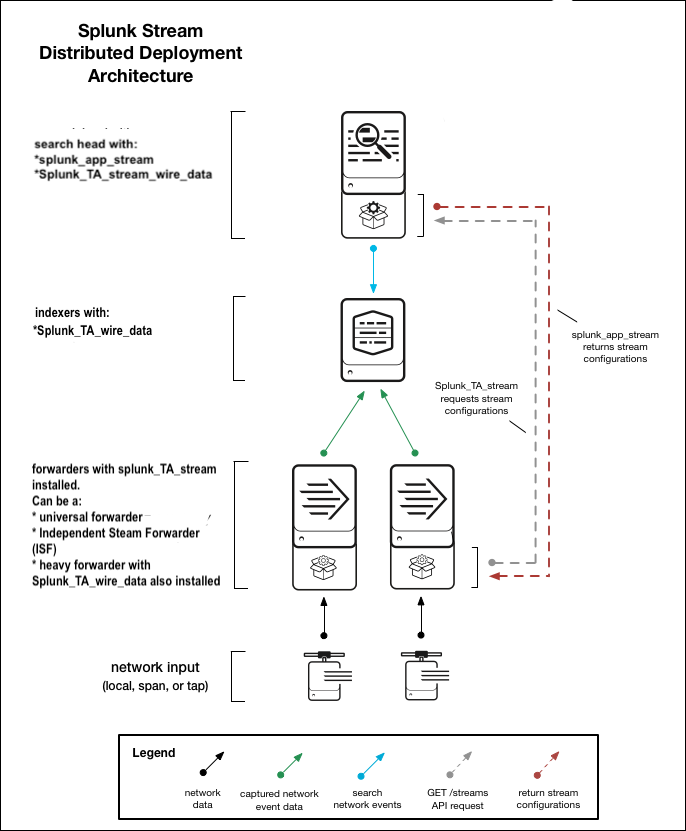
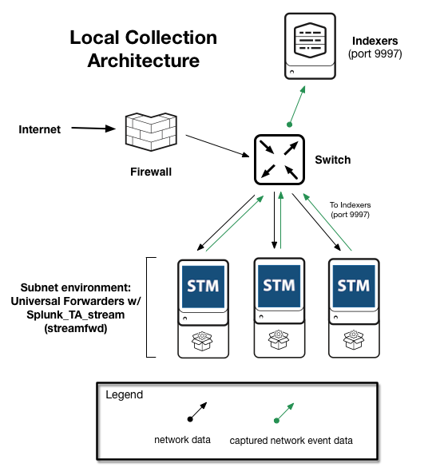
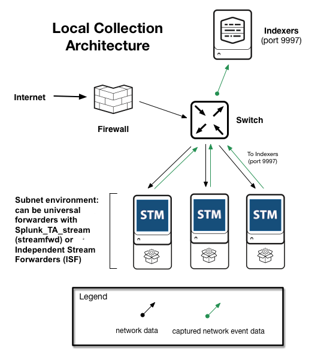

# Splunk Stream Architecture

## Splunk Stream On-Premise 배포 아키텍처

Splunk Stream을 배포하려면 Splunk 소프트웨어에 3 개의 Stream 구성 요소를 설치합니다.

|상품명|설치 패키지 이름|설치된 파일 이름|
|:--:|:--:|:--:|
|Splunk App for Stream|splunk_app_stream|splunk_app_stream/|
|Splunk Add-on for Stream Forwarders|Splunk_TA_stream|Splunk_TA_stream/|
|Splunk Add-on for Stream Wire Data|Splunk_TA_stream_wire_data|Splunk_TA_stream_wire_data/|

Splunk Stream은 ISF (Independent Stream Forwarder)도 제공합니다. ISF 설치는 `<streamfwd>` Splunk App for Stream 패키지에 바이너리 파일로 패키지되어 있습니다.

Splunk Stream 구성 요소에 대한 자세한 내용은 이 설명서의 Splunk Stream 설치 패키지 개요 를 참조하십시오 .

Splunk Stream은 대부분의 배포 아키텍처를 지원합니다.

- 관리 형 Splunk Cloud 배포
- 배포 서버 및 인덱서 클러스터를 포함한 분산 배포 구성
- Splunk Enterprise의 단일 인스턴스가 인덱서이자 검색 헤드 인 단일 인스턴스 배포
- 호환되는 Linux 시스템의 ISF (Independent Stream Forwarder)

## 단일 인스턴스 배포

단일 Splunk Enterprise 인스턴스에 Splunk Stream을 설치하면 해당 인스턴스가 검색 헤드 및 인덱서 역할을하며 검색 및 저장 기능을 모두 제공합니다. 단일 인스턴스 배포는 소규모 테스트 환경에 이상적인 동시 검색을 실행하는 한 명 또는 두 명의 사용자를 지원할 수 있습니다. 단일 인스턴스 설치 지침 은이 설명서 의 단일 인스턴스 에 Splunk Stream 설치를 참조하십시오 .

## 분산 Splunk Stream 배포

Splunk Stream 분산 배포는 NIC, 스위치 및 라우터를 포함한 여러 네트워크 장치에서 네트워크 이벤트 데이터를 캡처 할 수 있습니다. 분산 배포는 중대형 엔터프라이즈 네트워크 인프라에서 사용할 수 있습니다. 분산 설치 지침 은이 설명서 의 분산 환경 에 Splunk Stream 설치를 참조하십시오 .

Splunk Stream 용 분산 배포에는 다음 배포 위치와 Splunk Stream 구성 요소가 포함됩니다.

<table>

<tr><td>Splunk 배포 위치</td><td>Splunk Stream 구성 요소</td></tr>
<tr><td>검색 헤드</td><td>Splunk App for Stream ( splunk_app_stream) 및 Splunk Add-on for Stream Wire 데이터 ( Splunk_TA_stream_wire_data)는 검색 헤드에 설치해야합니다.
splunk_TA_stream검색 헤드에서 데이터를 수집하거나 PCAP 업로드를 사용하려는 경우 선택적으로 Stream Forwarders 용 Splunk 애드온 ( ) 을 설치할 수 있습니다 .</td></tr>

<tr><td>인덱서</td><td>Stream Wire Data 용 Splunk 추가 기능 ( Splunk_TA_stream_wire_data)은 검색 및 구문 분석을 위해 모든 인덱서에 설치해야합니다. Stream Wire Data 용 Splunk 애드온에는 검색 및 인덱스 시간 지식 개체가 모두 포함되어 있습니다.</td></tr>
<tr><td>유니버설 포워더</td><td>Stream Forwarder 용 Splunk 애드온 ( Splunk_TA_stream)은 네트워크 데이터를 캡처하려는 범용 포워더에 설치해야합니다. 범용 포워더가없는 Linux 환경에서 전용 와이어 캡처의 경우 ISF (Independent Stream Forwarder)를 사용하십시오. 자세한 정보 는이 매뉴얼의 네트워크 콜렉션 아키텍처 를 참조하십시오.</td></tr>
<tr><td>무거운 포워더</td><td>Splunk Stream 구성에서 헤비 포워더를 사용하는 경우, Splunk_TA_stream네트워크 데이터를 캡처하려는 범용 또는 헤비 포워더에 Stream Forwarder 용 Splunk 애드온 ( )을 설치해야합니다. 또한 Splunk_TA_stream_wire_data해당 인덱스가 파이프 라인 처리를 수행하는 헤비 포워더에 스트림 와이어 데이터 용 추가 기능 ( )을 설치해야합니다 .</td></tr>
<tr><td>배포 서버</td><td>Splunk 배포 서버 를 사용하여 Splunk Add-on for Stream Forwarders 패키지 ( Splunk_TA_stream)를 분산 배포를 통해 유니버설 포워더에 배포합니다. 새 버전의 Splunk Stream으로 업그레이드 할 때 배포 서버는 Stream Forwarders 용 Splunk 애드온의 새 버전이 있는지 여부를 감지합니다. 새 버전이 발견되면 배포 클라이언트로 구독 한 모든 유니버설 포워더가 새 버전의 추가 기능을 가져와 설치합니다. 자세한 내용은
프로비저닝 배포 서버 에서 업그레이드 인 Splunk 기업의 인스턴스.
Splunk Enterprise 용량 계획 매뉴얼 의 Splunk Enterprise 배포 구성 요소 .</td></tr>
<tr><td>ISF (Independent Stream Forwarder)</td><td>ISF는 독립형 스트림 포워더입니다. ISF는 HTTP 이벤트 수집기를 사용하여 캡처 된 네트워크 데이터를 Splunk로 전송하며, 유선 데이터를 수집하기 위해 Splunk 범용 포워더가 필요하지 않습니다. 범용 포워더를 설치할 수없는 네트워크 및 배포에 유용합니다. 독립 스트림 전달자 설치를 참조하십시오.</td></tr>
</table>

## 분산 Splunk Stream 배포 작동 방식

일반적인 분산 배포에서 Stream Forwarder 용 Splunk 애드온은 유니버설 포워더에 Splunk_TA_Stream. 일단 설치되면 포워더는 서브넷 환경의 각 노드와 같은 로컬 NIC 또는 네트워크 SPAN 또는 TAP에서 네트워크 이벤트 데이터를 캡처합니다. 데이터 수집에 대한 자세한 내용은 이 설명서의 네트워크 수집 아키텍처 를 참조하십시오 .

Stream Forwarder가 캡처하는 네트워크 데이터 는 Splunk App for Stream이 설치할 때 제공 하는 Configure Streams UI를 사용하여 스트림을 구성 할 때 선택한 특정 프로토콜 및 필드에 따라 다릅니다 . Stream forwarder는 Stream Wire Data 용 Splunk Add-on ( Splunk_TA_stream_wire_data)을 사용하여 캡처 한 이벤트 데이터를 인덱서로 보냅니다 .

Splunk_TA_stream/local/inputs.confSplunk App for Stream ( splunk_app_stream) 설치 위치를 저장합니다 . Stream 포워더는이 위치를 사용하여 Splunk App For Stream over HTTP 포트 8000을 핑합니다. Stream 포워더가 Splunk Stream 구성의 변경 사항을 감지하면 Stream 포워더는 API 요청을 엔드 포인트로 전송하여 최신 구성 데이터를 가져옵니다.

Stream Forwarder 용 Splunk Add-on 구성에 대한 자세한 내용은 이 설명서의 Configure Stream Forwarder 를 참조하십시오 .

## Splunk Stream for Cloud 배포 아키텍처

Splunk Stream을 배포하려면 Splunk Cloud 계정 팀에 문의하여 Splunk Cloud에 Splunk App for Stream을 설치하십시오. 이 설치에는 일반적으로 검색 헤드와 인덱서가 포함됩니다.

이 관리 구성에서 작동하는 포워더를 설치할 수 있습니다. 포워더 splunk_app_stream는 Managed Splunk Cloud 인스턴스의 검색 헤드에 설치된 Splunk App for Stream ( ) 에서 Stream 구성 데이터를 가져옵니다 . 포워더는 캡처 된 데이터를 Splunk Cloud 인덱서로 다시 보냅니다.

Splunk Stream은 Splunk Stream의 Managed Cloud 인스턴스에 대해 두 가지 유형의 포워더를 지원합니다.

- Splunk_TA_stream유니버설 포워더에 설치된 Stream Forwarder 용 Splunk 애드온 ( ). 구성된 Stream forwarder는 Splunk2Splunk 프로토콜을 통해 데이터를 전송합니다. 헤비 포워더를 사용하여 데이터를 수집하고 구문 분석하는 경우 Splunk_TA_stream_wire_data해당 인덱스가 파이프 라인 처리를 수행하는 곳마다 해당 헤비 포워더에 스트림 와이어 데이터 용 애드온 ( ) 도 설치하십시오 .
- ISF (Independent Stream Forwarder). 이러한 포워더는 HTTP Event Collector (HEC)를 사용하여 캡처 된 데이터를 Splunk Cloud 인덱서로 보냅니다.
다음 다이어그램은 포워더가있는 Managed Splunk Cloud 배포에서 Splunk Stream의 배포 아키텍처를 설명합니다.

## 네트워크 데이터 수집 아키텍처 결정

네트워크 데이터를 캡처하려는 네트워크에 Stream Forwarder 용 Splunk 애드온을 설치합니다. Splunk Stream을 배포하기 전에 Stream 전달자를위한 최적의 위치를 ​​결정하십시오.

- 모니터링 할 호스트가 포함 된 네트워크 또는 네트워크 세그먼트를 검토합니다.
- 이 항목의 네트워크 컬렉션 아키텍처를 검토하여 데이터를 캡처하는 가장 좋은 방법을 결정하십시오.

수집 할 데이터를 결정한 후에는 네트워크 수집 방법을 결정하십시오.

- 모니터링하는 각 시스템에서 데이터를 수집하는 로컬 컬렉션
- SPAN (Switched Port Analyzer) 수집
- 액세스 포트 (TAP) 수집 테스트

## 로컬 컬렉션 구성

예를 들어 로컬 수집은 다중 계층 웹 사이트와 같은 서브넷 환경의 개별 네트워크 노드에서 데이터를 캡처하는 데 유용합니다.

로컬 컬렉션을 사용하려면 모니터링하려는 네트워크 또는 네트워크 세그먼트의 각 호스트에 범용 포워더 및 Stream Forwarder 용 Splunk 애드온을 설치하십시오.

로컬 컬렉션을 수동으로 구성 하거나 Splunk 배포 서버를 사용할 수 있습니다 .

## SPAN 또는 TAP 수집 구성

SPAN (Switched Port Analyzer) 및 TAP (Test Access Port) 수집을 사용하려면 SPAN 포트 또는 네트워크 TAP를 사용하여 네트워크 또는 네트워크 세그먼트의 모든 트래픽을 수신하는 기존 수집 노드가 있어야합니다.

유니버설 포워더에 Splunk Add-on for Stream Forwarder를 설치하거나 ISF (Independent Stream Forwarder)를 배포 한 다음 해당 포워더를 SPAN 또는 TAP 인터페이스의 리스너로 구성하십시오.

이 다이어그램은 SPAN 수집 아키텍처를 사용한 분산 Splunk Stream 배포를 보여줍니다.

## 로컬, SPAN 및 TAP 수집에 대한 고려 사항

이 표는 로컬, SPAN 및 TAP 컬렉션 아키텍처의 장단점을 강조합니다.

<table>
<tr><td>컬렉션 유형</td><td>장점</td><td>단점</td></tr>
<tr><td>Local</td><td>
- 빠른 구현 (배포 서버 사용) 
- 보다 선택적 데이터 수집 (서브넷) 
- SPAN 또는 TAP를 사용할 수없는 공용 클라우드 VM에서 작동합니다.
</td><td>
- 리소스는 개별 컴퓨터로 제한됩니다. 하드웨어 성능 테스트 요약을 참조하십시오 .</td></tr>
<tr><td>SPAN</td><td>
- 네트워크의 모든 것을 효율적으로 캡처합니다. 
- 단일 캡처 지점을 통해 데이터 수집을 쉽게 설정할 수 있습니다. 
- SPAN은 개별 시스템에 성능 영향을주지 않습니다.</td><td>
- 스위치 하드웨어 구성이 필요합니다. 
- 네트워크의 모든 것을 캡처하므로 보안 고려 사항이 발생할 수 있습니다. 
- 단일 캡처 지점은 단일 지점 실패 위험을 생성합니다. 
- 클라우드 가상 머신에서 데이터를 수집하는 것은 어려울 수 있습니다. 
- 네트워크 스위치에 리소스 제한이있을 수 있습니다. 
- 삭제 된 패킷은 TAP보다 더 일반적입니다.</td></tr>
<tr><td>TAP</td><td>
- 네트워크의 모든 것을 효율적으로 캡처합니다. 
- 단일 캡처 지점을 통해 데이터 수집을 쉽게 설정할 수 있습니다. 
- 개별 시스템에 성능 영향이 없습니다. 
- 네트워크 스위치에 성능 영향이 없습니다. 
- SPAN보다 더 높은 데이터 캡처 충실도.</td><td>
- 물리적 하드웨어 장치가 필요합니다. 
- 보안 고려 사항으로 이어질 수있는 네트워크의 모든 것을 캡처합니다. 
- 단일 캡처 지점은 단일 지점 실패 위험을 생성합니다. 
- 클라우드 가상 머신에서 수집하기 어려울 수 있습니다.</td></tr>
</table>

## SPAN 수집에 대한 추가 고려 사항

SPAN 수집에는 몇 가지 추가 고려 사항이 필요합니다.

- 미러 데이터를 수신하는 네트워크 인터페이스 카드 (NIC)가 유입되는 트래픽을 처리 할 수 ​​있습니까? 예를 들어 1GB NIC는 10GB 포트의 데이터 볼륨을 처리 할 수 ​​없습니다.
- SPAN 미러 포트에 스패닝중인 모든 포트의 수신 및 송신 트래픽이 모두 포함되어 있습니까? 그렇다면 NIC 자체의 용량이 훨씬 더 중요합니다.
- 미러 장치가 NAT 데이터를 생성합니까 (이 경우 데이터에 트래픽의 내부 및 외부 (인터넷) 표현이 모두 포함됨)?
- 소스 트래픽의 양은 얼마입니까? 트래픽 양에 따라 시스템이 예상대로 작동하도록 성능을 조정해야 할 수 있습니다.
