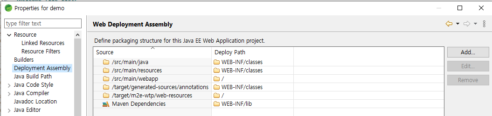

# Eclipse

## Eclipse 초기 세팅

<https://devks.tistory.com/10>

- Window > Preferences > General > Workspace : UTF-8
- Window > Preferences > General > Context Type > Text (Default encoding): UTF-8
- Window > Preferences > Web > CSS : UTF-8
- Window > Preferences > Web > HTML : UTF-8
- Window > Preferences > Web > JSP : UTF-8

## Spring 세팅

<https://offbyone.tistory.com/391>
<https://start.spring.io/>

### 프로젝트 스킬셋

- JDK 1.8
- Embedded Tomcat
- Thymeleaf
- Spring Boot 2.x
- Mybatis
- Lombok
- DevTools
- MySQL
- Maven

### 프로젝트 세팅(Spring Boot Project)

1. lombok.jar 세팅

   - SpringToolShite4.ini

   ```properties
   -vmargs
   -javaagent:lombok.jar
   ```

2. New > Other > Spring Boot > Spring Starter Project

   - DevTools
   - Lombok
   - MySQL
   - MyBatis
   - Thymeleaf
   - Web

3. 웹 애플리케이션 실행을 위한 의존성 추가

   ```xml
   <properties>
      <java.versionb>1.8</java.version>
      <maven-jar-plugin.version>3.1.1</maven-jar-plugin.version>
   </properties>
   ```

   ```xml
   <dependency>
      <groupId>org.apache.tomcat.embed</groupId>
      <artifactId>tomcat-embed-jasper</artifactId>
      <scope>provided</scope>
   </dependency>
   ```

4. 웹 파일을 위한 폴더 생성

   - /src/main/webapp
   - /src/main/webapp/WEB-INF
   - /src/main/webapp/WEB-INF/jsp

   /src/main/resources/application.properties

   - 설정(JSP,DB)

   ```properties
   spring.mvc.view.prefix=/WEB-INF/jsp/
   spring.mvc.view.suffix=.jsp

   # DataSource
   spring.datasource.url=jdbc:mysql://192.168.4.55:3306/splunkdb?autoReconnect=true
   spring.datasource.username=splunk
   spring.datasource.password=splunk
   spring.datasource.driver-class-name=com.mysql.jdbc.Driver
   ```

   - DB세팅이 없는 경우 아래와 같은 오류 발생

   ```bash
   ***************************
   APPLICATION FAILED TO START
   ***************************
   Description:
   Failed to configure a DataSource: 'url' attribute is not specified and no embedded datasource could be configured.

   Reason: Failed to determine a suitable driver class

   Action:
   Consider the following:
   If you want an embedded database (H2, HSQL or Derby), please put it on the classpath.
   If you have database settings to be loaded from a particular profile you may need to activate it (no profiles are currently active).
   ```

5. Controller 생성

   ```java
   package com.tistory.offbyone.springboot.web;
   import org.springframework.stereotype.Controller;
   import org.springframework.web.bind.annotation.RequestMapping;

   @Controller
   public class WelcomeController {

      @RequestMapping("/welcome")
      public String welcome() {
         return "welcome";
      }
   }
   ```

6. JSP파일 생성

   ```html
   <html>
     <head>
       <title>Welcome Title</title>
     </head>
     <body>
       Welcome
     </body>
     
   </html>
   ```

7. 테스트 어플리케이션 실행

   - 프로젝트 생성시 SpringBootTestApplication.java 파일이 생성
   - 이 파일에 마우스 오른쪽 키를 누르고, Run As -> Java Application으로 실행

8. 웹 브라우저 실행

- <http://localhost:8080/context_name>

## WEB 어플리케이션 세팅(Spring Legacy Project)

<https://kamang-it.tistory.com/entry/JSPwebxml-%EC%83%9D%EC%84%B1%ED%95%98%EA%B8%B0>

### eclipse에서 web.xml생성

- 프로젝트 -> Java EE Tools -> Generate Deployment Descriptor (web.mxl 자동생성)

### web.xml DispatcherServlet (Front Controller) 설정 추가

```xml
<?xml version="1.0" encoding="UTF-8"?>
<web-app xmlns:xsi="http://www.w3.org/2001/XMLSchema-instance" xmlns="http://xmlns.jcp.org/xml/ns/javaee" xsi:schemaLocation="http://xmlns.jcp.org/xml/ns/javaee http://xmlns.jcp.org/xml/ns/javaee/web-app_4_0.xsd" id="WebApp_ID" version="4.0">

   <context-param>
      <param-name>contextConfigLocation</param-name>
      <param-value>/WEB-INF/conf/root-context.xml</param-value>
   </context-param>
   <listener>
      <listener-class>org.springframework.web.context.ContextLoaderListener</listener-class>
   </listener>

   <filter>
      <filter-name>encodingFilter</filter-name>
      <filter-class>org.springframework.web.filter.CharacterEncodingFilter</filter-class>
      <init-param>
         <param-name>encoding</param-name>
         <param-value>UTF-8</param-value>
      </init-param>
   </filter>
   <filter-mapping>
      <filter-name>encodingFilter</filter-name>
      <url-pattern>/*</url-pattern>
   </filter-mapping>

  <servlet>
    <servlet-name>dispatcherServlet</servlet-name>
    <servlet-class>org.springframework.web.servlet.DispatcherServlet</servlet-class>
    <init-param>
      <param-name>contextConfigLocation</param-name>
      <param-value>/WEB-INF/spring/servlet-context.xml</param-value>
    </init-param>
  </servlet>
  <servlet-mapping>
    <servlet-name>dispatcherServlet</servlet-name>
    <url-pattern>*.do</url-pattern>
  </servlet-mapping>
</web-app>
```

### Eclipse Web Deployment Assembly



### servlet-context.xml 파일 생성

- /WEB-INF/spring/servlet-context.xml

```xml
<init-param>
   <param-name>contextConfigLocation</param-name>
   <param-value>/WEB-INF/spring/servlet-context.xml</param-value>
</init-param>
```

- ./setting/org.eclipse.wst.common.project.facet.core.xml

```xml
<fixed facet="java"/>
<fixed facet="wst.jsdt.web"/>
```

## Spring DB 오류발생

Maven 기준 pom.xml에 데이터베이스를 사용하기 위한 dependency가 존재하는 경우 @SpringBootApplication 에서 자동으로 데이터베이스 값을 설정하려고 시도하지만 사용자는 데이터베이스 값을 입력을 안했기에 발생하는 에러

### 해결방법

- application.properties 및 application.yml 파일에 데이터 소스를 추가

```properties
spring.datasource.url=
spring.datasource.username=
spring.datasource.password=
spring.datasource.driver-class-name=
```

```yml
spring:
  datasource:
    driver-class-name:
    url:
    username:
    password:
```

- Configuration 생성

```java
@Configuration
public class DBConfiguration {
   @Bean
   public DataSource datasource() {
      return DataSourceBuilder.create()
         .driverClassName("")
         .url("")
         .username("")
         .password("")
         .build();
   }
}
```

- DataSourceAutoConfiguration 제외 (DB를 사용안한다는 의미)

```java
@SpringBootApplication(exclude={DataSourceAutoConfiguration.class})
public class Sample01Application {
    public static void main(String[] args) {
    	SpringApplication.run(Sample01Application.class, args);
    }
}
```

## Spring + Eclipse 배포

<https://my-itstory.tistory.com/entry/spring-%ED%8C%8C%EC%9D%BC-%EB%B0%B0%ED%8F%AC%ED%95%98%EA%B8%B0-STS-%EC%9D%B4%EC%9A%A9>

프로젝트 파일 -> Run AS -> Maven install

```bash
[INFO] BUILD SUCCESS
[INFO] ------------------------------------------------------------------------
[INFO] Total time:  31.974 s
[INFO] Finished at: 2021-01-07T10:48:12+09:00
```

- `/target/*.war`

### 실행

- Tomcat에서 실행
  - TOMCAT_HOME/webapps 하위에 복사 후 톰켓 기동
- Spring Boot Start
  - java -jar demo.jar 실행
- <http://localhost:8080/context_name>

## 이클립스 플러그인

- Eclipse Java EE Developer Tools
- Eclipse Java Web Developer Tools
- Eclipse Web Developer Tools(기설치)
- Eclipse XSD Editors and Tools

## Dynamic Web Module 4.0 requires Java 1.0 or newer 해결방안

- [Project Facets]에 자바 버전을 수정
- [Java Compiler] 버전 수정(Java Build Path)
- Maven pom.xml 아래부분 수정
  ```xml
  <plugin>
       <groupId>org.apache.maven.plugins</groupId>
       <artifactId>maven-compiler-plugin</artifactId>
       <version>2.5.1</version>
       <configuration>
          <source>1.8</source>
          <target>1.8</target>
          <compilerArgument>-Xlint:all</compilerArgument>
          <showWarnings>true</showWarnings>
          <showDeprecation>true</showDeprecation>
       </configuration>
  </plugin>
  ```
