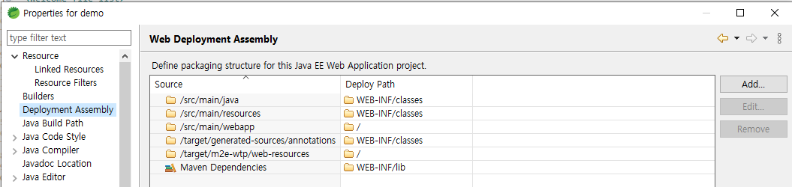

# WEB 어플리케이션 세팅

## WEB 어플리케이션 세팅(Spring Legacy Project)

<https://kamang-it.tistory.com/entry/JSPwebxml-%EC%83%9D%EC%84%B1%ED%95%98%EA%B8%B0>

### eclipse에서 web.xml생성

- 프로젝트 -> Java EE Tools -> Generate Deployment Descriptor (web.mxl 자동생성)

### web.xml DispatcherServlet (Front Controller) 설정 추가

```xml
<?xml version="1.0" encoding="UTF-8"?>
<web-app xmlns:xsi="http://www.w3.org/2001/XMLSchema-instance" xmlns="http://xmlns.jcp.org/xml/ns/javaee" xsi:schemaLocation="http://xmlns.jcp.org/xml/ns/javaee http://xmlns.jcp.org/xml/ns/javaee/web-app_4_0.xsd" id="WebApp_ID" version="4.0">

   <context-param>
      <param-name>contextConfigLocation</param-name>
      <param-value>/WEB-INF/conf/root-context.xml</param-value>
   </context-param>
   <listener>
      <listener-class>org.springframework.web.context.ContextLoaderListener</listener-class>
   </listener>

   <filter>
      <filter-name>encodingFilter</filter-name>
      <filter-class>org.springframework.web.filter.CharacterEncodingFilter</filter-class>
      <init-param>
         <param-name>encoding</param-name>
         <param-value>UTF-8</param-value>
      </init-param>
   </filter>
   <filter-mapping>
      <filter-name>encodingFilter</filter-name>
      <url-pattern>/*</url-pattern>
   </filter-mapping>

  <servlet>
    <servlet-name>dispatcherServlet</servlet-name>
    <servlet-class>org.springframework.web.servlet.DispatcherServlet</servlet-class>
    <init-param>
      <param-name>contextConfigLocation</param-name>
      <param-value>/WEB-INF/spring/servlet-context.xml</param-value>
    </init-param>
  </servlet>
  <servlet-mapping>
    <servlet-name>dispatcherServlet</servlet-name>
    <url-pattern>*.do</url-pattern>
  </servlet-mapping>
</web-app>
```

### Eclipse Web Deployment Assembly



### servlet-context.xml 파일 생성

- /WEB-INF/spring/servlet-context.xml

```xml
<init-param>
   <param-name>contextConfigLocation</param-name>
   <param-value>/WEB-INF/spring/servlet-context.xml</param-value>
</init-param>
```
