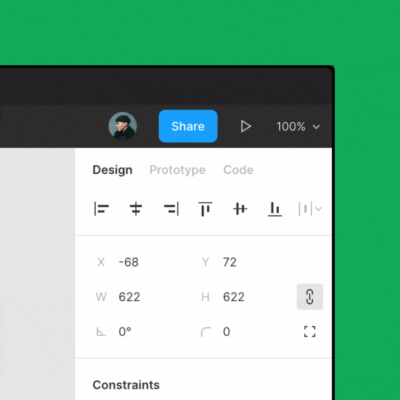
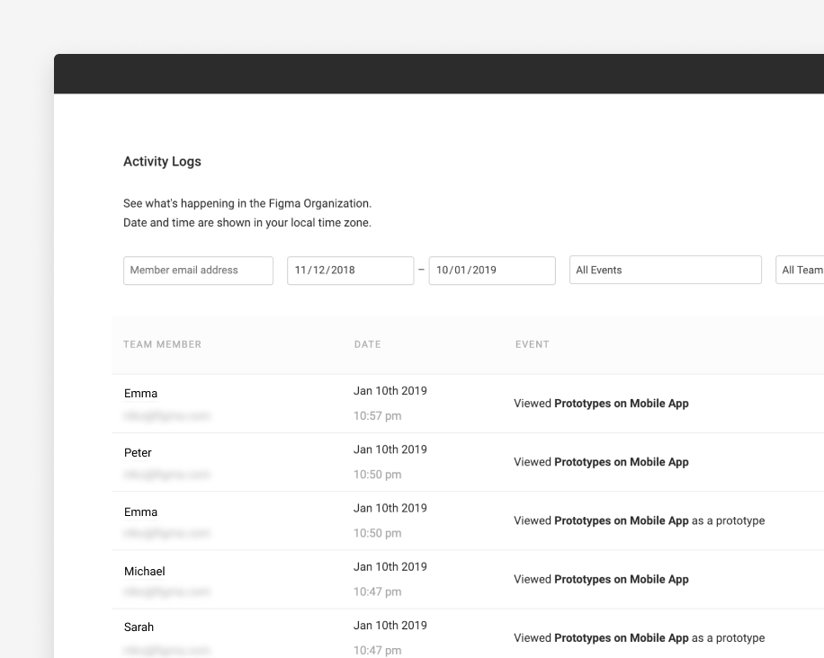

# Figma

<https://github.com/yamoo9/Figma>

## 특징

### 1) 윈도우OS, 맥OS 대응 + 웹 브라우저를 통한 디자인 진행

 
이미지 출처 :  http://www.figma.com/collaboration/

### 2) 실시간 협업 시스템 (공동 라이브 디자인)

- 웹 기반 브라우저 프로그램
- 피그마 계정 소유자가 링크를 공유하여 여러 명이 아트 보드를 확인하며 동시에 온라인으로 실시간 작업을 진행

 
이미지 출처 : http://www.figma.com/design/

- 개발자가 참조할 수 있는 정보를 주는 ‘개발 툴바’가 있어 개발자와 소통에 매우 효과적
- 마우스 툴바로도 수치값을 확인할 수 있어 가이드라인이 없어도 빠른 작업이 가능

 
이미지 출처 : http://www.figma.com/collaboration/

- 스케치는 제플린 zeplin이라는 앱을 따로 사용하여 (핸드오프) 작업물을 내보내는 방식으로 개발자와 소통하는 반면, 피그마는 앱 하나에서 바로 핸드오프 기능을 사용

### 3) 버전 히스토리 관리

 
이미지 출처 : http://www.figma.com/organization/

- 히스토리 영역을 통해 협업자 중 누가 무엇을 변경했는지 확인하고, 필요에 따라 날짜&시간별로 기록되어 있는 히스토리를 확인
- 버전 관리 필요 없이 히스토리 기능을 사용하여 편리하게 버전 관리가 가능
- 포토샵과는 다르게 사용자가 날짜를 지정하여 저장할 수 있으며, 최대 30일까지 히스토리 저장이 가능
- 히스토리뿐만 아니라 피그마 파일로도 저장이 가능하므로 필요시 파일로 내보내기 하여 파일을 관리

### 4) 최적화된 어댑티브(ADAPTIVE) 레이아웃 시스템

- 포토샵은 해상도에 맞추어 매번 새롭게 작업을 해야 하는 것에 비해, 피그마는 외곽 선을 조정하는 것만으로도 대부분의 콘텐츠 레이아웃을 크기에 맞게 자동 조정

 
 
이미지 출처 : http://www.figma.com/graphic-design-tool/

### 5) SKETCH 파일과의 연동

- 기존에 작업하던 스케치 파일들을 피그마에 임포트 하여 작업
- 현재 온라인에 배포되어 있는  스케치 UI 키트들을 피그마에서도 사용

### 6) 프로토타이핑 PROTOTYPING

- 직관적인 인터페이스로 UI 상호작용 및 애니메이션 제작이 가능
- 클릭/호버/버튼 동작 등 단순한 인터렉션을 넣어 프로토타입을 제작

 
이미지 출처 : http://www.figma.com/prototyping/

- 모바일에 최적화되어있어 플레이 시 프레임 및 모멘텀 스크롤과 같은 세부적인 부분의 프로토타입 또한 실제 화면 확인

 
이미지 출처 : 피그마 공식 사이트 https://www.figma.com/prototyping/

## 시작

1. 팀생성
2. 프로젝트 생성
  - 여러파일 관리
3. 디자인 파일 생성
  - `Draft +` : 특정 프로젝트에 속하는 파일은 만드는 것이 아닌 임시 파일 생성
  
  
