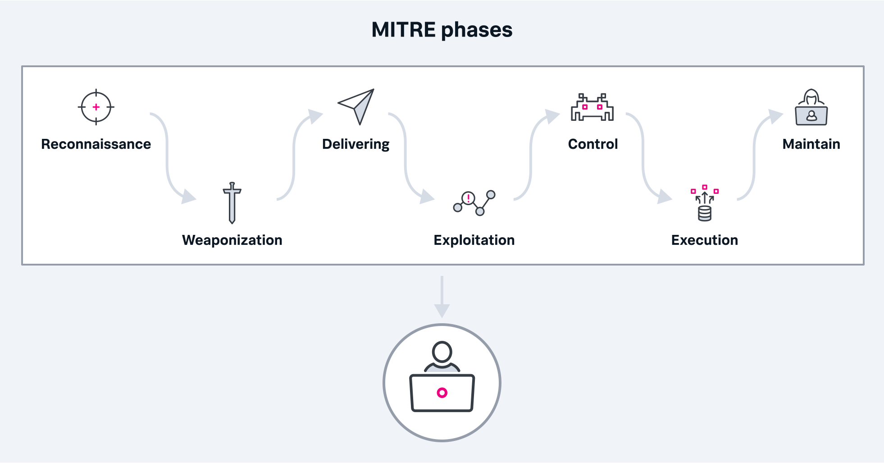
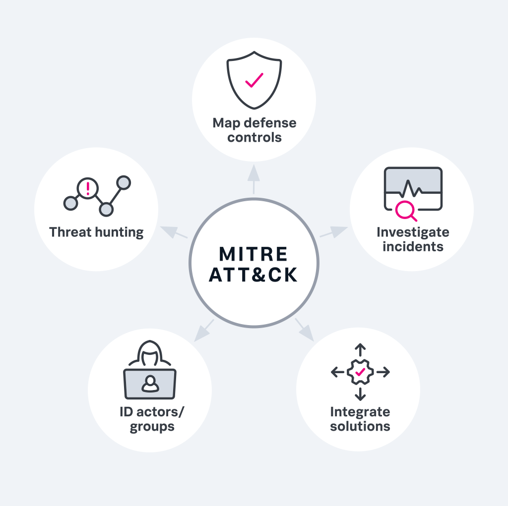
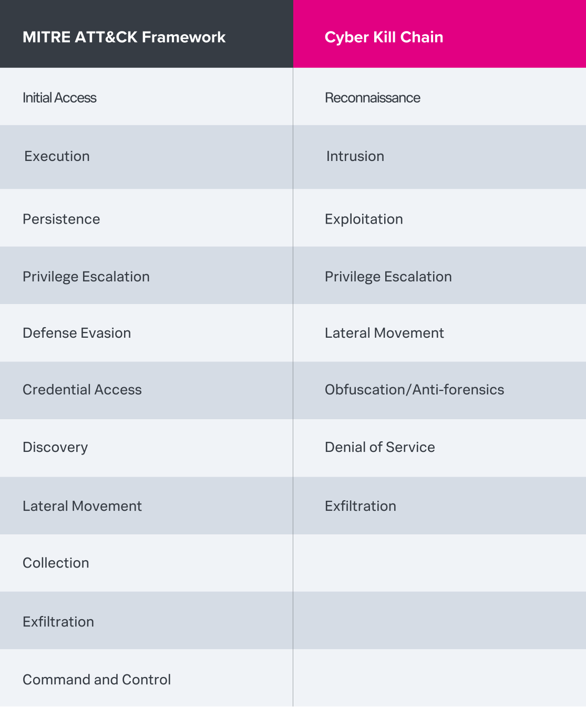

# MITRE ATT&CK

The MITRE ATT&CK framework is a depository of cyberattack behaviors based on real-world observations of adversaries’ behaviors that are categorized by tactics and techniques.
MITER ATT&CK 프레임워크는 전술과 기술로 분류된 적의 행동에 대한 실제 관찰을 기반으로하는 사이버 공격 행동의 보관소입니다.

Created in 2013 by the MITRE Corporation, a not-for-profit organization that works with government agencies, industry and academic institutions, the framework is a globally accessible knowledge base that provides a comprehensive representation of attack behaviors.
정부 기관, 산업 및 학술 기관과 협력하는 비영리 조직인 MITER Corporation이 2013 년에 만든이 프레임워크는 공격 행동의 포괄적 인 표현을 제공하는 전 세계적으로 접근 가능한 지식 기반입니다.

ATT&CK, which stands for Adversarial Tactics, Techniques and Common Knowledge, documents common tactics, techniques and procedures (TTPs) that cyber criminals employ when attacking networks and it outlines adversarial behaviors specific to Windows, Linux, Mac, cloud-based and mobile environments. Organizations regularly rely on its knowledge base to devise offensive and defensive measures to strengthen their overall security posture.
Adversarial Tactics, Techniques 및 Common Knowledge의 약자 인 ATT&CK는 사이버 범죄자가 네트워크를 공격 할 때 사용하는 일반적인 전술, 기술 및 절차 (TTP)를 문서화하고 Windows, Linux, Mac, 클라우드 기반 및 모바일 환경에 특정한 적대적 행동을 설명합니다. 조직은 정기적으로 지식 기반에 의존하여 전반적인 보안 태세를 강화하기위한 공격 및 방어 조치를 고안합니다.

The ATT&CK framework can help threat hunters and other cyber defenders better classify attacks, understand adversary behavior and assess an organization's risk. Security teams can also use the framework to gain insight into how adversaries might operate in various scenarios so they can create informed strategies on how to detect — and ultimately prevent — those behaviors from affecting the security of their organization.
ATT&CK 프레임워크는 위협 사냥꾼 및 기타 사이버 방어자가 공격을 더 잘 분류하고 적의 행동을 이해하며 조직의 위험을 평가하는 데 도움이 될 수 있습니다. 또한 보안 팀은 프레임워크를 사용하여 공격자가 다양한 시나리오에서 어떻게 작동 할 수 있는지에 대한 통찰력을 얻을 수 있으므로 이러한 행동이 조직의 보안에 영향을 미치는 것을 감지하고 궁극적으로 방지하는 방법에 대한 정보에 입각 한 전략을 만들 수 있습니다.

The ATT&CK framework’s unique ability to provide insights into adversaries’ behaviors, as well as its ability to provide a standardized, easily accessible global language, has led to its growing popularity for organizations looking to share threat intelligence and bolster their security posture.
공격자의 행동에 대한 통찰력을 제공하는 ATT&CK 프레임워크의 고유 한 기능과 쉽게 액세스 할 수있는 표준화 된 글로벌 언어를 제공하는 능력은 위협 인텔리전스를 공유하고 보안 태세를 강화하려는 조직에서 점점 인기를 얻었습니다.

This article will examine the MITRE organization’s approach to security, explore various components of the ATT&CK framework and discuss how you can start applying ATT&CK in real-world situations.
이 기사에서는 보안에 대한 MITER 조직의 접근 방식을 검토하고 ATT&CK 프레임워크의 다양한 구성 요소를 살펴보고 실제 상황에서 ATT&CK를 적용하는 방법을 논의합니다.

What Are Microservices? : Contents - In This Article
- What is the MITRE ATT&CK framework?
- What is MITRE security?
- Is MITRE a government agency?
- What is the purpose of threat modeling?
- What is the cyberattack lifecycle?
- What are cybersecurity frameworks?
- How is the MITRE ATT&CK framework used?
- How does the MITRE ATT&CK framework compare to modern cybersecurity standards?
- How does the MITRE ATT&CK framework compare to the Cyber Kill Chain framework?
- How do I get started using the MITRE ATT&CK framework?
- How do I perform a threat model?
- 마이크로 서비스 란? : 목차-이 기사에서
-MITER ATT&CK 프레임워크 란 무엇입니까?
- MITER 보안이란 무엇입니까?
- MITER는 정부 기관입니까?
- 위협 모델링의 목적은 무엇입니까?
- 사이버 공격 라이프 사이클은 무엇입니까?
- 사이버 보안 프레임워크 란 무엇입니까?
- MITER ATT&CK 프레임워크는 어떻게 사용됩니까?
- MITER ATT&CK 프레임워크는 최신 사이버 보안 표준과 어떻게 비교됩니까?
- MITER ATT&CK 프레임워크는 Cyber Kill Chain 프레임워크와 어떻게 비교됩니까?
- MITER ATT&CK 프레임워크 사용을 시작하려면 어떻게해야합니까?
- 위협 모델을 어떻게 수행합니까?

Additional Resources
Data Insider home

## What is MITRE security?

MITRE security is a core capability of the MITRE Corporation, incorporating both cyber threat intelligence and an array of cybersecurity resources. MITRE advocates for a well-rounded security posture that combines traditional cyber defense approaches along with an increased reliance on cyber threat intelligence — all of which enable organizations to respond and adapt quickly to evolving threats. These resources provide a foundation for creating and building out a cybersecurity program, including:
MITER 보안은 사이버 위협 인텔리전스와 일련의 사이버 보안 리소스를 모두 통합하는 MITER Corporation의 핵심 기능입니다. MITER는 기존의 사이버 방어 접근 방식과 사이버 위협 인텔리전스에 대한 의존도 증가를 결합한 다재다능한 보안 태세를 옹호합니다.이 모든 기능을 통해 조직은 진화하는 위협에 신속하게 대응하고 적응할 수 있습니다. 이러한 리소스는 다음과 같은 사이버 보안 프로그램을 만들고 구축하기위한 토대를 제공합니다.

- Awareness and training: This incorporates employee awareness programs, technical training and student learning opportunities.
- Standards: A framework of cybersecurity standards provides a common foundation for identifying, analyzing and sharing threat information.
- Tools: MITRE provides a range of open source tools that help organizations analyze, detect and respond to threats.
- 인식 및 교육 : 여기에는 직원 인식 프로그램, 기술 교육 및 학생 학습 기회가 포함됩니다.
- 표준 : 사이버 보안 표준 프레임워크는 위협 정보를 식별, 분석 및 공유하기위한 공통 기반을 제공합니다.
- 도구 : MITER는 조직이 위협을 분석, 감지 및 대응하는 데 도움이되는 다양한 오픈 소스 도구를 제공합니다.

To significantly improve organizations’ cybersecurity posture, the framework adopts a threat-based defense strategy that uses knowledge from various attacks and related events to reduce the likelihood of successful attacks in the future.
조직의 사이버 보안 태세를 대폭 개선하기 위해 프레임워크는 다양한 공격 및 관련 이벤트의 지식을 사용하여 향후 공격 성공 가능성을 줄이는 위협 기반 방어 전략을 채택합니다.

According to MITRE, a comprehensive, threat-based defense is contingent upon three elements:
MITRE에 따르면 포괄적 인 위협 기반 방어는 다음 세 가지 요소를 조건으로합니다.

- Cyber threat intelligence analysis: This analysis provides practical information and threat detection signatures, which specialists can use to strengthen cyber defense and improve ways to anticipate, prevent, detect and respond to cyberattacks.
- Defensive threat engagement: During early stages of the attack lifecycle, organizations have an opportunity to detect and mitigate threats early on before cyber criminals conduct extensive damage, making this a critical window for preventing and detecting future attacks. In later stages, however, techniques like incident response are used reactively to an existing threat.
- Focused sharing and collaboration: MITRE works with sponsors and industry partners to promote cyber threat information sharing, adopt new concepts and apply solutions to bolster cybersecurity postures and awareness.

## Is MITRE a government agency?

MITRE is a not-for-profit corporation that works across federal, state and local governments and throughout various industries and academia. While not a government organization, MITRE operates federally funded research and development centers (FFRDCs), unique organizations that support the U.S. government with scientific research and analysis; development and acquisition; and engineering and integration systems.
MITER는 연방, 주 및 지방 정부와 다양한 산업 및 학계 전반에 걸쳐 활동하는 비영리 기업입니다. 정부 기관은 아니지만 MITER는 과학 연구 및 분석을 통해 미국 정부를 지원하는 고유 한 기관인 연방 자금 지원 연구 개발 센터 (FFRDC)를 운영합니다. 개발 및 인수; 및 엔지니어링 및 통합 시스템.

MITRE specializes in shepherding innovative ideas into areas such as artificial intelligence, intuitive data science, quantum information science, health informatics, space security, policy and economic expertise, cyber threat sharing and cyber resilience.
MITER는 인공 지능, 직관적 인 데이터 과학, 양자 정보 과학, 건강 정보학, 우주 보안, 정책 및 경제 전문성, 사이버 위협 공유 및 사이버 복원력과 같은 영역에 혁신적인 아이디어를 전달하는 데 특화되어 있습니다.

It also has an independent research program that explores new and expanded uses of technologies to address client’s specific problems, in particular bringing its own technical prowess to assist various federal agencies. Some of its core capabilities include systems engineering, signal processing and acquisition, as well as cybersecurity, mobile technology and social software.
또한 고객의 특정 문제를 해결하기 위해 새롭고 확장 된 기술 사용을 탐구하는 독립적 인 연구 프로그램을 가지고 있으며, 특히 다양한 연방 기관을 지원하기 위해 자체 기술력을 발휘합니다. 핵심 기능 중 일부에는 시스템 엔지니어링, 신호 처리 및 획득은 물론 사이버 보안, 모바일 기술 및 소셜 소프트웨어가 포함됩니다.

## What is the purpose of threat modeling?

Cyber threat modeling is the process of developing and applying a representation of attack threat scenarios in a cyber environment. These threats can target a device, an application, a system, a network, an organization or a business-critical mission. Threat modeling can determine how these various platforms and environments respond to attacks in real-world situations, and can help identify vulnerabilities and other weaknesses.
사이버 위협 모델링은 사이버 환경에서 공격 위협 시나리오의 표현을 개발하고 적용하는 프로세스입니다. 이러한 위협은 장치, 애플리케이션, 시스템, 네트워크, 조직 또는 업무상 중요한 임무를 표적으로 삼을 수 있습니다. 위협 모델링은 이러한 다양한 플랫폼과 환경이 실제 상황에서 공격에 어떻게 대응 하는지를 결정할 수 있으며 취약성 및 기타 약점을 식별하는 데 도움이 될 수 있습니다.

The cyber threat modeling process is used in numerous aspects of cybersecurity and resilience strategy, including:
사이버 위협 모델링 프로세스는 다음을 포함하여 사이버 보안 및 복원력 전략의 다양한 측면에서 사용됩니다.

- Threat intelligence sharing
- Risk management
- Technology profiling and foraging
- Systems security engineering
- Security operations and analysis
- 위협 인텔리전스 공유
- 위기 관리
- 기술 프로파일 링 및 수색
- 시스템 보안 공학
- 보안 운영 및 분석

## What is the cyberattack lifecycle?

The cyberattack lifecycle, first articulated by Lockheed Martin as the “Cyber Kill Chain,” illustrates the various phases in a cyberattack. MITRE’s own Cyber Attack Lifecycle is a critical component of its threat-based defense (mentioned above), providing organizations an enhanced opportunity to discover and respond to attacks at earlier stages. 
Lockheed Martin이 "Cyber Kill Chain"으로 처음 언급 한 사이버 공격 라이프 사이클은 사이버 공격의 다양한 단계를 보여줍니다. MITRE의 자체 사이버 공격 수명주기는 위협 기반 방어 (위에서 언급)의 중요한 구성 요소로, 조직에 초기 단계에서 공격을 발견하고 대응할 수있는 향상된 기회를 제공합니다.

The MITRE phases include:

- Reconnaissance: Adversary develops strategy on target
- Weaponization: Develops cyber weapon and determines best method to successfully deliver
- Delivering: Delivers cyber weapon to predetermined target system
- Exploitation: Exploits vulnerability to install and activate malware on target system
- Control: Manages initial target and perform internal recon
- Execution: Executes plan to achieve objections (e.g. data exfiltration)
- Maintain: Ensures long-term presence on target systems or networks (e.g. erase any indications of presence)
- 정찰 : 적들이 목표에 대한 전략을 개발
- 무기화 : 사이버 무기 개발 및 성공적인 전달을위한 최선의 방법 결정
- 전달 : 미리 정해진 표적 시스템에 사이버 무기 전달
- 악용 : 취약점을 악용하여 대상 시스템에 맬웨어를 설치하고 활성화합니다.
- 제어 : 초기 목표 관리 및 내부 정찰 수행
- 실행 : 이의 제기 (예 : 데이터 유출)를 달성하기위한 계획을 실행합니다.
- 유지 : 대상 시스템 또는 네트워크에서 장기적인 존재를 보장합니다 (예 : 존재 표시 삭제).

Organizations that map their own defensive tools and capabilities across the entirety of the MITRE cyber attack lifecycle will be better able to determine gaps in their security architecture and make the appropriate investments to strengthen their security defenses.
MITER 사이버 공격 라이프 사이클 전체에 걸쳐 자체 방어 도구 및 기능을 매핑하는 조직은 보안 아키텍처의 격차를 더 잘 파악하고 보안 방어를 강화하기 위해 적절한 투자를 할 수 있습니다.

## What are cybersecurity frameworks?

A cybersecurity framework is a series of documented standards and protocols that define best security practices to manage risk, reduce exposure to vulnerabilities and keep data protected from potential threats.  Because organizations of all sizes and across all industries struggle to keep critical systems and data secure, many rely on cybersecurity frameworks for guidance. A cybersecurity framework provides a comprehensive, standardized plan that anticipates many of the challenges while alleviating much of the guesswork around how critical data and infrastructure needs to be protected. In many cases, organizations can tailor an existing cybersecurity framework to meet their own specific needs or compliance requirements. 
사이버 보안 프레임워크는 위험을 관리하고 취약성에 대한 노출을 줄이며 잠재적 인 위협으로부터 데이터를 보호하기위한 모범 보안 사례를 정의하는 일련의 문서화 된 표준 및 프로토콜입니다. 모든 규모와 모든 산업의 조직이 중요한 시스템과 데이터를 안전하게 유지하기 위해 고군분투하고 있기 때문에 많은 기업이 지침을 위해 사이버 보안 프레임워크에 의존합니다. 사이버 보안 프레임워크는 많은 문제를 예상하는 포괄적이고 표준화 된 계획을 제공하는 동시에 중요한 데이터 및 인프라를 보호해야하는 방법에 대한 추측을 많이 줄여줍니다. 대부분의 경우 조직은 기존 사이버 보안 프레임워크를 맞춤화하여 고유 한 요구 사항 또는 규정 준수 요구 사항을 충족 할 수 있습니다.

## How is the MITRE ATT&CK framework used?

The ATT&CK framework can be used by security teams in everyday defense activities — particularly those that address threat actors and their attack methods. ATT&CK is used in a myriad of ways by both red and blue teams, providing both offensive and defensive security professionals a common language and frame of reference around adversarial behaviors. 
ATT&CK 프레임워크는 보안 팀이 일상적인 방어 활동, 특히 위협 행위자와 공격 방법을 다루는 활동에서 사용할 수 있습니다. ATT&CK는 레드 팀과 블루 팀 모두에서 무수히 많은 방식으로 사용되어 공격 및 방어 보안 전문가 모두에게 적대적 행동에 대한 공통 언어와 참조 프레임을 제공합니다.

Red teams (pen testers and offensive security professionals who regularly test and break into cyber defenses) can follow MITRE's ATT&CK framework to test their networks’ security defenses by modeling ATT&CK’s documented adversary behavior. Using ATT&CK as an enhancement to existing methodology for predictive campaigns can make it easier for red teams to anticipate threats, detect patterns, and assess the effectiveness of defense tools in their environment.
레드 팀(펜 테스터 및 사이버 방어를 정기적으로 테스트하고 침입하는 공격적 보안 전문가)은 MITRE의 ATT&CK 프레임워크를 따라 ATT&CK의 문서화된 공격적 행동을 모델링하여 네트워크의 보안 방어를 테스트할 수 있다. ATT&CK를 예측 캠페인을 위한 기존 방법론의 향상으로 사용하면 레드 팀이 위협을 예측하고 패턴을 탐지하고 환경에서 방어 도구의 효과를 평가하는 것이 더 쉬워질 수 있다.

Blue teams (defensive security professionals who oversee internal network security protections and defend against cyber threats) can leverage the ATT&CK framework to better understand what adversaries are doing, as well as prioritize the most severe threats and ensure the appropriate security mechanisms are in place and effectively working.
Blue 팀(내부 네트워크 보안 보호를 감독하고 사이버 위협으로부터 보호하는 방어적 보안 전문가)은 ATT&CK 프레임워크를 활용하여 가장 심각한 위협의 우선 순위를 정하고 적절한 보안 메커니즘이 제대로 작동하고 있는지 확인할 수 있습니다. 

Below are various ways in which ATT&CK’s taxonomy can be applied:

- Mapping defense controls: Security teams can have a clear understanding of defense tools, systems and strategies when they’re referenced against the ATT&CK tactics and techniques and their associated threats.
- Threat hunting: Security teams can map defenses to ATT&CK to identify critical gaps in security infrastructure, which can help them detect previously overlooked threat activity.
- Investigating: Incident response and blue teams can refer to ATT&CK techniques and tactics to understand the strengths and weaknesses in their security infrastructure, validatIng effective measures while also giving them the ability to detect misconfigurations and other operational flaws.
- Identifying actors and groups: Security teams can align specific malicious actors and groups with associated documented behaviors.
- Integrating solutions: Organizations that have a wide range of disparate tools and solutions can categorize and standardize their solutions according to the ATT&CK framework, hardening their overall defense strategy.
- 방어 컨트롤 매핑: 보안 팀은 ATT&CK 전술 및 기술 및 관련 위협에 대해 참조할 때 방어 도구, 시스템 및 전략을 명확히 이해할 수 있습니다.
- 위협 사냥: 보안 팀은 ATT&CK에 방어를 매핑하여 이전에 간과했던 위협 활동을 탐지하는 데 도움이 되는 보안 인프라의 중요한 격차를 식별할 수 있습니다.
- 조사 중: 사고 대응 및 청색 팀은 보안 인프라의 강점과 약점을 이해하기 위한 ATT&CK 기술 및 전술을 참조할 수 있습니다.효과적인 측정을 수행하는 동시에 잘못된 구성 및 기타 운영 결함을 탐지할 수 있는 기능을 제공합니다.
- 행위자 및 그룹 식별: 보안 팀은 특정 악의적인 행위자 및 그룹을 문서화된 관련 동작과 일치시킬 수 있습니다.
- 솔루션 통합: 상이한 툴과 솔루션을 폭넓게 보유하고 있는 조직은 ATT&CK 프레임워크에 따라 솔루션을 분류 및 표준화하여 전체적인 방어 전략을 강화할 수 있습니다.

## How does the MITRE ATT&CK framework compare to modern cybersecurity standards?

Although the ATT&CK framework has been in existence for years, it has recently become a popular way for organizations, government agencies and individuals to share threat intelligence, providing a common standardized language that’s easily accessible and universally understood. Its ability to provide detailed classifications about how attackers interact with systems across all environments has been one of the frequently cited factors in its growing adoption.
Other security frameworks cater to specific industries and users, with recommendations that vary depending on their specific needs and compliance requirements. Some of the most common cybersecurity frameworks include: 
ATT&CK 프레임워크는 수년간 존재해왔지만, 최근에는 조직, 정부 기관 및 개인이 위협 인텔리전스를 공유하여 쉽게 접근할 수 있고 보편적으로 이해할 수 있는 표준화된 공통 언어를 제공하고 있습니다. 공격자가 모든 환경에서 시스템과 상호 작용하는 방법에 대한 상세한 분류를 제공하는 능력은 채택이 증가하는 데 있어 자주 인용되는 요소 중 하나였다.
기타 보안 프레임워크는 특정 산업 및 사용자에 적합하며, 특정 요구 사항 및 규정 준수 요구사항에 따라 권장 사항이 달라집니다. 가장 일반적인 사이버 보안 프레임워크는 다음과 같다.

- NIST Cybersecurity Framework: The National Institute of Standards and Technology’s general-use security framework for any organization looking to strengthen its cybersecurity posture. Both cost-effective and flexible, the framework entails a five-step process for addressing cybersecurity risks and maintaining security infrastructure, which includes ways to identify, protect, detect, respond and recover from attack.
- NIST SP 800-53: The National Institute of Standards and Technology also created the NIST SP 800-53 that outlines security requirements for most federal information systems, including all entities that use or support these systems. This framework protects classified or critical data housed by government networks with clear measures that improve the security posture of federal agencies and their contractors.
- HITRUST: Created for healthcare organizations, the Health Information Trust Alliance’s Common Security Framework covers any information system that houses protected health data, both in transit and at rest. The framework offers concrete guidance for protecting healthcare information and staying in compliance with regulatory mandates such as HIPAA.
- ISO 27000 Series: The International Organization of Standardization and the International Electrotechnical Commission created this standard for information security management systems with the aim of enabling managers to stay on top of cybersecurity measures and controls. The framework has several publications available, and covers everything from security controls to guidelines on how to effectively manage IT operations.
- NERC 1300: The North American Electric Reliability Corporation created a set of security standards, which, among other things, incorporates patch management best practices, proper network security mechanisms and system continuity. This framework protects critical systems, providing measures that reduce the risk of widespread power outages and system failure.
- ANSI/ISA 62443: The International Society for Automation and the American National Standards Institute developed this security framework for Industrial Automation and Control Systems, which has become increasingly relevant as IoT has continued its rapid growth in both consumer and manufacturing spaces. The framework consists of four categories — general, component, system, and policies and procedures —while also offering certification for IoT equipment and consumer products.
- NIST 사이버보안 프레임워크: 국가표준기술원의 사이버 보안태세를 강화하고자 하는 모든 조직을 위한 일반용도 보안 프레임워크. 비용 효과적이고 유연한 프레임워크는 사이버 보안 위험을 해결하고 보안 인프라를 유지하기 위한 5단계 프로세스를 수반하며 여기에는 공격으로부터 식별, 보호, 탐지, 대응 및 복구 방법이 포함된다.
- NIST SP 800-53: 국립표준기술원은 또한 이러한 시스템을 사용하거나 지원하는 모든 실체를 포함하여 대부분의 연방 정보 시스템에 대한 보안 요건을 요약한 NIST SP 800-53을 만들었다. 이 프레임워크는 연방 기관과 계약자의 보안 상태를 개선하는 명확한 방법으로 정부 네트워크에 의해 저장된 기밀 또는 중요한 데이터를 보호한다.
- HITRUST: 의료 기관을 위해 만들어진 의료 정보 신뢰 동맹의 공통 보안 프레임워크는 보호되는 의료 데이터를 보관하는 모든 정보 시스템을 포함합니다. 이 프레임워크는 의료 정보를 보호하고 HIPAA와 같은 규제 규정을 준수하기 위한 구체적인 지침을 제공한다.
- ISO 27000 시리즈: 국제표준화기구와 국제전기기술위원회는 관리자가 사이버보안 대책과 통제를 계속 유지할 수 있도록 하기 위한 목적으로 정보보안 관리 시스템을 위한 이 표준을 제정하였다. 이 프레임워크에는 여러 출판물이 있으며, 보안 제어에서 IT 운영을 효과적으로 관리하는 방법에 대한 가이드라인에 이르기까지 모든 내용이 포함되어 있습니다.
- NERC 1300: 북미 전기 신뢰성 협회는 패치 관리 모범 사례, 적절한 네트워크 보안 메커니즘 및 시스템 연속성을 포함하는 일련의 보안 표준을 만들었다. 이 프레임워크는 중요한 시스템을 보호하여 광범위한 정전 및 시스템 장애의 위험을 줄이는 조치를 제공합니다.
- ANSI/ISA 62443: 국제자동화협회와 미국국가표준원은 산업자동화제어시스템 보안 프레임워크를 개발했는데, IoT가 소비자와 제조 분야 모두에서 급속한 성장을 지속하면서 그 중요성이 더욱 커지고 있다. 프레임워크는 일반, 구성요소, 시스템, 정책 및 절차 등 4가지 범주로 구성되며 IoT 장비와 소비자 제품에 대한 인증도 제공한다.

## How does the MITRE ATT&CK framework compare to the Cyber Kill Chain framework?

The most significant difference between these two frameworks is that the Cyber Kill Chain provides a high-level overview of the unified security strategy, while the MITRE ATT&CK framework provides a comprehensive list of tactics and techniques without indicating a specific attack pattern or order of operation. 
Both frameworks follow the same general pattern that illustrates adversaries’ entry into the network, how they evade detection, and finally how they abscond with assets. However, an ATT&CK scenario could start with an Initial Access technique, for example, then jump to Credential Access via various methods, use techniques around Defense Evasion to cover their tracks, and then go back to the Execution phase.
The Cyber Kill Chain, on the other hand, articulates a specific sequence of events, in which the adversaries move from reconnaissance to intrusion and the subsequent phases in a prescribed order. The Cyber Kill Chain is slightly shorter than ATT&CK:
이 두 프레임워크 사이의 가장 큰 차이점은 사이버 킬 체인은 통합 보안 전략에 대한 높은 수준의 개요를 제공하는 반면, MITRE ATT&CK 프레임워크는 특정 공격 패턴이나 작동 순서를 나타내지 않고 포괄적인 전술 및 기술 목록을 제공한다는 것이다.
두 프레임워크는 적수의 네트워크 진입, 탐지 회피 방법, 마지막으로 자산 회피 방법을 보여주는 동일한 일반적인 패턴을 따른다. 그러나 ATT&CK 시나리오는 예를 들어 초기 액세스 기술로 시작한 다음 다양한 방법을 통해 Credential Access로 이동하고 방어 회피 주변의 기술을 사용하여 추적을 커버한 다음 실행 단계로 돌아갈 수 있다.
반면에 사이버 킬 체인은 적들이 정찰에서 침입으로, 그리고 정해진 순서에 따라 후속 단계로 이동하는 특정한 일련의 사건들을 명확히 묘사한다. 사이버 킬 체인은 ATT&CK보다 약간 짧습니다.

## How do I get started using the MITRE ATT&CK framework?

ATT&CK can be useful for any organization that wants to elevate threat knowledge and build a more informed defense posture, regardless of how big or sophisticated the security team. While MITRE provides its materials at no cost for use, organizations can employ a myriad of MITRE consultants or other vendors who could help apply the framework to meet the specific needs of the organization.
ATT&CK는 보안팀의 규모나 정교함에 관계없이 위협 지식을 높이고 보다 정보에 입각한 방어 태세를 구축하고자 하는 모든 조직에 유용할 수 있다. MITRE는 자신의 자료를 무료로 제공하지만, 조직은 조직의 특정 요구를 충족하기 위해 프레임워크를 적용하는 데 도움이 될 수 있는 수많은 MITRE 컨설턴트 또는 기타 벤더를 고용할 수 있다.

If you’re an organization with a small security team and want to expand your threat intelligence capabilities, you can focus in on a relevant group — organized sets of intrusion activity — and look at the related attack behaviors as defined in ATT&CK relevant to your organization. 
소규모 보안 팀이 있는 조직에서는 위협 인텔리전스 기능을 확장하려는 경우 조직화된 침입 활동이라는 관련 그룹에 집중하고 조직과 관련된 ATT&CK에 정의된 관련 공격 동작을 살펴볼 수 있습니다.

If you’re an organization that has a team of dedicated security professionals that regularly analyze threat information, you can get started by mapping intelligence to the ATT&CK framework yourself, as opposed to relying on what others have previously mapped.
소규모 보안 팀이 있는 조직에서는 위협 인텔리전스 기능을 확장하려는 경우 조직화된 침입 활동이라는 관련 그룹에 집중하고 조직과 관련된 ATT&CK에 정의된 관련 공격 동작을 살펴볼 수 있습니다.

위협 정보를 정기적으로 분석하는 전담 보안 전문가 팀이 있는 조직이라면 다른 사용자가 이전에 매핑한 정보를 사용하는 대신 직접 ATT&CK 프레임워크에 인텔리전스를 매핑하여 시작할 수 있습니다.

If your team is more advanced, you can increasingly map more information to ATT&CK, using it to guide how you build out your cyber defenses. You can map both internal and external information to ATT&CK, including incident response, real-time alerts​ and your company’s historic data. Once this data is mapped, you can do things like compare groups and prioritize commonly used techniques.
팀이 더 발전한 경우, ATT&CK에 더 많은 정보를 매핑하여 사이버 방어 구축 방법을 안내할 수 있습니다. 사고 대응, 실시간 경고 및 회사의 기록 데이터를 포함하여 내부 및 외부 정보를 ATT&CK에 매핑할 수 있습니다. 이 데이터가 매핑되면 그룹을 비교하고 일반적으로 사용되는 매개 변수의 우선 순위를 지정할 수 있습니다.

## The bottom line

Build a more threat-informed security strategy Many organizations rely on traditional defenses, which include an arsenal of security products, designed to block malware and other threats, and alert you to vulnerabilities that can be exploited by hackers. Although effective in some areas, these approaches are limited — and perhaps most importantly, don’t give you insight into how malicious attackers are executing their cyber assaults once they’re inside your network. Cyber threat intelligence outlined with a comprehensive framework like ATT&CK will give you a window into adversaries’ methods so you can start thinking like an attacker, and make better-informed decisions that prevent destructive, targeted attacks before they ever occur. 
위협 정보에 대한 보다 강력한 보안 전략 많은 조직이 악성 프로그램 및 기타 위협을 차단하도록 설계된 일련의 보안 제품을 포함하는 기존 방어에 의존하며 해커가 악용할 수 있는 취약성에 대해 경고합니다. 일부 영역에서는 이러한 접근 방식이 제한적이지만, 가장 중요한 것은 악성 공격자가 네트워크에 접속한 후 사이버 공격을 실행하는 방식에 대한 통찰력을 제공하지 않는다는 점입니다. ATT&CK와 같은 포괄적인 프레임워크로 요약된 사이버 위협 인텔리전스는 공격자처럼 생각하기 시작할 수 있도록 적의 방법에 대한 창을 제공하고, 파괴적이고 표적형 공격을 사전에 방지하는 더 나은 정보에 입각한 결정을 내릴 수 있다.

More resources

- [10 Ways to Take the MITRE ATT&CK Framework From Plan to Action](https://www.splunk.com/en_us/form/10-ways-to-take-the-mitre-att-and-ck-framework-from-plan-to-action.html)
- [Security Essential 3.1, Enhanced MITRE Matrix: Find the Content That Matters Most to You, Faster](https://www.splunk.com/en_us/blog/security/splunk-security-essentials-3-1-with-enhanced-mitre-att-ck-matrix-find-the-content-that-masters-most-to-you-faster.html)
- [ATT&CK-ING the Adversary, Episode I: A New Hope Splunk Security](https://www.splunk.com/en_us/blog/security/att-ck-ing-the-adversary-episode-1-a-new-hope.html)