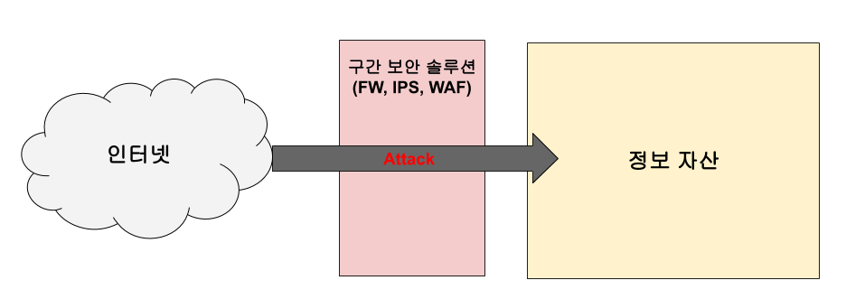
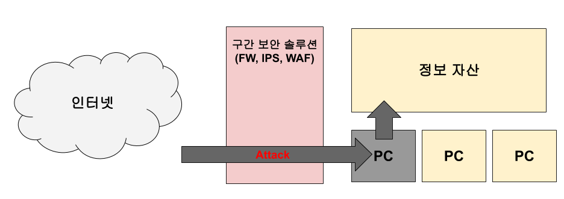

# 시큐리티 모니터링

## 공격 분석

- 직접 침투 방식(서버) - 외부의 인터넷에서 구간 보안 솔루션을 통과하여 내부의 정보자산을 침투, 구간 보안 솔루션에서 철저하게 보호하고 있기 때문에 공격자가 내부로 침투하기가 매우 어렵다.

>> 대응 : 보안 장비에서 공격자의 공격 행위

- 간접 침투 방식(PC) - 외부에서 내부 자원(사용자 PC)을 점거한 이후 내부망 이동을 통해 다른 정보자산에 접근하는 침투방법, 공격 대상에 특화된 악성코드 이용해 내부 자원을 감염

>> 대응 : Outbound 통신을 상세히 관찰,Inbound 모니터링의 경우 불특정 다수에서 내부에 접근하기 때문에 주체를 파악하기 어렵지만, Outbound 모니터링은 내부의 사용자는 한정적이기 때문에 출발지와 사용자를 알 수 있는 충분한 가시성을 확보

- __내부망 이동(Lateral Movement)__ : 공격자가 내부 시스템을 건너가며 피해를 확산시키는 현상. 공격자가 공격 목표(내부 정보 유출, 전사 시스템 감염 등)원하는 시스템이 나올때까지 단계별로 시스템을 지나오며 (1)타겟 스캔 (정찰), (2)정보 유출, (3)지속성을 유지하기 위하여 백도어 및 침입 경로 생성 등의 행위
<https://two2sh.tistory.com/16?category=656160>
<https://two2sh.tistory.com/13?category=656160>

- __스피어 피싱__ : 특정인을 목표로 하는 피싱 공격, APT공격의 시작점이자 내부 시스템 파악의 첫 발판

### 공격동향 분석

#### 사이버킬체인

#### MITRE ATT&CK

### 위협사냥

#### 로그수집

#### 수집대상

#### 수집로그저장

## SIEM이란

### SIEM 이해

### SIEM 구축

#### 구축전 고려사항

#### 로그수집 전략

#### 로그검색 및 분석전략

#### 경고 구축 전략

## 로그수집

### Zeek

### Sysmon

## 네트워크 로그분석

### 주요 서비스 프로토콜

### 네트워크 현황 분석

### 이상징후 분석

## 엔드포인트 로그분석

### 엔드포인트 로그분석

### PC이상징후 분석

## SIEM운영 강화

### OSINT

#### 위협정보 수집

#### OSINT 정보수집

### 경고 설정

#### 네트워크 계층 경고

#### 엔드포인트 경고

#### 악성 도메인 접속 경고

### 위협사냥 구현

#### 명령 제어 서버 탐지

#### 비정상 파일명 탐지

### 상황 대응 대시보드 운영

#### 상황 대응 전략 수립

#### 상환 판단 대시보드 제작
